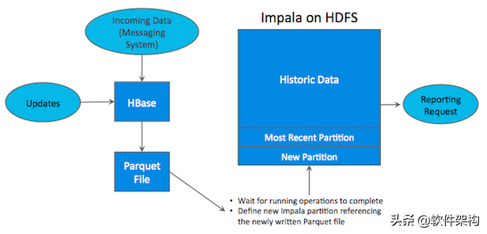
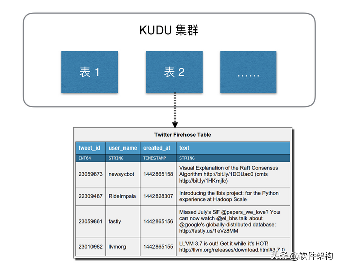
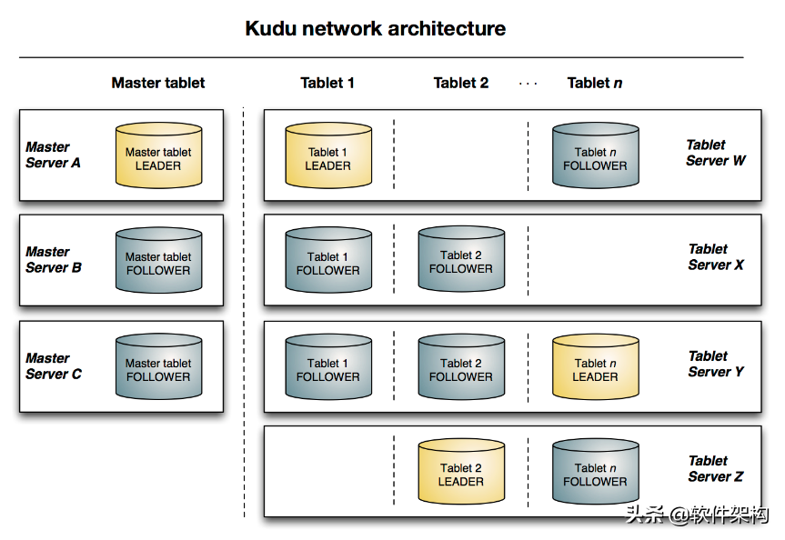

# Apache Kudu
Apache Kudu 是 Cloudera 主导开发的数据存储系统，2015年12月3日成为 Apache 孵化项目，2016年7月25日正式宣布毕业，升级为 Apache 顶级项目。

Apache Kudu 是为 Hadoop 生态系统构建的开源列式存储引擎，旨在实现灵活的高性能分析管道。它支持在传统数据库中提供许多操作，包括实时插入、更新和删除等。目前在许多行业的不同公司和组织中使用，包括零售、在线服务交付、风险管理和数字广告等等行业，还有大家较为熟悉的有小米公司。

## Apache Kudu入门-简介

Kudu 在大数据平台的应用越来越广泛。在阿里、小米、网易等公司的大数据架构中，Kudu 都有着不可替代的地位。

本文将简单介绍Kudu的一些基本概念和架构以及在企业中的应用，对Kudu有一个初步的了解。

### Apache Kudu 简介
Apache Kudu 是一个针对 Apache Hadoop 平台而开发的列式数据存储（Columnar Data Store）管理器。

Apache Kudu是由Cloudera开源的存储引擎，可以同时提供低延迟的随机读写和高效的数据分析能力。Kudu支持水平扩展，使用Raft协议进行一致性保证，并且与Cloudera Impala和Apache Spark等当前流行的大数据查询和分析工具结合紧密。

> Apache Kudu官网：https://kudu.apache.org/

在Kudu之前，大数据主要以两种方式存储：

- 静态数据：以 HDFS 引擎作为存储引擎，适用于高吞吐量的离线大数据分析场景。这类存储的局限性是数据无法进行随机的读写。
- 动态数据：以 HBase、Cassandra 作为存储引擎，适用于大数据随机读写场景。这类存储的局限性是批量读取吞吐量远不如 HDFS，不适用于批量数据分析的场景。

从上面分析可知，这两种数据在存储方式上完全不同，进而导致使用场景完全不同，但在真实的场景中，边界可能没有那么清晰，面对既需要随机读写，又需要批量分析的大数据场景，该如何选择呢？这个场景中，单种存储引擎无法满足业务需求，我们需要通过多种大数据工具组合来满足这一需求，一个常见的方案是：

如上图所示，数据实时写入 HBase，实时的数据更新也在 HBase 完成，为了应对 OLAP 需求，我们定时（通常是 T+1 或者 T+H）将 HBase 数据写成静态的文件（如：Parquet）导入到 OLAP 引擎（如：HDFS）。这一架构能满足既需要随机读写，又可以支持 OLAP 分析的场景，但他有如下缺点：

- 架构复杂。从架构上看，数据在 HBase、消息队列、HDFS 间流转，涉及环节太多，运维成本很高。并且每个环节需要保证高可用，都需要维护多个副本，存储空间也有一定的浪费。最后数据在多个系统上，对数据安全策略、监控等都提出了挑战。
- 时效性低。数据从 HBase 导出成静态文件是周期性的，一般这个周期是一天（或一小时），在时效性上不是很高。
- 难以应对后续的更新。真实场景中，总会有数据是「延迟」到达的。如果这些数据之前已经从 HBase 导出到 HDFS，新到的变更数据就难以处理了，一个方案是把原有数据应用上新的变更后重写一遍，但这代价又很高。

为了解决上述架构的这些问题，Kudu 应运而生。Kudu的定位是 「Fast Analytics on Fast Data」，是一个既支持随机读写、又支持 OLAP 分析的大数据存储引擎。

## Apache Kudu构建高性能实时数据分析存储系统 -数据模型和架构

### 数据模型
Kudu 的数据模型与传统的关系型数据库类似，一个 Kudu 集群由多个表组成，每个表由多个字段组成，一个表必须指定一个由若干个（>=1）字段组成的主键，如下图：

### 架构概述
Kudu 中存在两个角色：

- Mater Server：负责集群管理、元数据管理等功能。
- Tablet Server：负责数据存储，并提供数据读写服务。

为了实现分区容错性，跟其他大数据产品一样，对于每个角色，在 Kudu 中都可以设置特定数量（一般是 3 或 5）的副本。各副本间通过 Raft 协议来保证数据一致性。Raft 协议与 ZAB 类似，都是 Paxos 协议的工程简化版本，具体细节有兴趣的同学可以搜索相关资料学习。

下图显示了一个具有三个 master 和多个 tablet server 的 Kudu 集群，每个服务器都支持多个 tablet。它说明了如何使用 Raft 共识来允许 master 和 tablet server 的 leader 和 follow。此外，tablet server 可以成为某些 tablet 的 leader，也可以是其他 tablet 的 follower。leader 以金色显示，而 follower 则显示为蓝色。

