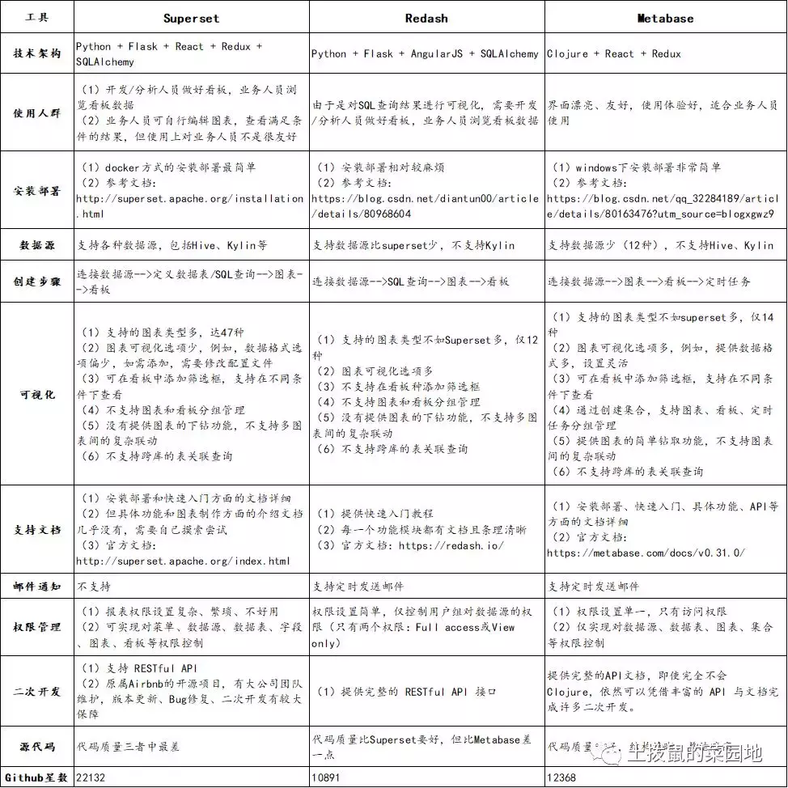

据可视化是 Business Intelligence(简称 BI)中的核心功能

老牌的 Tableau, Qilk, microstrategy，新生代的 Looker，国内的 FineBI,微软的 Power BI 等等

[数据可视化的开源方案: Superset vs Redash vs Metabase (二)](https://zhuanlan.zhihu.com/p/33164124)
[数据可视化的开源方案: Superset vs Redash vs Metabase (一)](https://zhuanlan.zhihu.com/p/33164027)


## Superset

Superset 最初是由 Airbnb 的数据团队开源的，目前已进入 Apache Incubator(孵化器)，算是明星级的开源项目。
https://github.com/apache/superset python 39.4k
https://superset.incubator.apache.org/

支持数据库：https://superset.incubator.apache.org/#databases
支持 Spark SQL
```
docker run -d -p 8080:8088 --name superset apache/superset
```
1. Setup your local admin account
```
linux
$ docker exec -it superset superset fab create-admin \
               --username admin \
               --firstname Superset \
               --lastname Admin \
               --email admin@superset.com \
               --password admin

winddows
docker exec -it superset superset fab create-admin     --username admin      --firstname Superset    --lastname Admin   --email admin@superset.com     --password admin
```
1. Migrate local DB to latest
`$ docker exec -it superset superset db upgrade`
1. Load Examples
`$ docker exec -it superset superset load_examples`
1. Setup roles
`$ docker exec -it superset superset init`
1. Login and take a look -- navigate to http://localhost:8080/login/ -- u/p: [admin/admin]

非官方
docker pull amancevice/superset:0.36.0
docker run --detach --name superset -p 8088:8088 amancevice/superset:0.36.0
docker exec -it superset superset-init

## Redash

https://github.com/getredash/redash python 19.1k
https://redash.io/

https://redash.io/help/data-sources/querying/supported-data-sources

Redash 比 Superset 支持的数据库多

## Metabase

https://github.com/metabase/metabase Clojure 25.3k
https://www.metabase.com/

## Davinci

https://github.com/edp963/davinci

## Pentaho

https://github.com/pentaho/pentaho-platform

## CBoard

https://github.com/TuiQiao/CBoard

## Grafana

目前已经支持绝大部分常用的时序数据库

## stimulsoft Dashboards

商业，付费

## 自定义报表
- [Stimulsoft](https://www.stimulsoft.com/en)
- [ReportServer](https://reportserver.net/en/download/)
- [pentaho](http://www.pentaho.com/download/)
- [SpagoBI](http://www.spagobi.org/product/)
支持Portal、report、OLAP、QbE、ETL、dashboard、文档管理、元数据管理、数据挖掘与地理信息分析。
- [BIRT](http://www.eclipse.org/birt/)
- [KNIME](https://github.com/knime)
数据集成，数据处理，数据分析和数据勘探平台
- [Seal-Report](https://github.com/ariacom/Seal-Report)
- [JasperReports](https://github.com/TIBCOSoftware/jasperreports)
- OpenReports
- [葡萄城 ActiveReports](https://github.com/activereports)


## 其它

- openI http://openi.sourceforge.net
- jaspersoft http://www.jaspersoft.com/
- spagoBI http://spago.eng.it
- pentaho http://www.pentaho.com/

[DataEase](https://github.com/dataease) 应该是最接近 Tableau 的开源软件。

[16 个免费和开源商业智能工具](https://blog.csdn.net/qiansg123/article/details/80129400)

[Awesome Data Science](https://github.com/academic/awesome-datascience)
### Orange Data Mining
https://github.com/biolab/orange3

### Microsoft Power BI

Microsoft Power BI 提供该平台的免费版本，每个用户数据容量限制为 1 GB，每天一次数据刷新计划。Power BI 的仪表板可以提供 Salesforce，Google Analytics 以及桌面和移动设备上其他平台的洞察力。用户还可以使用自然语言（换句话说，简单的英语）查询软件。

### Tableau Public

Tableau Public 是免费的 BI 软件，允许人们创建交互式图表和实时仪表板，然后在 Internet 上发布，嵌入网站或在社交媒体上共享。还可以自定义材料以在桌面，平板电脑或移动设备上显示。Tableau 还可以连接到 Google 表格，每天可以自动刷新一次数据。

### BIRT

BIRT 是一种开源 BI 软件，可用于创建数据可视化和报告，这些都可以嵌入到 Web 应用程序中。主要组件是可视化报表设计器，用于生成设计的运行时组件以及图表引擎。

### Clicdata

ClicData 提供 ClicData Personal，它是仪表板软件的免费版本，可为单个用户提供 1 GB 的数据存储和无限数量的仪表板。高级版本允许更多数据连接器，自动数据刷新以及具有高级共享功能的多用户。

### ELK Stack

开源 ELK Stack 通常用于集中数据流，然后实时可视化信息，监控仪表板（例如 Salesforce 仪表板中的仪表板）。我们 Logz.io 创建了一个基于 AI 的日志分析平台，该平台将 ELK 作为具有机器学习技术的企业级云服务提供。

### Helical Insight

Helical Insight 是一个开源 BI 框架，提供电子邮件调度，可视化，导出，多租户和用户角色管理以及 API 驱动的框架，允许用户添加他们可能需要的任何其他功能。Instant BI 功能允许用户在类似 Google 的界面中输入问题并接收相关的报告和图表。

### Jedox

Jedox 在每个桌面和移动设备上提供强大的规划和精美的报告。该平台旨在通过提供丰富的交互式体验和实时建模来消除 Excel 的麻烦。云端和高级内部部署版本分别进行了 14 天和 30 天的试用。

### Jasperreports Server

JasperReports Server 提供可以嵌入到 Web 或移动应用程序中的报告和分析，以及作为可以实时或定期交付的信息的存储库。这个开源软件还可以管理 Jaspersoft 付费 BI 报告和分析平台。

### Knime

KNIME 是一个用于数据分析的开源平台，包含 1,000 多个模块，数百个可立即运行的示例分析，集成到软件中的一组工具，以及用户可以选择的冗长算法选择包括。KNIME 被数据科学家和 BI 高管使用。

### Pentaho

该 Pentaho 的报表平台是公司的开源报表工具套件，可让用户创建 PDF，Excel 中，HTML，文本，富文本文件，XML 的历史数据报告和 CSV 格式。计算机生成的报告可以从多个来源获取数据，使其更容易理解。

### Rapidminer

RapidMiner 允许数据科学家在数据科学和商业智能项目中构建完整的分析工作流程，使他们能够在单一环境中进行数据准备，建模和部署。该平台由 250,000 名数据科学专家组成的社区提供支持。RapidMiner 有免费套餐，高级计划每年起价 2,500 美元。

### Reportserver

ReportServer 将各种 BI 报告引擎集成到一个用户界面中，目的是允许人们在正确的时间使用正确的分析工具。有一个免费的社区层和一个企业层，软件的动态列表功能允许临时生成类似列表的报告。

### Seal Report

Seal Report 是一个开源框架，可以根据数据库中的信息生成报告和仪表板。功能包括本机数据透视表，HTML 5 或 Microsoft 格式的图表，Web 报表服务器和动态 SQL 源。用户还可以提前安排报告生成并在文件夹中生成或通过电子邮件发送。

### Spagobi

SpagoBI 是一个开源商业智能套件，包括报告，图表和数据挖掘工具。它由工程集团开源能力中心开发，这是一家意大利大型软件和服务公司，也提供用户支持，维护，咨询和培训等专业服务。

### SQL Power Wabit

2008 年，SQL Power Group 开源了 Wabit，它为所有即席查询和 OLAP 分析提供了一个框架，几乎适用于任何数据库平台。Wabit 的拖放界面还可以利用流数据创建实时仪表板。社区版可以免费部署。

### Zoho Reports

Zoho 的 BI 平台 Zoho Reports 可以连接到几乎任何数据源，然后创建可视化报告和仪表板进行分析。该软件还具有分析引擎，能够处理数亿条记录并在几秒钟内返回相关见解。免费版本允许两个用户。

## 实时数据看板

### PubNub+Cloudinary：简单几步快速搭建实时图片分享应用

PubNub 是一个非常强大且易于使用的云服务，可进行实时的推送信息应用。而 Cloudinary 是一个基于云端的图片处理、管理、存储、美化于一体的平台，同时还集成了图片抓取功能，提供 API 接口。
https://github.com/cloudinary/cloudinary_pubnub_demo

### 实时数据可视化方案——PubNub+PowerBI

在“Power BI 服务”新建新仪表板，然后选择“添加磁贴” > “自定义流式处理数据” ，然后选择“下一步” 按钮。
从窗口右上角中的链接中选择“+ 添加流式处理数据” 。选择“PubNub” ，然后选择“下一步” 。


### 图表工具

#### Highcharts
https://www.highcharts.com/
#### 数据地图 Power Map
https://support.office.com/en-us/article/get-started-with-power-map-88a28df6-8258-40aa-b5cc-577873fb0f4a
#### Echarts
https://echarts.apache.org/zh/index.html
#### AntV
https://antv.vision/zh

### 数据可视化工具
[30个值得推荐的数据可视化工具（2020年更新）](https://zhuanlan.zhihu.com/p/51695598)

图表
- https://rawgraphs.io/
- https://www.chartblocks.com/
- https://www.tableau.com/
- https://powerbi.microsoft.com/zh-cn/
- https://www.qlik.com/us/products/qlikview
- https://www.datawrapper.de/
- https://www.visme.co/
- https://www.grow.com/
- https://www.icharts.in/

信息图
- https://infogram.com/
- https://visual.ly/

地图
- https://www.instantatlas.com/
- https://leafletjs.com/
- https://openlayers.org/
- https://kartograph.org/
- https://carto.com/

关系网络图
- https://gephi.org/
- http://sigmajs.org/

数学图形
- https://www.wolframalpha.com/

开发者工具
- https://www.echartsjs.com/zh/index.html
- https://d3js.org/
- https://plotly.com/
- https://www.chartjs.org/
- https://developers.google.com/chart
- https://opensource.addepar.com/ember-charts/
- https://gionkunz.github.io/chartist-js/
- https://www.highcharts.com/
- https://www.fusioncharts.com/
- https://www.zingchart.com/

金融图表
- http://dygraphs.com/  https://github.com/danvk/dygraphs
- https://cn.tradingview.com/  https://github.com/tradingview/lightweight-charts
- WijmoJS

