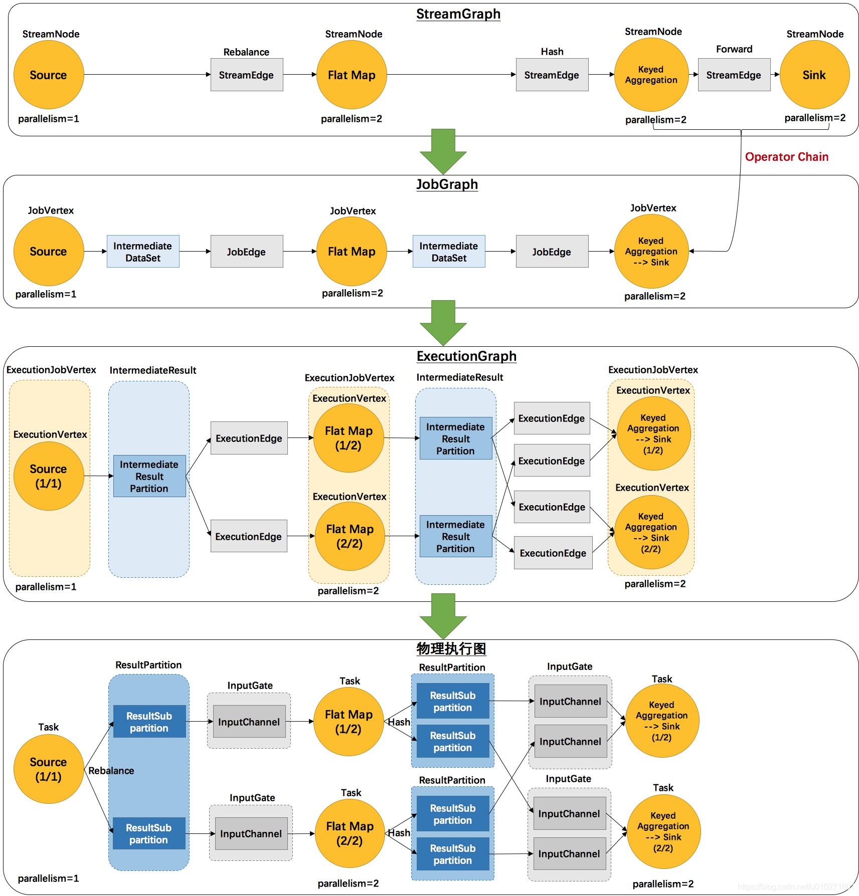

[Streaming-大数据的未来](https://www.cnblogs.com/tree1123/p/11389146.html)
<!-- toc -->
[TOC]
# flink的批处理和流处理
> 流处理系统与批处理系统最大不同在于节点间的数据传输方式
## 1.流处理(Streaming)系统
流处理系统，其节点间数据传输的标准模型是：当一条数据被处理完成后，序列化到缓存中，然后立刻通过网络传输到下一个节点，由下一个节点继续处理。

数据的流处理可以理解为系统需要接收并处理一系列不断变化的数据。如：会员权益营销系统

流处理的输入数据是无边界数据，流处理视业务场景关注事件时间还是处理时间

流处理架构应用：

- 实时监控
- 实时商业智能
- 终端销售系统

## 2.批处理(Batch)系统
批处理系统，其节点间数据传输的标准模型是：当一条数据被处理完成后，序列化到缓存中，并不会立刻通过网络传输到下一个节点，当缓存写满，就持久化到本地硬盘上，当所有数据都被处理完成后，才开始将处理后的数据通过网络传输到下一个节点。 

数据的批处理，可以理解为一系列相关联的任务顺序（或并行）一个接一个的执行，批处理关注事件时间
输入：是一段时间内已经存收集保存好的数据
输出：可以作为下一个批处理的输入

批处理架构应用：

- 日志分析
- 计费程序
- 数据仓库

## 3.flink的流处理和批处理

Flink的执行引擎采用了一种十分灵活的方式，同时支持了这两种数据传输模型：

- Flink以固定的缓存块为单位进行网络数据传输，用户可以通过设置缓存块超时值指定缓存块的传输时机。如果缓存块的超时值为0，则Flink的数据传输方式类似上文所提到流处理系统的标准模型，此时系统可以获得最低的处理延迟

- 如果缓存块的超时值为无限大，则Flink的数据传输方式类似上文所提到批处理系统的标准模型，此时系统可以获得最高的吞吐量

- 同时缓存块的超时值也可以设置为0到无限大之间的任意值。缓存块的超时阈值越小，则Flink流处理执行引擎的数据处理延迟越低，但吞吐量也会降低，反之亦然。通过调整缓存块的超时阈值，用户可根据需求灵活地权衡系统延迟和吞吐量

## 4.flink的流处理和批处理代码的区别

### 批处理
```java
import org.apache.flink.api.scala.ExecutionEnvironment
 
/**
  * 批处理
  * 需求：读取一个目录下的文件信息统计文件里面单词出现的总次数
  */
object BatchWordCount {
 
  def main(args: Array[String]): Unit = {
 
      val inputPath = "G:\\flinData\\file"
      val outPath = "G:\\flinData\\result"
 
      val env = ExecutionEnvironment.getExecutionEnvironment
 
      val text = env.readTextFile(inputPath)
 
      import org.apache.flink.api.scala._
      val counts = text.flatMap(_.toLowerCase.split(" "))
        .filter(_.nonEmpty)
        .map(word => (word,1))
        .groupBy(0)
        .sum(1)
 
      //setParallelism设置并行度
      counts.writeAsCsv(outPath,"\n"," ").setParallelism(1)
      env.execute("batch word count")
 
  }
}
```

### 流处理

```java
package streaming
 
import org.apache.flink.api.java.utils.ParameterTool
import org.apache.flink.streaming.api.scala.StreamExecutionEnvironment
import org.apache.flink.streaming.api.windowing.time.Time
 
/**
  * 滑动窗口计算   ---->流处理
  *
  * 手工通过socket实时产生一些单词，使用flink实时接收数据，
  * 对指定时间窗口内(例如：2秒)的数据进行聚合统计，
  * 并且把时间窗口内计算的结果打印出来
  *
  */
object SocketWindowWordCount {
 
  def main(args: Array[String]): Unit = {
 
      //port : 连接duank
 
    val port : Int = try{
 
      ParameterTool.fromArgs(args).getInt("port")
 
    } catch {
 
      case e : Exception => {
        System.err.println("No specified. use default 9000")
      }
     9000
    }
 
 
    //获取运行环境
    val env : StreamExecutionEnvironment = StreamExecutionEnvironment.getExecutionEnvironment
 
    //连接此socket获取数据
    val text = env.socketTextStream("spark1",port,'\n')
 
    //解析数据，分组，窗口化，并且聚合求SUM
   import org.apache.flink.api.scala._
 
    val windowCounts = text
      .flatMap(line => line.split("\\s"))
      .map(w => WordWithCount(w,1))
      .keyBy("word")
      .timeWindow(Time.seconds(2),Time.seconds(1)) //指定窗口大小，指定间隔时间
      .sum("count")   //sum或者reduce都可以
      //.reduce((a,b) => WordWithCount(a.word,a.count+b.count))
 
 
    //使用一个单线程来打印结果
    windowCounts.print().setParallelism(1)
 
    //执行任务
    env.execute("Socket Window WordCount")
  }
 
 
  case class  WordWithCount(word: String, count: Long)
 
}
```
### 代码区别总结
流处理Streaming

- StreamExecutionEnvironment
- DataStreaming

批处理Batch
- ExecutionEnvironment
- DataSet


## Flink的执行计划图

Flink 中的执行图可以分成四层：StreamGraph -> JobGraph -> ExecutionGraph -> 物理执行图。

- StreamGraph：是根据用户通过 Stream API 编写的代码生成的最初的图。用来表示程序的拓扑 [tuò pū] 结构。

- JobGraph：StreamGraph经过优化后生成了 JobGraph，提交给 JobManager 的数据结构。主要的优化为，将多个符合条件的节点 chain 在一起作为一个节点，这样可以减少数据在节点之间流动所需要的序列化/反序列化/传输消耗。

- ExecutionGraph：JobManager 根据 JobGraph 生成ExecutionGraph。方便调度和监控和跟踪各个 tasks 的状态。ExecutionGraph是JobGraph的并行化版本，是调度层最核心的数据结构。

- 物理执行图：JobManager 根据 ExecutionGraph 对 Job 进行调度后，在各个TaskManager 上部署 Task 后形成的“图”，并不是一个具体的数据结构。

### 图演变过程
2个并发度（Source为1个并发度）的 SocketTextStreamWordCount 四层执行图的演变过程：

env.socketTextStream().flatMap(…).keyBy(0).sum(1).print();


[Flink 数据交换和Redistribute详解](https://cwiki.apache.org/confluence/display/FLINK/Data+exchange+between+tasks)