<!-- toc -->
[TOC]
# Hadoop和Spark概述
## 一. 简单说说Hadoop
### 1. Hadoop的产生背景
在过去的 20 年里， 社会的各个领域所产生的数据实现了大规模的增长，并且就目前来看，未来全球的数据量将呈现出爆炸性的增长趋势,因此将会产生海量数据。2008 年《自然》杂志刊登了名为“Big Data”的专辑，正式提出大数据的概念，标志着大数据时代的到来。随之而来的研究，加深了人们对大数据时代的认识。大数据正在改变着人们的生活、工作和思想。

 面对如此海量的数据，传统的数据计算和数据存储方式已经无法满足要求，因此在解决当前基于大数据的实际应用问题时，也显得捉襟见肘。为此急需要一套完整的大数据问题解决方案。 2004 年 Google 的三篇论文 MapReduce、 GFS和 BigTable介绍了 Google 内部对于大数据问题的解决方案，从此奠定了针对大数据问题的关键技术基础。 受此启发的 Doug Cutting 等人开始尝试实现开源的 MapReduce 计算框架，并与NDFS 相结合，使之成为了一套完整软件， 并在 2008 年成为Apache 软件基金会旗下的顶级项目，命名为 Hadoop。Hadoop经过近十年的发展，期间形成了以 Hive、 Hbase、 Zookeeper 等软件为核心的 Hadoop 生态系统， 并且仍然处在不断更新完善的过程中，目前 Hadoop 已发展到 3.0 版本， 且已经成为当前最为流行且成熟的大数据问题解决方案。

下面是一个hadoop生态圈的基本介绍：

生态系统子项目 |	项目功能
---|---
Hive|	基于 Hadoop 文件系统的数据仓库
Hbase|	基于 Hadoop 的面向列存储的数据库
Mahout|	集成了经典的数据挖掘与机器学习算法的算法库
Pig|	支持大规模数据分析的平台
ZooKeeper|	为 Hadoop 集群提供协调服务
Avro|	将数据结构或对象转换成便于存储或传输的合适
Chukwa|	针对 Hadoop 集群的分布式数据收集和分析系统

### 2. Hadoop核心技术
目前 Hadoop 的核心技术包括 Hadoop Common、 HadoopDistributed File System (HDFS) 、 Hadoop MapReduce 以 及Hadoop Yarn 四大模块。共同构成了 Hadoop 的基础架构。

- **Common**： Common 是 Hadoop 的基础模块，主要为生态系统中其他的软件提供包括文件系统、 RPC 以及串行化库等功能在内的支持，为云平台提供基本服务。

- **HDFS**： HDFS是一个分布式文件系统，是 Hadoop 的存储核心， 它可以被部署运行于大量的廉价服务器上，可以处理超大文件，它的设计是建立在“一次写入，多次读取的”思想之上。对于被上传到 HDFS 上的数据，系统会对其进行分块分进行保存，分块概念的存在是 HDFS 可以存储大量文件的重要原因。 HDFS 中有两个重要概念 NameNode 和 DataNode，NameNode 是中心服务器，负责管理文件系统命名空间以及客户端对文件的访问， DataNode 是 Hadoop 集群的主体， 一般的一个存储节点运行一个 DataNode 进程， DataNode 的作用是管理本节点上所存储的文件。

下面是HDFS的读过程：
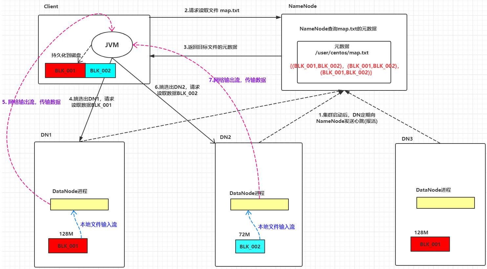
下面是HDFS的写过程：
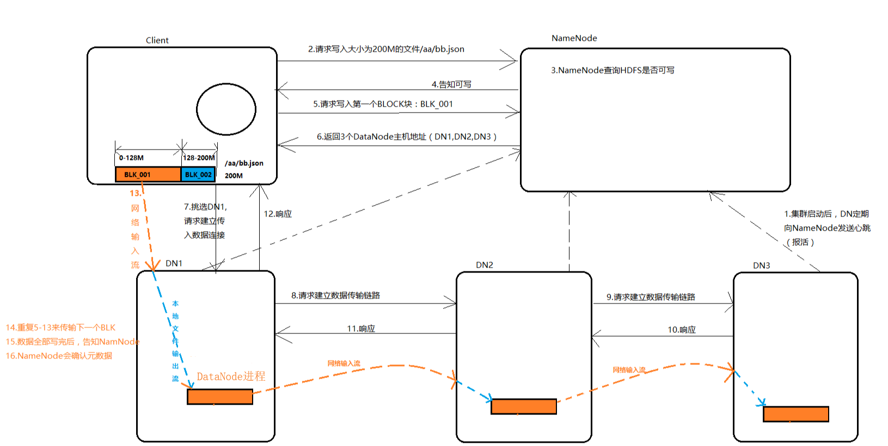

- **MapReduce**： MapReduce 是一个并行计算框架，是 Hadoop的计算核心， 它通过将数据分割，并行处理等底层问题进行封装，使得用户只需要考虑自身所关注的并行计算任务的实现逻辑，从而极大的简化了分布式程序的设计，在整个计算过程中，数据始终以`<key,value>`键值对的形式存在。它的核心是 Map 函数与 Reduce 函数。

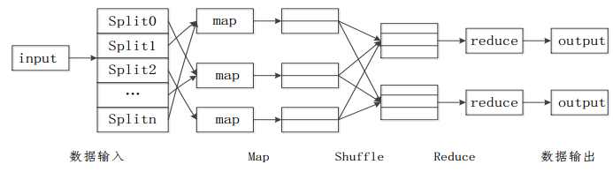

- **Yarn**： Yarn[14]是针对 Hadoop 存在的 JobTracker 单点瓶颈， 编程框架不够灵活等问题提出的改进方案。通过将集群资源管理和作业管理分离开来，降低 JobTracker 的负载。其中集群 资 源 管 理 由 ResourceManager 负 责 ， 作 业 管 理 由ApplicationMaster 负责， Container 负责为集群各个节点调度资源，与所有计算节点 NodeManager 共同构成新的数据计算框架。

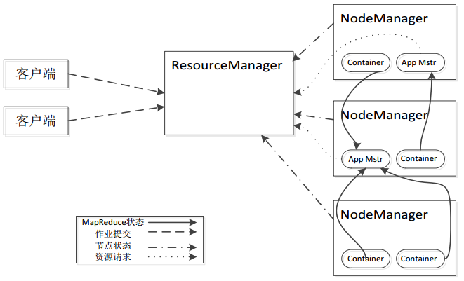

## 二. 简单说说Spark
### 1. Spark的官方定义
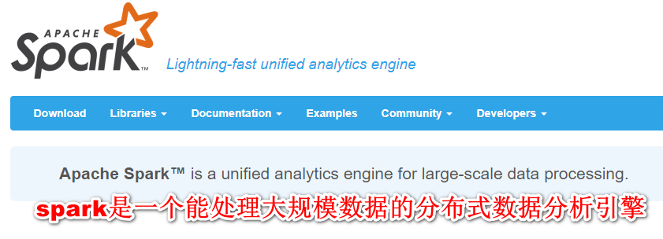
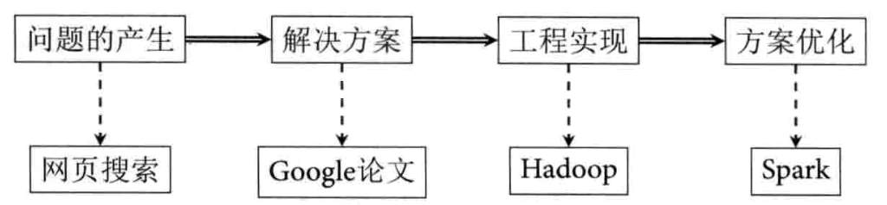

Spark是一种**快速、通用、可扩展**的大数据分析引擎，是UC Berkeley AMP lab (加州大学伯克利分校AMP实验室)所开源的**类Hadoop MapReduce**的通用并行框架，专门用于大规模数据的迭代式计算，是为了跟 Hadoop 配合而开发出来的，**不是为了取代 Hadoop**。2009年诞生，2010年开源，2013年6月成为Apache孵化项目，2014年2月成为Apache顶级项目。项目是用Scala进行编写。

目前，Spark生态系统已经发展成为一个包含多个子项目的集合，其中包含**SparkSQL、Spark Streaming、GraphX、MLib、SparkR**等子项目，Spark是基于**内存计算**的大数据**并行计算框架**。除了扩展了广泛使用的 MapReduce 计算模型，而且高效地支持更多计算模式，包括**交互式查询和流处理**。Spark 适用于各种各样原先需要多种不同的分布式平台的场景，包括**批处理、迭代算法、交互式查询、流处理**。

### 2. Spark的核心技术
> Spark 的 最 主 要 的 核 心 技 术 是 Resilient Distributed Datasets(RDD)即弹性分布式数据集，此外还包括 Spark有向无环图 DAG，Spark部署模式以及Spark架构。

- **RDD**： RDD 是对分布式内存数据的一个抽象，对数据的所有操作最终会转换成对 RDD 的操作，即 RDD 是数据操作的基本单位。对于 RDD 的操作分为 Transformation(转换)和
Action(执行)，其中 Transformation 又包括多种基本操作：map,filter,flatmap,groupByKey,reduceByKey,union 等；Action 操作包括：count,collect,reduce 等基本操作。Spark 对于两
种操作采取不同机制：对于所有的转换操作都是惰性操作(懒执行)，即从一个 RDD 通过转换操作生成另一个 RDD 的过程在 Spark 上并不会被马上执行，只有在 Action 操作触发时转换操作才会被真正执行。

- **DAG**： 在一个 Spark 应用当中，数据执行流程是以 RDD 组成的有向无环图 DAG 的形式存在，Spark 根据用户提交的应用逻辑绘制 DAG 图，并且依据 RDD 之间的依赖关系，将 DAG 图划分成不同阶段(stage)，但是 DAG 绘制完成之后并不会被马上执行，只是起到一个标记数据集的作用。下图就是一个DAG图：
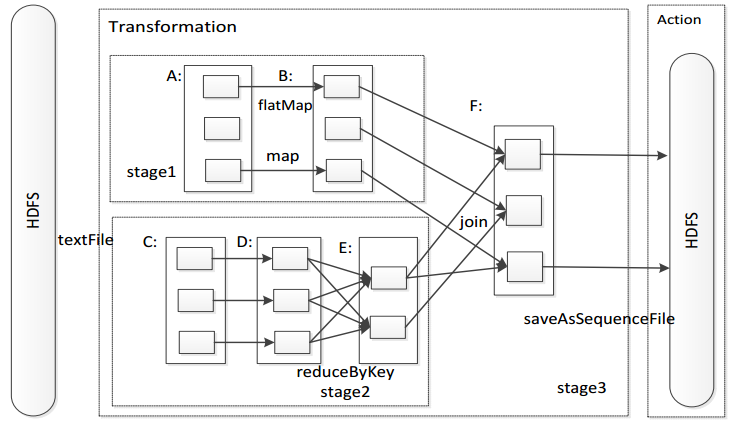

- **Spark部署模式**： 当前 Spark 存在多种部署模式，包括 Local 模式，Standalone模式，基于 Mesos 的模式以及基于 Yarn 的部署模式。其中基于 Yarn 的部署模式是当前最为主流的部署模式，其核心思想是利用 Hadoop Yarn 实现集群资源的管理。

- **Spark架构**： 尽管 Spark 有不同的部署模式，但是其基本组成部分包括控制节点 Master 和作业控制进程 Driver，资源管理器 ClusterManager，执行节点 Worker 和执行单元 Executor 以及客户端 Client， 其中 Driver 进程位于 Master 主控节点上，一
个 Worker 节点一般维护一个 Executor 进程。Spark架构如下图：
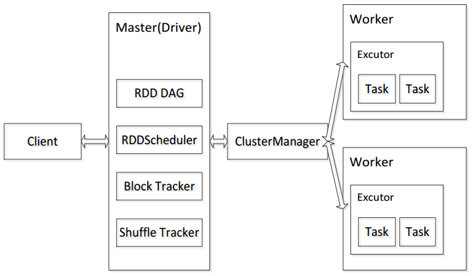

### 3. Spark的内置项目
在官网中我们可以看到其4个内置项目：
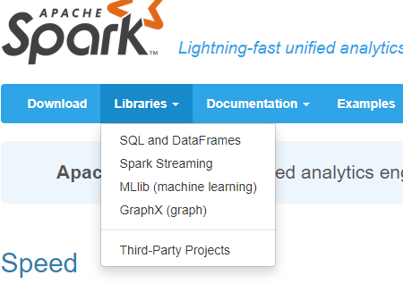

- **Spark SQL**： 是 Spark 用来操作结构化数据的程序包。通过 Spark SQL，我们可以使用 SQL 或者 Apache Hive 版本的 SQL 方言(HQL)来查询数据。Spark SQL 支持多种数据源，比 如 Hive 表、Parquet 以及 JSON 等。

- **Spark Streaming**： 是 Spark 提供的对实时数据进行流式计算的组件。提供了用来操作数据流的 API，并且与 Spark Core 中的 RDD API 高度对应。

- **Spark MLlib**：
提供常见的机器学习(ML)功能的程序库。包括分类、回归、聚类、协同过滤等，还提供了模型评估、数据 导入等额外的支持功能。

- **Spark GraphX**： Spark GraphX是一个分布式图处理框架，它是基于Spark平台提供对图计算和图挖掘简洁易用的而丰富的接口，极大的方便了对分布式图处理的需求。

### 4. Spark的生态体系

下图表现了spark的生态体系

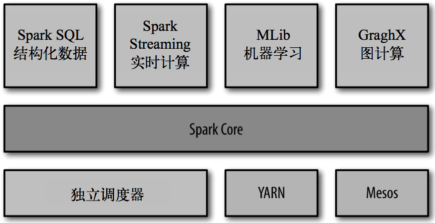

> 内置项目已经分析过，下面将不再给出解释。

- **Spark Core**： 实现了 Spark 的基本功能，包含任务调度、内存管理、错误恢复、与存储系统 交互等模块。Spark Core 中还包含了对弹性分布式数据集(resilient distributed dataset，简称RDD)的 API 定义。

> 说明：Spark Core 相当于 Java 语言中的 JDK，而其他的子项目相当于在 JDK 支持下开发出的组件。

- **集群管理器**： Spark 设计为可以高效地在一个计算节点到数千个计算节点之间**伸缩计算**。为了实现这样的要求，同时获得最大灵活性，Spark 支持在各种群管理器(cluster manager)上运行，包括 Hadoop YARN、Apache Mesos，以及 Spark 自带的一个简易调度 器，叫作**独立调度器**(独立模式：Standalone)。

### 5. Spark的特点
- **速度快**： 与Hadoop的MapReduce相比，Spark基于内存的运算要比MapReduce运算快100倍以上，基于硬盘的运算也要快10倍以上。Spark实现了高效的DAG执行引擎，可以通过基于内存来高效处理数据流。计算的中间结果是存在于内存中的。
 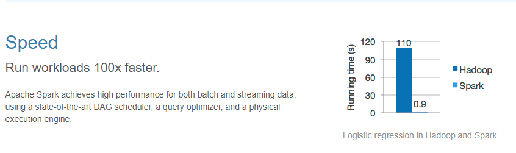

- **容易使用**： Spark支持Java、Python和Scala的API，还支持超过80种高级算法，使用户可以快速构建不同的应用。而且Spark支持交互式的Python和Scala的shell，可以非常方便地在这些shell中使用Spark集群来验证解决问题的方法。
 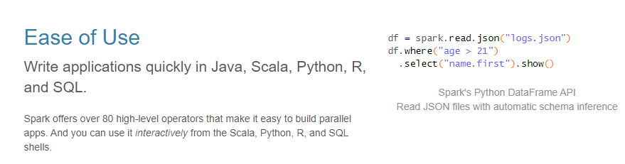

- **通用**： Spark提供了**统一的解决方案**。Spark可以用于批处理、交互式查询（Spark SQL）、实时流处理（Spark Streaming）、机器学习（Spark MLlib）和图计算（GraphX）。这些不同类型的处理都可以在同一个应用中无缝使用。Spark统一的解决方案非常具有吸引力，毕竟任何公司都想用统一的平台去处理遇到的问题，减少开发和维护的人力成本和部署平台的物力成本。
 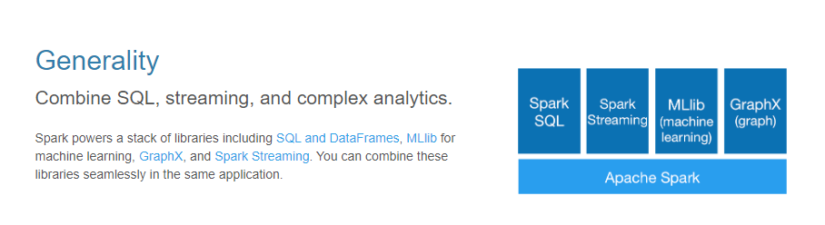

- **优秀的兼容性**： Spark可以非常方便地与其他的开源产品进行融合。比如，Spark可以使用Hadoop的YARN和Apache Mesos作为它的资源管理和调度器，并且可以处理所有Hadoop支持的数据，包括HDFS、HBase和Cassandra等。这对于已经部署Hadoop集群的用户特别重要，因为不需要做任何数据迁移就可以使用Spark的强大处理能力。Spark也可以不依赖于第三方的资源管理和调度器，它实现了Standalone作为其内置的资源管理和调度框架，这样进一步降低了Spark的使用门槛，使得所有人都可以非常容易地部署和使用Spark。此外，Spark还提供了在EC2上部署Standalone的Spark集群的工具。
  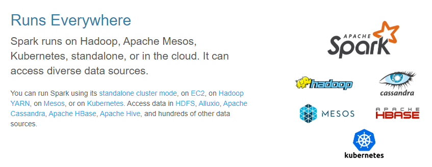

### 6. Spark的用户和用途
> Spark的用例大致分为两类：数据科学应用和数据处理应用，所以相对应的产生了对应的两种研究人群：数据科学家和工程师。

- **数据科学任务**： 主要是数据分析领域，数据科学家要负责分析数据并建模，具备 SQL、统计、预测建模(机器学习)等方面的经验，以及一定的使用 Python、 Matlab 或 R 语言进行编程的能力。

- **数据处理应用**： 工程师定义为使用Spark开发 生产环境中的数据来处理问题的软件开发者，使用Spark的API实现对任务进行处理和转换。

## 三. Hadoop和Spark的关系

### 1. Spark的优势
随着对 Hadoop 的广泛应用，也暴露出 Hadoop 存在的一些问题，例如作为 Hadoop 核心技术的 MapReduce 计算框架一方面缺少对迭代的支持，另一方面在计算过程中会将中间数据输出到硬盘存储，因此会产生较高的延迟( Hadoop 在一次 MapReduce 运算之后，会将数据的运算结果从内存写入到磁盘中，第二次 Mapredue 运算时在从磁盘中读取数据，所以其瓶颈在2次运算间的多余 IO 消耗)。

基于Hadoop的缺陷，Spark计算框架大大减缓了 MapReduce计算 的I/O瓶颈，因为Spark 是将数据一直缓存在内存中，直到计算得到最后的结果，再将结果写入到磁盘，所以多次运算的情况下 Spark 是比较快的，其速度大约是 MR 运算的100倍。Spark优化了迭代式工作负载。

### 2. Spark对Hadoop的改进

Hadoop的局限	| Spark的改进
---|---
抽象层次低，代码编写难以入手 |	通过使用 RDD 的统一抽象，实现数据处理逻辑的代码变得非常简洁
只提供 Map 和 Reduce 两个操作，表达不明确	|   通过 RDD 提供了很多转换和动作，实现了很多基本操作(提供了很多功能API，如：sort，Join等，编程变得更加简单)
一个 Job 只有 Map 和 Reduce 两个阶段，复杂的程序需要大量的 Job 来完成，且 Job 之间的依赖关系需要应用开发者自行管理      |	    一个 Job 可以包含多个 RDD 的转换动作，只需要在调度时生成多个 Stage。一个 Stage 中也可以包含多个 Map 操作，只需要 Map 操作所使用的 RDD 分区保持不变
处理逻辑隐藏在代码细节中，缺少整体逻辑视图      |	RDD 的转换支持流式API，提供处理逻辑的整体视图
对迭代式数据处理性能比较差，Reduce 与 下一步 Map 之间的中间结果只能存放在 HDFS 文件系统中，将大大增加迭代计算的时间(I/O成本高昂)        |	    通过内存缓存数据，可以大大提高迭代式计算的性能，内存不足时可以溢出到磁盘
ReduceTask 需要等待所有的 MapTask 都完成后才能开始执行      |	    分区相同的转换可以在一个 Task 中以流水线的形式执行，只有分区不同的转换才需要 shuffle 操作
延时比较高，只是用与大数据集的批量计算，对交互式数据处理和实时数据处理支持不够      |	将流拆成小的 Batch，提供 Discretized Stream 处理数据

### 3. 明晰概念

- 通过对 Hadoop 的由来说明，我们需要形成一个清晰的逻辑公式：Hadoop架构 = Common + HDFS + MapReduce + Yarn

> 说明：HDFS 为大规模数据的存储提供了基础，MapReduce模型 则为集群并行计算提供了保证。所以我们需要明确：Hadoop 是一个集存储模型(HDFS)和计算模型(MapReduce)为一体的大数据处理工具。

- Spark 是一个相当于 MapReduce编程模型 的大数据分析计算框架，并不能完全替代 Hadoop，因为 Hadoop 具备分布式文件管理能力(分布式文件管理系统)，HDFS 是大数据计算的数据源泉。

> 强调：Spark 相当于一个计算引擎，其地位和 MapReduce模型 对等。其优点就是计算过程都在内存完成，大大加快了运算速度。Spark无法完全替代Hadoop。

# Hadoop和Spark特性
## 一. Hadoop的优势和劣势
### 1. Hadoop的技术优势
> MapReduce 是与 Spark 对应的大数据编程框架，因此以 MapReduce 来阐述。

- 首先 MapReduce 之所以能够成为面向大数据的计算框架，原因在于其具有优良的伸缩性，在 Hadoop 集群当中，每当有新的计算节点加入时，MapReduce 几乎会增加该节点所具有的全部的计算能力，而如此优良的伸缩性是以往大多数分布式计算框架所不具备的。这也使得 MapReduce 成为最受欢迎的主流大数据计算框架。

- MapReduce 为用户提供了一套极为简易的编程模型，也就是以 map 函数与 reduce 函数为核心的编程接口，使得在进行MapRedcuce 编程时，用户只需考虑实际应用问题的应用逻辑，而不需要考虑负载均衡，并行计算等底层细节问题。

- MapReduce 的设计目标是为了运行批量作业，处理海量数据，在同等大小集群下所能处理的数据量上限要远大于 Spark，因此 MapReduce 是真正意义上的大数据计算框架。

### 2. Hadoop的技术劣势
- 首先 MapReduce 是面向磁盘存储的，在 MapReduce 应用程序运行过程所有的中间数据会输出到磁盘中，当再需要时才会将数据从磁盘调入内存，因磁盘速度与内存速度的差距导致了计算过程的高延迟现象。高延迟是 MapReduce 最大的技术瓶颈。

- 由于 MapReduce 主要用于处理批量数据，因此在需要对数据进行随机访问时，MapReduce 明显不能满足。

- 考虑 MapReduce 的实现方式是以 map 函数和 reduce 函数为基础，虽然这套编程接口极为简易，但是面对多样性的实际问题时，仅仅只有这两个算子使得 MapRedcue 在编程时需要花费更多的时间去考虑如何能够在这两个函数中实现所需要的应用逻辑。即算子缺乏多样性和灵活性。

- 根据 MapReduce 的计算思想，在 map 过程之后，框架会对中间数据进行一个统计排序(shuffle,sort)，然后才将排序之后的结果交由 reduce 过程处理。但是在某些情况下，并不需要这过程，但是 MapReduce 还是会强制进行统计排序，这无疑会增加计算耗时。

## 二. Spark的优势和劣势
### 1. Spark的技术优势
> Spark 是以 MapReduce 基本思想为基础，并针对 MapReduce 现今所存在的问题而设计开发的框架。它的提出弥补了 MapReduce 的很多不足之处，因此优势也很明显。

- 首先 Spark 最明显优势在于它的内存计算，不同于MapReduce 面向磁盘，它的数据计算在内存中完成，产生的中间数据也大部分驻留在内存中，不需要进行 I/O 操作，使得 Spark的计算过程要远快于 MapReduce。

- 弹性分布式数据集 RDD 作为 Spark 的核心技术，对调入内存数据实现了分布式抽象划分，使得 Spark 不仅能够进行大数据的计算，同时也可以实现数据的随机查询与分析，弥补了MapReduce 在这方面的不足。

- 针对 MapReduce 计算算子的不足，Spark 提出的转换与执行两大类型算子解决这个问题，使得 Spark 可以支持更为复杂的数据查询和分析任务，降低了用户开发 Spark 应用时的代码复杂度。

- 针对 MapReduce 的强制排序机制， Spark 进行了改进，改进了 shuffle 的传输方式，提升了其稳定性和速度，并利用基本算子使得 Spark 不用在所有场景中均进行排序，节省了计算耗时。

### 2. Spark的技术劣势
> 虽然 Spark 拥有诸多优势，且大多数情况下在性能上要优于 MapReduce，在面对大数据问题时具有更广泛的适用性。但是一方面 Spark 的开发时间较晚，远不如 MapReduce 的相关技术成熟，另一方面 Spark 在基本思想方面的一些设计使得其在适用性上也有一定局限。

- Spark 的内存计算为其带来了速度上的优势，但是在容量上，内存要远小于磁盘， MapReduce 所能处理的数上限要远大于 Spark,因此 Spark 被定义为轻量级的大数据计算框架，而MapReduce 是实际意义上的大数据计算框架。

- 同样由于内存计算， Spark 在计算过程中，无疑会给 Java虚拟机的垃圾回收机制带来严重压力， 例如当两个 Spark 应用使用同样的数据时， 那么同一份数据会被缓存两次，不但会造成较大的内存压力，同时也使得垃圾回收缓慢，从而影响 Spark性能，导致其不稳定。

- 由于弹性分布式数据集的只读特性，使得 Spark 只适合处理粗粒度的数据并行计算，而不适合那些异步的细粒度的更新计算。

# Hadoop和Spark的应用场景

## 一. Hadoop应用场景
> 虽然 Spark 的提出，使得其在一定的应用场景中优于Hadoop，但是 Hadoop 及生态系统的技术成熟的优势仍然使得其在当前大多数基于大数据的应用场景中得的应用，并取得了明显的应用效果。

### 1. ETL 过程场景
MapReduce 作为针对处理批量数据的大数据计算框架，在面对需要批量处理的数据时表现出理想的效果，最主要的应用场景是在构建数据仓库时，针对存入数据仓库数据进行预处理，即数据的抽取、转换和装载(ETL)， 数据仓库主要存储的是企业大量的历史数据，原始数据在大多数情况下并不是规范的满足存储的数据，因此需要进行 ETL，但是基于传统数据仓库的 ETL 在面对大数据时的性能瓶颈使得基于 MapReduce 的并行 ETL 渐受到人们重视，且成为当前主流的 ETL 抽取方式。MapReduce 在针对大数据的 ETL 方面具有较强的性能优势。

### 2. 日志处理场景
由于 MapReduce 的高延迟现象，使得其适合处理离线数据，而不适合处理实时数据，因此一些针对离线数据的应用场景，MapReduce 成为主要贡献者，日志问题是 MapReduce 在开发之初所解决的一个主要问题，离线日志是 MapReduce 所处理的主要方面，在电商交易方面， MapReduce 可以通过对用户交易数据的分析，对用户进行分类划分不同客户群，从而有益于电商企业针对不同客户开展不同的促销活动，提升企业效益，具有代表性的是阿里巴巴集团开发的基于 Hadoop 的云梯系统。

### 3. 数据挖掘与统计机器学习应用场景
由于 MapReduce 针对批量数据的特性使得其在数据挖掘或者是统计机器学习领域也占有一席之地， 例如谷歌著名的索引技术倒排索引，谷歌公司在研发出 MapReduce 之后，便应用 MapReduce 对其倒排索引系统进行了并行化改造， 通过将海量数据的大规模操作分发给集群上的每个计算节点进行运算，同时保证每个节点会周期性的把完成的工作和状态的更新报告回主节点，使得谷歌在搜索领域占据了更大份额；此外作为Hadoop 机器学习算法库的 Mahout 同样以 MapReduce 为计算框架，实现了基本的分类，聚类，关联规则以及推荐算法。虽然 Spark 也提出了其机器学习算法库 MLlib 但是目前在算法的多样性上仍然不如 Mahout，总之在需要进行大规模数据挖掘以及机器学习的一些应用场景， MapReduce 发挥着一定作用。

### 4. 数据采集与处理场景
在大数据时代，只有拥有足够量的数据才能够根据数据得到正确的决策，但是当前只有少数的大型公司拥有足够的行业数据，为了解决数据不足的问题，网络爬虫技术成为重要的解
决办法，但是由于 Spark 不支持异步细粒度更新，使得其不能够有效的支持爬虫技术，而 MapReduce 则能够有效的支持爬虫技术包括增量爬虫的实现。 Cutting 起初实现 MapReduce 的主要目的是令其为 Nutch 的主要算法提供计算支持，而 Nutch
是 Apache 软件基金会下另一开源顶级项目，它是一款分布式爬虫软件，因此成为 Nutch 的标准计算引擎。MapReduce 适合在需要进行大规模数据采集的应用场景中应用。

## 二. Spark的应用场景
> Spark 的内存计算是相比于 Hadoop MapReduce 而言最显
著的优势，基于内存计算特性，使得 Spark 能够有效的处理实
时数据，因此 Spark 很适合应用在对实时性要求较高的大数据平台的并行化研究与应用上也取得了诸多成果。

### 1. 快速查询与实时推荐场景
在 Spark 之前， HIVE 因其以 MapReduce 为计算引擎，使得在大数据查询领域得到了广泛应用，在 Spark 出现之后，凭借内存计算优势，使得其针对特定数据的快速查询优势明显，特别是在查询性能上，要优于 HIVE 2 到 10 倍。而 Spark SQL的提出更加增强了 Spark 这种优势。因此 Spark 以及 Spark SQL 在数据的快速查询领域逐得到广泛的应用。

 随着互联网技术的发展，以电商为代表的众多企业为了提升效益，纷纷制定符合相应用户群体的推荐系统，但是用户的行为偏好实时多变， 唯有实时推荐系统才能够满足实时推荐需
求。以 MapReduce 为基础的推荐系统因为高延迟而缺乏这种实时性，不能满足实时推荐， 而使用 Spark 开发的推荐系统， 能够使得推荐系统的模型训练由小时级、天级转变为分钟级，从而可以实现这种实时推荐。基于 Spark 的实时推荐系统逐渐得到商界和学术界的广泛关注与应用，例如阿里、京东、雅虎、亚马逊等国内外大公司纷纷针对公司业务开发了基于 Spark 的实时推荐系统，使得推荐效果实现了极大的提升。

### 2. 图计算应用场景
图计算是以“图论”为基础的对现实世界的一种“图”结构的抽象表达，以及在这种数据结构上的计算模式。 图数据结构能够很好的表达了数据之间的关联性， 而这种关联性计算是大数据计算的核心， 通过获得数据的关联性，可以从包含噪声的海量数据中抽取有用的信息，因此为了提升计算精度， 许多问题可以转换成图形式进行计算。 但是 MapReduce 框架无法满足这种关联性计算。 Spark 生态系统中的 GraphX 为针对图数据的计算框架，GraphX 通过丰富的图数据操作符简化了图计算的难度，因此相比于 Pregel、 GraphLab等传统计算框架具有一定优势，并且被逐渐应用在实际的图计算问题中。

## 三. Hadoop和Spark适用场景总结
适用场景 |	MapReduce	| Spark
---|---|---
ETL 过程场景	|√	|×
日志处理场景	|√	|√
数据挖掘与统计机器学习应用场景	|√|	○
数据采集与处理场景	|√	|×
流数据处理场景	|×	|√
多轮迭代问题	|○	|√
快速查询与实时推荐场景	|○	|√
图计算应用场景	|×	|√
> √：适用 ×：不适用 ○：比较适用

# Hadoop和Spark联系与区别
## 一. 解决问题的层面不一样

- 首先，Hadoop和Apache Spark两者都是大数据框架，但是各自存在的目的不尽相同。Hadoop实质上更多是一个分布式数据基础设施: 它将巨大的数据集分派到一个由普通计算机组成的集群中的多个节点进行存储，意味着您不需要购买和维护昂贵的服务器硬件。

- 同时，Hadoop还会索引和跟踪这些数据，让大数据处理和分析效率达到前所未有的高度。Spark，则是那么一个专门用来对那些分布式存储的大数据进行处理的工具，它并不会进行分布式数据的存储。

## 二. 两者可合可分

- Hadoop除了提供为大家所共识的HDFS分布式数据存储功能之外，还提供了叫做MapReduce的数据处理功能。所以这里我们完全可以抛开Spark，使用Hadoop自身的MapReduce来完成数据的处理。

- 相反，Spark也不是非要依附在Hadoop身上才能生存。但如上所述，毕竟它没有提供文件管理系统，所以，它必须和其他的分布式文件系统进行集成才能运作。这里我们可以选择Hadoop的HDFS,也可以选择其他的基于云的数据系统平台。但Spark默认来说还是被用在Hadoop上面的，毕竟，大家都认为它们的结合是最好的。

## 三. Spark数据处理速度秒杀MapReduce

Spark因为其处理数据的方式不一样，会比MapReduce快上很多。MapReduce是分步对数据进行处理的: ”从集群中读取数据，进行一次处理，将结果写到集群，从集群中读取更新后的数据，进行下一次的处理，将结果写到集群，等等…“ Booz Allen Hamilton的数据科学家Kirk Borne如此解析。

反观Spark，它会在内存中以接近“实时”的时间完成所有的数据分析：“从集群中读取数据，完成所有必须的分析处理，将结果写回集群，完成，” Born说道。Spark的批处理速度比MapReduce快近10倍，内存中的数据分析速度则快近100倍。

如果需要处理的数据和结果需求大部分情况下是静态的，且你也有耐心等待批处理的完成的话，MapReduce的处理方式也是完全可以接受的。

但如果你需要对流数据进行分析，比如那些来自于工厂的传感器收集回来的数据，又或者说你的应用是需要多重数据处理的，那么你也许更应该使用Spark进行处理。

大部分机器学习算法都是需要多重数据处理的。此外，通常会用到Spark的应用场景有以下方面：实时的市场活动，在线产品推荐，网络安全分析，机器日记监控等。

## 四. 灾难恢复

两者的灾难恢复方式迥异，但是都很不错。因为Hadoop将每次处理后的数据都写入到磁盘上，所以其天生就能很有弹性的对系统错误进行处理。

Spark的数据对象存储在分布于数据集群中的叫做弹性分布式数据集(RDD: Resilient Distributed Dataset)中。“这些数据对象既可以放在内存，也可以放在磁盘，所以RDD同样也可以提供完成的灾难恢复功能，”Borne指出。
