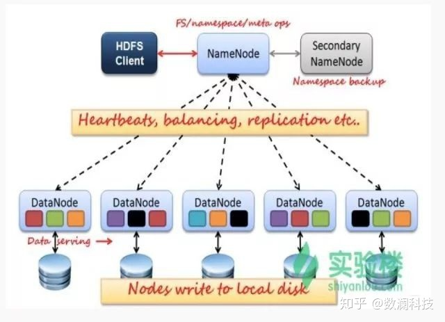
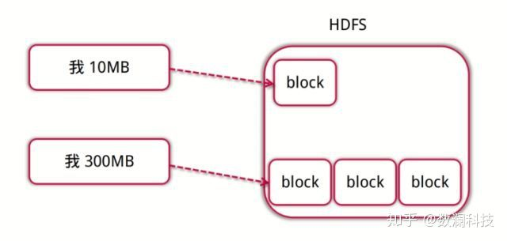
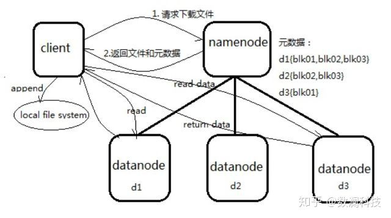
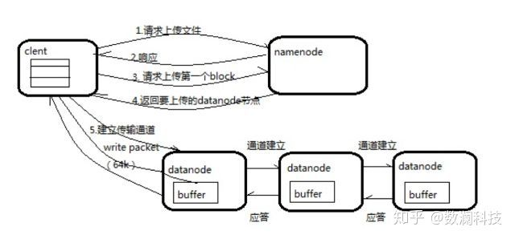
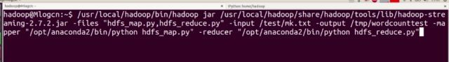
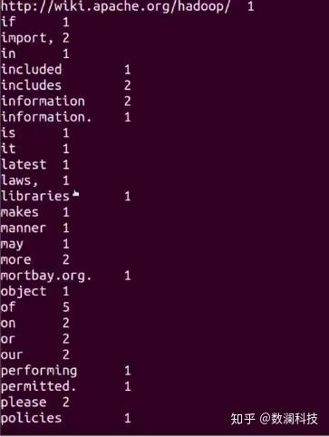

[TOC]
## 一、Hadoop

Hadoop是一个开源的大数据框架，是一个分布式计算的解决方案。

Hadoop的两个核心解决了数据存储问题（HDFS分布式文件系统）和分布式计算问题（MapRe-duce）。

举例1：用户想要获取某个路径的数据，数据存放在很多的机器上，作为用户不用考虑在哪台机器上，HD-FS自动搞定。

举例2：如果一个100p的文件，希望过滤出含有Hadoop字符串的行。这种场景下，HDFS分布式存储，突破了服务器硬盘大小的限制，解决了单台机器无法存储大文件的问题，同时MapReduce分布式计算可以将大数据量的作业先分片计算，最后汇总输出。

## 二、Hadoop特点

### 优点

1、支持超大文件。HDFS存储的文件可以支持TB和PB级别的数据。

2、检测和快速应对硬件故障。数据备份机制，NameNode通过心跳机制来检测DataNode是否还存在。

3、高扩展性。可建构在廉价机上，实现线性（横向）扩展，当集群增加新节点之后，NameNode也可以感知，将数据分发和备份到相应的节点上。

4、成熟的生态圈。借助开源的力量，围绕Hadoop衍生的一些小工具。

### 缺点

1、不能做到低延迟。高数据吞吐量做了优化，牺牲了获取数据的延迟。

2、不适合大量的小文件存储。

3、文件修改效率低。HDFS适合一次写入，多次读取的场景。

### Hadoop能干什么

- 大数据存储:   分布式存储
- 日志处理:     擅长日志分析
- ETL:         数据抽取到oracle、mysql、DB2、mongdb及主流数据库
- 机器学习:     比如Apache Mahout项目
- 搜索引擎:     Hadoop + lucene实现
- 数据挖掘:     目前比较流行的广告推荐，个性化广告推荐

> Hadoop是专为离线和大规模数据分析而设计的，并不适合那种对几个记录随机读写的在线事务处理模式。

## 三、HDFS介绍

### 1、HDFS框架分析

HDFS是Master和Slave的主从结构。主要由Name-Node、Secondary NameNode、DataNode构成。

  

#### NameNode

管理HDFS的名称空间和数据块映射信存储元数据与文件到数据块映射的地方。

如果NameNode挂掉了，文件就会无法重组，怎么办？有哪些容错机制？

Hadoop可以配置成HA即高可用集群，集群中有两个NameNode节点，一台active主节点，另一台stan-dby备用节点，两者数据时刻保持一致。当主节点不可用时，备用节点马上自动切换，用户感知不到，避免了NameNode的单点问题。

#### Secondary NameNode

辅助NameNode，分担NameNode工作，紧急情况下可辅助恢复NameNode。

#### DataNode

Slave节点，实际存储数据、执行数据块的读写并汇报存储信息给NameNode。

### 2、HDFS文件读写

文件按照数据块的方式进行存储在DataNode上，数据块是抽象块，作为存储和传输单元，而并非整个文件。
  

  

**文件为什么要按照块来存储呢？**

首先屏蔽了文件的概念，简化存储系统的设计，比如100T的文件大于磁盘的存储，需要把文件分成多个数据块进而存储到多个磁盘；为了保证数据的安全，需要备份的，而数据块非常适用于数据的备份，进而提升数据的容错能力和可用性。

**数据块大小设置如何考虑？**

文件数据块大小如果太小，一般的文件也就会被分成多个数据块，那么在访问的时候也就要访问多个数据块地址，这样效率不高，同时也会对NameNode的内存消耗比较严重；数据块设置得太大的话，对并行的支持就不太好了，同时系统如果重启需要加载数据，数据块越大，系统恢复就会越长。

#### HDFS文件读流程

  

1、向NameNode通信查询元数据（block所在的DataNode节点），找到文件块所在的DataNode服务器。

2、挑选一台DataNode（就近原则，然后随机）服务器，请求建立socket流。

3、DataNode开始发送数据（从磁盘里面读取数据放入流，以packet为单位来做校验）。

4、客户端已packet为单位接收，现在本地缓存，然后写入目标文件，后面的block块就相当于是append到前面的block块最后合成最终需要的文件。

#### HDFS文件写流程  

  

1. 向NameNode通信请求上传文件，NameNode检查目标文件是否已存在，父目录是否存在。

2. NameNode返回确认可以上传。

3. client会先对文件进行切分，比如一个block块128m，文件有300m就会被切分成3个块，一个128m、一个128m、一个44m。请求第一个block该传输到哪些DataNode服务器上。

4. NameNode返回DataNode的服务器。

5. client请求一台DataNode上传数据，第一个DataNode收到请求会继续调用第二个DataNode，然后第二个调用第三个DataNode，将整个通道建立完成，逐级返回客户端。

6. client开始往A上传第一个block，当然在写入的时候DataNode会进行数据校验，第一台DataNode收到后就会传给第二台，第二台传给第三台。

7. 当一个block传输完成之后，client再次请求NameNode上传第二个block的服务器。

## 四、MapReduce介绍

### 1、概念

MapReduce是一种编程模型，是一种编程方法，是抽象的理论，采用了分而治之的思想。MapReduce框架的核心步骤主要分两部分，分别是Map和Reduce。每个文件分片由单独的机器去处理，这就是Map的方法，将各个机器计算的结果汇总并得到最终的结果，这就是Reduce的方法。

### 2、工作流程

向MapReduce框架提交一个计算作业时，它会首先把计算作业拆分成若干个Map任务，然后分配到不同的节点上去执行，每一个Map任务处理输入数据中的一部分，当Map任务完成后，它会生成一些中间文件，这些中间文件将会作为Reduce任务的输入数据。Reduce任务的主要目标就是把前面若干个Map的输出汇总到一起并输出。  

  

### 3、运行MapReduce示例

运行Hadoop自带的MapReduce经典示例Word-count，统计文本中出现的单词及其次数。首先将任务提交到Hadoop框架上。  

  

查看MapReduce运行结束后的输出文件目录及结果内容。  

  

可以看到统计单词出现的次数结果  

  

## 五、Hadoop安装

墙裂推荐：史上最详细的Hadoop环境搭建[https://blog.csdn.net/hliq5399/article/details/78193113/](https://link.zhihu.com/?target=https%3A//blog.csdn.net/hliq5399/article/details/78193113/)

https://www.zhihu.com/question/333417513/answer/795736712?utm_source=wechat_session&utm_medium=social&utm_oi=867777191335858176