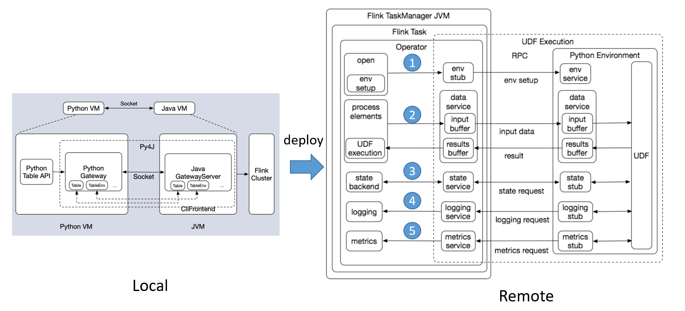

[视频](https://ververica.cn/developers/flink-training-course-basics/)
[视频](https://github.com/flink-china/flink-training-course)
[中文学习](https://ververica.cn/)
[PyFlink 作业的多种部署模式](https://ververica.cn/developers/multiple-deployment-modes-of-pyflink-jobs/)

[flink系列-11、PyFlink 核心功能介绍（整理自 Flink 中文社区）](https://www.cnblogs.com/xiexiandong/p/12878642.html)

Python虚拟机（PyVM）和Java虚拟机（JVM）之间建立握手有两种解决方案：Beam和Py4J

使用Apache Beam来实现VM通信有点复杂。简而言之，这是因为Apache Beam专注于通用性，在极端情况下缺乏灵活性。

Flink（Spark）还需要交互式编程。此外，为了使Flink（Spark）正常工作，我们还需要确保其API设计中的语义一致性，尤其是在其多语言支持方面。Apache Beam的现有体系结构无法满足这些要求，因此答案很明显，Py4J是支持PyVM和JVM之间通信的最佳选择。

 .|Beam|Py4J
---|---|---
interactive programming FLIP-36（交互式编程）|不支持|支持
Java call Python | 不支持|支持
Align Flink Java API | 不支持|支持

[Python Support for UDFs in Flink 1.10](https://flink.apache.org/2020/04/09/pyflink-udf-support-flink.html)

大体的流程我们可以大概看一下：
1. 在 open 方法里进行 Java Operator 和 Python Operator 环境的初始化。
2. 环境初始化好之后，会进行数据处理。当 Java Operator 收到数据之后，先把数据放到一个input buffer 缓冲区中，达到一定的阈值后，才会 flash 到 Python 这边。Python 这边在处理完之后，也会先将数据放到一个结果的缓冲区中，当达到一定阈值，比如达到一定的记录的行数，或者是达到一定的时间的位置，才会把结果 flash 到这边。
3. state 访问的链路。
4. logging 访问的链路。
5. metrics 汇报的链路。