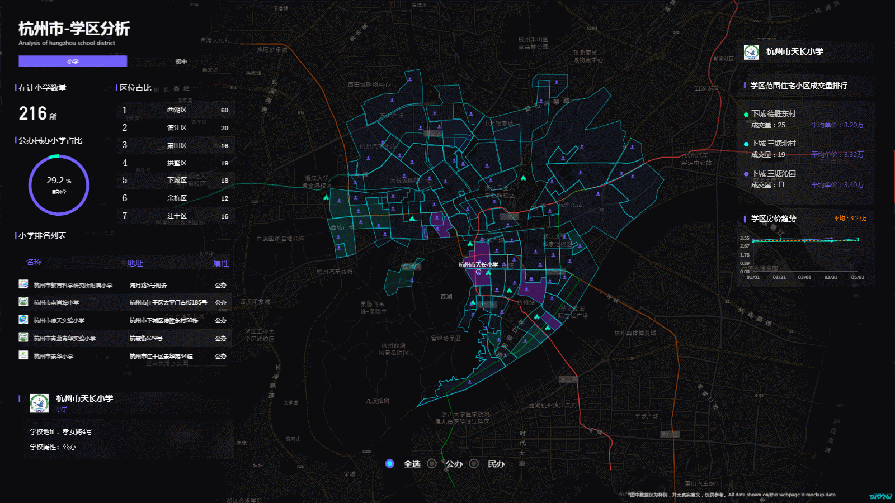
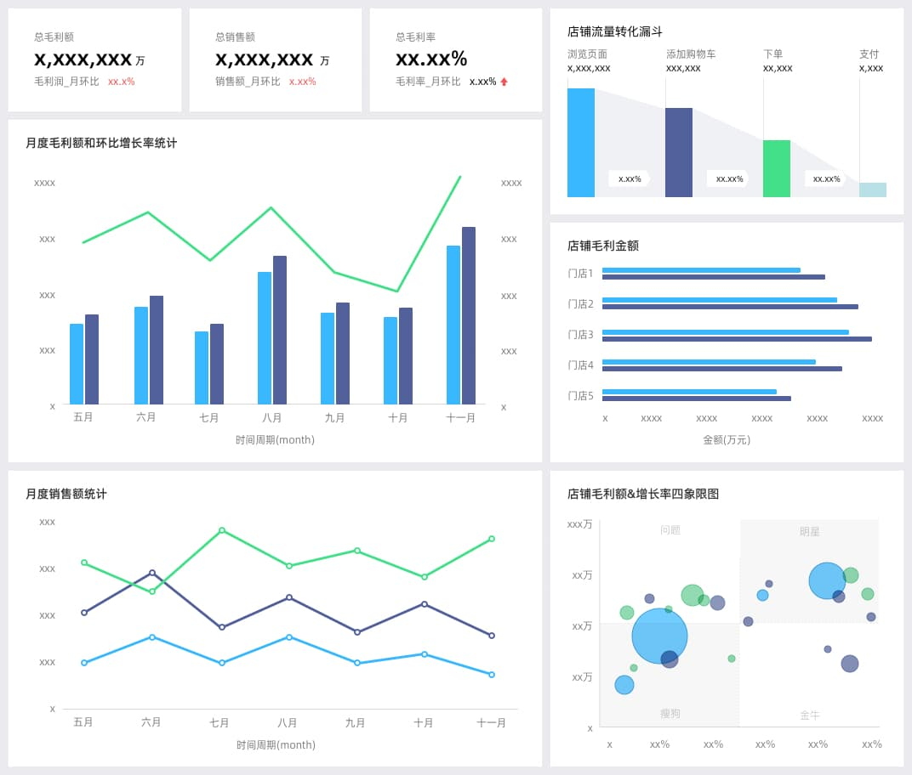
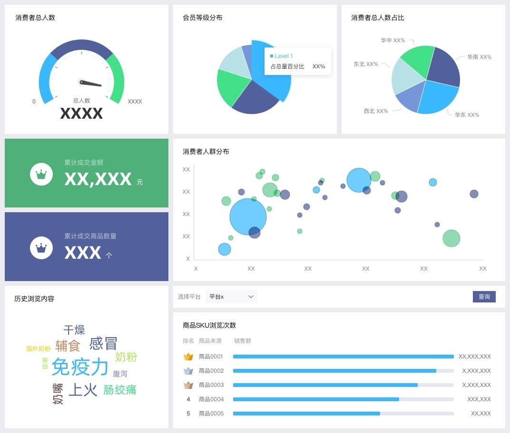
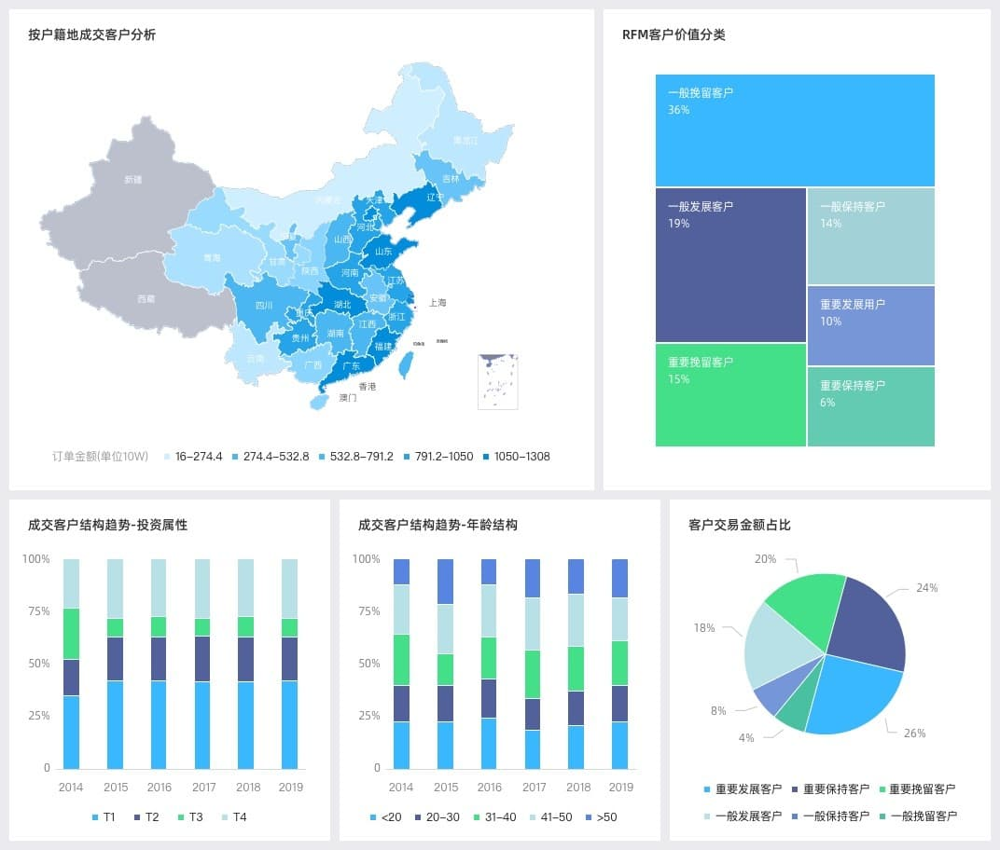
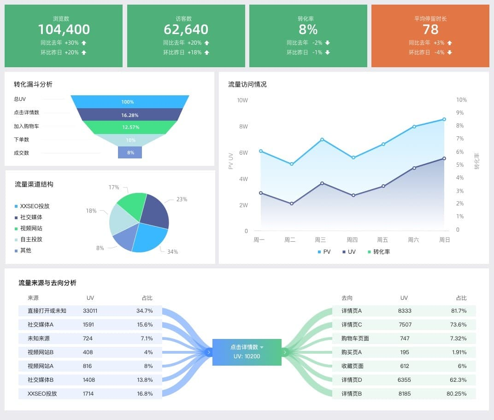
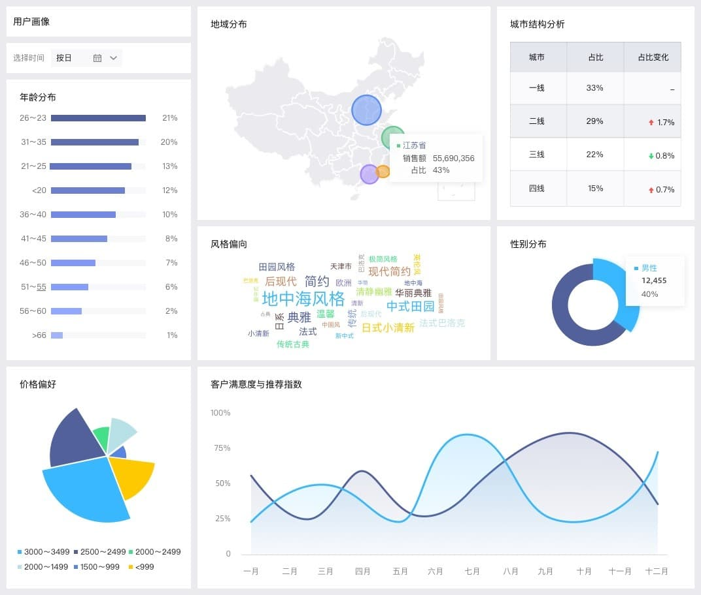
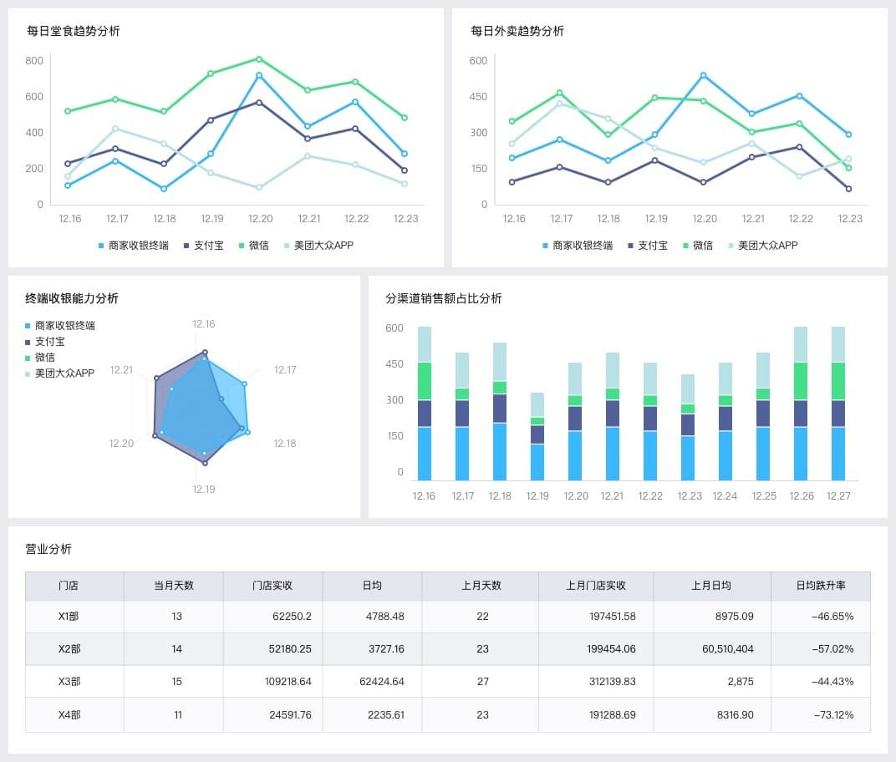

https://github.com/heibaiying/BigData-Notes


https://blog.csdn.net/qq_32641659/article/details/98729045


https://www.kaggle.com/

框架 | 语言|当前版本(2019/12/19)|star
--|--|--|--
[Apache Hadoop](https://github.com/apache/hadoop) |java| v2.10|10k
[Apache Spark](https://github.com/apache/spark)|scala，java|v3.0.0|24.6k
[Apache Flink](https://github.com/apache/flink) |java，scala |V1.9.1|11.5k
[Apache Storm](https://github.com/apache/storm)|java |V2.1.0|6k

Hadoop(第一代) - > Spark(第二代) - > Flink(第三代)

[Spark](https://spark.apache.org/) 生态更为丰富,在机器学习整合方面投入更多
[Flink](https://flink.apache.org/) 在流计算上有明显优势，核心架构和模型也更透彻和灵活一些。

总而言之，Flink与Spark没有谁强谁弱，只有哪个更适合当前的场景。

Spark与Flink API情况
API| Spark | Flink
--|--|--
底层API | RDD |Process Function
核心API  | DataFrame/DataSet/Structured Streaming | DataStream/DataSet
SQL | Spark SQL | Table API & SQL
机器学习 | MLlib | FlinkML
图计算 | GraphX | Gelly
其它 |  | CEP


Spark与Flink 对开发语言的支持

支持语言| Spark | Flink
--|--|--
Java|√|√
Scala|√|√
Python|√|√
R|√|第三方
SQL|√|√

Flink VS Spark 之 Connectors
https://ci.apache.org/projects/flink/flink-docs-release-1.9/zh/dev/connectors/
https://spark.apache.org/

支持| Spark | Flink
--|--|--
Hbase           |√  |√
HDFS            |√  |√
PostgreSQL      |√  |
Mysql           |√  |
Elastic         |√  |√
kafka           |√  |√
redis           |√  |
cassandra       |√  |√
mongoDB         |√  |
Alluxio         |√  |
Hive            |√  |
hundreds of other data sources|√  |
RabbitMQ        |   |√
Amazon Kinesis Streams|   |√
Apache NiFi     |   |√
Twitter Streaming API |   |√


Flink VS Spark 之 运行环境

部署环境| Spark | Flink
--|--|--
Local(single JVM) | √|√
Standalone |√|√
Yarn |√|√
Mesos |√|√
Kubernetes |√|√

Flink 流处理
Storm 流处理
Spark 微批处理
Hadoop 批处理


故障容忍（Apache Storm）、低延迟（Apache Flink、Storm），可操作性（Twitter Heron）、直观编程模型（Millwheel）、语义处理（Dataflow、Samza、Flink）、弹性伸缩（Millwheel），有效资源管理（Twitter Heron）和状态管理（Spark Streaming）


----------------

## 数据挖掘工作平台 Weka


在大数据时代，数据挖掘是最关键的工作。大数据的挖掘是从海量、不完全的、有噪声的、模糊的、随机的大型数据库中发现隐含在其中有价值的、潜在有用的信息和知识的过程，也是一种决策支持过程。其主要基于人工智能，机器学习，模式学习，统计学等。通过对大数据高度自动化地分析，做出归纳性的推理，从中挖掘出潜在的模式，可以帮助企业、商家、用户调整市场政策、减少风险、理性面对市场，并做出正确的决策。目前，在很多领域尤其是在商业领域如银行、电信、电商等，数据挖掘可以解决很多问题，包括市场营销策略制定、背景分析、企业管理危机等。大数据的挖掘常用的方法有分类、回归分析、聚类、关联规则、神经网络方法、Web 数据挖掘等。这些方法从不同的角度对数据进行挖掘。


(1)分类。分类是找出数据库中的一组数据对象的共同特点并按照分类模式将其划分为不同的类，其目的是通过分类模型，将数据库中的数据项映射到摸个给定的类别中。可以应用到涉及到应用分类、趋势预测中，如淘宝商铺将用户在一段时间内的购买情况划分成不同的类，根据情况向用户推荐关联类的商品，从而增加商铺的销售量。

(2)回归分析。回归分析反映了数据库中数据的属性值的特性，通过函数表达数据映射的关系来发现属性值之间的依赖关系。它可以应用到对数据序列的预测及相关关系的研究中去。在市场营销中，回归分析可以被应用到各个方面。如通过对本季度销售的回归分析，对下一季度的销售趋势作出预测并做出针对性的营销改变。

(3)聚类。聚类类似于分类，但与分类的目的不同，是针对数据的相似性和差异性将一组数据分为几个类别。属于同一类别的数据间的相似性很大，但不同类别之间数据的相似性很小，跨类的数据关联性很低。

(4)关联规则。关联规则是隐藏在数据项之间的关联或相互关系，即可以根据一个数据项的出现推导出其他数据项的出现。关联规则的挖掘过程主要包括两个阶段：第一阶段为从海量原始数据中找出所有的高频项目组;第二极端为从这些高频项目组产生关联规则。关联规则挖掘技术已经被广泛应用于金融行业企业中用以预测客户的需求，各银行在自己的ATM 机上通过捆绑客户可能感兴趣的信息供用户了解并获取相应信息来改善自身的营销。

(5)神经网络方法。神经网络作为一种先进的人工智能技术，因其自身自行处理、分布存储和高度容错等特性非常适合处理非线性的以及那些以模糊、不完整、不严密的知识或数据为特征的处理问题，它的这一特点十分适合解决数据挖掘的问题。典型的神经网络模型主要分为三大类：第一类是以用于分类预测和模式识别的前馈式神经网络模型，其主要代表为函数型网络、感知机;第二类是用于联想记忆和优化算法的反馈式神经网络模型，以Hopfield 的离散模型和连续模型为代表。第三类是用于聚类的自组织映射方法，以ART 模型为代表。虽然神经网络有多种模型及算法，但在特定领域的数据挖掘中使用何种模型及算法并没有统一的规则，而且人们很难理解网络的学习及决策过程。

(6)Web数据挖掘。Web数据挖掘是一项综合性技术，指Web 从文档结构和使用的集合C 中发现隐含的模式P，如果将C看做是输入，P 看做是输出，那么Web 挖掘过程就可以看做是从输入到输出的一个映射过程。

当前越来越多的Web 数据都是以数据流的形式出现的，因此对Web 数据流挖掘就具有很重要的意义。目前常用的Web数据挖掘算法有：PageRank算法，HITS算法以及LOGSOM 算法。这三种算法提到的用户都是笼统的用户，并没有区分用户的个体。目前Web 数据挖掘面临着一些问题，包括：用户的分类问题、网站内容时效性问题，用户在页面停留时间问题，页面的链入与链出数问题等。在Web 技术高速发展的今天，这些问题仍旧值得研究并加以解决。


大数据最直观的理解，就是数据量很大，但是多大才算是大呢？根据IDC作出的估测，数据一直以每年50%的速度增长，也就意味着数据每两年就增长一倍。 
人类在近两年产生的数据相当于之前产生的全部数据量。
预计到2020年，全球将总共拥有35ZB（**1ZB=1024EB,1EB=1024PB,1PB=1024TB,1TB=1024GB**）的数据量。


## 珠宝行业应用

营销数据分析

精准营销
精细化运营


个人化推荐
精准推荐(猜你喜欢 or 看了又看)

图计算：
社交网络
知识图谱
电商&金融风控

网络安全


大数据珠宝行业可以做什么：

分析营销数据 ERP，订单和会员
根据粉丝的点击和浏览以及购买行为 分析
打开市场-开拓客户和吸引投资商
打造珠宝行业头条、资讯、大数据（水贝·中国珠宝指数）

地图上正在交易的地点亮着


https://zhenchao125.gitbooks.io/bigdata_mallanalyze_atguigu/
- Top10 热门品类
- Top10热门品类中每个品类的 Top10 活跃 Session 统计

> 对于排名前 10 的品类，分别获取每个品类点击次数排名前 10 的 sessionId。
> 这个就是说，对于 top10 的品类，每一个都要获取对它点击次数排名前 10 的 sessionId。
> 这个功能，可以让我们看到，对某个用户群体最感兴趣的品类，各个品类最感兴趣最典型的用户的 session 的行为。计算完成之后，将数据保存到 MySQL 数据库中。


- 页面单跳转化率统计
> 计算页面单跳转化率，什么是页面单跳转换率，比如一个用户在一次 Session 过程中访问的页面路径 3,5,7,9,10,21，那么页面 3 跳到页面 5 叫一次单跳，7-9 也叫一次单跳，那么单跳转化率就是要统计页面点击的概率
> 比如：计算 3-5 的单跳转化率，先获取符合条件的 Session 对于页面 3 的访问次数（PV）为 A，然后获取符合条件的 Session 中访问了页面 3 又紧接着访问了页面 5 的次数为 B，那么 B/A 就是 3-5 的页面单跳转化率.


> 产品经理和运营总监，可以根据这个指标，去尝试分析，整个网站，产品，各个页面的表现怎么样，是不是需要去优化产品的布局；吸引用户最终可以进入最后的支付页面。

> 数据分析师，可以此数据做更深一步的计算和分析。
> 企业管理层，可以看到整个公司的网站，各个页面的之间的跳转的表现如何，可以适当调整公司的经营战略或策略。


- 各区域热门商品 Top3

地区 |	商品名称|	点击次数|	城市备注
---|---|---|---
华北|	商品A|	100000|	北京21.2%，天津13.2%，其他65.6%
华北|	商品P|	80200|	北京63.0%，太原10%，其他27.0%
华北|	商品M|	40000|	北京63.0%，太原10%，其他27.0%
东北|	商品J|	92000|	大连28%，辽宁17.0%，其他 55.0%

- 地区活跃度统计

- 营销活动点击、销售等分析


阿里云：智能推荐、 Quick BI 和 DataV


智能商场数据大屏
作为亲橙里第一大智慧核心的商场实时数据大屏，可以实时监测商场内以及每一楼层的到访人数、男女比例、车辆数量、店铺销售业绩和环境监控，准确度甚至可精确至秒。帮助商场管理人员全方位地掌握时间段、区域、店铺，甚至商品在消费者中的受欢迎程度，为运营管理方案的制定、调整与实施提供了更为便捷和一目了然的渠道。


智慧机场实时大屏
香港机场是全世界最繁忙的客运机场之一，每年处理超过7400万旅客，利用数据可视化大屏将航站楼内的人流数据以及停机坪上的交通状况实时显示，便于管理团队监控并随时调节机场内整体的状况，打造更满足时代潮流发展的智慧机场。


智慧工厂生产控制大屏
综合呈现了智慧工厂中每个生产阶段的生产状态参数，整个车间或者流水线的作业情况都会被汇总到一个整体的调度控制中心，能够控制并且帮助管理人员了解每一个生产阶段的工作情况，潜在的流水线程序错误将最大程度的被避免，通过可视化的手段实现远程监控指挥。


学区房分析大屏
根据杭州市区的中小学校区的方位分布，展现各区学校排名、学校数量、周边学区房房价及成交量，清晰地展现了杭州主城区学区情况，为房地产行业进行了有效地可视化呈现，也为需要选择购买学区房的人提供了方便。（数据来源三方公开数据，真实性与阿里云无关）



QuickBI助力零售企业实现全场景业务分析
通过整合散落的各类数据，构建统一的大数据平台系统，实现经营、商品、流量、店铺、订 单、营销等各类场景分析，从各类整体指标概览，再到分层细节指标数据的对比分析，实现 数据指导业务精细化运营。

能够解决
- 多渠道数据无法整合分析
多渠道经营、流量、店铺等数据各自为阵，无法整合关联分析。
- 数据的汇管用无法统一
各业务部分规则不同导致无法实现统一化管控，数据分析过程中效率低下。
- 业务人员自助分析困难
业务人员分析数据完全依赖IT部门，无法根据需求灵活分析



QuickBI助力飞鹤奶粉云上消费者生命周期洞察
整合散落的消费者数据，统一划分消费者生命周期，发现客户价值与客户的主客观需求，并洞察沉睡/流失客户，指导业务运营人员在拉新、营销活动策略、老客复购、环节做出针对性策略。

能够解决
- 数据分散
大量的消费者相关的事实数据、行为数据散落在多个系统，数据源的不统一导致数据就是零散的孤岛；
- 用户群体划分口径不同
消费者运营管理方式多样且环节较多，口径不一；
- 无法即时获取所需分析
各业务数据需求环节不能达到即时高效地使用数据。



QuickBI一站式搞定地产项目全周期分析
从项目前期调研、中期实施、交付到保修阶段，实现各阶段数据资源的整合及关注指标的实时监控预警，形成贯穿项目开发全周期的数据化管理机制，让产品和服务更贴近客户。

能够解决
- 业务系统数据分散化
业务数据各自为阵，难以从开发项目全周期视角实现对各阶段风险的全局把控；
- 业务分析需求迭代较快
市场政策变化快速，业务部门存在许多个性化数据分析需求；
- 项目开发进度及风险预警管控难实现
老式开发报表的方式周期较长、耗费较多人力，难以对业务部门需求的快速响应。


QuickBI数据驱动互联网业务优化与创新
百合大数据平台部门通过Quick BI，实现可视化数据分析，支撑传统交友业务与新视频交友业务。实现海量的离线用户行为数据的即席分析与查询，以及消费数据的实时分析。从而指导运营在各环节采取对应策略，实现精细化运营。

能够解决
- 海量数据难以实现即席分析
传统报表平台在做海量数据查询分析时，响应很慢，花费了大量IT与业务的人力资源；
- 业务口径差异
新老业务合并分析时，口径逻辑不同导致无法实现自上而下，从整体概览到精细化分析的诉求。用户流量红利消失，互联网寒冬到来，如何精细化分析实现增长是必须要解决的问题。


QuickBI助力用户行为画像
新的时代需要全方位的去利用大数据提高会员服务的体验，需要对会员的分类、分级、偏好、以及连锁门店的经营状况等数据进行分析，以增加对会员行为预测的更准确的判断。

能够解决
- 用户数据提取效率
要从业务上面考虑，如何从会员及其行为数据提取洞见，并给会员提供更好的服务；
- BI系统建设成本
传统BI 和大数据建设的体系成本非常高，速度也很慢；
- 业务人员协同
传统连锁的报表分析业务门槛很高，限于连锁模式的特性，很多业务人员分散在全国各地。



QuickBI助力餐饮行业大数据快速分析
将大型餐饮店铺类似数据分析需求抽象产品化，通过数据权限加个性化账号设置实现大型餐饮商家在统一系统的经营分析，大大节省了IT开发的人力成本，且能支撑日均近千万级数据量的分析查询。

能够解决
- 临时数据需求过多，人力不足
大型餐饮客户的数据查看需求过多，不定期就会要求提数，IT人力资源不足，导致分析需求不能及时响应；
- 数据量过大，开发难度大
日均流水明细数据过大，开发时间长，且易因细节问题返工；
- 数据需求存在共性，导致开发的重复单一
大型餐饮业客户数据需求存在共性，存在大量重复开发工作。


大屏实时数据
<video controls="" preload="none">
<source id="mp4" src="files/swiper.mp4" type="video/mp4"/>
</video>

```
<video src="file:///E:/openjw/open/BigData/files/swiper.mp4"  controls="controls"></video>
```

深圳市经济云图
<video controls="" preload="none">
<source id="mp4" src="files/shenz.mp4" type="video/mp4"/>
</video>
