<!--toc-->
[TOC]
# Hadoop 非正式介绍
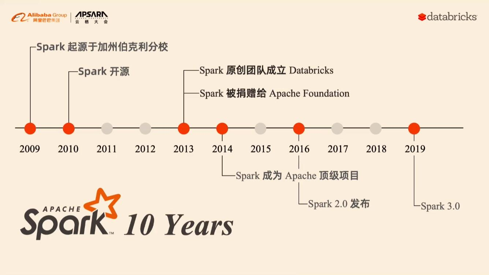

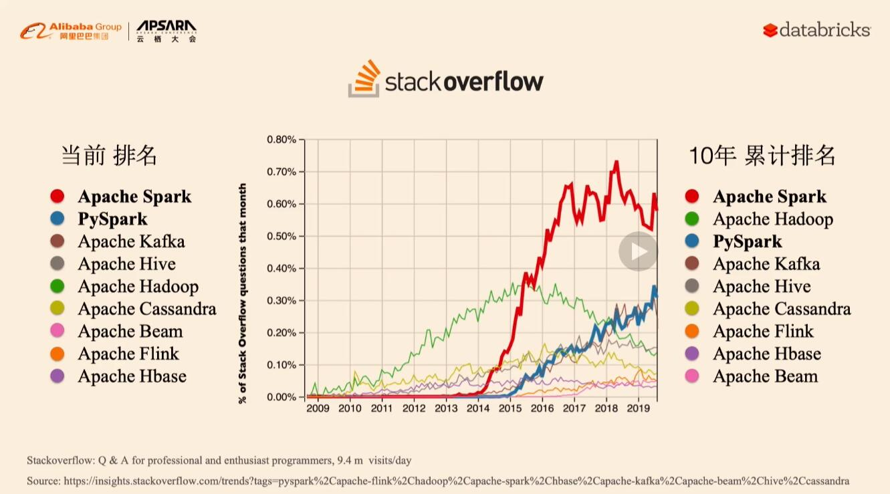

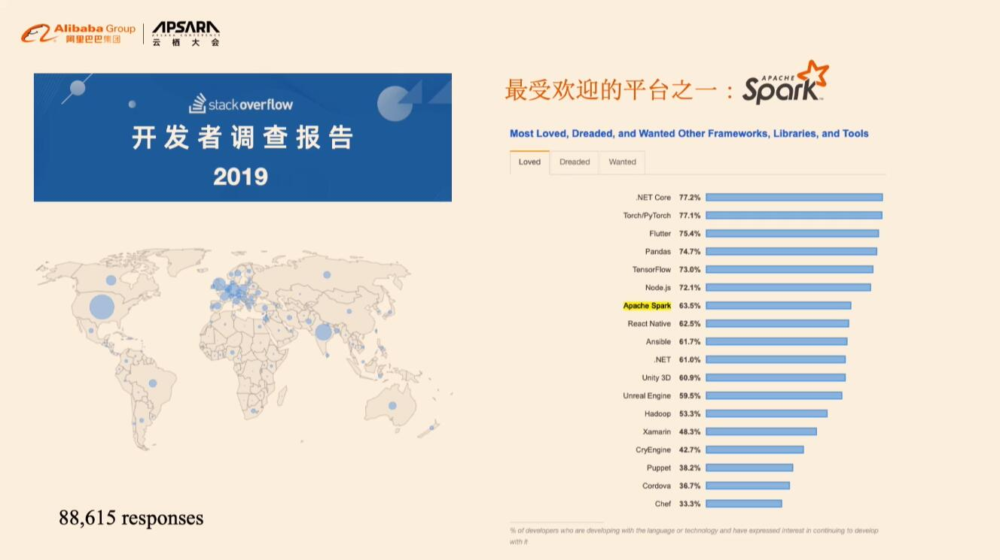

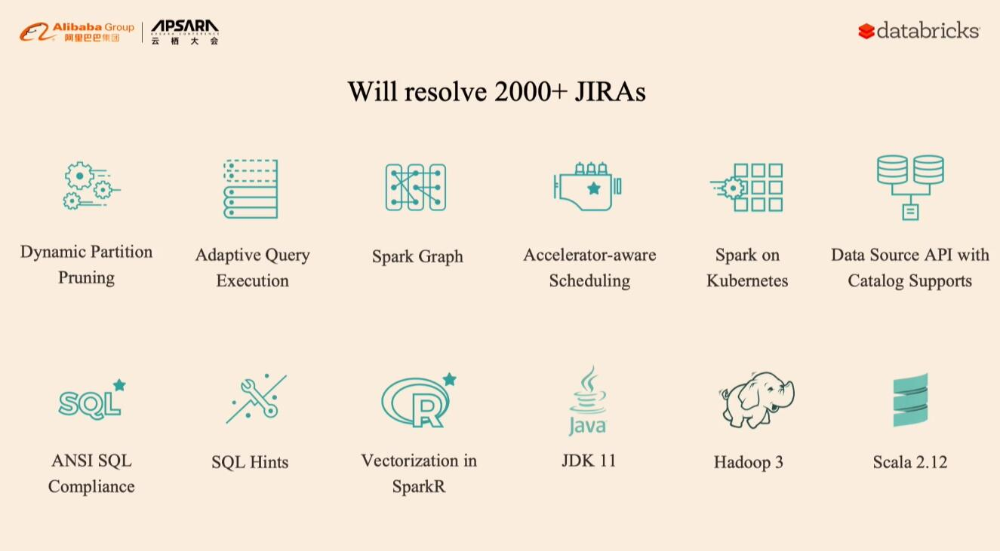


ETL(Extract-Transform-Load)用来描述将数据从来源端经过抽取（extract）、转换（transform）、加载（load）至目的端的过程、数据清洗(Data cleaning)

## Delta Lake
https://delta.io/
https://github.com/delta-io/delta

## mlflow
https://www.mlflow.org/
https://github.com/mlflow/mlflow/

## 分布式计算引擎
### MapReduce
MapReduce 模型的诞生是大数据处理从无到有的飞跃。但随着技术的进步，对大数据处理的需求也变得越来越复杂，MapReduce 的问题也日渐凸显。通常，我们将 MapReduce 的输入和输出数据保留在 HDFS 上，很多时候，复杂的 ETL、数据清洗等工作无法用一次 MapReduce 完成，所以需要将多个 MapReduce 过程连接起来：
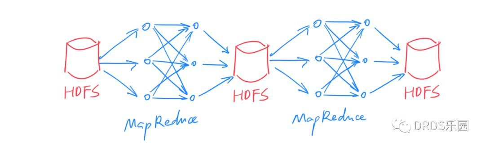
这种方式下，每次中间结果都要写入 HDFS 落盘保存，代价很大（HDFS 的每份数据都需要冗余若干份拷贝）。另外，由于本质上是多次 MapReduce 任务，调度也比较麻烦，实时性无从谈起。

### Spark
生态及运行原理
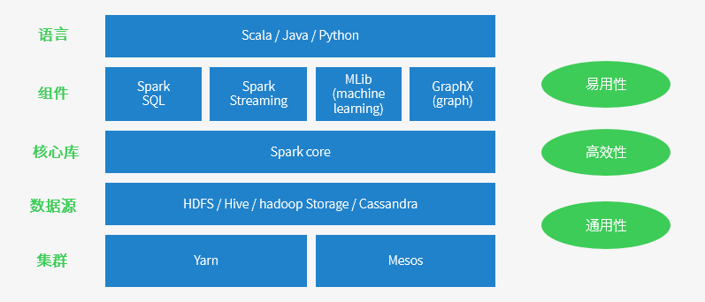
> 集群模式还支持：Standalone独立集群和K8S
#### Spark 特点
- **运行速度快:** Spark拥有DAG执行引擎，支持在内存中对数据进行迭代计算。官方提供的数据表明，如果数据由磁盘读取，速度是Hadoop MapReduce的10倍以上，如果数据从内存中读取，速度可以高达100多倍。

- **适用场景广泛:** 大数据分析统计，实时数据处理，图计算及机器学习

- **易用性:** 编写简单，支持80种以上的高级算子，支持多种语言，数据源丰富，可部署在多种集群中

- **容错性高:** Spark引进了弹性分布式数据集RDD (Resilient Distributed Dataset) 的抽象，它是分布在一组节点中的只读对象集合，这些集合是弹性的，如果数据集一部分丢失，则可以根据“血统”（即充许基于数据衍生过程）对它们进行重建。另外在RDD计算时可以通过CheckPoint来实现容错，而CheckPoint有两种方式：CheckPoint Data和Logging The Updates，用户可以控制采用哪种方式来实现容错。

#### Spark的适用场景

- 复杂的批量处理（Batch Data Processing），偏重点在于处理海量数据的能力，至于处理速度可忍受，通常的时间可能是在数十分钟到数小时；

- 基于历史数据的交互式查询（Interactive Query），通常的时间在数十秒到数十分钟之间

- 基于实时数据流的数据处理（Streaming Data Processing），通常在数百毫秒到数秒之间

#### Spark 与 RDD 模型
针对上面的问题，如果能把中间结果保存在内存里，岂不是快的多？之所以不能这么做，最大的障碍是：分布式系统必须能容忍一定的故障，所谓 fault-tolerance（错误容忍）。如果只是放在内存中，一旦某个计算节点宕机，其他节点无法恢复出丢失的数据，只能重启整个计算任务，这对于动辄成百上千节点的集群来说是不可接受的。

一般来说，想做到 fault-tolerance 只有两个方案：要么存储到外部（例如 HDFS），要么拷贝到多个副本。Spark 大胆地提出了第三种——重算一遍。但是之所以能做到这一点，是依赖于一个额外的假设：所有计算过程都是确定性的（deterministic）。Spark 借鉴了函数式编程思想，提出了 RDD（Resilient Distributed Datasets），译作“弹性分布式数据集”。

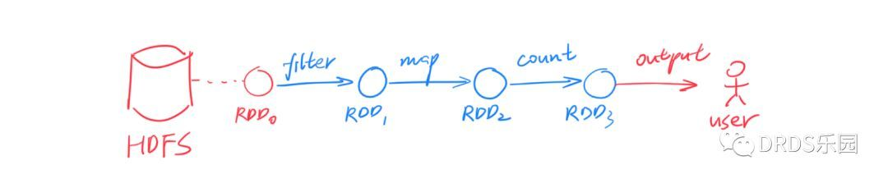
RDD 是一个只读的、分区的（partitioned）数据集合。RDD 要么来源于不可变的外部文件（例如 HDFS 上的文件），要么由确定的算子由其他 RDD 计算得到。RDD 通过算子连接构成有向无环图（DAG），上图演示了一个简单的例子，其中节点对应 RDD，边对应算子。

回到刚刚的问题，RDD 如何做到 fault-tolerance？很简单，RDD 中的每个分区都能被确定性的计算出来，所以一旦某个分区丢失了，另一个计算节点可以从它的前继节点出发、用同样的计算过程重算一次，即可得到完全一样的 RDD 分区。这个过程可以递归的进行下去。

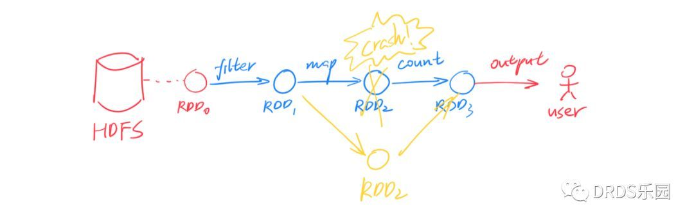

RDD 作为数据，在多种算子间变换，构成对执行计划 DAG 的描述。最后，一旦遇到类似 collect()这样的输出命令，执行计划会被发往 Spark 集群、开始计算。
算子分成两类:
- map()、filter()、join() 等算子称为 Transformation，它们输入一个或多个 RDD，输出一个 RDD。
- collect()、count()、save() 等算子称为 Action，它们通常是将数据收集起来返回；

```python
lines = spark.read.text("filename").rdd.map(lambda r: r[0])
counts = lines.flatMap(lambda x: x.split(' ')) \
                .map(lambda x: (x, 1)) \
                .reduceByKey(add)
output = counts.collect()
for (word, count) in output:
    print("%s: %i" % (word, count))
```

#### Spark SQL
Spark 诞生后，大幅简化了 MapReduce 编程模型，但人们并不满足于此。于是诞生了声明式接口：Spark SQL。我们知道，与命令式（imperative）编程相对的是声明式（declarative）编程，前者需要告诉程序怎样得到我需要的结果，后者则是告诉程序我需要的结果是什么。举例而言：你想知道，各个部门 `<dept_id, dept_name>`中性别为女 'female'的员工分别有多少？
命令式编程中:
```
employees = db.getAllEmployees() 
countByDept = dict() // 统计各部门女生人数 (dept_id -> count) 
for employee in employees: 
    if (employee.gender == 'female') 
        countByDept[employee.dept_id] += 1 
results = list() // 加上 dept.name 列 
depts = db.getAllDepartments() 
for dept in depts: 
    if (countByDept containsKey dept.id) 
        results.add(row(dept.id, dept.name, countByDept[dept.id])) 
return results;
```
声明式编程中，你只要用关系代数的运算表达出结果：
```
employees.join(dept, employees.deptId == dept.id).where(employees.gender == 'female').groupBy(dept.id, dept.name).agg()
```

> 等价SQL: `SELECT dept.id,dept.name,COUNT(*) FROM employees JOIN dept ON employees.dept_id = dept.id WHERE employees.gender ='female' GROUP BY dept.id,dept.name`

显然，声明式的要简洁的多！但声明式编程依赖于执行者产生真正的程序代码，所以除了上面这段程序，还需要把数据模型（即 schema）一并告知执行者。声明式编程最广为人知的形式就是 SQL。

Spark SQL 就是这样一个基于 SQL 的声明式编程接口。你可以将它看作在 Spark 之上的一层封装，在 RDD 计算模型的基础上，提供了 DataFrame API 以及一个内置的 SQL 执行计划优化器 Catalyst。
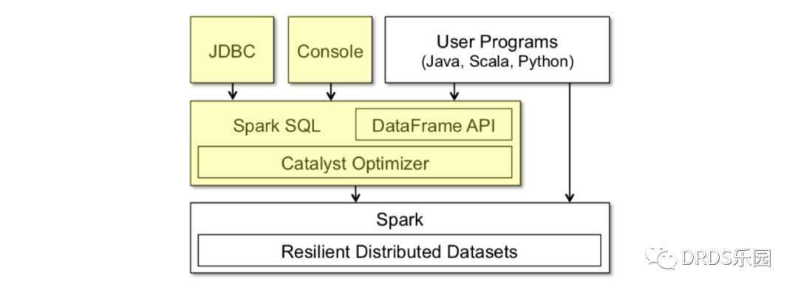
> 上图黄色部分是 Spark SQL 中新增的部分

DataFrame 就像数据库中的表，除了数据之外它还保存了数据的 schema 信息。计算中，schema 信息也会经过算子进行相应的变换。DataFrame 的数据是行（row）对象组成的 RDD，对 DataFrame 的操作最终会变成对底层 RDD 的操作。

Catalyst 是一个内置的 SQL 优化器，负责把用户输入的 SQL 转化成执行计划。Catelyst 强大之处是它利用了 Scala 提供的代码生成（codegen）机制，物理执行计划经过编译，产出的执行代码效率很高，和直接操作 RDD 的命令式代码几乎没有分别。

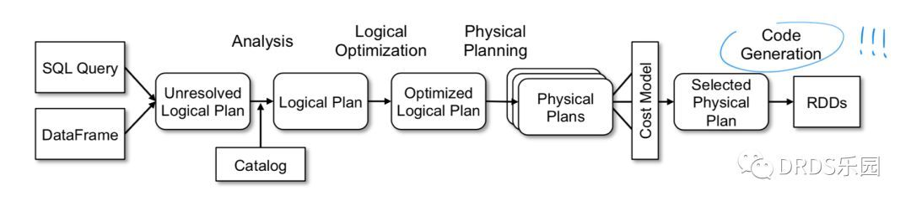
>上图是 Catalyst 的工作流程，与大多数 SQL 优化器一样是一个 Cost-Based Optimizer (CBO)，但最后使用代码生成（codegen）转化成直接对 RDD 的操作。

#### 流计算框架：Spark Streaming

以往，批处理和流计算被看作大数据系统的两个方面。我们常常能看到这样的架构——以 Kafka、Storm和后来的Flink 为代表的流计算框架用于实时计算，而 Spark 或 MapReduce 则负责每天、每小时的数据批处理。在 ETL 等场合，这样的设计常常导致同样的计算逻辑被实现两次，耗费人力不说，保证一致性也是个问题。

Spark Streaming 正是诞生于此类需求。传统的流计算框架大多注重于低延迟，采用了持续的（continuous）算子模型；而 Spark Streaming 基于 Spark，另辟蹊径提出了 D-Stream（Discretized Streams）方案：将流数据切成很小的批（micro-batch），用一系列的短暂、无状态、确定性的批处理实现流处理。
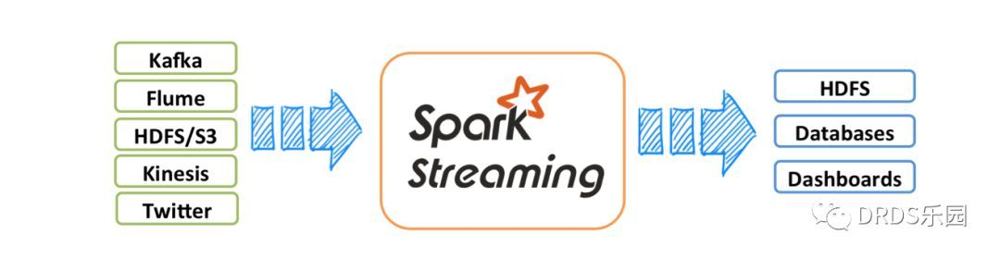

Spark Streaming 的做法在流计算框架中很有创新性，它虽然牺牲了低延迟（一般流计算能做到 100ms 级别，Spark Streaming 延迟一般为 1s 左右），但是带来了三个诱人的优势：

- 更高的吞吐量（大约是 Storm 的 2-5 倍）
- 更快速的失败恢复（通常只要 1-2s），因此对于 straggler（性能拖后腿的节点）直接杀掉即可
- 开发者只需要维护一套 ETL 逻辑即可同时用于批处理和流计算

#### 流计算与 SQL：Spark Structured Streaming
Spark 通过 Spark Streaming 拥有了流计算能力，那 Spark SQL 是否也能具有类似的流处理能力呢？答案是肯定的，只要将数据流建模成一张不断增长、没有边界的表，在这样的语义之下，很多 SQL 操作等就能直接应用在流数据上。

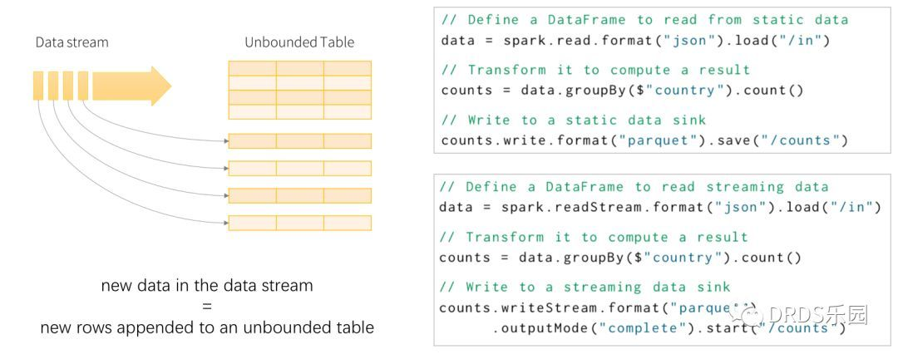
> 左b部分是 Spark Structured Streaming 模型示意图；右部分展示了同一个任务的批处理、流计算版本，可以看到，除了输入输出不同，内部计算过程完全相同。

与 Spark SQL 相比，流式 SQL 计算还有两个额外的特性，分别是窗口（window）和水位（watermark）。

**窗口（window）是对过去某段时间的定义**。批处理中，查询通常是全量的（例如：总用户量是多少）；而流计算中，我们通常关心近期一段时间的数据（例如：最近24小时新增的用户量是多少）。用户通过选用合适的窗口来获得自己所需的计算结果，常见的窗口有滑动窗口（Sliding Window）、滚动窗口（Tumbling Window）等。


**水位（watermark）用来丢弃过早的数据**。在流计算中，上游的输入事件可能存在不确定的延迟，而流计算系统的内存是有限的、只能保存有限的状态，一定时间之后必须丢弃历史数据。以双流 A JOIN B 为例，假设窗口为 1 小时，那么 A 中比当前时间减 1 小时更早的数据（行）会被丢弃；如果 B 中出现 1 小时前的事件，因为无法处理只能忽略。

水位和窗口的概念都是因时间而来。在其他流计算系统中，也存在相同或类似的概念。
> 关于 SQL 的流计算模型，常常被拿来对比的还有另一个流计算框架 Apache Flink。与 Spark 相比，它们的实现思路有很大不同，但在模型上是很相似的。

#### 访问不同的数据源
可以访问HDFS、Alluxio、Apache Cassandra、Apache HBase、Apache Hive和其他数百个数据源中的数据(DB,MQ,socket)。


## 参考

[Spark入门——什么是Hadoop，为什么是Spark?](https://www.cnblogs.com/wing1995/p/9300120.html)

[Spark 以及 spark streaming 核心原理及实践](https://www.cnblogs.com/liuliliuli2017/p/6809094.html)

[一文读懂 Spark 和 Spark Streaming](https://www.sohu.com/a/270444235_494938)

[Apache Spark Architecture](https://intellipaat.com/blog/tutorial/spark-tutorial/spark-architecture/)

[Spark Cluster Architecture Explained](https://www.edureka.co/blog/spark-architecture/)

[The Components and Working of Spark](https://www.digitalvidya.com/blog/spark-architecture/)