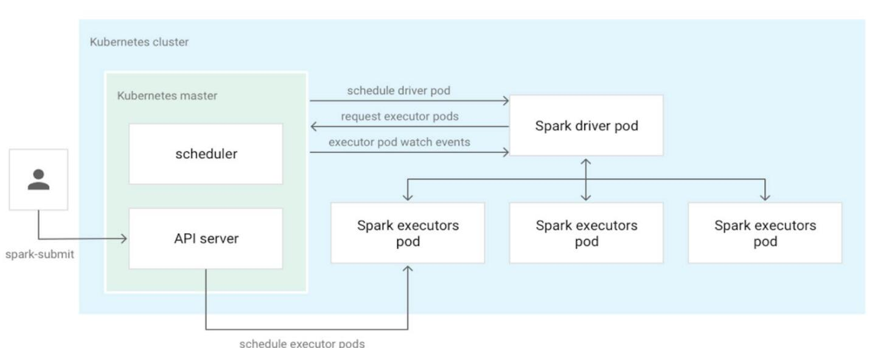

http://spark.apache.org/docs/latest/running-on-kubernetes.html

https://github.com/GoogleCloudPlatform/spark-on-k8s-operator
https://github.com/GoogleCloudPlatform/spark-on-k8s-operator/blob/master/docs/quick-start-guide.md
[Spark in action on Kubernetes - Spark Operator的原理解析](https://yq.aliyun.com/articles/695315)


[Spark on K8S环境部署细节](https://www.cnblogs.com/lanrish/p/12267623.html)


上面这张图是Spark中kubernetes的集成图，也就是说当我们通过spark-submit提交作业的时候，会自动生成driver pod与exector pods



### Two ways to submit Spark applications on k8s

Spark-submit
- “Vanilla” way from Spark main open source repo
- Configs spread between Spark config(mostly) and k8s manifests
- Little pod customization support before Spark 3.0
- App management is more manual

spark-on-k8s operator
- Open-sourced by Google (but works on any platform)
- Configs in k8s-style YAML with sugar on top (configmaps, volumes, affinities)
- Tooling to read logs, kill, restart,schedule apps
- Requires a long-running system pod

### App management in practice
Spark-submit
```
# Run an app
$ spark-submit --master k8s://https://<api-server> …
# List apps
k get pods -label "spark-role=driver"
NAME READY STATUS RESTARTS AGE
my-app-driver 0/1 Completed 0 25h
# Read logs
k logs my-app-driver
# Describe app
# No way to actually describe an app and its parameters… 
```

spark-on-k8s operator
```
# Run an app
$ kubectl apply -f <app-manifest>.yaml
# List apps
$ k get sparkapplications
NAME AGE
my-app 2d22h
# Read logs
sparkctl log my-app
# Describe app
$ k get sparkapplications my-app -o yaml
apiVersion: sparkoperator.k8s.io/v1beta2
kind: SparkApplication
 arguments:
 - gs://path/to/data.parquet
 mainApplicationFile: local:///opt/my-app/main.jar
 ...
status:
 applicationState:
 state: COMPLETED
 ...
```

### Dependency Management Comparison
YARN
- Lack of isolation
    ○ Global Spark version
    ○ Global Python version
    ○ Global dependencies

- Lack of reproducibility
    ○ Flaky Init scripts
    ○ Subtle differences in AMIs or system

Kubernetes
- Full isolation
    ○ Each Spark app runs in its own docker container
- Control your environment
    ○ Package each app in a docker image
    ○ Or build a small set of docker images for major changes and specify your app code using URIs
