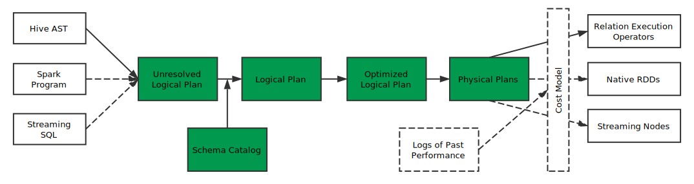
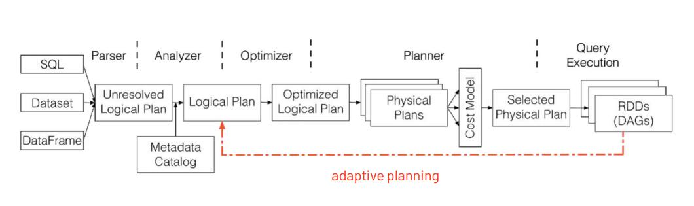

https://www.tutorialspoint.com/spark_sql/spark_sql_introduction.htm
https://data-flair.training/blogs/spark-sql-tutorial/


## 跨源

数据虚拟化（data virtualization）是用来描述所有数据管理方法的涵盖性术语，这些方法允许应用程序检索并管理数据，且不需要数据相关的技术细节。


- 阿里云的 【数据管理 DMS】通过DBLink 实现 [跨数据库查询](https://help.aliyun.com/document_detail/99941.html?spm=a2c4g.11186623.6.581.49e97e53uziNCp) 

- SparkSQL 

- 华为的数据虚拟化引擎[OpenLookeng](https://openlookeng.io/zh-cn/docs/docs/overview/use-cases.html)
openLooKeng不是为处理联机事务处理（OLTP）而设计，openLooKeng被设计用来处理数据仓库和分析：数据分析、聚合大量数据并生成报告。这些工作负载通常归类为联机分析处理（OLAP）。

- SQL Server 数据虚拟化 (Polybase)  [配置 PolyBase 以访问 Hadoop 中的外部数据](https://docs.microsoft.com/zh-cn/sql/relational-databases/polybase/polybase-configure-hadoop?view=sql-server-ver15)

    [PolyBase 与 链接服务器 比较](https://docs.microsoft.com/zh-cn/sql/relational-databases/polybase/polybase-faq?view=sql-server-ver15)


- PostgreSQL外部数据源支持(Foreign Data Wrapper，FDW)
可以把 70 种外部数据源 (包括 Mysql, Oracle, CSV, hadoop …) 当成自己数据库中的表来查询。Postgres有一个针对这一难题的解决方案：一个名为“外部数据封装器(Foreign Data Wrapper，FDW)”的特性。该特性最初由PostgreSQL社区领袖Dave Page四年前根据SQL标准SQL/MED(SQL Management of External Data)开发。FDW提供了一个SQL接口，用于访问远程数据存储中的远程大数据对象，使DBA可以整合来自不相关数据源的数据，将它们存入Postgres数据库中的一个公共模型。这样，DBA就可以访问和操作其它系统管理的数据，就像在本地Postgres表中一样。例如，使用FDW for MongoDB，数据库管理员可以查询来自文档数据库的数据，并使用SQL将它与来自本地Postgres表的数据相关联。借助这种方法，用户可以将数据作为行、列或JSON文档进行查看、排序和分组。他们甚至可以直接从Postgres向源文档数据库写入(插入、更细或删除)数据，就像一个一体的无缝部署。也可以对Hadoop集群或MySQL部署做同样的事。FDW使Postgres可以充当企业的中央联合数据库或“Hub”。


## 架构图 Architecture 

SparkSQL架构分成三个部分，第一部分是前端的，第二部分是后端的，第三个部分是中间的Catalyst，这个Catalyst是整个架构的核心。



https://0x90e.github.io/spark-sql-architecture/
## 函数
http://spark.apache.org/docs/latest/api/sql/index.html

## 执行计划

```
>>> spark.sql("EXPLAIN FORMATTED" + query).show()


EXPLAIN [FORMATTED|EXTENDED|DEPENDENCY|AUTHORIZATION] hql_query

FORMATTED：对执行计划进行格式化，返回JSON格式的执行计划
EXTENDED：提供一些额外的信息，比如文件的路径信息

下面两个测试报错
DEPENDENCY：以JSON格式返回查询所依赖的表和分区的列表
AUTHORIZATION：列出需要被授权的条目，包括输入与输出
```
spark.sql("SELECT age FROM emp where age>25 order by age").explain()
可以调用explain(True)方法查看逻辑和物理执行计划

## SparkSQL中产生笛卡尔积的几种典型场景以及处理策略

1. join语句中不指定on条件
`select * from test_partition1 join test_partition2;`
2. join语句中指定不等值连接
`select * from test_partition1 t1 inner join test_partition2 t2 on t1.name <> t2.name;`
3. join语句on中用or指定连接条件
`select * from test_partition1 t1 join test_partition2 t2 on t1.id = t2.id or t1.name = t2.name;`
4. join语句on中用||指定连接条件
`select * from test_partition1 t1 join test_partition2 t2 on t1.id = t2.id || t1.name = t2.name;`
除了上述举的几个典型例子，实际业务开发中产生笛卡尔积的原因多种多样。

同时需要注意，在一些SQL中即使满足了上述4种规则之一也不一定产生笛卡尔积。比如，对于join语句中指定不等值连接条件的下述SQL不会产生笛卡尔积:
```
--在Spark SQL内部优化过程中针对join策略的选择，最终会通过SortMergeJoin进行处理。
select * from test_partition1 t1 join test_partition2 t2 on t1.id = t2.id and t1.name<>t2.name;
```
此外，对于直接在SQL中使用cross join的方式，也不一定产生笛卡尔积。比如下述SQL：
```
-- Spark SQL内部优化过程中选择了SortMergeJoin方式进行处理
select * from test_partition1 t1 cross  join test_partition2 t2 on t1.id = t2.id;
```
但是如果cross join没有指定on条件同样会产生笛卡尔积。
那么如何判断一个SQL是否产生了笛卡尔积呢？
### Spark SQL是否产生了笛卡尔积

以join语句不指定on条件产生笛卡尔积的SQL为例:
```
-- test_partition1和test_partition2是Hive分区表
select * from test_partition1 join test_partition2;
```
通过Spark UI上SQL一栏查看上述SQL执行图，
可以看出，因为该join语句中没有指定on连接查询条件，导致了CartesianProduct即笛卡尔积。

也可以看执行计划 ：通过逻辑计划到物理计划，以及最终的物理计划选择CartesianProduct，可以分析得出该SQL最终确实产生了笛卡尔积。
### Spark SQL中产生笛卡尔积的处理策略
1. 在利用Spark SQL执行SQL任务时，通过查看SQL的执行图来分析是否产生了笛卡尔积。如果产生笛卡尔积，则将任务杀死，进行任务优化避免笛卡尔积。
2. 分析Spark SQL的逻辑计划和物理计划，通过程序解析计划推断SQL最终是否选择了笛卡尔积执行策略。如果是，及时提示风险。 

除了笛卡尔积效率比较低，BroadcastNestedLoopJoin效率也相对低效，尤其是当数据量大的时候还很容易造成driver端的OOM，这种情况也是需要极力避免的。


## 参考
[二十八、SparkSQL入门](https://www.toutiao.com/i6846994501806850568)