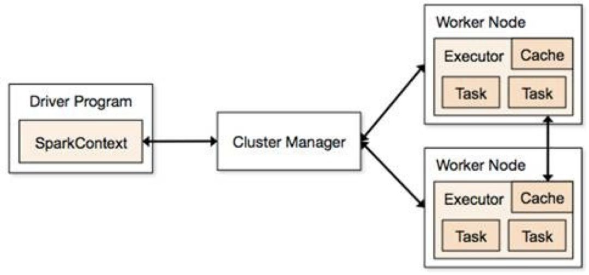
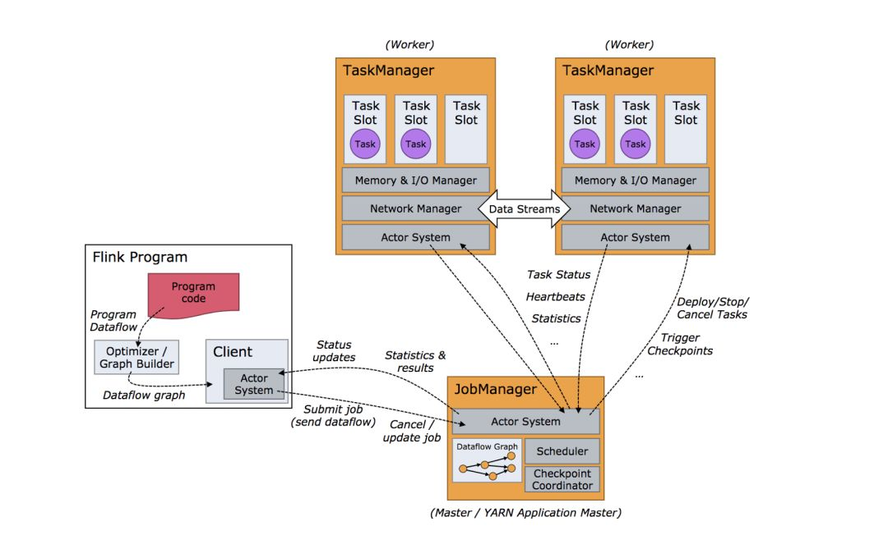
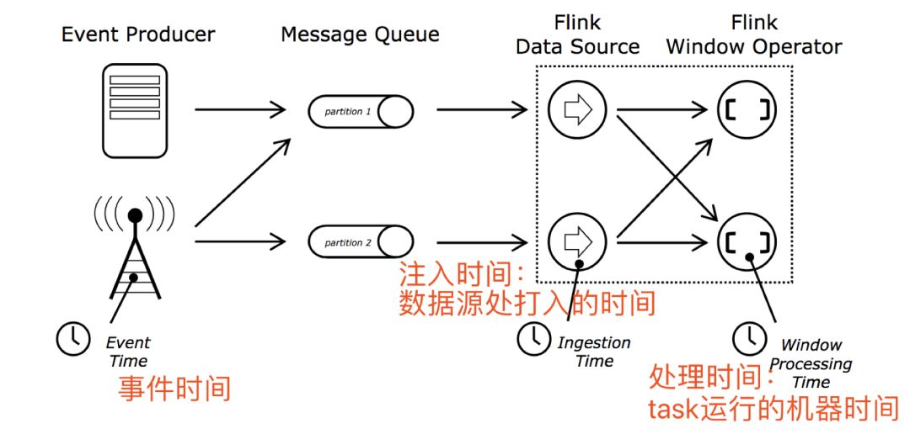
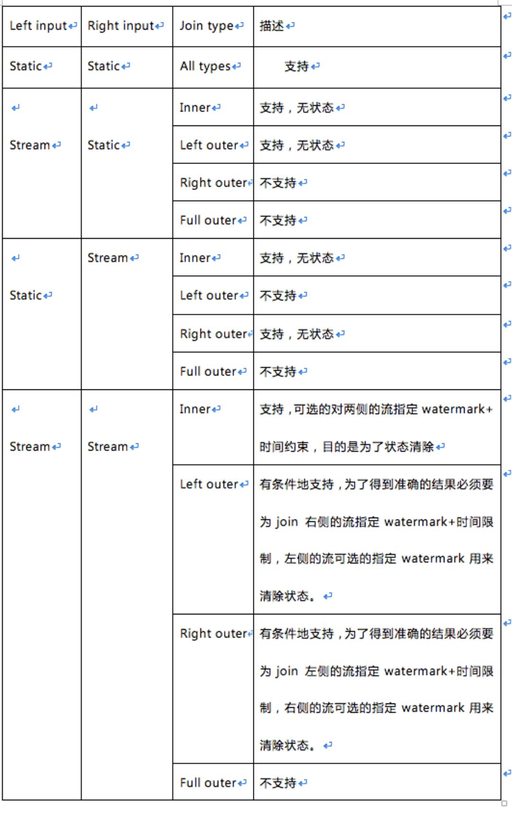

<!--toc-->
[TOC]

flink是标准的实时处理引擎，而且Spark的两个模块Spark Streaming和Structured Streaming都是基于微批处理的，不过现在Spark Streaming已经非常稳定基本都没有更新了，然后重点移到spark sql和structured Streaming了。

Flink作为一个很好用的实时处理框架，也支持批处理，不仅提供了API的形式，也可以写sql文本。这篇文章主要是帮着大家对于Structured Streaming和flink的主要不同点。文章建议收藏后阅读。

**1. 运行模型**

Structured Streaming 的task运行也是依赖driver 和 executor，当然driver和excutor也还依赖于集群管理器Standalone或者yarn等。可以用下面一张图概括：



Flink的Task依赖jobmanager和taskmanager。官方给了详细的运行架构图，可以参考：



Structured Streaming 周期性或者连续不断的生成微小dataset，然后交由Spark SQL的增量引擎执行，跟Spark Sql的原有引擎相比，增加了增量处理的功能，增量就是为了状态和流表功能实现。由于是也是微批处理，底层执行也是依赖Spark SQL的。

Flink 中的执行图可以分成四层：StreamGraph-> JobGraph -> ExecutionGraph -> 物理执行图。细分:

**StreamGraph**： 是根据用户通过 Stream API 编写的代码生成的最初的图。用来表示程序的拓扑结构。

**JobGraph**： StreamGraph经过优化后生成了JobGraph，提交给 JobManager 的数据结构。主要的优化为，将多个符合条件的节点 chain 在一起作为一个节点，这样可以减少数据在节点之间流动所需要的序列化/反序列化/传输消耗。这个可以用来构建自己的自己的集群任务管理框架。

**ExecutionGraph**： JobManager 根据 JobGraph 生成的分布式执行图，是调度层最核心的数据结构。

**物理执行图**： JobManager 根据ExecutionGraph 对 Job 进行调度后，在各个TaskManager 上部署 Task 后形成的“图”，并不是一个具体的数据结构。

**2. 编程风格**

两者的编程模型基本一致吧，都是链式调用。

3. 时间概念

三种处理时间：事件时间，注入时间，处理时间。



Flink支持三种时间，同时flink支持基于事件驱动的处理模型，同时在聚合等算子存在的时候，支持状态超时自动删除操作，以避免7\*24小时流程序计算状态越来越大导致oom，使得程序挂掉。

Structured Streaming仅支持事件时间，处理时间。

对于基于事件时间的处理flink和Structured Streaming都是支持watemark机制，窗口操作基于watermark和事件时间可以对滞后事件做相应的处理，虽然听起来这是个好事，但是整体来说watermark就是鸡肋，它会导致结果数据输出滞后，比如watermark是一个小时，窗口一个小时，那么数据输出实际上会延迟两个小时，这个时候需要进行一些处理。

**4. 维表实现及异步io**

Structured Streaming不直接支持与维表的join操作，但是可以使用map、flatmap及udf等来实现该功能，所有的这些都是同步算子，不支持异步IO操作。但是Structured Streaming直接与静态数据集的join，可以也可以帮助实现维表的join功能，当然维表要不可变。

Flink也不支持与维表进行join操作，除了map，flatmap这些算子之外，flink还有异步IO算子，可以用来实现维表，提升性能。关于flink的异步IO可以参考浪尖以前的文章：

[Flink异步IO第一讲](http://mp.weixin.qq.com/s?__biz=MzA3MDY0NTMxOQ==&mid=2247485776&idx=1&sn=bb78ed1f45c7509688526cbd29686f4f&chksm=9f38ea78a84f636e468765b2f870e5f78afe5063f6a94b96cca540c9116fc39d7e4a123b6b6e&scene=21#wechat_redirect)

**5. 状态管理**

状态维护应该是流处理非常核心的概念了，比如join，分组，聚合等操作都需要维护历史状态，那么flink在这方面很好，structured Streaming也是可以，但是spark Streaming就比较弱了，只有个别状态维护算子upstatebykye等，大部分状态需要用户自己维护，虽然这个对用户来说有更大的可操作性和可以更精细控制但是带来了编程的麻烦。flink和Structured Streaming都支持自己完成了join及聚合的状态维护。

Structured Streaming有高级的算子，用户可以完成自定义的mapGroupsWithState和flatMapGroupsWithState，可以理解类似Spark Streaming 的upstatebykey等状态算子。

就拿mapGroupsWithState为例：

由于Flink与Structured Streaming的架构的不同，task是常驻运行的，flink不需要状态算子，只需要状态类型的数据结构。

首先看一下Keyed State下，我们可以用哪些原子状态：

**ValueState**：即类型为T的单值状态。这个状态与对应的key绑定，是最简单的状态了。它可以通过update方法更新状态值，通过value()方法获取状态值。

**ListState**：即key上的状态值为一个列表。可以通过add方法往列表中附加值；也可以通过get()方法返回一个Iterable<T>来遍历状态值。

**ReducingState**：这种状态通过用户传入的reduceFunction，每次调用add方法添加值的时候，会调用reduceFunction，最后合并到一个单一的状态值。

**FoldingState**：跟ReducingState有点类似，不过它的状态值类型可以与add方法中传入的元素类型不同（这种状态将会在Flink未来版本中被删除）。

**MapState**：即状态值为一个map。用户通过put或putAll方法添加元素。

**6. join操作**

flink的join操作没有大的限制，支持种类丰富，比：

**Inner Equi-join**

```hljs-default
SELECT * FROM Orders INNER JOIN Product ONOrders.productId = Product.id
```

**Outer Equi-join**

```hljs-default
SELECT *FROM Orders LEFT JOIN Product ON Orders.productId =Product.idSELECT *FROM Orders RIGHT JOIN Product ON Orders.productId =Product.idSELECT *FROM Orders FULL OUTER JOIN Product ONOrders.productId = Product.id
```

**Time-windowed Join**

```hljs-default
SELECT * FROM Oderso,Shipmentss WHEREo.id=s.orderIdAND o.ordertimeBETWEENs.shiptime INTERVAL'4'HOURANDs.shiptime
```

**Expanding arrays into a relation**

```hljs-default
SELECT users, tagFROM Orders CROSS JOIN UNNEST(tags) AS t (tag)
```

**Join with Table Function**

```hljs-default
Inner JoinA row of the left (outer) table is dropped, if its table function call returns an empty result.SELECT users, tagFROM Orders, LATERAL TABLE(unnest_udtf(tags)) t AS tagLeft Outer JoinIf a table function call returns an empty result, the corresponding outer row is preserved and the result padded with null values.SELECT users, tagFROM Orders LEFT JOIN LATERAL TABLE(unnest_udtf(tags)) t AS tag ON TRUE
```

**Join with Temporal Table**

```hljs-default
SELECT  o_amount, r_rateFROM  Orders,  LATERAL TABLE (Rates(o_proctime))WHERE  r_currency = o_currency
```

Structured Streaming的join限制颇多了，知识星球里发过了join细则，限于篇幅问题在这里只讲一下join的限制。具体如下表格



还有另外细则需要说明一下：

1. join可以传递。比如df1.join(df2).join(df3)。
    
2. 从spark2.3开始，只有在输出模式为append的流查询才能使用join，其他输出模式暂不支持。
    
3. 从spark2.3开始，在join之前不允许使用no-map-like操作。以下是不能使用的例子。
    

- 在join之前不能使用流聚合操作。
    
- 在join之前，无法在update模式下使用mapGroupsWithState和flatMapGroupsWithState。
    

**7. 触发处理模型**

这个之所以讲一下区别，实际缘由也很简单，Structured Streaming以前是依据spark的批处理起家的实时处理，而flink是真正的实时处理。那么既然Structured Streaming是批处理，那么问题就简单了，批次执行时间和执行频率自然是有限制的，就产生了多种触发模型，简单称其为triggers。Strucctured Streaming的triggers有以下几种形式：

1). 支持单次触发处理，类似于flink的批处理。

Trigger.Once()顾名思义这个仅处理一次，类似于flink的批处理。

2). 周期性触发处理

Trigger.ProcessingTime("2 seconds")

 查询将以微批量模式执行，其中微批次将以用户指定的间隔启动:

a).如果先前的微批次在该间隔内完成，则引擎将等待该间隔结束，然后开始下一个微批次。

b).如果前一个微批次需要的时间超过完成的时间间隔（即如果错过了区间边界），那么下一个微批次将在前一个完成后立即开始（即，它不会等待下一个间隔边界））。

c).如果没有可用的新数据，则不会启动微批次。

3). 连续处理

指定一个时间间隔

Trigger.Continuous("1 second")

这个1秒钟表示每秒钟记录一次连续处理查询进度。

4). 默认触发模型

一个批次执行结束立即执行下个批次。

Flink的触发模式很简单了，一旦启动job一直执行处理，不存在各种触发模式，当然假如窗口不算的话。

**8. 表管理**

flink和structured streaming都可以讲流注册成一张表，然后使用sql进行分析，不过两者之间区别还是有些的。

Structured Streaming将流注册成临时表，然后用sql进行查询，操作也是很简单跟静态的dataset/dataframe一样。

```hljs-default
df.createOrReplaceTempView("updates")spark.sql("select count(*) from updates")
```

其实，此处回想Spark Streaming 如何注册临时表呢？在foreachRDD里，讲rdd转换为dataset/dataframe，然后将其注册成临时表，该临时表特点是代表当前批次的数据，而不是全量数据。Structured Streaming注册的临时表就是流表，针对整个实时流的。Sparksession.sql执行结束后，返回的是一个流dataset/dataframe,当然这个很像spark sql的sql文本执行，所以为了区别一个dataframe/dataset是否是流式数据，可以df.isStreaming来判断。

当然，flink也支持直接注册流表，然后写sql分析，sql文本在flink中使用有两种形式：

```hljs-default
1). tableEnv.sqlQuery("SELECT product,amount FROM Orders WHERE product LIKE '%Rubber%'")2). tableEnv.sqlUpdate("INSERT INTO RubberOrders SELECT product, amount FROM Orders WHEREproduct LIKE '%Rubber%'");
```

对于第一种形式，sqlQuery执行结束之后会返回一张表也即是Table对象,然后可以进行后续操作或者直接输出，如：result.writeAsCsv("");。

而sqlUpdate是直接将结果输出到了tablesink，所以要首先注册tablesink，方式如下：

```hljs-default
TableSink csvSink = newCsvTableSink("/path/to/file", ...);String[] fieldNames = {"product","amount"};TypeInformation[] fieldTypes ={Types.STRING, Types.INT};tableEnv.registerTableSink("RubberOrders",fieldNames, fieldTypes, csvSink);
```

flink注册表的形式比较多，直接用数据源注册表，如：

```hljs-default
tableEnv.registerExternalCatalog();tableEnv.registerTableSource();
```

也可以从datastream转换成表，如：

```hljs-default
tableEnv.registerDataStream("Orders",ds, "user, product, amount");Table table = tableEnv.fromDataStream(ds,"user, product, amount");
```

**9. 监控管理**

对于Structured Streaming一个SparkSession实例可以管理多个流查询,可以通过SparkSession来管理流查询，也可以直接通过start调用后返回的StreamingQueryWrapper对象来管理流查询。

SparkSession.streams获取的是一个StreamingQueryManager，然后通过start返回的StreamingQueryWrapper对象的id就可以获取相应的流查询状态和管理相应的流查询。当然，也可以直接使用StreamingQueryWrapper来做这件事情，由于太简单了，我们就不贴了可以直接在源码里搜索该类。

对与Structured Streaming的监控，当然也可以使用StreamingQueryWrapper对象来进行健康监控和告警

其中，有些对象内部有更详细的监控指标，比如lastProgress，这里就不详细展开了。

还有一种监控Structured Streaming的方式就是自定义StreamingQueryListener，然后监控指标基本一样。注册的话直接使用

spark.streams.addListener(new StreamingQueryListener())即可。

Flink的管理工具新手的话主要建议是web ui ，可以进行任务提交，job取消等管理操作，监控的话可以看执行图的结构，job的执行状态，背压情况等。

当然，也可以通过比如flink的YarnClusterClient客户端对jobid进行状态查询，告警，启动，停止等操作。

**总结**

除了以上描述的这些内容，可能还关心kafka结合的时候新增topic或者分区时能否感知，实际上两者都能感知，初次之外。flink还有很多特色，比如数据回流，分布式事务支持，分布式快找，异步增量快照，丰富的windows操作，侧输出，复杂事件处理等等。

对于窗口和join，两者区别还是很大，限于篇幅问题后面浪尖会分别给出讲解。

flink是一个不错的流处理框架，虽然目前还有些bug和待完善的部分。

推荐阅读：

[几道大数据面试题](http://mp.weixin.qq.com/s?__biz=MzA3MDY0NTMxOQ==&mid=2247486221&idx=1&sn=cb24def038d68a2cfe57e487e7cd444e&chksm=9f38e825a84f6133172b3adf8b547ac04db9e1b79a85c6182a4dafdf47b083a220f3694ecc4a&scene=21#wechat_redirect)

[Spark&nbsp;Streaming&nbsp;VS&nbsp;Flink](http://mp.weixin.qq.com/s?__biz=MzA3MDY0NTMxOQ==&mid=2247486214&idx=1&sn=8bd44797a23c9350c8884213e82c3830&chksm=9f38e82ea84f6138774af6bdbdd6e5332e8c98e97a5b0dea83de295c779026426ab458e05f2b&scene=21#wechat_redirect)

[关于Structured&nbsp;Streaming都在这了～](http://mp.weixin.qq.com/s?__biz=MzA3MDY0NTMxOQ==&mid=2247486213&idx=2&sn=453c853f1f1e55bec64c290d8f8bd4b9&chksm=9f38e82da84f613b213dab0891317f2f24cdae5ba99285ce84d8c4bebf1df5b59125cae85588&scene=21#wechat_redirect)

[原文](https://mp.weixin.qq.com/s?__biz=MzUyMDA4OTY3MQ==&mid=2247487077&amp;idx=1&amp;sn=87b1e93ff98e6056c409ca53c4c2a2df&source=41#wechat_redirect)