<!--toc-->
[TOC]
# spark内核源码解析

## spark内核源码解析一
1、Application，自己编写的spark程序。
2、spark-submit，利用shell来提交自己的spark程序
3、Driver，standalone提交方式，会通过反射构造出一个Driver进程。Driver进程会执行application程序。
4、SparkContext，Driver进程执行Application程序时会构造一个SparkContext。它会构造出DAGScheduler和TaskScheduler。构造TaskScheduler时，会去寻找集群的master，通过一个后台进程，然后向master注册Application。Master收到注册请求后会在spark集群上找worker，然后启动相应的Executor。
5、Master
6、Worker
7、Executor，进程。Executor通过上面的步骤启动后会反向注册到taskScheduler上去。所有Executor反向注册完成后，会结束SparkContext初始化，会继续执行Application代码。Executor每接收一个Task都会用TaskRunner封装，然后从线程池中找一个线程执行。TaskRunner就将我们写的代码，要执行的算子和函数拷贝，反序列化，然后执行Task。
8、Job，每执行一个action就会提交一个job提交给DAGScheduler。
9、DAGScheduler，DAGScheduler会将job划分为多个stage，然后为每一个stage创建一个taskset，stage划分算法很重要。TaskScheduler会把TaskSet里面的每一个Task提交到executor上面去执行，task分配算法。
10、TaskScheduler
11、ShuffleMapTask and ResultTask，Task有两种，只有最后一个stage的Task才是ResultTask，其余的都是ShuffleMapTask

最后spark应用的执行，就是stage分批次作为task提交到executor执行，每个task针对RDD的一个Partition，执行我们定义的算子和函数，依次类推直到结束。

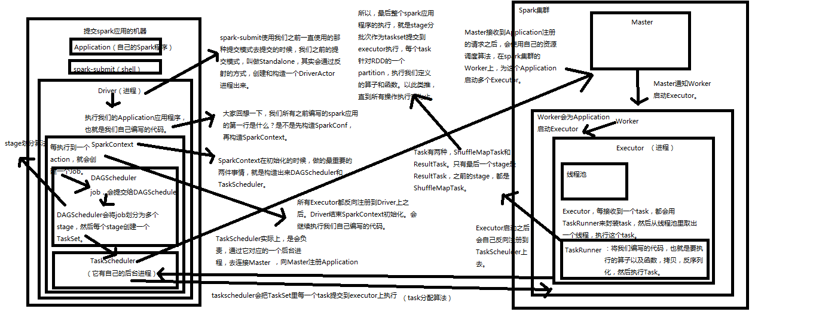

## Spark内核源码解析二：宽依赖和窄依赖
[Spark宽依赖和窄依赖深度剖析](https://www.jianshu.com/p/736a4e628f0f)
1、窄依赖

一个RDD的Partition对他的父个RDD中Partition只有一对一的关系。

2、宽依赖

本质就是每一个父RDD中的Partition的数据都可能会传输到下一个RDD的每一个Partition中。同时他们之间的操作就是shuffle。

宽依赖：父RDD的分区被子RDD的多个分区使用   例如 groupByKey、reduceByKey、sortByKey等操作会产生宽依赖，会产生shuffle

窄依赖：父RDD的每个分区都只被子RDD的一个分区使用  例如map、filter、union等操作会产生窄依赖

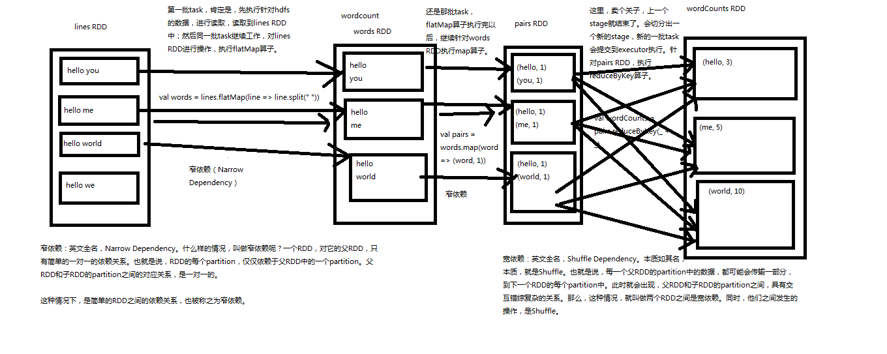

## Spark内核源码解析三：三种提交模式
1、基于Spark内核架构也就是standalone提交，基于自己的Master-worker集群。Driver在本地启动，

2、基于yarn的yarn-cluster模式，要先分配container，然后在yarn进群的一个nodeManager上启动Driver。

3、基于yarn的yarn-client模式，就是本地提交。

如果，你要切换到第二种和第三种模式，很简单，将我们之前用于提交spark应用程序的spark-submit脚本，加上--master参数，设置为yarn-cluster，或yarn-client，即可。如果你没设置，那么，就是standalone模式。

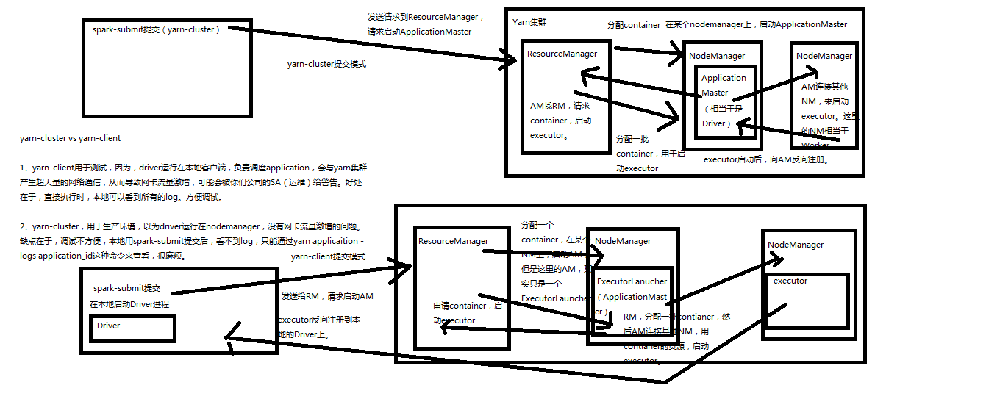

提交脚本如下
```
/usr/local/spark/bin/spark-submit \
--class cn.spark.study.core.WordCountCluster \
--num-executors 3 \
--driver-memory 100m \
--executor-memory 100m \
--executor-cores 3 \
--master yarn-cluster/yarn-client
```

## Spark内核源码解析四：SparkContext原理解析和源码解析


源码解析

主构造函数代码
```
 private[spark] var (schedulerBackend, taskScheduler) =
    SparkContext.createTaskScheduler(this, master)
```
createTaskScheduler，创建TaskSchedulerImpl和SparkDeploySchedulerBackend对象
　　TaskSchedulerImpl.initialize
　　　　创建一个Pool调度池
TaskSchedulerImpl.start()
　　SparkDeployShedulerBackend.start()
　　　　创建ApplicationDescreption，描叙Application需要多少内存，启动多少excecutor
　　　　创建AppClient，是一个actor
　　　　　　registerWithMaster，向Master进行注册
　　　　然后waitForRegistration

DAGScheduler，实现了面向stage的调度的高层次调度。它会为每一个job计算一个stage的DAG（有向无环图），追踪RDD和stage的输出是否物化（写入磁盘和内存），寻找一个最小消耗来调度job。它将stage作为
tasksets提交到底层的TaskSchedulerImpl上，来在集群上运行他们。
除了处理stage的DAG，它还负责决定运行一个task的最佳运行位置，基于当前缓存的状态，将这些最佳运行位置提交给底层TaskSchedulerImpl。它还会处理由于shuffle输出文件导致的失败，在这种情况下旧的stage
可能会被重新提交。一个stage内部的失败，如果不是由于shuffle文件丢失导致，会被TaskScheduler处理，它会多次重试一个task，直到最后实在不行，才取消task。
```
dagScheduler = new DAGScheduler(this)
private[spark] val ui: Option[SparkUI] =
  if (conf.getBoolean("spark.ui.enabled", true)) {
    Some(SparkUI.createLiveUI(this, conf, listenerBus, jobProgressListener,
env.securityManager,appName))
  } else {
    // For tests, do not enable the UI
None
  }
private[spark] var (schedulerBackend, taskScheduler) =
  SparkContext.createTaskScheduler(this, master)
```

## Spark内核源码继续五：Master原理解析和源码解析
1. Master的主备切换原理
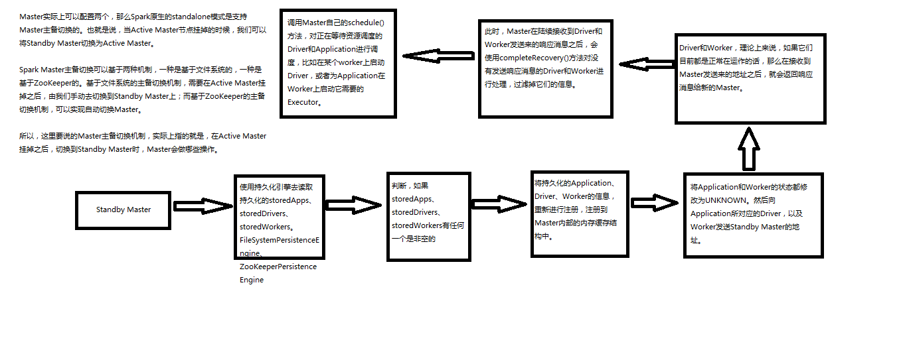
```
package org.apache.spark.deploy.master
　　completeRecovery，过滤没有响应的worker，app，drivers，从内存缓存中移除，从组件缓存中移除，从持久化机制中移除。
　　　　workers.filter(_.state == WorkerState.UNKNOWN).foreach(removeWorker),过滤掉没有响应的Worker，并且移除没有响应的
　　　　apps.filter(_.state == ApplicationState.UNKNOWN).foreach(finishApplication
　　　　// Reschedule drivers which were not claimed by any workers
　　　　drivers.filter(_.worker.isEmpty).foreach { d => }
```
2. 注册机制原理和源码分析
　　1. worker会向master注册，过滤将状态为Dead过滤掉，对于UNKNOW的状态的设置为Dead，清理掉旧的Worker信息，替换成新的。将Worker信息加入内存缓存中，用持久化引擎将Worker信息进行持久化（文件系统或者zookeeper），最后调用schedule方法。
　　2. Driver会向master注册，将Driver信息放入内存缓存中，hashmap中，加入等待调度执行队列ArrayBuffer，调用持久化引擎将Driver信息进行持久化，最后调用schedule方法
　　3. 用Spark-submit提交的Spark Application首先就是注册Driver，Driver启动好了，执行我们编写的Application代码，执行SparkContext初始化，底层的SparkDeploySchedulebackend，会通过AppClient内部的线程，ClientActor发送RegisterApplication，到Master进行Application的注册。将Application放入缓存，hashMap，将Application加入等待调度的Application队列ArrayBuffer，用持久化引擎将Application持久化。然后调用schedule方法。


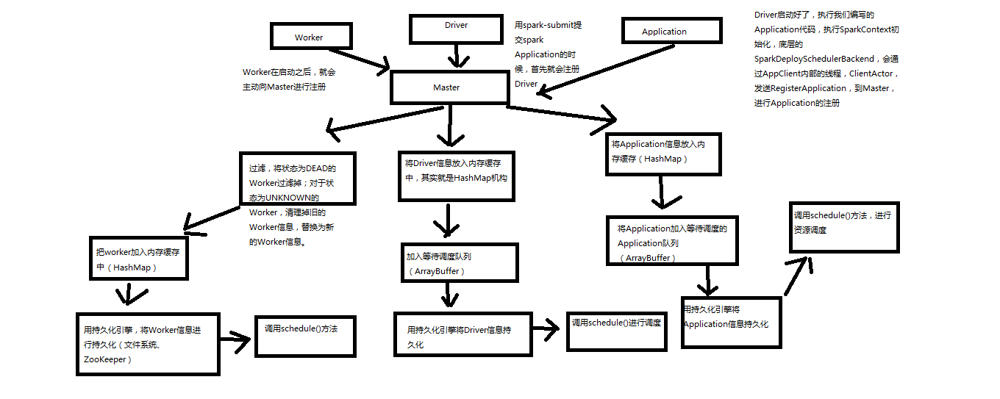
```
case RegisterApplication(description)
　　CreateApplication，创建一个Application对象，然后采用这个对象进行注册
　　registerApplication
　　　　//加入内存
　　　　waitingApps //加入等待调度队列，这是一个ArrayBuffer对象
　　persistenceEngine.addApplication(app)，调用持久化引擎持久化application
　　sender ! RegisteredApplication(app.id, masterUrl)，反向向SparkDeploySchedulerBackend的Appclient的ClientActor，发送消息也就是RedisterdApplication
```
3. 状态改变原理和源码分析
```
def removeDriver(driverId: String, finalState: DriverState, exception: Option[Exception]) {
    // 找到对应的Driver
    drivers.find(d => d.id == driverId) match {
        // 找到后
      case Some(driver) =>
        logInfo(s"Removing driver: $driverId")
        // 将Driver从内存移除
        drivers -= driver
        if (completedDrivers.size >= RETAINED_DRIVERS) {
          val toRemove = math.max(RETAINED_DRIVERS / 10, 1)
          completedDrivers.trimStart(toRemove)
        }
        // 向CompleteDrivers中加入Driver
        completedDrivers += driver

        // 使用持久化引擎移除Driver
        persistenceEngine.removeDriver(driver)
        // 设置Driver的状态和异常
        driver.state = finalState
        driver.exception = exception

        // 将driver所在的worker，移除Driver
        driver.worker.foreach(w => w.removeDriver(driver))
        // 调用schedule方法
        schedule()
      case None =>
        logWarning(s"Asked to remove unknown driver: $driverId")
    }
  }

  case ExecutorStateChanged(appId, execId, state, message, exitStatus) => {
      val execOption = idToApp.get(appId).flatMap(app => app.executors.get(execId))
      execOption match {
          // 如果有值
        case Some(exec) => {
          val appInfo = idToApp(appId)
          exec.state = state
          if (state == ExecutorState.RUNNING) { appInfo.resetRetryCount() }
          // 向Driver发送ExecutorUpdated消息
          exec.application.driver ! ExecutorUpdated(execId, state, message, exitStatus)
          if (ExecutorState.isFinished(state)) {
            // Remove this executor from the worker and app
            logInfo(s"Removing executor ${exec.fullId} because it is $state")
            // 从app中移除缓存worker
            appInfo.removeExecutor(exec)
            // 从运行的executor的worker中移除executor
            exec.worker.removeExecutor(exec)
            // 判断executor退出状态
            val normalExit = exitStatus == Some(0)
            // Only retry certain number of times so we don't go into an infinite loop.
            if (!normalExit) {
              // 判断重试次数，如果没有达到最大次数就重新调度
              if (appInfo.incrementRetryCount() < ApplicationState.MAX_NUM_RETRY) {
                schedule()
              } else {
                // 否则就移除application
                val execs = appInfo.executors.values
                if (!execs.exists(_.state == ExecutorState.RUNNING)) {
                  logError(s"Application ${appInfo.desc.name} with ID ${appInfo.id} failed " +
                    s"${appInfo.retryCount} times; removing it")
                  removeApplication(appInfo, ApplicationState.FAILED)
                }
              }
            }
          }
        }
        case None =>
          logWarning(s"Got status update for unknown executor $appId/$execId")
      }
    }
```
4. 资源调度原理和源码分析
也就是schedule方法

driver的调度机制
```
 private def schedule() {
    // 判断master状态不是ALIVE的话直接返回
    if (state != RecoveryState.ALIVE) { return }

    // First schedule drivers, they take strict precedence over applications
    // Randomization helps balance drivers
    // 将传入的集合元素随机打乱，取出所有注册的Worker。将所有alive的worker随机打乱
    val shuffledAliveWorkers = Random.shuffle(workers.toSeq.filter(_.state == WorkerState.ALIVE))
    // 拿到数量
    val numWorkersAlive = shuffledAliveWorkers.size
    var curPos = 0

    // 首先调度driver，什么情况下会注册driver，并且会导致driver调度
    // 只有yarn-cluster，才会注册driver，standalone和yarn-client模式下，都会在本地直接创建启动driver，而不会注册driver
    // 更不可能调度driver。driver的调度机制，遍历waitingDrivers ArrayBuffer
    for (driver <- waitingDrivers.toList) { // iterate over a copy of waitingDrivers
      // We assign workers to each waiting driver in a round-robin fashion. For each driver, we
      // start from the last worker that was assigned a driver, and continue onwards until we have
      // explored all alive workers.
      var launched = false
      var numWorkersVisited = 0
      // 只要还有还活着的worker没有被遍历到，那么就继续遍历，当前还没有启动driver，就是launced为false
      while (numWorkersVisited < numWorkersAlive && !launched) {
        val worker = shuffledAliveWorkers(curPos)
        numWorkersVisited += 1
        // 如果当前worker空闲内存和cpu满足driver的需求，
        if (worker.memoryFree >= driver.desc.mem && worker.coresFree >= driver.desc.cores) {
          // 启动driver，并且将driver从waitingDrivers队列中移除
          launchDriver(worker, driver)
          waitingDrivers -= driver
          launched = true
        }
        // 将指针移到下一个worker
        curPos = (curPos + 1) % numWorkersAlive
      }
    }


      // 在某个worker上启动driver
  def launchDriver(worker: WorkerInfo, driver: DriverInfo) {
    logInfo("Launching driver " + driver.id + " on worker " + worker.id)
    // driver加入内存的缓存结构，将worker内使用的内存和cpu数量加上driver所需要的数量
    worker.addDriver(driver)
    // 同时也将worker加入driver的缓存结构中
    driver.worker = Some(worker)
    // 然后调用worker的actor，给他发送LaunchDriver消息，让woker启动driver
    worker.actor ! LaunchDriver(driver.id, driver.desc)
    // 将driver的状态设置为running状态
    driver.state = DriverState.RUNNING
  }

```
application调度机制
```
// Right now this is a very simple FIFO scheduler. We keep trying to fit in the first app
    // in the queue, then the second app, etc.
    // 首先呢Application的调度算法分两种，一种是spreadOutApps，另外一种是非spreadOtuApps算法
    if (spreadOutApps) {
      // Try to spread out each app among all the nodes, until it has all its cores
      // 首先遍历waitingApps中的applicationInfo，过滤出要调度的applicationInfo
      for (app <- waitingApps if app.coresLeft > 0) {
        // 过滤出可以被application使用的worker，按照剩余内存倒序排列，也就是过滤出要能满足application的worker，并且没有启动过
        // app 对应的executor
        val usableWorkers = workers.toArray.filter(_.state == WorkerState.ALIVE)
          .filter(canUse(app, _)).sortBy(_.coresFree).reverse
        val numUsable = usableWorkers.length
        // 创建一个空数组存储分配worker的cpu数量
        val assigned = new Array[Int](numUsable) // Number of cores to give on each node
        // 获取到低要分配多少cpu，取app剩余要分配的cpu数量和work剩余cpu的最小值
        var toAssign = math.min(app.coresLeft, usableWorkers.map(_.coresFree).sum)
        var pos = 0
        // 只要要分配的cpu还没有分配完就继续
        // 通过这种算法，其实会将这个application，要启动的executor都平均分布到各个worker上去
        // 比如有个20 cpu core要分配，实际会循环两遍worker，给每个worker分配一个1个core，最后每个worker分配2个core
        while (toAssign > 0) {
          // 每个worker如果空闲的cpu数量大于已经分配的cpu数量，worker还有可以分配的cpu
          if (usableWorkers(pos).coresFree - assigned(pos) > 0) {
            // 将总共要分配的cpu数量-1，因为这里已经决定在这个worker上分配一个cpu了
            toAssign -= 1
            // 给这个worker分配的数量加1
            assigned(pos) += 1
          }
          //  指针下移动一个
          pos = (pos + 1) % numUsable
        }
        // Now that we've decided how many cores to give on each node, let's actually give them
        // 给每个worker分配application要求的core后，遍历worker然后启动executor
        for (pos <- 0 until numUsable) {
          // 只要这个worker分配到core了
          if (assigned(pos) > 0) {
            // 首先application内部缓存结构中，添加executor，并且创建executor对象，其中封装了给这个executor分配多少个cpu
            // spark-submit脚本里面可以指定要多少个executor，每个executor多少个cpu，多少内存，基于我们的机制，实际上最后executor的数量
            // 以及executor的cpu的数量可以跟配置的不一样，因为我们是基于总的cpu数量来分配的，就是说要比如要3个executor，每个executor 3个cpu
            // 那么比如，有9给worker，每个有1个CPU，那么要分配9个core，每个worker分配一个core，每个worker启动一个executor，
            // 最后启动9个executor，每个executor有一个cpu core
            val exec = app.addExecutor(usableWorkers(pos), assigned(pos))
            // 那么就在worker上启动executor
            launchExecutor(usableWorkers(pos), exec)
            // 将app状态设置为Running
            app.state = ApplicationState.RUNNING
          }
        }
      }
    } else {
      // Pack each app into as few nodes as possible until we've assigned all its cores
      // 非spradout算法，将一个application尽可能少的分配到worker上去，遍历worker，并且需要分配的core的application。
      // 总共有10个worker，每个10个core，app要分配20个core，只能分配到2个worker上每个worker10个core
      for (worker <- workers if worker.coresFree > 0 && worker.state == WorkerState.ALIVE) {
        // 遍历application，并且是还需要分配的application
        for (app <- waitingApps if app.coresLeft > 0) {
          // 判断worker是否可以被application使用
          if (canUse(app, worker)) {
            // 取worker剩余和app所需core的最小值
            val coresToUse = math.min(worker.coresFree, app.coresLeft)
            if (coresToUse > 0) {
              // 给app添加executor
              val exec = app.addExecutor(worker, coresToUse)
              launchExecutor(worker, exec)
              // 将app状态修改为running
              app.state = ApplicationState.RUNNING
            }
          }
        }
      }
    }
  }
```

## Spark内核源码解析六：worker原理解析和源码解析
https://www.cnblogs.com/xiaofeiyang/p/12869689.html
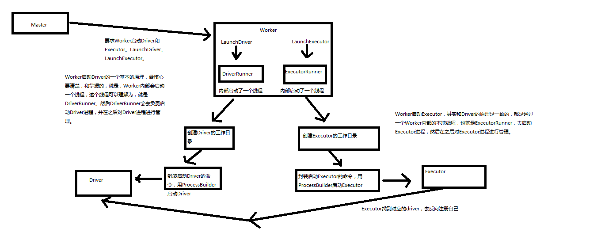

## Spark内核源码解析七：job触发流程原理解析和源码解析
一个action就会触发一个job,foreach，会调用sparkContext的runJob方法

https://www.cnblogs.com/xiaofeiyang/p/12870951.html


## Spark内核源码解析八：DAGScheduler原理解析和源码解析
https://www.cnblogs.com/xiaofeiyang/p/12872758.html
重点DAGScheduler会从触发Action操作的RDD划分stage，然后往前倒退，如果之前依赖的RDD是窄依赖就会放入同一个stage，如果是宽依赖就会就会重新划分一个stage


## Spark内核源码解析九：TaskScheduler原理解析和源码解析
https://www.cnblogs.com/xiaofeiyang/p/12877682.html

## Spark内核源码解析十：executor原理解析和源码解析
https://www.cnblogs.com/xiaofeiyang/p/12877868.html
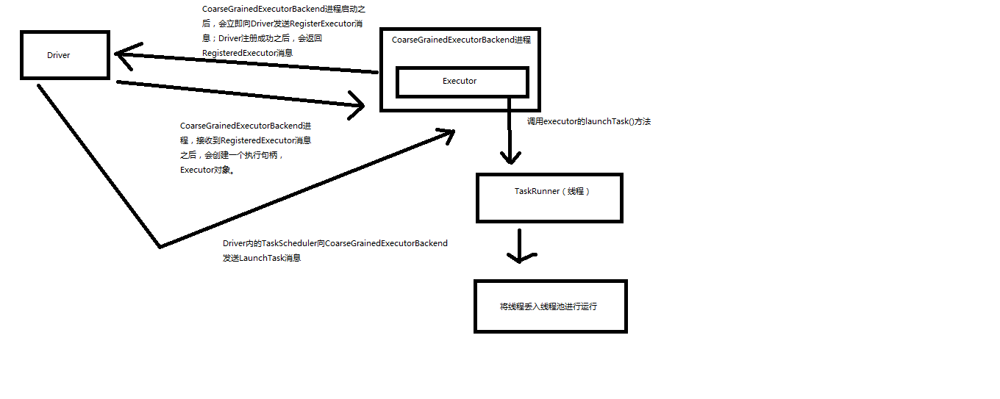

## Spark内核源码解析十：task原理解析和源码解析
https://www.cnblogs.com/xiaofeiyang/p/12890760.html
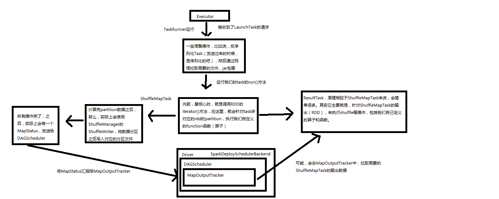

## Spark内核源码解析十一：BlockManager解析
https://www.cnblogs.com/xiaofeiyang/p/12913540.html

BlockManager负责数据存储管理，原理图如下
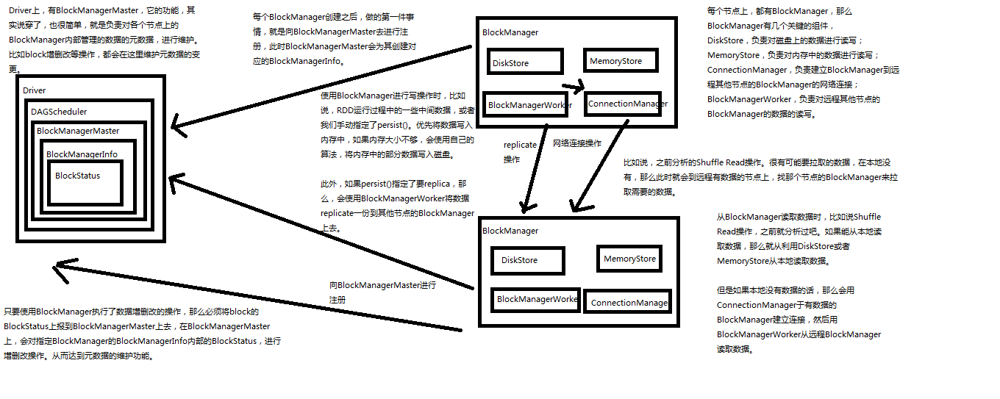

## Spark内核源码解析十二：shuffle原理解析
第一个特点，
在Spark早期版本中，那个bucket缓存是非常非常重要的，因为需要将一个ShuffleMapTask所有的数据都写入内存缓存之后，才会刷新到磁盘。但是这就有一个问题，如果map side数据过多，那么很容易造成内存溢出。所以spark在新版本中，优化了，默认那个内存缓存是100kb，然后呢，写入一点数据达到了刷新到磁盘的阈值之后，就会将数据一点一点地刷新到磁盘。
这种操作的优点，是不容易发生内存溢出。缺点在于，如果内存缓存过小的话，那么可能发生过多的磁盘写io操作。所以，这里的内存缓存大小，是可以根据实际的业务情况进行优化的。

第二个特点，
与MapReduce完全不一样的是，MapReduce它必须将所有的数据都写入本地磁盘文件以后，才能启动reduce操作，来拉取数据。为什么？因为mapreduce要实现默认的根据key的排序！所以要排序，肯定得写完所有数据，才能排序，然后reduce来拉取。
但是Spark不需要，spark默认情况下，是不会对数据进行排序的。因此ShuffleMapTask每写入一点数据，ResultTask就可以拉取一点数据，然后在本地执行我们定义的聚合函数和算子，进行计算。
spark这种机制的好处在于，速度比mapreduce快多了。但是也有一个问题，mapreduce提供的reduce，是可以处理每个key对应的value上的，很方便。但是spark中，由于这种实时拉取的机制，因此提供不了，直接处理key对应的values的算子，只能通过groupByKey，先shuffle，有一个MapPartitionsRDD，然后用map算子，来处理每个key对应的values。就没有mapreduce的计算模型那么方便。

shuffle原理图如下
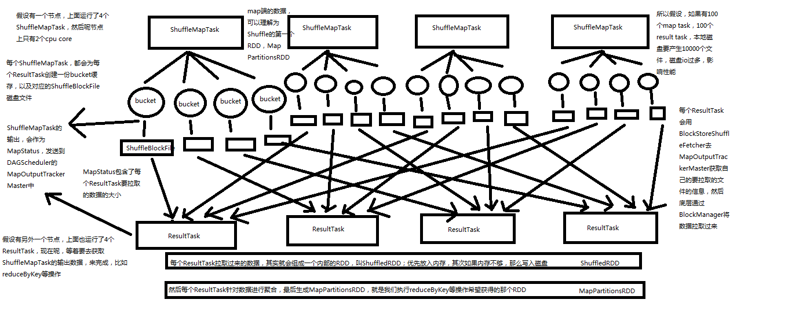

## Spark内核源码解析十三：cacheManager原理解析和源码解析
https://www.cnblogs.com/xiaofeiyang/p/12914049.html
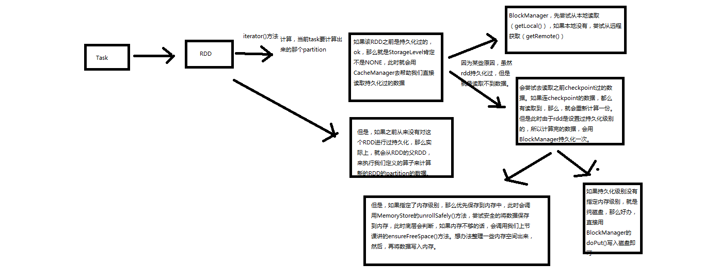

## Spark内核源码解析十四：checkpoint原理剖析
https://www.cnblogs.com/xiaofeiyang/p/12914086.html

Checkpoint，是Spark提供的一个比较高级的功能。有的时候啊，比如说，我们的Spark应用程序，特别的复杂，然后呢，从初始的RDD开始，到最后整个应用程序完成，有非常多的步骤，比如超过20个transformation操作。而且呢，整个应用运行的时间也特别长，比如通常要运行1~5个小时。
在上述情况下，就比较适合使用checkpoint功能。因为，对于特别复杂的Spark应用，有很高的风险，会出现某个要反复使用的RDD，因为节点的故障，虽然之前持久化过，但是还是导致数据丢失了。那么也就是说，出现失败的时候，没有容错机制，所以当后面的transformation操作，又要使用到该RDD时，就会发现数据丢失了（CacheManager），此时如果没有进行容错处理的话，那么可能就又要重新计算一次数据。

简而言之，针对上述情况，整个Spark应用程序的容错性很差。

所以，针对上述的复杂Spark应用的问题（没有容错机制的问题）。就可以使用checkponit功能。

checkpoint功能是什么意思？checkpoint就是说，对于一个复杂的RDD chain，我们如果担心中间某些关键的，在后面会反复几次使用的RDD，可能会因为节点的故障，导致持久化数据的丢失，那么就可以针对该RDD格外启动checkpoint机制，实现容错和高可用。

checkpoint，就是说，首先呢，要调用SparkContext的setCheckpointDir()方法，设置一个容错的文件系统的目录，比如说HDFS；然后，对RDD调用调用checkpoint()方法。之后，在RDD所处的job运行结束之后，会启动一个单独的job，来将checkpoint过的RDD的数据写入之前设置的文件系统，进行高可用、容错的类持久化操作。

那么此时，即使在后面使用RDD时，它的持久化的数据，不小心丢失了，但是还是可以从它的checkpoint文件中直接读取其数据，而不需要重新计算。（CacheManager）

1、如何进行checkpoint？
SparkContext.setCheckpointDir()
RDD.checkpoint()
2、Checkpoint原理剖析
3、Checkpoint与持久化的不同：lineage的改变
4、RDD.iterator()：读取checkpoint数据
5、给要checkpoint的RDD，先进行persist(StorageLevel.DISK_ONLY)

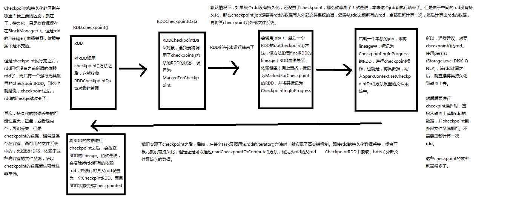