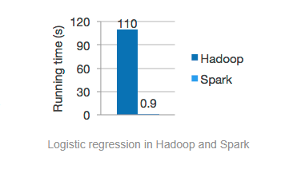
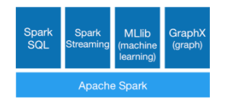
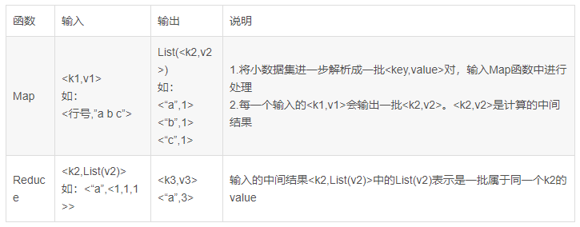
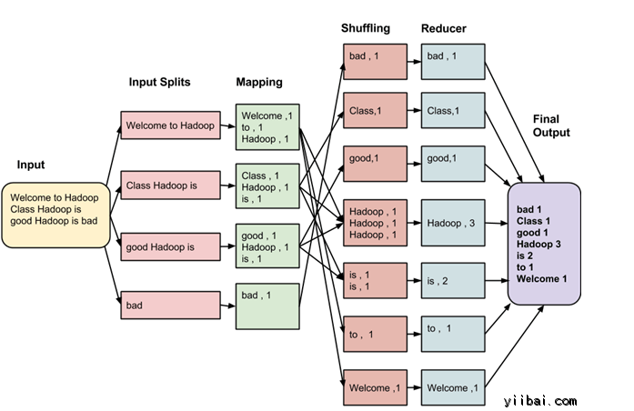
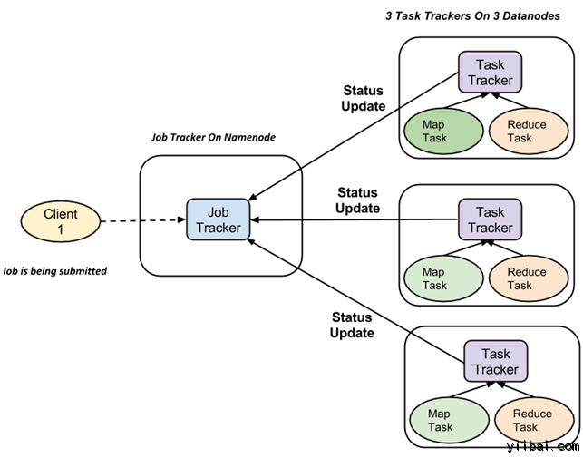
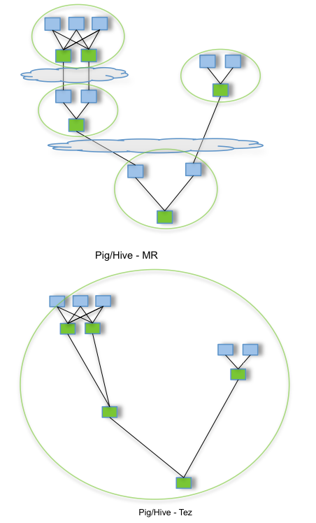
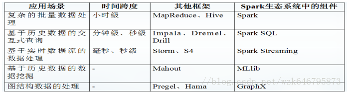

<!--toc-->
[TOC]
# Spark入门——什么是Hadoop，为什么是Spark?

Spark入门#这个系列课程，是综合于我从2017年3月分到今年7月份为止学习并使用Spark的使用心得感悟，暂定于每周更新，以后可能会上传讲课视频和PPT，目前先在博客园把稿子打好。注意：这只是一个草稿，里面关于知识的误解还请各大网友监督，我们互相进步。总而言之，网络上的知识学会断舍离，学会带着辩证的眼光去学习就能进步。

　　谈到Spark，实际上从16年本科实习的时候就已经开始接触，那个时候是从Pig入门大数据Hadoop的，有兴趣的朋友可以看[Hadoop家族之Pig入门](https://www.cnblogs.com/wing1995/p/5161511.html)；当时大家基本都在使用Pig，Pig我也没有接触太深，大概两个月后开始跟着当时的师父（当时是实习的硕士，后来就业去了阿里）学了Spark，整个公司就他在写Spark，他是一个我很佩服的人，属于全栈工程师类型的人，前后端数据分析以及数据挖掘的算法都会，所以就跟着使用Python写着Spark的一些入门程序，可见我另外一个博客Spark2.0系列[RDDVs.DataSetVs.DataFrame](https://www.cnblogs.com/wing1995/p/6803630.html)，实际上这里关于Dataset的介绍是非常不全面的，接下来我也会在这个Spark入门系列讲的更为详细一点。目前看来，大数据相关的职位那么吃香，很多学计算机的，学数学的，学统计的，半路上培训的，各种各样的人都来投Spark工程师的岗位，因为薪资高的原因吧，但是真正喜欢这个职业的又有几个，希望大家能一直坚持下去，见证大数据技术的更新迭代！

**第一个问题，什么是HadoopTM？**实际上这个答案[Hadoop官网](http://hadoop.apache.org/)已经给的很明确：

　　Hadoop是[Apache软件基金会](https://www.apache.org/)支持可靠的、可扩展的一个开源的分布式计算框架的工程。（PS：Apache软件基金会真是扛下了开源世界的半壁江山，旗下支持的开源的大数据项目大家有兴趣可以去官网访问一下。）

　　具体而言，Apache Hadoop软件库是一个允许使用简单编程模型跨计算机集群处理大型数据集合的框架，其设计的初衷是将单个服务器扩展成上千个机器组成的一个集群为大数据提供计算服务，其中每个机器都提供本地计算和存储服务。

　　Hadoop工程包括以下模块：

- **Hadoop Common：**支持其他Hadoop模块的通用工具。
- **Hadoop Distributed File System(HDFSTM)：**提供高吞吐量的访问应用数据的一个分布式文件系统。
- **Hadoop YARN：**一种作业调度和集群资源管理的框架。
- **Hadoop MapReduce：**一种基于Yarn来处理大数据集合的系统。

　　Apache中其他Hadoop相关的项目包括：

- **[Ambari](http://ambari.apache.org/)**TM：一种用于提供、管理和监督Apache Hadoop集群的基于Web UI的且易于使用的Hadoop管理工具。
- **[Avro](http://avro.apache.org/)**TM：一种数据序列化系统。
- **[Cassandra](http://cassandra.apache.org/)**TM：一种无单点故障的可扩展的分布式数据库。
- **[Chukwa](http://chukwa.apache.org/)**TM：一种用于管理大型分布式系统的数据收集系统。
- **[HBase](http://hbase.apache.org/)**TM：一种支持存储大型表的结构化存储的可扩展的分布式数据库。
- **[Hive](http://hive.apache.org/)**TM：一种提供数据汇总和特定查询的数据仓库。
- **[Mahout](http://mahout.apache.org/)**TM：一种可扩展的机器学习和数据挖掘库（Scala语言实现，可结合Spark后端）。
- **[Pig](http://pig.apache.org/)**TM：一种高级的数据流语言且支持并行计算的执行框架（2017年发布的最新版本0.17.0是添加了Spark上的Pig应用）。
- **[Spark](http://spark.apache.org/)**TM：一种用于Hadoop数据的快速通用计算引擎。Spark提供一种支持广泛应用的简单而易懂的编程模型，包括ETL（ Extract-Transform-Load）、机器学习、流处理以及图计算。
- **[Tez](http://tez.apache.org/)**TM：一种建立在Hadoop YARN上数据流编程框架，它提供了一个强大而灵活的引擎来任意构建DAG（Directed-acyclic-graph）任务去处理用于批处理和交互用例的数据。
- **[ZooKeeper](http://zookeeper.apache.org/)**TM：一种给分布式应用提供高性能的协同服务系统。

**第二个问题，既然Hadoop生态家族这么庞大，我们为什么要选择Spark作为对于大数据进行数据分析和数据挖掘的基本计算框架？**

这个问题的答案实际上[Spark官网](http://spark.apache.org/)已经给的很明确了，我就照样搬砖过来。

- **速度快**
    

　　Apache Spark拥有先进的DAG调度器、查询优化器以及物理执行引擎从而高性能的实现批处理和流数据处理。



- **易用性**（可以使用Java，Scala，Python，R以及SQL快速的写Spark应用）

Spark提供80个以上高级算子便于执行并行应用，并且可以使用Scala、Python、R以及SQL的shell端交互式运行Spark应用。

```
#通过Spark的Python的DataFrame的API读取JSON文件
df = spark.read.json("logs.json")
df.where("age > 21").show()
```

- **通用性**(支持SQL，流数据处理以及复杂分析)

Spark拥有一系列库，包括SQL和DataFrame，用于机器学习的MLib,支持图计算GraphX以及流计算模块Streaming。你可以在一个应用中同时组合这些库。



- **支持多种模式运行**（平台包括Hadoop,Apache Mesos,Kubernete,standalone或者云上，也可以获取各种数据源上的数据）

Spark可以直接运行以自身的[standalone](http://spark.apache.org/docs/latest/spark-standalone.html)集群模式运行，也可以在[亚马逊EC2](https://github.com/amplab/spark-ec2)上运行，不过企业级用的比较多的是[Hadoop Yarn](https://hadoop.apache.org/docs/current/hadoop-yarn/hadoop-yarn-site/YARN.html)模式，当然也有[Mesos](https://mesos.apache.org/)和[Kubernetes](https://kubernetes.io/)模式。可以获取不限于来自于[HDFS](https://hadoop.apache.org/docs/stable/hadoop-project-dist/hadoop-hdfs/HdfsUserGuide.html)、[Apache Cassandra](https://cassandra.apache.org/)、[Apache HBase](https://hbase.apache.org/)和[Apache Hive](https://hive.apache.org/)等上百种数据源。

**那么，第三个问题，Hadoop和Spark之间的关系是什么？**

首先要从Hadoop的MapReduce编程框架说起，如果说MapReduce是第一代计算引擎，那么Spark就是第二代计算引擎。

　　MapReduce将复杂的并行计算过程高度的抽象到了两个函数：Map函数和Reduce函数。



　　MapReduce的核心是“分而治之”策略。数据在其MapReduce的生命周期中过程中需要经过六大保护神的洗礼，分别是：Input、Split、Map、Shuffule、Reduce和Output。



　　MapReduce框架采用Master/Slave架构，一个Master对应多个Slave，Master运行JobTracker，Slave运行TaskTracker；JobTracker充当一个管理者，负责Client端提交的任务能够由手下的TaskTracker执行完成，而TaskTracker充当普通员工执行的Task分为Map Task（Split and Map）和Reduce Task(Shuffle and Reduce)。



　　现在，我们普通的开发人员只要会用MapReduce的API就可以实现高大上的并行计算了，但是对于非科班毕业的数据分析（例如我这样半路出家的统计学毕业）人员而言，MapReduce存在的局限性不仅仅是在于其代码的又长又臭，固定的框架等，总而言之其短板可见以下列表：

1. 抽象层次低，具体的Map和Reduce实现起来代码量大并且对于数据挖掘算法中复杂的分析需要大量的Job来支持，且Job之间的依赖需要开发者定义，导致开发的难度高而代码的可读性不强；
2. 中间结果也存放在HDFS文件系统中，导致中间结果不能复用（需要重新从磁盘中读取），不适宜数据挖掘算法中的大量迭代操作，ReduceTask需要等待所有的MapTask执行完毕才可以开始；
3. 只适合批处理场景，不支持交互式查询和数据的实时处理。

要知道，我们通常意义上的Hadoop往往是Hadoop生态圈，意味着很多技术对Hadoop本身具有的局限进行了扩展和改进，从而有了Pig、Hive将SQL语言翻译成MapReduce程序，让我们从繁琐的MapReduce程序中释放出来。如果说Pig这类的类SQL语言解决了MapReduce中存在的大量手写代码，那么Tez就解决是去除了Map和Reduce两个任务之间的屏障从而提升了整体的性能，从而将多个MapReduce任务在一个Tez任务中处理完。



随着大数据处理的应用场景越来越多，人们对Hadoop的要求也越来越高，开发出的对应的系统也越来越多，人们迫切的需要一个综合的计算框架，Spark应运而生，我们可以看看Spark可以干些什么。



　　那么为什么Spark能做到这些？

　　首先，我们需要理解Spark中的三大概念：

1. **RDD（Resilient Distributed Dataset）**。实际上对与开发人员而已它是以一种对象的形式作为数据的一种表现形式而存在，可以理解为一种你可以操作的只读的分布式数据集，之所以称之为有弹性，在于：1. RDD可以在内存和磁盘存储间手动或自动切换；
    2. RDD拥有Lineage（血统）信息，及存储着它的父RDD以及父子之间的关系，当数据丢失时，可通过Lineage关系重新计算并恢复结果集，使其具备高容错性；
    3. 当血统链太长时，用户可以建立checkpoint将数据存放到磁盘上持久化存储加快容错速度（建议通过saveAsTextFile等方式存储到文件系统），而persist方式可以将数据存储到内存中用于后续计算的复用；
    4. RDD的数据重新分片可以手动设置。在Spark中执行重新分片操作的方法有repartition和coalesce两个方法，这两个方法都是手动设置RDD的分区数量，repartition只是coalesce接口中参数shuffle=true的实现；是否重新分区对性能影响比较大，如果分区数量大，可以减少每个分区的占存，减少OOM（内存溢出）的风险，但如果分区数量过多同时产生了过多的碎片，消耗过多的线程去处理数据，从而浪费计算资源。
    
2. **Transformations。**转换发生在当你将现有的RDD转换成其他的RDD的时候。比如当你打开一个文件然后读取文件内容并通过map方法将字符串类型RDD转换成另外一个数组类型RDD就是一种转换操作，常用的转换操作有map,filer,flatMap,union,distinct,groupByKey等。
3. **Actions。**动作发生在你需要系统返回一个结果的时候。比如你需要知道RDD的第一行数据是什么样的内容，比如你想知道RDD一共有多少行这样类似的操作就是一种动作，常用的动作操作有reduce,collect,count,first,take(),saveAsTextFile(),foreach()等。

　　有意思的是Spark使用“lazy evaluation”，意味着执行Transformations操作的时候实际上系统并没有发生任何操作，只有在遇到Actions操作的时候Spark才开始真正从头运行程序执行一系列转换并返回结果。因为有了这种惰性求值方式加上RDD的血缘依赖关系导致程序在一系列连续的运算中形成了DAG，而这种DAG（Directed Acyclic Graph）可以优化整个执行计划（参照上图中的Tez）。

**最后再强调一下，为什么要选择Spark？**

- 首先，Spark通过RDD的lineage血统依赖关系提供了一个完备的数据恢复机制；
- 其次，Spark通过使用DAG优化整个计算过程；
- 最后，Spark对RDD进行Transformation和Action的一系列算子操作使得并行计算在粗粒度上就可以简单执行，而且Spark生态系统提供了一系列的开发包使得数据科学家可以执行一系列的SQL、ML、Streaming以及Graph操作，而且还支持很多其他的第三方包括一些交互式框架类似于[Apache Zeppelin](https://hortonworks.com/apache/zeppelin/)，地理数据可视化框架[GeoSpark](http://geospark.co.uk/)以及一些比较流行的深度学习框架[Sparking-water](https://www.h2o.ai/sparkling-water/),[Deeplearning4j](https://deeplearning4j.org/),[SparkNet](https://sparknet.net/)等。

　　我们都知道Spark最初是由UC伯克利大学的AMP实验室研究出来的，强烈推荐这个实验室的[Projects](https://amplab.cs.berkeley.edu/projects)！Happy Coding!

[原文](https://www.cnblogs.com/wing1995/p/9300120.html)