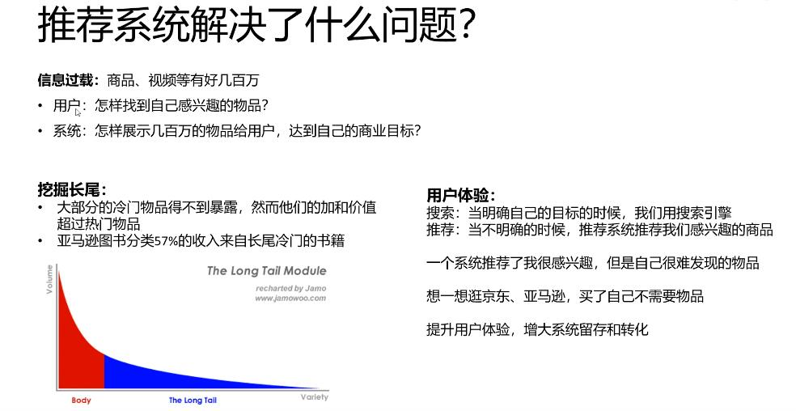
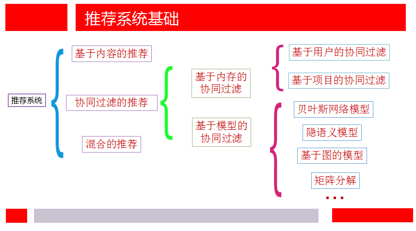
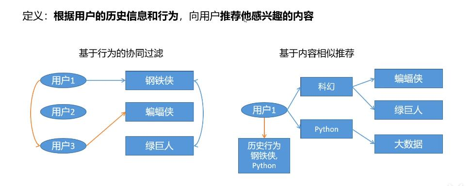
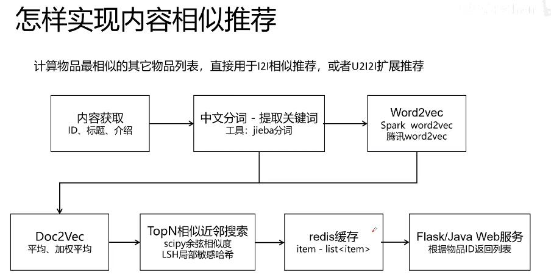
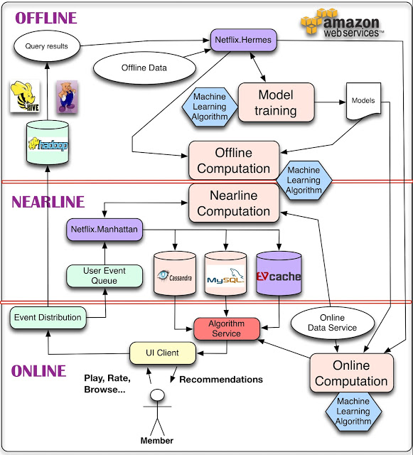
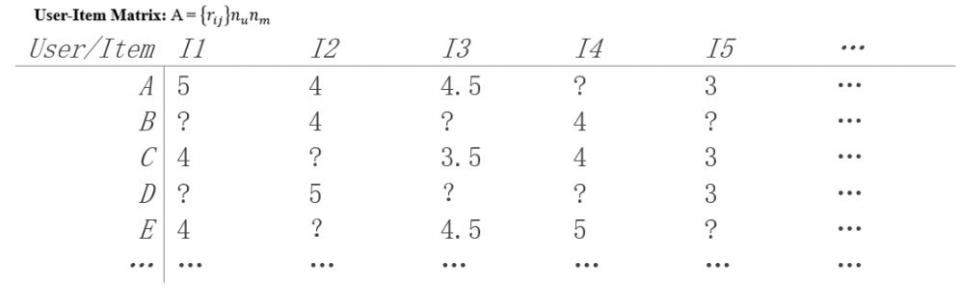
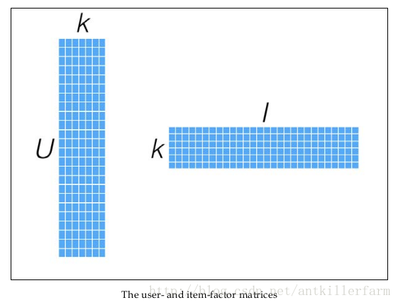
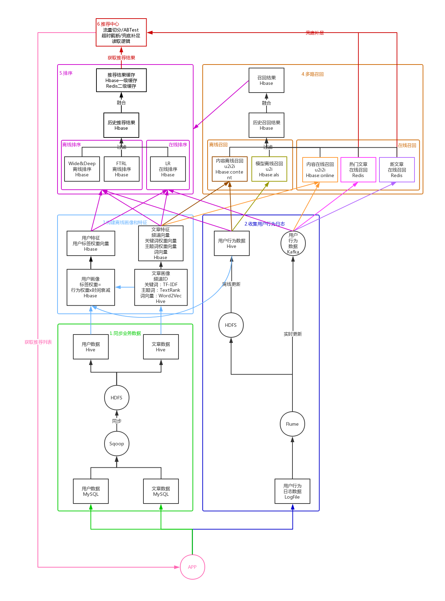

# 推荐系统Recommendation System/Recommender System

## 简介

说到推荐系统，我们肯定是要问它是为什么而存在的，即存在的意义是什么。

随着当今技术的飞速发展，数据量也与日俱增，人们越来越感觉在海量数据面前束手无策。正是为了解决信息过载(Information overload)的问题，人们提出了推荐系统（与搜索引擎对应，人们习惯叫推荐系统为推荐引擎）。当我们提到推荐引擎的时候，经常联想到的技术也便是搜索引擎。不必惊讶，因为这两者都是为了解决信息过载而提出的两种不同的技术，一个问题，两个出发点，我更喜欢称它们两者为兄弟，亲近而形象。

兄弟二人有共同的目标，即解决信息过载问题，但具体的做法因人而异。

搜索引擎更倾向于人们有明确的目的，可以将人们对于信息的寻求转换为精确的关键字，然后交给搜索引擎最后返回给用户一系列列表，用户可以对这些返回结果进行反馈，并且是对于用户有主动意识的，但它会有马太效应的问题，即会造成越流行的东西随着搜索过程的迭代会越流行，使得那些越不流行的东西石沉大海。

而推荐引擎更倾向于人们没有明确的目的，或者说他们的目的是模糊的，通俗来讲，用户连自己都不知道他想要什么，这时候正是推荐引擎的用户之地，推荐系统通过用户的历史行为或者用户的兴趣偏好或者用户的人口统计学特征来送给推荐算法，然后推荐系统运用推荐算法来产生用户可能感兴趣的项目列表，同时用户对于搜索引擎是被动的。其中长尾理论（人们只关注曝光率高的项目，而忽略曝光率低的项目）可以很好的解释推荐系统的存在，试验表明位于长尾位置的曝光率低的项目产生的利润不低于只销售曝光率高的项目的利润。推荐系统正好可以给所有项目提供曝光的机会，以此来挖掘长尾项目的潜在利润。

> 根据用户的历史信息和行为 ，比如进入首页，显示的内容；搜索后显示的内容...

如果说搜索引擎体现着马太效应的话，那么长尾理论则阐述了推荐系统所发挥的价值。

## 所属领域
推荐系统是多个领域的交叉研究方向，所以会涉及机器学习以及数据挖掘方面的技巧（推荐系统==》数据挖掘/机器学习==》人工智能）。在这整理了小邬老师上课所介绍的关于主流研究方向的结构图。

- RS(Recommender System)：RecSys : 推荐系统
- IR (Information Retrieval): SIGIR ：信息检索
- DM(Data Mining): SIGKDD,ICDM, SDM ：数据挖掘
- ML (Machine Learning): ICML, NIPS ：机器学习
- CV (Computer Vision): ICCV, CVPR, ECCV ：计算机视觉
- MM (MultiMedia): ACM MM ： 多媒体
- DB (Database): CIKM, WIDM ：数据库
- AI (Artificial Intelligence): IJCAI, AAAI ：人工智能

## 相关算法

[推荐系统中常用算法 以及优点缺点对比](http://www.woshipm.com/operate/107472.html)

- 基于内容的推荐（Content-based Recommendation）
- 协同过滤推荐（Collaborative Filtering Recommendation）
- 基于关联规则的推荐（Association Rule-based Recommendation）
- 基于效用的推荐（Utility-based Recommendation）
- 基于知识的推荐（Knowledge-based Recommendation）
- 组合推荐
    1. 加权（Weight）：加权多种推荐技术结果。

    2. 变换（Switch）：根据问题背景和实际情况或要求决定变换采用不同的推荐技术。

    3. 混合（Mixed）：同时采用多种推荐技术给出多种推荐结果为用户提供参考。

    4. 特征组合（Feature combination）：组合来自不同推荐数据源的特征被另一种推荐算法所采用。

    5. 层叠（Cascade）：先用一种推荐技术产生一种粗糙的推荐结果，第二种推荐技术在此推荐结果的基础上进一步作出更精确的推荐。

    6. 特征扩充（Feature augmentation）：一种技术产生附加的特征信息嵌入到另一种推荐技术的特征输入中。

    7. 元级别（Meta-level）：用一种推荐方法产生的模型作为另一种推荐方法的输入。

## 相关会议
对于推荐系统领域，直接相关的会议不多，但由于推荐系统会涉及到数据挖掘、机器学习等方面的知识，并且推荐系统作为数据挖掘和机器学习的重要应用之一，同时推荐系统往更大的领域靠拢的话也属于人工智能的范畴，因此很多做推荐的学者把目光也瞄向了数据挖掘、机器学习和人工智能方面的会议。所以，如果想关注推荐系统的前沿，我们需要不仅关注推荐系统年会，还需要关注其他与推荐挂钩的会议。

1、与推荐系统直接相关的会议

[RecSys](https://recsys.acm.org/) -The ACM Conference Series on Recommender Systems.

2、数据挖掘相关的会议

[SIGKDD](http://www.kdd.org/) - The ACM SIGKDD Conference on Knowledge Discovery and Data Mining.

[WSDM](http://www.wsdm-conference.org/) - The International Conference on Web Search and Data Mining.

[ICDM](http://cs.uvm.edu/~icdm/) - The IEEE International Conference on Data Mining.

[SDM](http://www.siam.org/meetings/sdm19/) -TheSIAM International Conference on Data Mining.

[ECML-PKDD](https://ecmlpkdd2020.net/) - The European Conference on Machine Learning and Principles and Practice of Knowledge Discovery in Databases

3、机器学习相关的会议

[ICML](https://icml.cc/) - The International Conference on Machine Learning.

[NIPS](https://nips.cc/) - The Conference on Neural Information Processing Systems

4、信息检索相关的会议

[SIGIR](http://sigir.org/) - The ACM International Conference on Research and Development in Information Retrieval

5、数据库相关的会议

[CIKM](http://www.cikm2018.units.it/) - The ACM International Conference on Information and Knowledge Management.

6、Web相关的会议

[WWW](https://www2018.thewebconf.org/) - The International World Wide Web Conference.

7、人工智能相关的会议

[AAAI](https://aaai.org/Conferences/AAAI-18/) - The National Conference of the American Association for Artificial Intelligence.

[IJCAI](http://www.ijcai.org/) - The International Joint Conference on Artificial Intelligence.

[ECAI](http://ecai2020.eu/) -European Conference on Artificial Intelligence

[UAI](http://www.auai.org/uai2020/) - The Conference on Uncertainty in Artificial Intelligence

## 关于数据集
1、[MovieLens](https://grouplens.org/datasets/movielens/)

适用于传统的推荐任务，提供了3种不同规模的数据，包含用户对电影的评分信息，用户的人口统计学特征以及电影的描述特征。

2、[Filmtrust](https://www.librec.net/datasets/filmtrust.zip)

适用于社会化推荐任务，规模较小，包含用户对电影的评分信息，同时包含用户间的信任社交信息。

3、[Douban](https://www.cse.cuhk.edu.hk/irwin.king.new/pub/data/douban)

适用于社会化推荐任务，规模适中，包含用户对电影的评分信息，同时包含用户间的信任社交信息。

4、[Epinions](http://www.trustlet.org/datasets/)

适用于社会化推荐任务，规模较大，包含用户对电影的评分信息，同时包含用户间的信任社交信息，值得注意的是，该数据集同时还包括不信任关系信息。

5、[Yelp](https://www.yelp.com/dataset/challenge)

几乎适用于所有推荐任务，数据规模大，需要手动提取自己需要的信息，包含评价评分信息，用户信息（注册信息、粉丝数量、朋友信息），商品信息（属性信息、位置信息、图像信息），建议信息等。

6、[KB4Rec](https://github.com/RUCDM/KB4Rec)

适用于推荐系统与知识图谱相结合的研究需求，该数据集将推荐数据中的物品链接到大型知识图谱中的实体，为推荐系统的物品提供蕴含丰富语义的结构化知识信息。

## 代码与工具

1、[LibRec](https://github.com/guoguibing/librec)

java版本开源推荐系统，包含了70多种经典的推荐算法。

2、[Surprise](http://surpriselib.com/)
python版本开源推荐系统，包含了多种经典的推荐算法。
Surprise是一个基于Python scikit构建和分析推荐系统
设计时考虑到以下目的：

- 让用户完美控制他们的实验。为此，我们非常强调文档，我们试图通过指出算法的每个细节尽可能清晰和准确。
- 减轻数据集处理的痛苦。用户可以使用内置数据集（Movielens，Jester）和他们自己的自定义数据集。
- 提供各种即用型预测算法，如基线算法，邻域方法，基于矩阵因子分解（SVD，PMF，SVD ++，NMF）等等。此外，内置了各种相似性度量（余弦，MSD，皮尔逊......）。
- 可以轻松实现新的算法思路。
- 提供评估，分析和比较算法性能的工具。使用强大的CV迭代器（受scikit-learn优秀工具启发）以及对一组参数的详尽搜索，可以非常轻松地运行交叉验证程序。

3、[LibMF](https://www.csie.ntu.edu.tw/~cjlin/libmf/)

c++版本开源推荐系统，主要实现了基于矩阵分解的推荐算法。

4、[Neural Collaborative Filtering](https://github.com/hexiangnan/neural_collaborative_filtering)

python实现神经协同过滤推荐算法。

5、[Apache Mahout](http://mahout.apache.org/)
Mahout 是 Apache Software Foundation（ASF） 旗下的一个开源项目，提供一些可扩展的机器学习领域经典算法的实现，旨在帮助开发人员更加方便快捷地创建智能应用程序。Mahout包含许多实现，包括聚类、分类、推荐过滤、频繁子项挖掘。此外，通过使用 Apache Hadoop 库，Mahout 可以有效地扩展到云中。

## Netflix推荐系统架构
[Netflix 公布个性化和推荐系统架构](https://www.infoq.cn/article/2013/04/netflix-ml-architecture)

https://www.bilibili.com/video/av74367874/

他们这样解释其中的组件和处理过程：
> 对于数据，最简单的方法是存下来，留作后续离线处理，这就是我们用来管理离线作业（Offline jobs）的部分架构。计算可以以离线、接近在线或是在线方式完成。在线计算（Online computation）能更快地响应最近的事件和用户交互，但必须实时完成。这会限制使用算法的复杂性和处理的数据量。离线计算（Offline computation）对于数据数量和算法复杂度限制更少，因为它以批量方式完成，没有很强的时间要求。不过，由于没有及时加入最新的数据，所以很容易过时。个性化架构的关键问题，就是如何以无缝方式结合、管理在线和离线计算过程。接近在线计算（Nearline computation）介于两种方法之间，可以执行类似于在线计算的方法，但又不必以实时方式完成。模型训练（Model training）是另一种计算，使用现有数据来产生模型，便于以后在对实际结果计算中使用。另一块架构是如何使用事件和数据分发系统（Event and Data Distribution）处理不同类型的数据和事件。与之相关的问题，是如何组合在离线、接近在线和在线之间跨越的不同的信号和模型（Signals and Models）。最后，需要找出如何组合推荐结果（Recommendation Results），让其对用户有意义。

接下来，文章分析了在线、接近在线和离线计算。

对于在线计算，相关组件需要满足 SLA 对可用性和响应时间的要求，而且纯粹的在线计算在某型情形下可能无法满足 SLA，因此，快速的备用方案就很重要，比如返回预先计算好的结果等。在线计算还需要不同的数据源确保在线可用，这需要额外的基础设施。

离线计算在算法上可相对灵活，工程方面的需求也简单。客户端的 SLA 响应时间要求也不高。在部署新算法到生产环境时，对于性能调优的需求也不高。Netflix 利用这种灵活性来完成快速实验：如果某个新的实验算法执行较慢，他们会部署更多 Amazon EC2 实例来达成吞吐处理目标，而不是花费宝贵的工程师时间去优化性能，因为业务价值可能不是很高。

接近在线计算与在线计算执行方式相同，但计算结果不是马上提供，而是暂时存储起来，使其具备异步性。接近在线计算的完成是为了响应用户事件，这样系统在请求之间响应速度更快。这样一来，针对每个事件就有可能完成更复杂的处理。增量学习算法很适合应用在接近在线计算中。

> 不管什么情况，选择在线、接近在线、还是离线处理，这都不是非此即彼的决策。所有的方式都可以、而且应该结合使用。 …… 即使是建模部分也可以用在线和离线的混合方式完成。这可能不适合传统的监督分类法（supervised classification）应用，因为分类器必须从有标记的数据中批量培训，而且只能以在线方式使用，对新输入分类。不过，诸如矩阵因子分解这样的方法更适合混合离线和在线建模方法：有些因子可以预先以离线方式计算，有些因子可以实时更新，创建更新的结果。其他诸如集群处理这样的非监督方法，也可以对集群中心进行离线计算，对集群节点进行在线作业。这些例子说明：模型训练可以分解为大规模和复杂的全局模型训练，以及轻量级的用户指定模型训练或更新阶段，以在线方式完成。

对于离线作业（Offline jobs），主要用来运行个性化机器学习算法。这些作业会定期执行，而且不必与结果的请求和展示同步。主要有两种任务这样处理：模型训练和中间与最终结果批量计算（batch computation of intermediate or final results）。不过，他们也有一些学习算法是以在线增量方式完成的。

这两种任务都需要改善数据，通常是由数据库查询完成。由于这些查询要操作大量数据，以分布式方式完成更方便，因此通过 Hadoop 或是 Hive、Pig 作业就是自然而然的事情。一旦查询完成，就需要某种机制发布产生的数据。对于这样的机制，Netflix 有如下需求：

- 可以通知订阅者查询完成。
- 支持不同存储方式（不只是 HDFS，还有 S3 或是 Cassandra 等等）
- 应该透明处理错误，允许监控和报警。

Netflix 使用内部的工具 Hermes 完成这些功能，它将数据以接近实时的方式交付给订阅者，在某些方面接近 Apache Kafka ，但它不是消息 / 事件队列系统。

无论是离线还是在线计算，都需要处理三种输入：模型、数据和信号。模型是以离线方式训练完成的参数文件，数据是已完成处理的信息，存在某种数据库中。在 Netflix，信号是指输入到算法中的新鲜信息。这些数据来自实时服务，可用其产生用户相关数据。

对于事件和数据分发，Netflix 会从多种设备和应用中收集尽可能多的用户事件，并将其集中起来为算法提供基础数据。他们区分了数据和事件。事件是对时间敏感的信息，需要尽快处理。事件会路由、触发后续行动或流程。而数据需要处理和存储，便于以后使用，延迟不是重要，重要的是信息质量和数量。有些用户事件也会被作为数据处理。

Netflix 使用内部框架Manhattan处理接近实时的事件流。该分布式计算系统是推荐算法架构的中心。它类似 Twitter 的 Storm ，但是用处不同，而且响应不同的内部需求。数据流主要通过 Chukwa ，输入到 Hadoop，进行处理的初步阶段。此后使用 Hermes 作为发布 - 订阅机制。

Netflix 使用 Cassandra、EVCache 和 MySQL 存储离线和中间结果。它们各有利弊。MySQL 存储结构化关系数据，但会面临分布式环境中的扩展性问题。当需要大量写操作时，他们使用 EVCache 更合适。关键问题在于，如何满足查询复杂度、读写延迟、事务一致性等彼此冲突的需求，要对于各种情况到达某个最优点。

在总结中，他们指出：
> 我们需要具备使用复杂机器学习算法的能力，这些算法要可以适应高度复杂性，可以处理大量数据。我们还要能够提供灵活、敏捷创新的架构，新的方法可以很容易在其基础上开发和插入。而且，我们需要我们的推荐结果足够新，能快速响应新的数据和用户行为。找到这些要求之间恰当的平衡并不容易，需要深思熟虑的需求分析，细心的技术选择，战略性的推荐算法分解，最终才能为客户达成最佳的结果。

## 推荐系统算法视频教程
https://www.bilibili.com/video/BV1Dz411B7wd?p=6

网盘地址：https://pan.baidu.com/s/18Xz_jxwLB9QB3PdTcQd8iw 密码: 4xc7
备用地址（腾讯微云）：https://share.weiyun.com/13cfa2579ec185dbeca447c9d927f41b 密码：baja7p

## 参考

[推荐系统从入门到接着入门](https://zhuanlan.zhihu.com/p/27502172)
[推荐系统干货总结](https://zhuanlan.zhihu.com/p/34004488)
[推荐系统的架构](https://kb.cnblogs.com/page/662938/)
[搞懂推荐系统中的评价指标NDCG（CG、DCG、IDCG）](https://www.cnblogs.com/datasnail/p/13088964.html)

[推荐系统 相关文章](https://blog.csdn.net/dooonald/category_7609098.html)

[主流推荐引擎技术及优缺点分析](https://blog.csdn.net/g6U8W7p06dCO99fQ3/article/details/106912916)

[推荐系统总结](https://blog.csdn.net/cqlboat/article/details/81008625)

[推荐系统概述（一）](https://www.cnblogs.com/hellojamest/p/10952382.html)
[推荐系统实践 - 基于用户行为分析的推荐算法](https://blog.csdn.net/whwan11/article/details/81133160)

[机器学习算法系列(4)--ALS](https://blog.csdn.net/u012834750/article/details/81560971)

[ALS推荐算法学习总结](https://blog.csdn.net/weixin_41366941/article/details/82318526)

[Spark机器学习之推荐引擎](https://www.cnblogs.com/xiaoyesoso/p/5570079.html)

## 案例

ALS中文名作交替最小二乘法，在机器学习中，ALS特指使用最小二乘法求解的一个协同过滤算法，是协同过滤中的一种。ALS算法是2008年以来，用的比较多的协同过滤算法。它已经集成到Spark的Mllib库中，使用起来比较方便。从协同过滤的分类来说，ALS算法属于User-Item CF，也叫做混合CF，因为它同时考虑了User和Item两个方面，即即可基于用户进行推荐又可基于物品进行推荐。

git:openjw\penter\bigdata_study\pyspark3\ml\recommendation_als_example.py

用户收藏的产品 - 购买欲望0.6
用户已购买的产品 - 购买欲望0.01
用户浏览的产品（可以多次浏览） - 购买欲望0.3

只知用户评分矩阵（User-Item Matrix），试向用户(User)推荐产品(Item)。

将用户（user）对商品（item）的评分矩阵分解成2个矩阵(**具体的分解思路，找出两个低维的矩阵，使得它们的乘积是原始矩阵。因此这也是一种降维技术。**)：
- user对item 潜在因素的偏好矩阵(latent factor vector)
- item潜在因素的偏好矩阵

换句话说，就是一个m*n的打分矩阵可以由分解的两个小矩阵U（m*k）和V（k*n）的乘积来近似，即A=UV^T,k<=m,n 。这就是ALS的矩阵分解方法。这样我们把系统的自由度从O(mn)降到了O((m+n)k)。

比如：我喜欢科幻片，周星驰的片，
Item 是否科幻片，是否周星驰 
https://blog.csdn.net/u012834750/article/details/81560971

K 特征

## 推荐系统模型演变史
[一文尽览推荐系统模型演变史](https://blog.csdn.net/m0_37586850/article/details/106953513)
https://github.com/hongleizhang/RSPapers
[可能是史上最全推荐系统资料了（吐血整理，建议收藏）](https://mp.weixin.qq.com/s/WqpRxKBUHYBeuTh6AETpTQ)

## 嵌套 (embeddings)

一种分类特征，以连续值特征表示。通常，嵌套是指将高维度向量映射到低维度的空间。例如，您可以采用以下两种方式之一来表示英文句子中的单词：

- 表示成包含百万个元素（高维度）的稀疏向量，其中所有元素都是整数。向量中的每个单元格都表示一个单独的英文单词，单元格中的值表示相应单词在句子中出现的次数。由于单个英文句子包含的单词不太可能超过 50 个，因此向量中几乎每个单元格都包含 0。少数非 0 的单元格中将包含一个非常小的整数（通常为 1），该整数表示相应单词在句子中出现的次数。
- 表示成包含数百个元素（低维度）的密集向量，其中每个元素都存储一个介于 0 到 1 之间的浮点值。这就是一种嵌套。

在 TensorFlow 中，会按反向传播损失训练嵌套，和训练神经网络中的任何其他参数一样。

## 协同过滤（Collaborative Filtering， CF）
### 基于近邻的协同过滤
- 基于用户(User-CF)
- 基于物品(Item-CF)
### 基于模型的协同过滤
- 奇异值分解(SVD)
- 潜在语义分析(LSA)
- 支持向量机(SVM)

## 代码实战
https://github.com/NickHuangA/MovieRecommendSystem