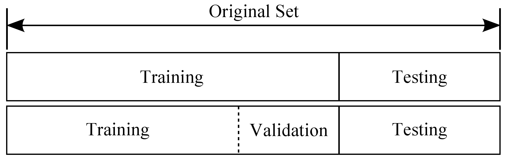
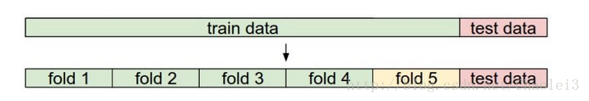
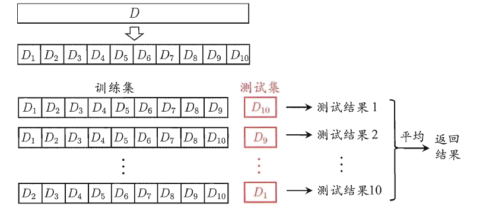

# 交叉验证与训练集、验证集、测试集
在有监督(supervise)的机器学习中，数据集常被分成2~3个，即：训练集(train set)，验证集(validation set)，测试集(test set)。

如果给定的样本数据充足，我们通常使用均匀随机抽样的方式将数据集划分成3个部分——训练集、验证集和测试集，**这三个集合不能有交集**，常见的比例是8:1:1。需要注意的是，通常都会给定训练集和测试集，而不会给验证集。这时候验证集该从哪里得到呢？一般的做法是，从训练集中均匀随机抽样一部分样本作为验证集。

- 训练集
训练集用来训练模型，即确定模型的权重和偏置这些参数，通常我们称这些参数为学习参数。

- 验证集
而验证集用于模型的选择，更具体地来说，验证集并不参与学习参数的确定，也就是验证集并没有参与梯度下降的过程。验证集只是为了选择超参数，比如网络层数、网络节点数、迭代次数、学习率这些都叫超参数。比如在k-NN算法中，k值就是一个超参数。所以可以使用验证集来求出误差率最小的k。

- 测试集
测试集只使用一次，即在训练完成后评价最终的模型时使用。它既不参与学习参数过程，也不参数超参数选择过程，而仅仅使用于模型的评价。 
值得注意的是，千万不能在训练过程中使用测试集，而后再用相同的测试集去测试模型。这样做其实是一个cheat，使得模型测试时准确率很高。

为何需要划分？
简而言之，**为了防止过度拟合**。如果我们把所有数据都用来训练模型的话，建立的模型自然是最契合这些数据的，测试表现也好。但换了其它数据集测试这个模型效果可能就没那么好了。就好像你给班上同学做校服，大家穿着都合适你就觉得按这样做就对了，那给别的班同学穿呢？不合适的概率会高吧。总而言之训练集和测试集相同的话，模型评估结果可能比实际要好。

## 交叉验证
因为训练集较小，无法直接像前面那样只分出训练集，验证集，测试集，所以出现了交叉验证

### 什么是交叉验证？
交叉验证的基本思想就是重复的使用数据；把数据进行切分，将数据分为训练集和测试集，在此基础上反复地进行训练、测试以及模型选择。
### 交叉验证的作用是什么？
1. 交叉验证可以评估模型在新数据上的表现，如果训练集和测试集预测效果比较大，则模型存在一定过拟合的可能。

2. 当数据集不充足的时候，可以选择这种训练方式，获取数据中更多的有用信息。

### 交叉验证的实现

图上面的部分表示我们拥有的数据，而后我们对数据进行了再次分割，主要是对训练集，假设将训练集分成5份（该数目被称为折数，5-fold交叉验证），每次都用其中4份来训练模型，粉红色的那份用来验证4份训练出来的模型的准确率，记下准确率。然后在这5份中取另外4份做训练集，1份做验证集，再次得到一个模型的准确率。直到所有5份都做过1次验证集，也即验证集名额循环了一圈，交叉验证的过程就结束。算得这5次准确率的均值。留下准确率最高的模型，即该模型的超参数是什么样的最终模型的超参数就是这个样的。

需要说明的是，在实际情况下，人们不是很喜欢用交叉验证，主要是因为它会耗费较多的计算资源。一般直接把训练集按照50%-90%的比例分成训练集和验证集。但这也是根据具体情况来定的：如果超参数数量多，你可能就想用更大的验证集，而验证集的数量不够，那么最好还是用交叉验证吧。至于分成几份比较好，一般都是分成3、5和10份。

### 交叉验证（简单交叉验证、k折交叉验证、留一法）
https://blog.csdn.net/u010451580/article/details/51373081