# 用户画像

叫做User Portrait System，是和数据挖掘、大数据息息相关的应用。通过数据建立描绘用户的标签。Profile指的用户资料
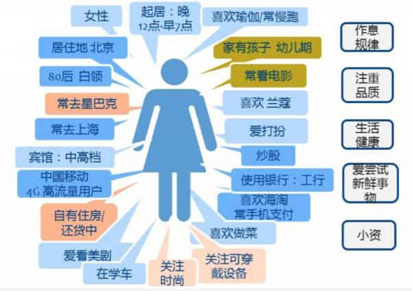
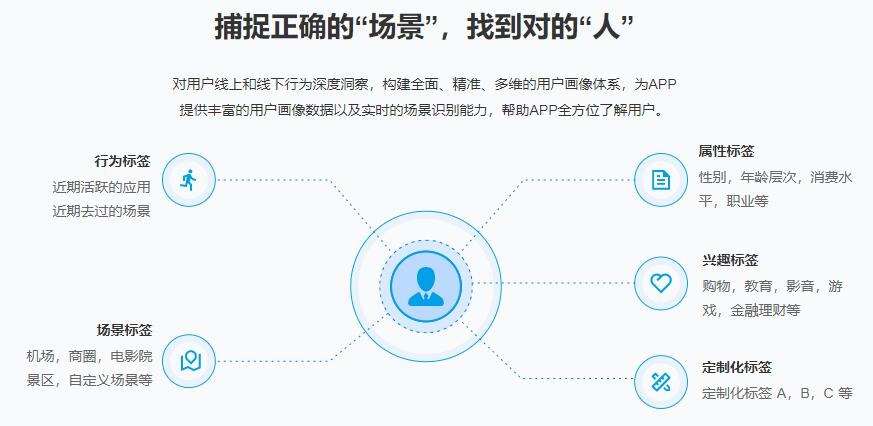
## 什么是用户画像

用户画像可以简单理解成是海量数据的标签，根据用户的属性、行为和观点的差异，将他们区分为不同的类型，然后从每种类型中抽取出典型特征，赋予名字、照片、一些人口统计学要素、场景等描述，形成了一个人物原型 (personas)。

简而言之，用户画像是根据用户社会属性、生活习惯和消费行为等信息而抽象出的一个标签化用户模型。构建用户画像的核心工作即是给用户贴“标签”，而标签是通过对用户信息分析而来的高度精炼的特征标识。

> 举例来说，如果你经常购买一些玩偶玩具，那么电商网站即可根据玩具购买的情况替你打上标签“有孩子”，甚至还可以判断出你孩子大概的年龄，贴上“有5-10岁的孩子”这样更为具体的标签，而这些所有给你贴的标签统在一次，就成了你的用户画像，因此，也可以说用户画像就是判断一个人是什么样的人。

除去“标签化”，用户画像还具有的特点是“低交叉率”，当两组画像除了权重较小的标签外其余标签几乎一致，那就可以将二者合并，弱化低权重标签的差异。

## 为什么要做用户画像？
  其意义大体上表现在一下几个方面：

1. 精准营销，分析产品潜在用户，针对特定群体利用短信邮件等方式进行营销
根据历史用户特征，分析产品的潜在用户和用户的潜在需求，针对特定群体，利用短信、邮件等方式进行营销。

1. 用户统计，比如中国城市上班族购买书籍类型人数 TOP10；
根据用户的属性、行为特征对用户进行分类后，统计不同特征下的用户数量、分布；分析不同用户画像群体的分布特征。

1. 数据挖掘，构建智能推荐系统，利用关联规则计算，喜欢红酒的人通常喜欢什么运 动品牌，利用聚类算法分析，喜欢红酒的人年龄段分布情况
以用户画像为基础构建推荐系统、搜索引擎、广告投放系统，提升服务精准度。

1. 服务产品：对产品进行用户画像，对产品进行受众分析，更透彻地理解用户使用产品的心理动机和行为习惯，完善产品运营，提升服务质量。

1. 行业报告&用户研究：通过用户画像分析可以了解行业动态，比如人群消费习惯、消费偏好分析、不同地域品类消费差异分析

1. 对服务或者产品进行私人订制，个性化服务某一类群体甚至每一位用户（未来趋势）。

1. 业务经营分析以及竞争分析，制定企业发展战略。

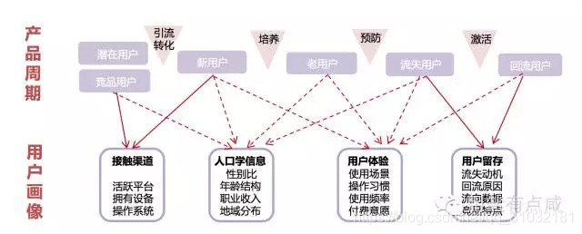

## 用户画像呈现
用户画像应该包含目标，方式，组织，标准，验证这5个方面。

1. 目标：指的是描述人，认识人，了解人，理解人。

1. 方式：又分为非形式化手段，如使用文字、语言、图像、视频等方式描述人；形式化手段，即使用数据的方式来刻画人物的画像。

1. 组织：指的是结构化、非结构化的组织形式。

1. 标准：指的是使用常识、共识、知识体系的渐进过程来刻画人物，认识了解用户。

1. 验证：依据侧重说明了用户画像应该来源事实、经得起推理和检验。

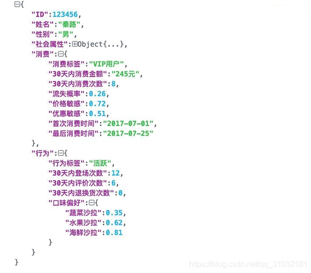

### 用户静态画像（以数据分析从业者数据为例）
此部分数据来源于静态信息数据：

- 用户填写的个人资料，或者由此通过一定的算法，计算出来的数据

- 如果有不确定的，可以建立模型来判断，比如用户的性别注册没有填写，可以建立模型，根据用户的行为来判断用户性别是什么，或者它的概率

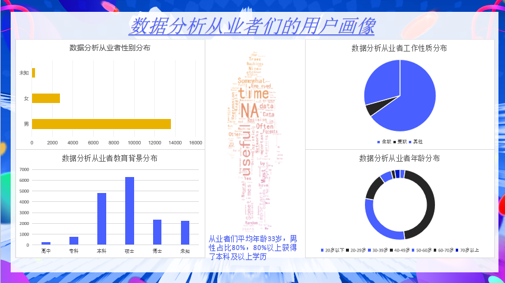

### 用户行为画像（以电商用户行为数据为例）
此部分数据来源于动态信息数据：

- 用户行为产生的数据：注册、游览、点击、购买、签收、评价、收藏等等。

- 用户比较重要的行为数据：游览商品，收藏商品、加入购物车、关注商品

  根据这些行为特性可以计算出：用户注册时间、首单时间、潮妈族、纠结商品、最大消费、订单数量、退货数量、败家指数、偏好等等，后续可以根据用户的行为与消费习惯，预测商品的发展的趋势，提高产品质量，同时提高用户满意度。

### 结合用户静态和动态行为画像（图片来源于网络）
在电商领域中，京东、阿里这些以TB计的高质量、多维度数据记录着用户大量的网络行为，用户画像就是对这些数据的分析而得到的用户基本属性、购买能力、行为特征、社交网络、心理特征和兴趣爱好等方面的标签模型，从而指导并驱动业务场景和运营，发现和把握在海量用户中的巨大商机。

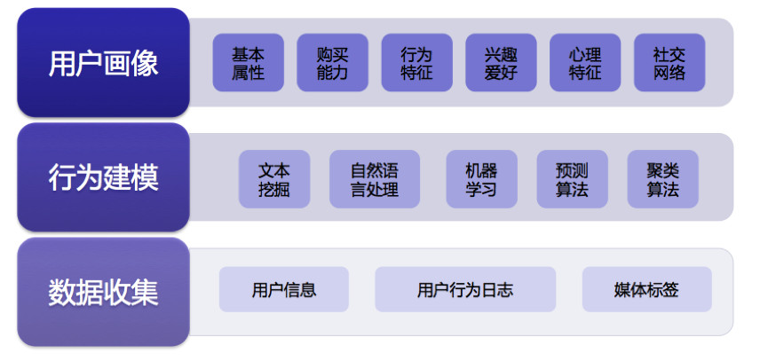

- **基本属性**：即性别、职业、月收入、有无车等标签，通过用户注册信息和多维建模获得；
- **购买能力**：即败家指数、潮妈族、消费水平等标签，通过消费金额、下单频度、消费周期等数据分析建模获得；
- **行为特征**：即活跃程度、购物类型、起居时间等标签，通过分析浏览、点击、下单等数据获得；
- **社交网络**：即社交关系网、公司关系网等标签，通过收货地址、活动地址等信息来判断；
- **心理特征**：即促销敏感度、购物忠诚度等标签，通过代金券使用频度、购买单品类的品牌分布等数据判断；
- **兴趣爱好**：即运动偏好、品牌偏好、爱打扮、颜色偏好等标签，通过购买的商品、颜色、品牌等信息判断。

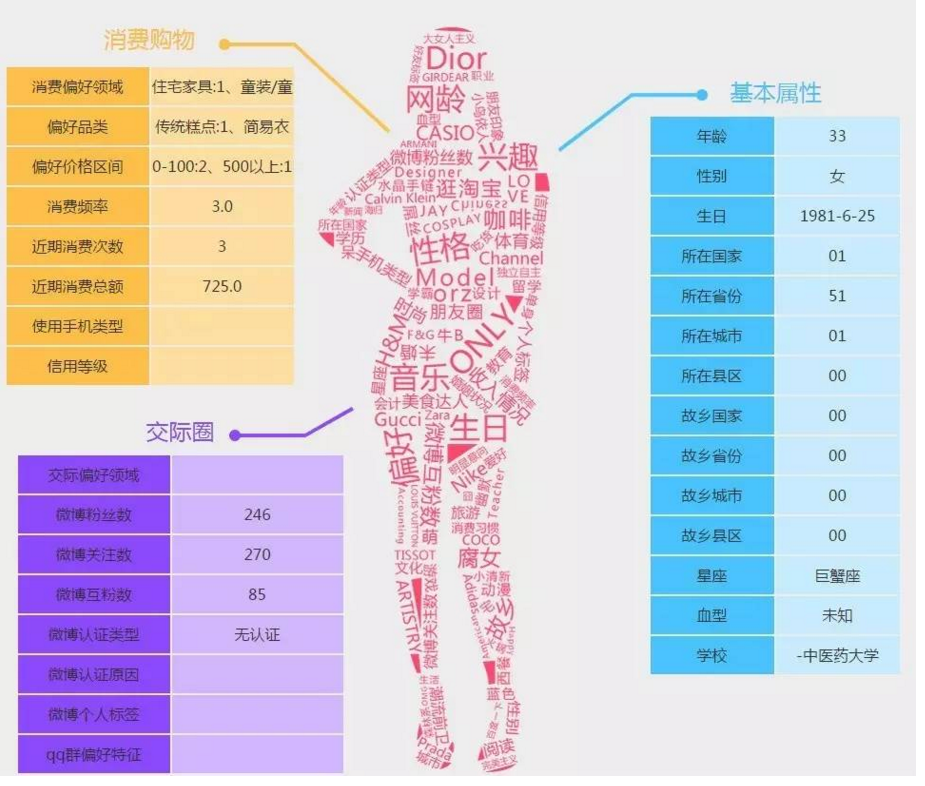

## 如何实现互联网用户画像？
**Step1：准确识别用户**

微博/微信/QQ等第三方登录成企业识别用户的折中选择

  用户识别的目的是为了区分用户、单点定位。用户识别的方式有很多种，如cookie、注册ID、邮箱、微信/微博/QQ等 **第三方登录、手机号等** ，这些都是互联网用户相对于传统线下渠道所特有的身份标识，其中手机号是目前移动端最为准确的用户标识，但随着用户的注册意愿越来越低，微博/微信/QQ等第三方登录成为越来越多企业的折中选择。

**Step2：动态跟踪用户行为轨迹**
三大维度：场景+媒体+路径

动态行为数据可以确认用户不同场景下的不同访问轨迹，助力广告主跨端控频营销。

  用户网络行为动态跟踪主要包括三个维度：场景+媒体+路径，应用到互联网中，场景主要包括访问设备、访问时段，媒体指某一时段下用户具体访问的媒体，如资讯类、视频类、游戏类、社交类等，路径指用户进入和离开某媒体的路径，可以简单理解为用户的站内与站外行为，如是通过搜索导航进入还是直接打开该APP，离开时是站内跳转到其他网页还是直接关闭，一方面有助于媒体自身优化流量运营，另一方面帮助广告主有效控制不同页面的投放频次，避免产生用户倦怠。

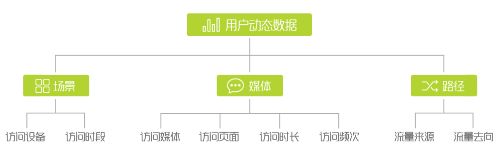

**Step3：结合静态数据评估用户价值**
五大维度：人口属性+商业属性+消费特征+生活形态+CRM

  静态数据获取后，需要对人群进行因子和聚类分析，不同的目的分类依据不同：如对于产品设计来说，按照使用动机或使用行为划分是最为常见的方式，而对于营销类媒体来说，依据消费形态来区分人群是最为直接的分类方式。

  静态数据主要包括用户的人口属性、商业属性、消费特征、生活形态、CRM五大维度，其获取方式存在多种，数据挖掘是最为常见也是较为精准的一种方式，如果数据有限，则需要定性与定量结合补充，定性方法如小组座谈会、用户深访、日志法、Laddering 阶梯法、透射法等，主要是通过开放性的问题潜入用户真实的心理需求，具象用户特征，定量更多是通过定量问卷调研的方式进行，关键在于后期定量数据的建模与分析，目的是通过封闭性问题一方面对定性假设进行验证，另一方面获取市场的用户分布规律。

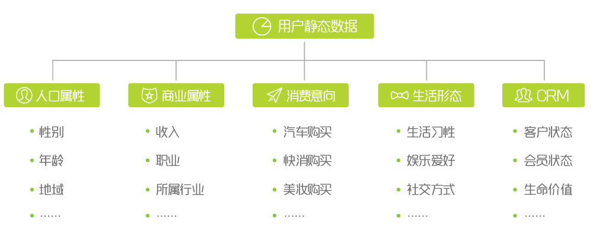

**时效性**

有些标签的时效性很强，如兴趣标签、出现轨迹标签等，一周之前的就没有意义了；有些标签基本没有时效性，如性别、年龄等，可以有一年到几年的有效期。对于不同的标签，需要建立合理的更新机制，以保证标签时间上的有效性。

**Step4：用户标签定义与权重**
从繁杂的数据中抽取共同的特征值

  根据特征值对群体进行定义，有助于广告主一目了然掌握该群体的特性，如“时尚小咖”，可以快速的联想到针对这类人，时尚感至关重要，即产品的设计感、外观等，并且小咖两字表明该类人并不盲目追求潮流，他们有自己的审美观，并且能够影响身边的人。

  同时，一个群体会有多个标签，不同的群体之间也会有标签的重合，此时标签的权重反映了不同群体的核心特征。如“时尚小咖”和“科技先锋”两类人群中都有女性标签，此时需要比较女性在不同人群中的标签权重，以决定将该标签解读给哪类群体。通常，一个好的用户画像，不同人群之间的标签重合度较小，只有在那些权重较小的标签上会有些许重合。

**Step5：不同人群优先级排列**
根据企业自身情况排列不同组合

  目前，大部分画像只完成上述4步就结束了，然而最后一步决定了最终效果的落地，对于广告主来说可以理解为媒介的组合策略。组合策略可以按照频率的高低、市场的大小、收益的潜力、竞争优势等，根据企业自身情况排列不同组合。

  如：品牌刚刚建立，需要快速提升知名度，可以按照不同媒体目标人群覆盖率的高低进行预算分配；当品牌具备一定知名度，企业核心领域营收处于快速增长期时，可以按照不同媒体目标人群贡献的市场大小进行分配；当企业想开拓新市场时，可以按照不同媒体目标人群的收益潜力进行分配，另外如企业品牌需增强差异化的竞争优势时，可按照不同媒体目标人群的竞争优势进行投放。

## 用户画像困难点、用户画像瓶颈
1. 用户多渠道信息打通

同一个用户的数据面临多渠道的数据来源、格式、定义方式等，在数据清洗层面上就已经产生了很多的困难。

2. 多渠道产品信息打通

同一个用户不同产品，比如微信数据、支付宝、百度检索数据。每个产品都能在不同层面对用户进行精准的定位，但结合起来又不太现实。

3. 实时采集用户数据

目前收集用户的行为数据都属于敏感信息，过多或者过详细的数据都没有办法上报，更存在上报缺失等情况。假如再上升到实时收集用户信息，不止对产品来说，用户层面也会有诸多困难。

4. 用户数据挖掘建模

挖掘用户有效信息，一直是很多企业想要做的事情，但数据量大，有效数据难以利用，并存在和现有的技术难以结合等。

5. 亿级画像系统实践和应用

当用户数据上升到一定程度，就要面临技术上的问题，有些技术并不是不能实现或者准确产出结果，而是需要一定时间去计算，而某些场景迭代快，用户兴趣转移快又需要实时进行画像数据或者结果数据的变动，那对技术也是一方面的难点。

## 新用户冷启动推荐
### 1. 一无所知
当系统对用户没有任何认识时，我们通常采用的策略为“保底内容池+兴趣试探”方法为用户进行内容推荐。由于对用户的认知为0，我们在构建保底内容池时通常要考虑内容的普适性和优质性，即：推荐能够满足各类用户需求的优质内容，而这一工作的策略指标就是迅速满足用户消费内容的需求。因此，常见的内容类型就包括时下最新的热点以及一些泛娱乐休闲类的内容，而内容的优质性不言而喻。

内容优质的标准通常为运营加精、基于后验数据（如：点赞、转发等）等。而在兴趣试探方面，更多的是采取“随机试探”的方式给用户推荐内容，这里的随机也可以结合平台老用户的兴趣倾向来做个偏置，比如说老用户更多的使用产品看娱乐类、热点类内容，那就可以尝试对这类内容做优先的召回用于试探。

不过，在兴趣试探之前构建“高度垂直”领域的内容池也是十分的关键，毕竟用户消费内容的垂直度在某种意义上决定了用户画像的清晰度。例如，如果给一个爱好时尚的用户推荐一篇有点时尚，又有点娱乐领域的内容（系统的标签是娱乐），而用户产生消费行为后，系统会认为该用户的兴趣偏娱乐类。

### 2. 粗粒度认识

当系统获取了用户安装的App List、进入App后选择的兴趣领域、位置、机型信息等(选择自己感兴趣的标签)，我们通常采用“保底内容池+粗个性化分发+兴趣试探”的策略。此时，通过获取用户安装的App信息，我们可以对用户有一个粗粒度理解，而这些理解也可以直接写入用户画像。例如，手机端安装了“汽车之家”App，那其实对应该用户的人群属性是一个“有车人”，且通常为男性。那么，我们就可以构建一个区分有车的人和无车的人之间内容消费差异化的试探内容池，从而对该类用户做粗粒度的个性化分发。

不过，这里有个难点在于如何区分无车和有车人之间的消费内容差异性呢？通常，我们可以对有车人的消费内容（根据点击、阅读等后验数据）进行打分，根据得分可以该类内容的Top N，同样也可以获得无车人的消费内容Top N。

同样，在进行兴趣试探时，由于判定该用户是一个有车的人，系统也可以推荐这类用户可能感兴趣的其他内容，比如，这类人群往往也对科技感兴趣，就可以推荐科技领域的相关内容试探。除了安装的App信息之外，还有开屏兴趣选择，可以直接用来完善用户画像，根据所选择的兴趣进行内容分发；位置信息，可以用来推送本地相关的内容；机型信息可以映射出价格和消费水平用来推送相应的机型及其他内容

### 3. 产生用户行为

当用户产生内容消费行为后，比如：点击、订阅、搜索。此时就可以根据这些反馈行为进行内容更细粒度的分发，我们通常采用“保底内容池+细粒度分发+反馈+兴趣试探”，这里的细粒度分发会与系统反馈相结合，相比此前的粗粒度分发会更具有针对性和“大胆”。

例如，当用户点击“王源”相关内容，而在下几刷就会推荐如“王俊凯”相关内容；用户搜索了“都挺好”，系统将会直接推荐电视剧《都挺好》相关的内容；用户订阅了诗词栏目、就会给用户推荐诗词领域的内容等。同样，针对更加清晰的用户画像，兴趣试探内容池也会加入更多基于兴趣、人群属性以及后验数据的内容。

### 什么是兴趣试探

考虑到每个场景下，对新用户的推荐都会涉及到兴趣试探，有必要拎出来着重讲一下兴趣试探做了什么东西。兴趣试探之前，构建优质、高垂直的兴趣试探内容池是第一步，而我们通常会结合兴趣、人群、后验指标这3个维度构建。得到了内容池之后，就要设计相应的试探的逻辑。

在此之前，我们首先需要建立用户与内容池之间的试探状态，而每个用户与每个内容池之间的状态有四种：light（点亮）、awake（唤醒）、stable（稳定）、dead（死亡）。不过，由于用户与池子之间的状态会进行转换，因此，不同状态下的内容池试探优先级也会有所不同。
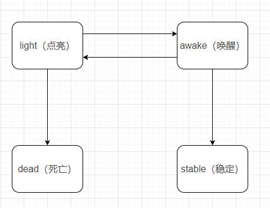

首先，简单介绍一下用户与内容池之间的四种试探状态：

- 点亮：用户与内容池的初始状态均为点亮状态；

- 唤醒：当试探捕捉到多次正向反馈，用户与该内容池的状态转为唤醒状态；

- 稳定：进入唤醒状态之后，继续试探依旧有正向点击行为则进入稳定状态；

- 死亡：继续试探，没有点击会进入点亮状态，直至死亡状态；

然后，内容试探的优先级：

- 对唤醒状态的用户与内容池做优先分发试探；

- 对死亡和稳定状态的用户与内容池，不进行试探；

- 对点亮状态的用户与内容池做正常试探；

最后，为了提升兴趣试探的效率，我们通常需要将不同调性的内容池进行组合，通过对比实验的方式得到试探效率最高的内容池，例如，系统针对新用户做电视剧、汽车、搞笑兴趣点的试探

## 其它
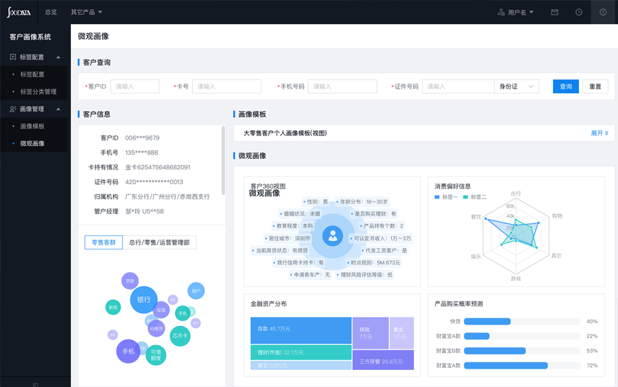
> 参考https://en.datamargin.com/

[用户画像在阅文的探索与实践](https://www.infoq.cn/article/pc3Q8zmqzklcT5Kz67Pq)

参考[用户画像系统构建](https://www.jianshu.com/p/7683df584cb4)

[用户画像体系介绍汇总](https://blog.csdn.net/qq_31032181/article/details/88896378)
