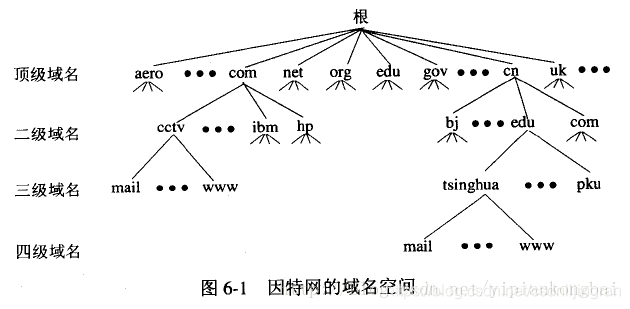
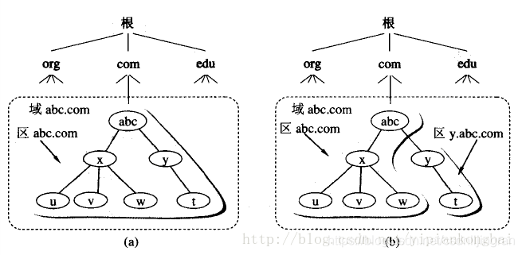
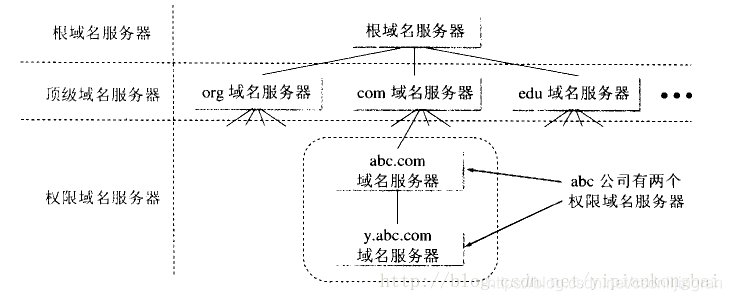
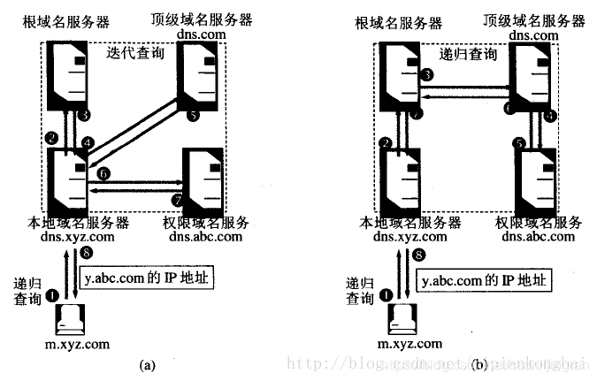

[TOC]

DNS（Domain Name Server，域名服务器）中保存了一张域名(domain name)和与之相对应的IP地址 (IP address)的表，以解析消息的域名。 域名是Internet上某一台计算机或计算机组的名称，用于在数据传输时标识计算机的电子方位（有时也指地理位置）。域名是由一串用点分隔的名字组成的，通常包含组织名，而且始终包括两到三个字母的后缀，以指明组织的类型或该域所在的国家或地区。

## 1、概述
把域名翻译成IP地址的软件称为域名系统，即DNS。它是一种管理名字的方法。这种方法是：分不同的组来负责各子系统的名字。系统中的每一层叫做一个域，每个域用一个点分开。域名服务器就是装有域名系统的主机。它是一种能够实现名字解析（name resolution）的分层结构数据库。

### 1.1 因特网的域名结构
由于因特网的用户数量较多，所以因特网在命名时采用的是层次树状结构的命名方法。任何一个连接在因特网上的主机或路由器，都有一个唯一的层次结构的名字，即域名(domain name)。

这是中央电视台用于手法电子邮件的计算机的域名，它由三个标号组成，其中标号com是顶级域名，标号cctv是二级域名，标号mail是三级域名。

现在顶级域名TLD(Top Level Domain)已有265个，分为三大类：
1. 国家顶级域名nTLD：采用ISO3166的规定。如：cn代表中国，us代表美国，uk代表英国，等等。国家域名又常记为ccTLD(cc表示国家代码contry-code)。

2. 通用顶级域名gTLD：最常见的通用顶级域名有7个，即：com(公司企业)，net(网络服务机构)，org(非营利组织)，int(国际组织)，gov(美国的政府部门)，mil(美国的军事部门)。

3. 基础结构域名(infrastructure domain)：这种顶级域名只有一个，即arpa，用于反向域名解析，因此称为反向域名。

### 1.2 域名服务器
如果采用上述的树状结构，每一个节点都采用一个域名服务器，这样会使得域名服务器的数量太多，使域名服务器系统的运行效率降低。所以在DNS中，采用划分区的方法来解决。

一个服务器所负责管辖(或有权限)的范围叫做区(zone)。各单位根据具体情况来划分自己管辖范围的区。但在一个区中的所有节点必须是能够连通的。每一个区设置相应的权限域名服务器，用来保存该区中的所有主机到域名IP地址的映射。总之，DNS服务器的管辖范围不是以“域”为单位，而是以“区”为单位。区是DNS服务器实际管辖的范围。区 <= 域。

下图是区的不同划分方法的举例。假定abc公司有下属部门x和y，部门x下面有分三个分布们u,v,w，而y下面还有下属部门t。图a表示abc公司只设一个区abc.com。这是，区abc.com和域abc.com指的是同一件事。但图b表示abc公司划分为两个区：abc.com和y.abc.com。这两个区都隶属于域abc.com，都各设置了相应的权限域名服务器。不难看出，区是域的子集。

因特网上的DNS服务器也是按照层次安排的。每一个域名服务器只对域名体系中的一部分进行管辖。根据域名服务器所起的作用，可以把域名服务器划分为下面四种不同的类型：

**根域名服务器**：最高层次的域名服务器，也是最重要的域名服务器。所有的根域名服务器都知道所有的顶级域名服务器的域名和IP地址。不管是哪一个本地域名服务器，若要对因特网上任何一个域名进行解析，只要自己无法解析，就首先 求助 根域名服务器。所以根域名服务器是最重要的域名服务器。假定所有的根域名服务器都瘫痪了，那么整个DNS系统就无法工作。需要注意的是，在很多情况下，根域名服务器并不直接把待查询的域名直接解析出IP地址，而是告诉本地域名服务器下一步应当找哪一个顶级域名服务器进行查询。

**顶级域名服务器**：负责管理在该顶级域名服务器 注册的二级域名。

**权限域名服务器**：负责一个“区”的域名服务器。

**本地域名服务器**：本地服务器不属于下图的域名服务器的层次结构，但是它对域名系统非常重要。当一个主机发出DNS查询请求时，这个查询请求报文就发送给本地域名服务器。

## 2、域名解析
### 2.1 两种解析方式
1. 主机 向 本地域名服务器的查询一般都是采用递归查询。所谓递归查询就是：如果主机所询问的本地域名服务器不知道被查询的域名的IP地址，那么本地域名服务器就以DNS客户的身份，向其它根域名服务器继续发出查询请求报文(即替主机继续查询)，而不是 让主机自己 进行下一步查询。因此，递归查询返回的查询结果或者是所要查询的IP地址，或者是报错，表示无法查询到所需的IP地址。
2. 本地域名服务器 向 根域名服务器的查询的迭代查询。迭代查询的特点：当根域名服务器收到本地域名服务器发出的迭代查询请求报文时，要么给出所要查询的IP地址，要么告诉本地服务器：“你下一步 应当 向哪一个域名服务器 进行查询”。然后 让本地服务器 进行后续的查询。根域名服务器通常是把自己知道的顶级域名服务器的IP地址告诉本地域名服务器，让本地域名服务器再向 顶级域名服务器查询。顶级域名服务器在收到本地域名服务器的查询请求后，要么给出所要查询的IP地址，要么告诉本地服务器下一步 应当向 哪一个权限域名服务器 进行查询。最后，知道了所要解析的IP地址或报错，然后把这个结果返回给发起查询的主机。

### 2.2 缓存
为了提高DNS查询效率，并减轻服务器的负荷和减少因特网上的DNS查询报文数量，在域名服务器中广泛使用了高速缓存，用来存放最近查询过的域名以及从何处获得域名映射信息的记录。

由于名字到地址的绑定并不经常改变，为保持告诉缓存中的内容正确，域名服务器应为每项内容设置计时器并处理超过合理时间的项(例如每个项目两天)。当域名服务器已从缓存中删去某项信息后又被请求查询该项信息，就必须重新到授权管理该项的域名服务器绑定信息。当权限服务器回答一个查询请求时，在响应中都指明绑定有效存在的时间值。增加此时间值可减少网络开销，而减少此时间值可提高域名解析的正确性。

不仅在本地域名服务器中需要高速缓存，在主机中也需要。许多主机在启动时从本地服务器下载名字和地址的全部数据库，维护存放自己最近使用的域名的高速缓存，并且只在从缓存中找不到名字时才使用域名服务器。维护本地域名服务器数据库的主机应当定期地检查域名服务器以获取新的映射信息，而且主机必须从缓存中删除无效的项。由于域名改动并不频繁，大多数网点不需花精力就能维护数据库的一致性。

### 2.3 备份容灾
每一个域名都至少要有两个DNS服务器，这样如果其中一个DNS服务器出现问题，另外一个也可以返回关于这个域名的数据。DNS服务器也可以有两个以上，但所有这些DNS服务器上的DNS记录都应该是相同的。

## 3、域名类型
- 一是国际域名（international top-level domain-names，简称iTDs），也叫国际顶级域名。这也是使用最早也最广泛的域名。例如 表示工商企业的.com .top，表示网络提供商的.net，表示非盈利组织的.org等。
- 二是国内域名，又称为国内顶级域名（national top-level domainnames，简称nTLDs），即按照国家的不同分配不同后缀，这些域名即为该国的国内顶级域名。200多个国家和地区都按照ISO3166国家代码分配了顶级域名，例如中国是cn，美国是us，日本是jp等。

## 4、服务器类型
主域名服务器
负责维护一个区域的所有域名信息，是特定的所有信息的权威信息源，数据可以修改。

辅助域名服务器
当主域名服务器出现故障、关闭或负载过重时，辅助域名服务器作为主域名服务器的备份提供域名解析服务。辅助域名服务器中的区域文件中的数据是从另外的一台主域名服务器中复制过来的，是不可以修改的。

缓存域名服务器
从某个远程服务器取得每次域名服务器的查询回答，一旦取得一个答案就将它放在高速缓存中，以后查询相同的信息就用高速缓存中的数据回答，缓存域名服务器不是权威的域名服务器，因为它提供的信息都是间接信息。

转发域名服务器
负责所有非本地域名的本地查询。转发域名服务器接到查询请求后，在其缓存中查找，如找不到就将请求依次转发到指定的域名服务器，直到查找到结果为止，否则返回无法映射的结果。

## 5、缓存的优缺点
缓存的优点
之所以域名解析不需要很长时间，是因为上网接入商，比如北京电信，河南电信等，为了要加速用户打开网页的速度，通常在他们的DNS服务器 中 缓存了很多域名的DNS记录。这样这个接入商的用户要打开某个网页时，接入商的服务器不需要去查询域名数据库，而是把自己缓存中的DNS记录直接使用，从而加快用户访问网站的速度。

缓存的缺点
缺点是上网接入商ISP的缓存会存储一段时间，只在需要的时候才更新，而更新的频率没有什么标准。有的ISP可能1小时更新一次，有的可能长达一两天才更新一次。

所以新注册的域名一般来说解析反倒比较快。因为所有的ISP都没有缓存，用户访问时ISP都是要查询域名数据库，得到最新的DNS数据。

而老域名如果更改了DNS记录，但世界各地的ISP缓存数据却并不是立即更新的。这样不同ISP下的不同用户，有的可以比较快的获取新的DNS记录，有的就要等ISP缓存的下一次更新。

## 关于53端口默认关闭的说明
> https://www.aliyun.com/notice/115519
一、概述
根据《中华人民共和国电信条例》及《电信业务经营许可管理办法》，开展递归解析服务需要相应的增值电信业务经营许可证，即B26-1互联网域名解析服务业务牌照。因此，如您需要使用阿里云服务器向公众提供递归解析服务，开通服务器53端口，需要提供相应增值电信业务经营许可证。

二、FAQ
1、什么是互联网域名解析服务？

互联网域名解析服务业务是指在互联网上通过架设域名解析服务器和相应软件，实现互联网域名和IP地址的对应关系转换的服务。域名解析服务包括权威解析服务和递归解析服务两类。其中开展递归解析服务需要获得互联网域名解析服务业务的增值电信业务经营许可证。
权威解析是指为根域名、顶级域名和其他各级域名提供域名解析的服务。
递归解析是指通过查询本地缓存或权威解析服务系统实现域名和IP地址对应关系的服务。

2、什么是服务器53端口？

服务器53端口为域名系统（DNS）服务端口，主要用于互联网域名解析。

3、如何办理“B26-1互联网域名解析服务业务”增值电信业务许可证？

具体办理方式可以咨询您主体所在省通信管理局。

4、不提供递归解析服务，需要开通53端口用来提供权威解析服务是否可以？

 可以，提供权威解析服务不需要申请牌照。

5、不向公众提供递归解析服务只在内部特定范围使用，如何操作？

 可以开通服务器53端口，并应采取必要的技术措施确保只在局域网内使用。

6、未对公众提供递归解析服务或权威解析服务，误打开了53端口，如何操作？

 请您关闭53端口，并强化网络安全管理工作。 

7、如果开展递归解析业务未获得相应增值电信业务许可证，阿里云是否会关闭我的服务器53端口？

根据《电信业务经营许可管理办法》，阿里云不得为未依法取得经营许可证的单位或个人提供接入服务。因此，阿里云需要依法关闭服务器53端口。

8、个人能从事互联网域名解析服务业务吗？

个人不能从事这项业务，您需要以公司的名义办理相应增值电信业务经营许可证，才能开展互联网域名解析服务业务。

三、相关政策法规要求
《电信业务经营许可管理办法》  

第四十六条 违反本办法第十六条第一款、第二十八条第一款规定，擅自经营电信业务或者超范围经营电信业务的，依照《中华人民共和国电信条例》第六十九条规定予以处罚，其中情节严重、给予责令停业整顿处罚的，直接列入电信业务经营失信名单。

《互联网域名管理办法》

第三十六条 提供域名解析服务，应当遵守有关法律、法规、标准，具备相应的技术、服务和网络与信息安全保障能力，落实网络与信息安全保障措施，依法记录并留存域名解析日志、维护日志和变更记录，保障解析服务质量和解析系统安全。涉及经营电信业务的，应当依法取得电信业务经营许可。

《电信业务经营许可管理办法》

第二十四条 提供接入服务的增值电信业务经营者应当遵守下列规定：（三）不得为未依法取得经营许可证或者履行非经营性互联网信息服务备案手续的单位或者个人提供接入或者代收费等服务。