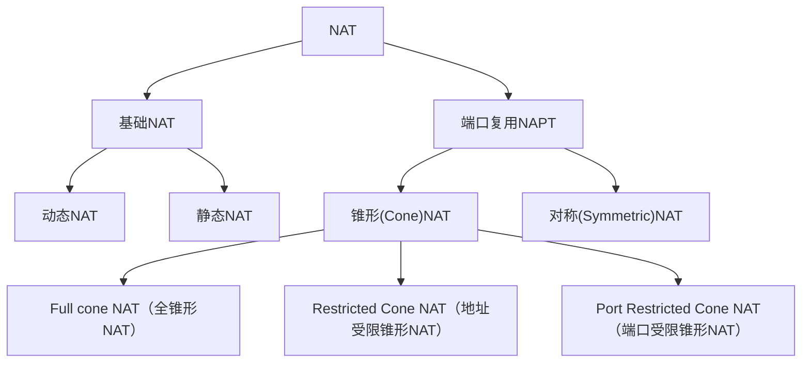

# P2P
P2P是指peer to peer， 点对点的技术， 每个客户端都是服务端，没有中心服务器

技术要点
- udp协议
- 节点之间的建立，连接和广播
- 内网穿透，如何能让两个处在内网的节点，相互发现自己的存在，并且建立通信

[P2P通信原理与实现](https://zhuanlan.zhihu.com/p/26796476)


P2P 相关资料，从旧到新依次有：Napster、Gnutella、Freenet、BitTorrent、IPFS……

## 开源实现

### Xorro P2P 
https://xorro-p2p.github.io/
https://github.com/xorro-p2p/xorro


### NAT1 打洞
github.com/libp2p/go-reuseport


demo:
https://github.com/xhyonline/p2p-demo
https://github.com/xhyonline/nat3p2p

client
```
package main

import (
	"github.com/gin-gonic/gin"
	"github.com/libp2p/go-reuseport"
	"time"
)

func main() {
	localAddr := "0.0.0.0:8222"
	remoteAddr := "云端serverIP:8555"
	listener, err := reuseport.Listen("tcp", localAddr)
	if err != nil {
		panic(err)
	}
	go func() {
		r := gin.Default()
		r.Static("/static", "./static/")
		r.RunListener(listener)
	}()
	conn, err := reuseport.Dial("tcp", localAddr, remoteAddr) // ip:port/static/1.zip
	if err != nil {
		panic(err)
	}
	for {
		conn.Write([]byte("ping"))
		time.Sleep(time.Second)
	}
}

```
云端server
```
package main

import (
	"bufio"
	"fmt"
	"net"
)

func main() {
	address := "0.0.0.0:8555"
	listen, err := net.Listen("tcp", address)
	if err != nil {
		fmt.Println("Listen() failed, err: ", err)
		return
	}
	fmt.Println("Listen(): ", address)
	for {
		conn, err := listen.Accept() // 监听客户端的连接请求
		if err != nil {
			fmt.Println("Accept() failed, err: ", err)
			continue
		}
		go process(conn) // 启动一个goroutine来处理客户端的连接请求
	}
}

// TCP Server端测试
// 处理函数
func process(conn net.Conn) {
	fmt.Println("RemoteAddr：", conn.RemoteAddr())
	fmt.Println("LocalAddr：", conn.LocalAddr())

	defer conn.Close() // 关闭连接
	for {
		reader := bufio.NewReader(conn)
		var buf [128]byte
		n, err := reader.Read(buf[:]) // 读取数据
		if err != nil {
			fmt.Println("read from client failed, err: ", err)
			break
		}
		recvStr := string(buf[:n])
		fmt.Println("RemoteAddr：", conn.RemoteAddr(), " 收到：", recvStr)
		conn.Write([]byte(recvStr)) // 发送数据
	}
}

```

[Golang TCP Server and Client Example [Tutorial]](https://www.golinuxcloud.com/golang-tcp-server-client/#google_vignette)

[Golang UDP Server and Client Example [Tutorial]](https://www.golinuxcloud.com/golang-udp-server-client/#google_vignette)
## NAT
NAT（Network Address Translator，网络地址转换）是用于在本地网络中使用私有地址，在连接互联网时转而使用全局 IP 地址的技术。NAT实际上是为解决IPv4地址短缺而开发的技术。

**SNAT(Source Network Address Translation)**：源网络地址转换，内部地址要访问公网上的服务时，内部地址会主动发起连接，将内部地址转换为公网IP。有关这个地址转换称为SNAT。

**DNAT(Destination Network Address Translation)**：目标地址转换，内部需要对外提供服务时，外部主动发起连接，路由器或者防火墙的网络接收到这个连接，然后将连接转换到内部，此过程是由带公网ip的网关代替内部服务来接收外部的连接，然后在内部做地址转换。此转换成为DNAT，主要用于内部服务对外发布。


NAT分为两大类，基本的NAT(Basic NAT)和NAPT（Network Address/Port Translator）。
Basic NAT只转化IP，不映射端口。



- 静态NAT(Static NAT)
内部本地地址一对一转换成内部全局地址，相当内部本地的每一台PC都绑定了一个全局地址。一般用于在内网中对外提供服务的服务器

- 动态NAT(Dynamic NAT/Pooled NAT)
在内部本地地址转换的时候，在地址池中选择一个空闲的，没有正在被使用的地址，来进行转换，一般选择的是在地址池定义中排在前面的地址，当数据传输或者访问完成时就会放回地址池中，以供内部本地的其他主机使用，但是，如果这个地址正在被使用的时候，是不能被另外的主机拿来进行地址转换的

- 端口复用NAPT
面对私网内部数量庞大的主机，如果NAT只进行IP地址的简单替换，就会产生一个问题：当有多个内部主机去访问同一个服务器时，从返回的信息不足以区分响应应该转发到哪个内部主机。此时，需要 NAT 设备根据传输层信息或其他上层协议去区分不同的会话，并且可能要对上层协议的标识进行转换，比如 TCP 或 UDP 端口号。这样 NAT 网关就可以将不同的内部连接访问映射到同一公网IP的不同传输层端口，通过这种方式实现公网IP的复用和解复用。这种方式也被称为端口转换PAT、NAPT或IP伪装，但更多时候直接被称为NAT，因为它是最典型的一种应用模式。
> NAPT是指网络地址转换过程中使用了端口复用技术，即PAT(Port address Translation)。


- 全锥型(Full Cone NAT)
所有来自同一个内部Tuple X的请求均被NAT转换至同一个外部Tuple Y，而不管这些请求是不是属于同一个应用或者是多个应用的。除此之外，当X-Y的转换关系建立之后，任意外部主机均可随时将Y中的地址和端口作为目标地址和目标端口，向内部主机发送UDP报文，由于对外部请求的来源无任何限制，因此这种方式虽然足够简单，但却不那么安全。

> 全锥型NAT打洞原理：在不同内网的主机A和B各自连接到服务器C，服务器收到A和B的连接后知道了他们的公网地址和NAT分配给他们的端口号，然后把这些NAT地址和端口号交叉告诉B和A。A和B给服务器所打开的“孔”可以给任何主机使用。

- 受限锥型(Restricted Cone NAT)
Full Cone的受限版本，亦可认为是IP地址受限锥型。所有来自同一个内部Tuple X的请求均被NAT转换至同一个外部Tuple Y，这与Full Cone相同，但不同的是，只有当内部主机曾经发送过报文给外部主机（假设其IP地址为Z）后，外部主机才能以Y中的信息作为目标地址和目标端口，向内部 主机发送UDP请求报文，这意味着，NAT设备只向内转发（目标地址/端口转换）那些来自于当前已知的外部主机的UDP报文，从而保障了外部请求来源的安 全性。

> 受限锥型NAT打洞原理：主机A和B同样需要各自连接服务器C，同时把A和B的地址告诉B和A，但一般情况下它们只能与服务器通信。要想直接通信需要发送消息给服务器C，如主机A发送一个UDP消息到主机B的公网地址上，与此同时，A又通过服务器C中转发送一个邀请信息给主机B，请求主机B也给主机A发送一个UDP消息到主机A的公网地址上。这时主机A向主机B的公网IP发送的信息导致NAT A打开一个处于主机A的和主机B之间的会话，与此同时，NAT B 也打开了一个处于主机B和主机A的会话。一旦这个新的UDP会话各自向对方打开了，主机A和主机B之间才可以直接通信。IP相同，port随便，就能和先前内部节点被映射的外部Tuple进行通信。

- 端口受限锥型(Port Restricted Cone NAT)
Restricted Cone NAT的进一步受限版。只有当内部主机曾经发送过报文给外部主机（假设其IP地址为Z且端口为P）之后，外部主机才能以Y中的信息作为目标地址和目标端 口，向内部主机发送UDP报文，同时，其请求报文的源端口必须为P，这一要求进一步强化了对外部报文请求来源的限制，从而较Restrictd Cone更具安全性。

> 端口受限锥型NAT打洞原理：与受限制锥型类似，与之不同的是还要指定端口号。IP,port都得一样；只能用先前内部节点被映射的外部Tuple与内部节点进行通信

- Symetric NAT（对称NAT）
所有从同一个内网（IP，端口）发送到同一个目的IP和端口的请求都会被映射到同一个IP和端口。换句话说（SIP，Sport, DIP, Dport）只要有一个发生变化都会使用不同的映射条目，即此NAT映射与报文四元组绑定。(dport：目的端口 ; sport：来源端口; 同理SIP和DIP )

> 双方都是对称型NAT正常是无法打洞的, 对称型NAT打洞原理：常规的打洞方式都不可用，目前可以尝试的有TCP+UDP打洞、UDP端口预测方法。
> 端口受限与对称 一般来说也是无法打洞的


### 动手
为了各种需求，我们希望提升NAT类型。提升NAT类型的好处有，浏览网页、观看视频、游戏等更顺畅，下载速度更稳定快速，特别是对那些玩游戏的，提升NAT类型后更容易进入游戏房间连线等。

提升NAT类型的途径和方法：

1. 修改光猫工作模式：
把光猫工作模式设置为桥接模式，这就是获取光猫超级密码的目的，修改模式，因为运营商一般默认设置光猫工作在路由模式。无线路由器直接连到猫上就可以上网的，那么光猫是路由模式。无线路由器需要PPPoE拨号上网的就是桥接模式。

2. 更改路由器设置：
如果无线路由器有启用“Full Cone”、“uPnP”等功能，果断启用。特别是启用“uPnP”，绝大部分路由器都支持。另外大部分的路由器都支持DMZ，把你要提升NAT类型的主机IP地址设置好，设置之前把主机的IP设置为静态的。

### 工具
#### pwnat
pwnat是目前唯一可以在防火墙/ NAT上打孔的工具，使用新开发的技术，利用NAT转换表的属性，能够在不需要proxy代理、第三方服务器、upnp、DMZ、sproofing、dns转换的情况下实现NAT中的P2P通信。http://samy.pl/pwnat/pwnat.pdf
```
其中一台NAT后的主机输入指令作为服务端：`./pwnat -s`

例如其中一台NAT后的主机作为客户端想访问google
`./pwnat -c 8000 <pwnat.server.com> google.com 80`

之后打开http://localhost:8000 就可以访问google了!

```
#### NatTypeTester
[测试当前网络的 NAT 类型（STUN）](https://github.com/HMBSbige/NatTypeTester)


### 参考
[什么是NAT？](https://zhuanlan.zhihu.com/p/340698491)

推荐: [NAT基本原理及穿透详解(打洞)](https://juejin.cn/post/6844904098572009485)