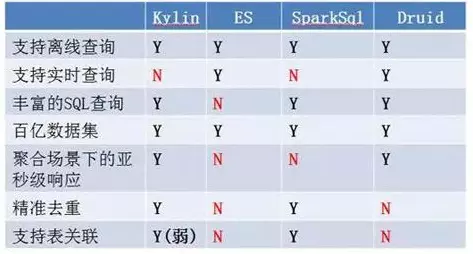

# Druid

Druid.io（以下简称Druid）是面向海量数据的、用于实时查询与分析的OLAP存储系统。Druid的四大关键特性总结如下：

1. 亚秒级的OLAP查询分析。Druid采用了列式存储、倒排索引、位图索引等关键技术，能够在亚秒级别内完成海量数据的过滤、聚合以及多维分析等操作。

2. 实时流数据分析。区别于传统分析型数据库采用的批量导入数据进行分析的方式，Druid提供了实时流数据分析，采用LSM(Long structure merge)-Tree结构使Druid拥有极高的实时写入性能；同时实现了实时数据在亚秒级内的可视化。

3. 丰富的数据分析功能。针对不同用户群体，Druid提供了友好的可视化界面、类SQL查询语言以及REST 查询接口。

4. 高可用性与高可拓展性。Druid采用分布式、SN(share-nothing)架构，管理类节点可配置HA，工作节点功能单一，不相互依赖，这些特性都使得Druid集群在管理、容错、灾备、扩容等方面变得十分简单。

四点重要的技术，分别是：

- 预聚合
- 列式存储
- 字典编码
- 位图索引

