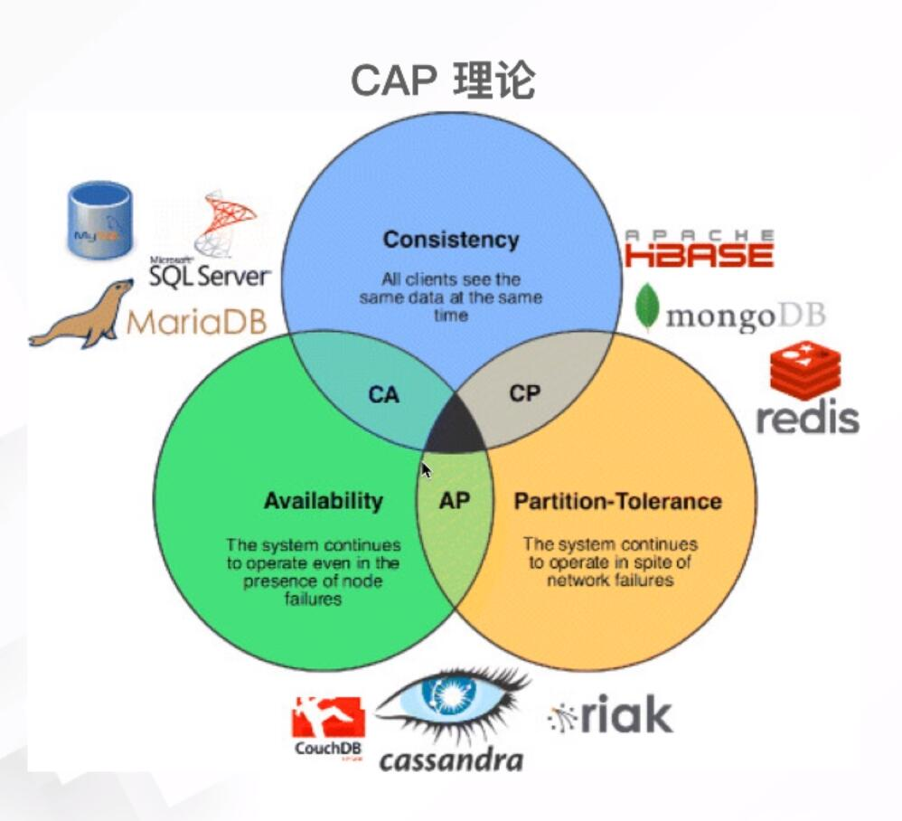
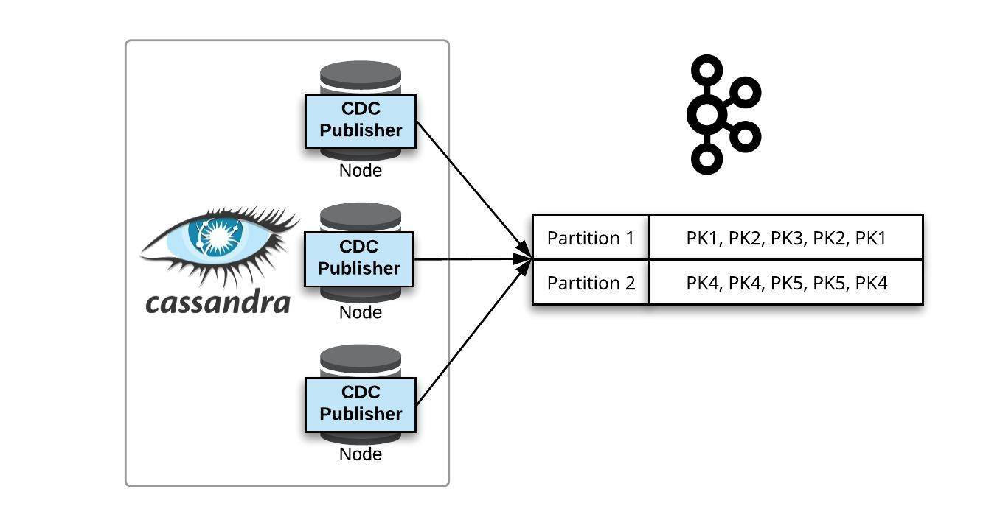

## 简介
Cassandra数据库在分布式的架构上借鉴了Amazon的Dynamo，而在数据的存储模型上参考了Google的Bigtable

https://cassandra.apache.org/doc/latest/architecture/guarantees.html

> Cassandra满足可用性和分区容差属性。弱一致性
> HBase满足一致性和分区容差属性。

[Cassandra维护数据一致性的策略](https://www.cnblogs.com/xxdfly/p/5641684.html)

Cassandra是闹过绯闻的，08年 由Facebook开源，然后10年[twitter宣布停用Cassandra](https://timyang.net/data/twitter-cassandra/)，由于Cassandra的最终一致性模型不适合Message类型应用的处理，当时不少公司考虑到它缺少海量并发的案例，所以也不敢将其使用在主要业务上。不过好东西是最经得起考验的，经过这么4,5年的发展，Cassandra有Datastax的推广，目前已经有好多公司在使用Cassandra，如Instagram按照DBEngine上面的数据库排名（2020.06全部数据库排行第十，Wide column排行第一，NoSQL排在MongoDB，Elasticsearch，Redis之后，排行第四），Cassandra已经成为列簇类型的Nosql中用户最广的产品(所以前几年有很多说选择HBase的)。

它的分布设计基于Amazon的Dynamo及其在Google的Bigtable上的数据模型。

## 安装
docker pull cassandra:3.11.6

docker run --name cassandra --restart always -d -p 9042:9042 cassandra:3.11.6

## 应用
Cassandra+Spark vs HBase+Hadoop

## 性能
https://www.datastax.com/products/compare/nosql-performance-benchmarks
遥遥领先

## 功能
CQL -> Cassandra Query Language  https://cassandra.apache.org/doc/latest/cql/
UDF -> User Defined function
TTL
CAS -> 比如更新或者插入时可以加if
batch -> 原子性

(Change Data Capture, CDC) 

Cassandra不支持join或者外键

https://www.bilibili.com/video/BV1WJ411g7NK?p=2

##  商业公司
[谁说不火-价值百亿Cassandra背后的力量](https://mp.weixin.qq.com/s/EnxBaTzDNMhCGvQWsAHS6Q)
- Datastax：DataStax | NoSQL Database Built on Apache Cassandra
https://www.datastax.com/，是一家位于加州的初创公司，提供了一个商业版本的Apache Cassandra数据库，公司目前已经接近1亿美元的融资。创始人也是Cassandra作者之一，是社区Cassandra较大贡献者。Datastax的Cassandra核心集成了Solr提供检索服务；另外集成Spark，与Cassandra一起搭配，提供流、存储、计算、机器学习一体化的存储计算分析服务。根据一些公开的资料，目前服务了较多世界500强的公司。

- InstaClustr：提供了开源的Cassandra、ES、Spark、Kafka，并且以Cassandra为核心。Cassandra、ES、Spark、Kafka也被称之为新大数据4组件。

- Thelastpickle：一家做Cassandra咨询的公司，公司也有不少的PMC及Committer。其开源了很多外围的工具，比如cassandra-reaper等，可以关注Thelastpickle的首页：https://thelastpickle.com

- scylladb：支持CQL协议的，号称是C++版本的Cassandra，参考：https://www.scylladb.com

- Strapdata：是cassandra + ES结合背后的商业公司，参考：https://www.strapdata.com/

这些商业公司，看起来也是分工合作，有的结合其他组件，有的提供工具，有的不断增强内核，共同把社区做大。

## 全球较大使用Cassandra的公司
根据不完全统计，在全球有超过10w公司在使用Cassandra，国内至少有5000家企业在使用。列举一些较大的使用的非云公司。（排除 阿里、华为、腾讯、京东等做云的公司）。

具体可以参考文章：https://developer.aliyun.com/article/718156

• Apple：目前有16w台的规模，使用在各个业务线，也是Cassandra社区较为活跃的贡献者

• Netflix：目前有数千台在使用，社区比较活跃，这片文章也了 netflix为什么选择cassandra：https://www.jcount.com/7-reasons-netflix-uses-cassandra-databases/

• Facebook：主导了cassandra+rocksdb的研发：https://thenewstack.io/instagram-supercharges-cassandra-pluggable-rocksdb-storage-engine/

• 360：之前主要用在云盘的业务，也是国内较早的使用者之一，规模也比较大。

• 思科：主要使用在设备制造等场景

## cassandra使用场景判断
什么时候应该考虑使用Cassandra

每个数据库服务器都是为满足特定的设计目标而构建，这些设计目标定义了数据库适合和不适合的场景。
Cassandra的设计目标如下：
- 分布式：在多个服务器节点上运行。
- 线性扩展：通过添加节点实现水平扩容
- 全球分布：群集可以在地理上分布。
- 写优于读：写入比读取快一个数量级。
- 民主对等架构：没有主/从。
- 支持分区容忍度和可用性而不是一致性：最终一致（参见CAP定理：https：//http://en.wikipedia.org/wiki/CAP_theorem。）
- 通过主键支持快速目标读取：关注主键读取，其他路径次优。
- 支持具有生命周期的数据：Cassandra数据库中的所有数据都具有已定义的生命周期，生命周期到期后自动删除数据。功能列表中没有关于ACID，关系型库中常见聚合等功能。此时您可能会想，“那它有什么用？”ACID，Join和聚合对于所有数据库至关重要。没有ACID意味着没有原子，没有原子操作，你如何确保任何事情都正确发生，如何保证一致。Cassandra的的确确确实不能保证，所以如果您考虑选型某数据库来跟踪银行的账户余额，您可能应该考虑其他选择。

理想的cassandra使用场景
事实证明，Cassandra对某些应用程序非常有用。理想的Cassandra应用程序具有以下特征：
- 写入大幅度超出读。
- 数据很少更新，并且在进行更新时它们是幂等的。
- 通过主键查询，非二级索引。
- 可以通过partitionKey均匀分区。
- 不需要Join或聚合。

我最推荐使用Cassandra的一些好场景是：
- 交易日志：购买，测试分数，观看的电影等。
- 存储时序数据（需要您自行聚合）。
- 跟踪几乎任何事情，包括订单状态，包裹等。
- 存储健康追踪数据。
- 气象服务历史。
- 物联网状态和事件历史。
- 汽车的物联网数据。
- 电子邮件

适用场景

- 快速开发应用程序：Schema Free的特点，让Cassandra可以快速适应你的初期变更；如果你使用关系型数据库，那么就不得不从数据表、DAO层、Logic/Service层到UI层进行层层变更，哪怕只是一个小小的列名或字段类型变化；

- 大量写入、统计和分析：Cassandra的列族设计是囊括数据关联和排序的，并且可以不存储不需要的数据，这极大减省了表联接和冗余字段带来的性能开销，后者恰恰是高并发写入操作、统计分析时关系型数据库的瓶颈；

- 需要扩展的部署结构：Cassandra是面向分布式的设计，这让它可以灵活地水平扩展，以在运维阶段满足你的需求，而不必考虑“将数据迁往更高性能的服务器”这样的问题。

- 高写入性能
Cassandra写入性能是非常高的，Netflix曾经在一次测试中达到每秒超过100万次的写入；非常适合高写入的应用，如广告点击记录，用户浏览记录等等

- 有弹性的模式定义
cassandra的设计机制决定了，它的数据模式（列的增减）的改动的成本是非常低的。在mysql中，对一张大数据的表进行schema改动（列的增删改）的成本是非常非常高的，一不小心就会导致锁表，导致业务异常。