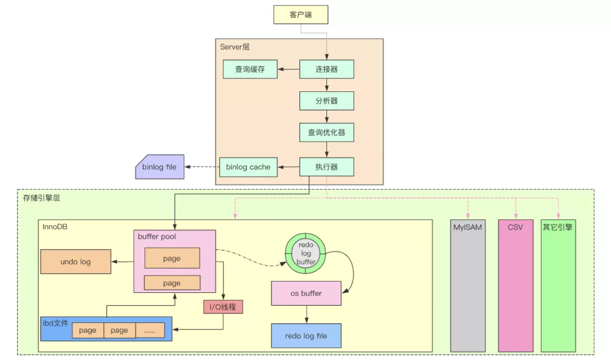
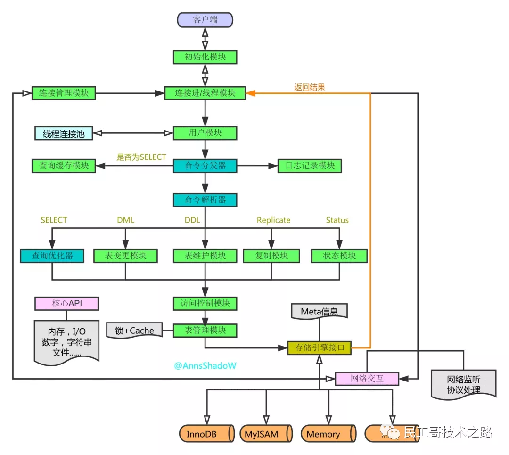
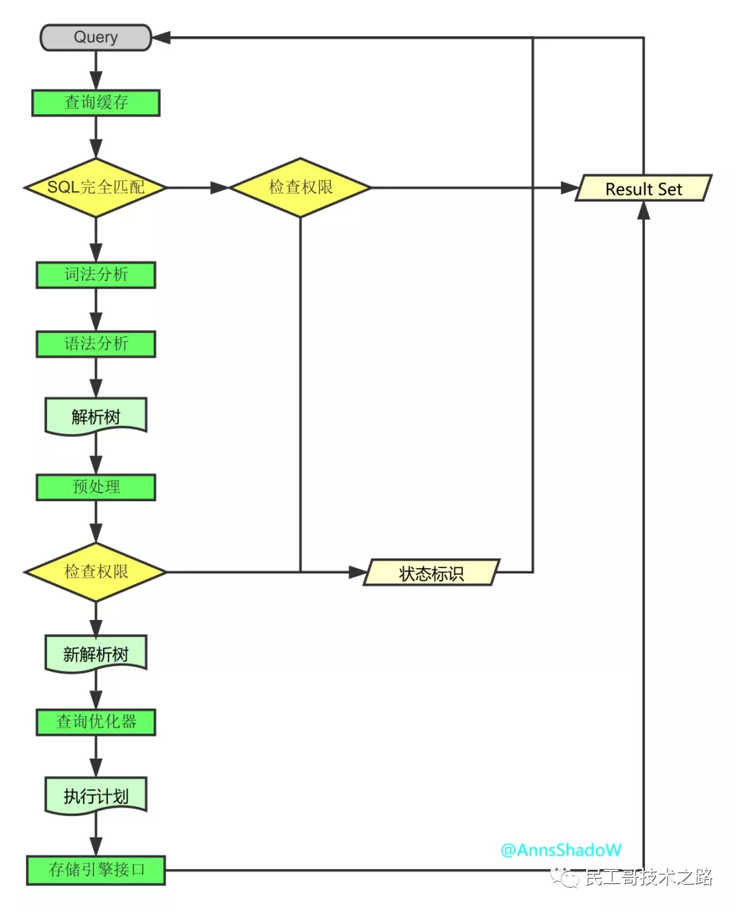
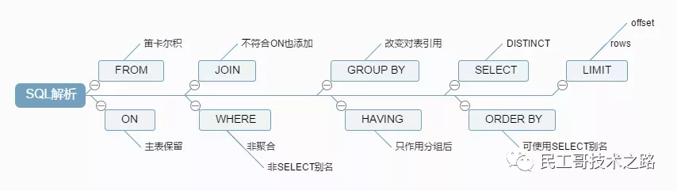

mysql参数
```
默认值:
read_buffer_size 128kb
sort_buffer_size 256kb
innodb_sort_buffer_size 1M
read_rnd_buffer_size 256kb
join_buffer_size 256kb
tmp_table_size 16M
table_open_cache 4000

innodb_buffer_pool_size 128M
key_buffer_size 8M

innodb_page_size 16kb

show global status;
show global variables  like '%query_cache%'; -- global   like '%s%';
SET GLOBAL innodb_buffer_pool_size = 3221225472

8G内存建议配置：

每个链接的：
read_buffer_size 4M
sort_buffer_size 4M
read_rnd_buffer_size 4M # 但MySql会为每个客户连接发放该缓冲空间，所以应尽量适当设置该值，以避免内存开销过大。 

全局的
innodb_buffer_pool_size 4G 改成db服务器总内存的60% 到80%
key_buffer_size 512M

# 5.7 key_buffer_size, innodb_buffer_pool_size, innodb_additional_mem_pool_size（8.0无），innodb_log_buffer_size, query_cache_size （8.0无）

其它
innodb_page_size 16kb
tmp_table_size 512M
table_open_cache 4000
max_allowed_packet = 16M：服务端最大允许接收的数据包大小。在没有调整该配置项的时候，服务端默认是4M。
max_allowed_packet =976kb

innodb_buffer_pool_chunk_size 默认 128MB
innodb_buffer_pool_chunk_size 的最大值估算如下：
MAX(innodb_buffer_pool_chunk_size) = innodb_buffer_pool_size / innodb_buffer_pool_instances
https://dev.mysql.com/doc/refman/5.7/en/innodb-buffer-pool-resize.html
```


## MySQL新增用户及赋予权限

创建用户
```
USE mysql; #创建用户需要操作 mysql 表
# 语法格式为 [@'host']  host 为 'localhost' 表示本地登录用户，host 为 IP地址或 IP 地址区间，表示指定IP地址的主机可登录，host 为 "%"，表示所有主机都可登录，省略代表所有主机
CREATE USER 'username'[@'host'] IDENTIFIED BY 'password';
# eg. 常见 local_user 用户可以在所有主机登录，密码为 123456
CREATE USER 'local_user' IDENTIFIED BY '123456';
# eg. 创建 local_user 只允许在本地登录
CREATE USER 'local_user'@'localhost' IDENTIFIED BY '123456';
```
查看用户权限
```
# 可以通过查询 user 表获取 语法格式为
SELECT  privileges|* FROM user WHERE `user` = 'username';
# eg. 查看 local_user 的权限
SELECT * FROM user WHERE `user` = 'local_user';
# 也可以用 SHOW GRANTS 查看
SHOW GRANTS FOR 'username' [@host];
# eg.
SHOW GRANTS FOR local_user;
```
赋予用户权限
```
# 语法格式
GRANT privileges ON database.table TO 'username'@'host' [IDENTIFIED BY 'password'];
# eg. 赋予 local_user 在所有主机的所有权限，但不包含给其他账号赋予权限的权限
GRANT all ON *.* TO 'local_user'@'%';
# 刷新权限 权限更新后刷新才会起作用
FLUSH PRIVILEGES;
```

- GRANT命令说明：
    - priveleges (权限列表),可以是all, 表示所有权限，也可以是select,update等权限，多个权限的名词,相互之间用逗号分开。
    - ON 用来指定权限针对哪些库和表。格式为数据库 .表名 ，点号前面用来指定数据库名，点号后面用来指定表名，*.* 表示所有数据库所有表。
    - TO 表示将权限赋予某个用户, 格式为username@host，@前面为用户名，@后面接限制的主机，可以是IP、IP段、域名以及%，%表示任何地方。注意：这里%有的版本不包括本地，以前碰到过给某个用户设置了%允许任何地方登录，但是在本地登录不了，这个和版本有关系，遇到这个问题再加一个localhost的用户就可以了。
    - IDENTIFIED BY 指定用户的登录密码,该项可以省略(某些版本下回报错，必须省略)。
    - WITH GRANT OPTION 这个选项表示该用户可以将自己拥有的权限授权给别人。注意：经常有人在创建操作用户的时候不指定WITH GRANT OPTION选项导致后来该用户不能使用GRANT命令创建用户或者给其它用户授权。
    备注：可以使用GRANT重复给用户添加权限，权限叠加，比如你先给用户添加一个select权限，然后又给用户添加一个insert权限，那么该用户就同时拥有了select和insert权限。
- 授权原则说明：
    - 只授予能满足需要的最小权限，防止用户干坏事。比如用户只是需要查询，那就只给select权限就可以了，不要给用户赋予update、insert或者delete权限。
    - 创建用户的时候限制用户的登录主机，一般是限制成指定IP或者内网IP段。
    - 初始化数据库的时候删除没有密码的用户。安装完数据库的时候会自动创建一些用户，这些用户默认没有密码。
    - 为每个用户设置满足密码复杂度的密码。
    - 定期清理不需要的用户。回收权限或者删除用户。

收回用户权限
```
# 语法格式
REVOKE privileges ON database.table FROM 'username'@'host';
# eg. 收回 local_user 的写入和更新权限
REVOKE insert,update ON *.* FROM 'local_user'@'%';
```
删除用户
```
# 语法格式
DROP USER 'username'@'host';
# eg. 删除本地用户 local_user
DROP USER 'local_user'@'localhost';
```

# MySQL 架构总览->查询执行流程->SQL 解析顺序
## MySQL 架构总览



从上图中我们可以看到，整个架构分为两层，上层是 MySQLD 的被称为的‘SQL Layer’，下层是各种各样对上提供接口的存储引擎，被称为‘Storage Engine Layer’。

## 查询执行流程
### 连接
- 客户端发起一条 Query 请求，监听客户端的‘连接管理模块’接收请求；
- 将请求转发到‘连接进/线程模块’；
- 调用‘用户模块’来进行授权检查；
- 通过检查后，‘连接进/线程模块’从‘线程连接池’中取出空闲的被缓存的连接线程和客户端请求对接，如果失败则创建一个新的连接请求。
### 处理
- 先查询缓存，检查 Query 语句是否完全匹配，接着再检查是否具有权限，都成功则直接取数据返回；
- 上一步有失败则转交给‘命令解析器’，经过词法分析，语法分析后生成解析树；
- 接下来是预处理阶段，处理解析器无法解决的语义，检查权限等，生成新的解析树；
- 再转交给对应的模块处理；
- 如果是 SELECT 查询还会经由‘查询优化器’做大量的优化，生成执行计划；
- 模块收到请求后，通过‘访问控制模块’检查所连接的用户是否有访问目标表和目标字段的权限；
- 有则调用‘表管理模块’，先是查看 table cache 中是否存在，有则直接对应的表和获取锁，否则重新打开表文件；
- 根据表的 meta 数据，获取表的存储引擎类型等信息，通过接口调用对应的存储引擎处理；
- 上述过程中产生数据变化的时候，若打开日志功能，则会记录到相应二进制日志文件中。
### 结果
- Query 请求完成后，将结果集返回给‘连接进/线程模块’；
- 返回的也可以是相应的状态标识，如成功或失败等；
- ‘连接进/线程模块’进行后续的清理工作，并继续等待请求或断开与客户端的连接。



## SQL解析顺序
首先看一下示例语句：
```sql
SELECT DISTINCT
    < select_list >
FROM
    < left_table > < join_type >
JOIN < right_table > ON < join_condition >
WHERE
    < where_condition >
GROUP BY
    < group_by_list >
HAVING
    < having_condition >
ORDER BY
    < order_by_condition >
LIMIT < limit_number >
```
然而它的执行顺序是这样的：
```sql
FROM <left_table>
ON <join_condition>
<join_type> JOIN <right_table>
WHERE <where_condition>
GROUP BY <group_by_list>
HAVING <having_condition>
SELECT 
DISTINCT <select_list>
ORDER BY <order_by_condition>
LIMIT <limit_number>
```
从哪里获取，不断的过滤条件，要选择一样或不一样的，排好序，那才知道要取前几条

### 准备工作
创建测试数据库
```sql
create database testQuery
```
创建测试表
```sql
CREATE TABLE table1
(
    uid VARCHAR(10) NOT NULL,
    name VARCHAR(10) NOT NULL,
    PRIMARY KEY(uid)
)ENGINE=INNODB DEFAULT CHARSET=UTF8;

CREATE TABLE table2
(
    oid INT NOT NULL auto_increment,
    uid VARCHAR(10),
    PRIMARY KEY(oid)
)ENGINE=INNODB DEFAULT CHARSET=UTF8;
```
插入数据
```sql
INSERT INTO table1(uid,name) VALUES('aaa','mike'),('bbb','jack'),('ccc','mike'),('ddd','mike');

INSERT INTO table2(uid) VALUES('aaa'),('aaa'),('bbb'),('bbb'),('bbb'),('ccc'),(NULL);
```
最后想要的结果
```sql
SELECT
    a.uid,
    count(b.oid) AS total
FROM
    table1 AS a
LEFT JOIN table2 AS b ON a.uid = b.uid
WHERE
    a. NAME = 'mike'
GROUP BY
    a.uid
HAVING
    count(b.oid) < 2
ORDER BY
    total DESC
LIMIT 1;
```

### SQL解析
#### FROM
当涉及多个表的时候，左边表的输出会作为右边表的输入，之后会生成一个虚拟表 VT1。

- (1-J1)笛卡尔积
计算两个相关联表的笛卡尔积 (CROSS JOIN) ，生成虚拟表 VT1-J1。
```
mysql> select * from table1,table2;
+-----+------+-----+------+
| uid | name | oid | uid  |
+-----+------+-----+------+
| aaa | mike |   1 | aaa  |
| bbb | jack |   1 | aaa  |
| ccc | mike |   1 | aaa  |
| ddd | mike |   1 | aaa  |
| aaa | mike |   2 | aaa  |
| bbb | jack |   2 | aaa  |
| ccc | mike |   2 | aaa  |
| ddd | mike |   2 | aaa  |
| aaa | mike |   3 | bbb  |
| bbb | jack |   3 | bbb  |
| ccc | mike |   3 | bbb  |
| ddd | mike |   3 | bbb  |
| aaa | mike |   4 | bbb  |
| bbb | jack |   4 | bbb  |
| ccc | mike |   4 | bbb  |
| ddd | mike |   4 | bbb  |
| aaa | mike |   5 | bbb  |
| bbb | jack |   5 | bbb  |
| ccc | mike |   5 | bbb  |
| ddd | mike |   5 | bbb  |
| aaa | mike |   6 | ccc  |
| bbb | jack |   6 | ccc  |
| ccc | mike |   6 | ccc  |
| ddd | mike |   6 | ccc  |
| aaa | mike |   7 | NULL |
| bbb | jack |   7 | NULL |
| ccc | mike |   7 | NULL |
| ddd | mike |   7 | NULL |
+-----+------+-----+------+
28 rows in set (0.00 sec)
```
- (1-J2) ON过滤

基于虚拟表 VT1-J1 这一个虚拟表进行过滤，过滤出所有满足 ON 谓词条件的列，生成虚拟表 VT1-J2。

注意：这里因为语法限制，使用了 'WHERE' 代替，从中读者也可以感受到两者之间微妙的关系。
```
mysql> SELECT
    -> *
    -> FROM
    -> table1,
    -> table2
    -> WHERE
    -> table1.uid = table2.uid
    -> ;
+-----+------+-----+------+
| uid | name | oid | uid  |
+-----+------+-----+------+
| aaa | mike |   1 | aaa  |
| aaa | mike |   2 | aaa  |
| bbb | jack |   3 | bbb  |
| bbb | jack |   4 | bbb  |
| bbb | jack |   5 | bbb  |
| ccc | mike |   6 | ccc  |
+-----+------+-----+------+
6 rows in set (0.00 sec)
```

- (1-J3) 添加外部列

如果使用了外连接 (LEFT,RIGHT,FULL)，主表（保留表）中的不符合ON条件的列也会被加入到 VT1-J2中，作为外部行，生成虚拟表 VT1-J3。

```
mysql> SELECT
    -> *
    -> FROM
    -> table1 AS a
    -> LEFT OUTER JOIN table2 AS b ON a.uid = b.uid;
+-----+------+------+------+
| uid | name | oid  | uid  |
+-----+------+------+------+
| aaa | mike |    1 | aaa  |
| aaa | mike |    2 | aaa  |
| bbb | jack |    3 | bbb  |
| bbb | jack |    4 | bbb  |
| bbb | jack |    5 | bbb  |
| ccc | mike |    6 | ccc  |
| ddd | mike | NULL | NULL |
+-----+------+------+------+
7 rows in set (0.00 sec)
```


#### WHERE
对 VT1 过程中生成的临时表进行过滤，满足 WHERE 子句的列被插入到 VT2 表中。

注意：此时因为分组，不能使用聚合运算；也不能使用 SELECT 中创建的别名；

与 ON 的区别：
- 如果有外部列，ON针对过滤的是关联表，主表（保留表）会返回所有的列；
- 如果没有添加外部列，两者的效果是一样的。

应用：

- 对主表的过滤应该放在 WHERE；
- 对于关联表，先条件查询后连接则用ON，先连接后条件查询则用 WHERE。
```
mysql> SELECT
    -> *
    -> FROM
    -> table1 AS a
    -> LEFT OUTER JOIN table2 AS b ON a.uid = b.uid
    -> WHERE
    -> a. NAME = 'mike';
+-----+------+------+------+
| uid | name | oid  | uid  |
+-----+------+------+------+
| aaa | mike |    1 | aaa  |
| aaa | mike |    2 | aaa  |
| ccc | mike |    6 | ccc  |
| ddd | mike | NULL | NULL |
+-----+------+------+------+
4 rows in set (0.00 sec)
```

#### GROUP BY
这个子句会把 VT2 中生成的表按照 GROUP BY 中的列进行分组，生成 VT3 表。

注意：其后处理过程的语句，如 SELECT、HAVING，所用到的列必须包含在 GROUP BY 中，对于没有出现的，得用聚合函数；

原因：GROUP BY 改变了对表的引用，将其转换为新的引用方式，能够对其进行下一级逻辑操作的列会减少。

我的理解是：根据分组字段，将具有相同分组字段的记录归并成一条记录，因为每一个分组只能返回一条记录，除非是被过滤掉了，而不在分组字段里面的字段可能会有多个值，多个值是无法放进一条记录的，所以必须通过聚合函数将这些具有多值的列转换成单值；

```
mysql> SELECT
    -> *
    -> FROM
    -> table1 AS a
    -> LEFT OUTER JOIN table2 AS b ON a.uid = b.uid
    -> WHERE
    -> a. NAME = 'mike'
    -> GROUP BY
    -> a.uid;
+-----+------+------+------+
| uid | name | oid  | uid  |
+-----+------+------+------+
| aaa | mike |    1 | aaa  |
| ccc | mike |    6 | ccc  |
| ddd | mike | NULL | NULL |
+-----+------+------+------+
3 rows in set (0.00 sec)
```

#### HAVING
这个子句对 VT3 表中的不同的组进行过滤，只作用于分组后的数据，满足 HAVING 条件的子句被加入到 VT4 表中。
```
mysql> SELECT
    -> *
    -> FROM
    -> table1 AS a
    -> LEFT OUTER JOIN table2 AS b ON a.uid = b.uid
    -> WHERE
    -> a. NAME = 'mike'
    -> GROUP BY
    -> a.uid
    -> HAVING
    -> count(b.oid) < 2;
+-----+------+------+------+
| uid | name | oid  | uid  |
+-----+------+------+------+
| ccc | mike |    6 | ccc  |
| ddd | mike | NULL | NULL |
+-----+------+------+------+
2 rows in set (0.00 sec)
```

#### SELECT
这个子句对 SELECT 子句中的元素进行处理，生成 VT5 表。

(5-J1) 计算表达式 计算 SELECT 子句中的表达式，生成 VT5-J1。

(5-J2) DISTINCT

寻找 VT5-1 中的重复列，并删掉，生成 VT5-J2。

如果在查询中指定了 DISTINCT 子句，则会创建一张内存临时表（如果内存放不下，就需要存放在硬盘了）。这张临时表的表结构和上一步产生的虚拟表 VT5 是一样的，不同的是对进行 DISTINCT 操作的列增加了一个唯一索引，以此来除重复数据。
```
mysql> SELECT
    -> a.uid,
    -> count(b.oid) AS total
    -> FROM
    -> table1 AS a
    -> LEFT OUTER JOIN table2 AS b ON a.uid = b.uid
    -> WHERE
    -> a. NAME = 'mike'
    -> GROUP BY
    -> a.uid
    -> HAVING
    -> count(b.oid) < 2;
+-----+-------+
| uid | total |
+-----+-------+
| ccc |     1 |
| ddd |     0 |
+-----+-------+
2 rows in set (0.00 sec)
```
#### ORDER BY
从 VT5-J2 中的表中，根据 ORDER BY 子句的条件对结果进行排序，生成 VT6 表。

注意：唯一可使用 SELECT 中别名的地方。
```
mysql> SELECT
    -> a.uid,
    -> count(b.oid) AS total
    -> FROM
    -> table1 AS a
    -> LEFT OUTER JOIN table2 AS b ON a.uid = b.uid
    -> WHERE
    -> a. NAME = 'mike'
    -> GROUP BY
    -> a.uid
    -> HAVING
    -> count(b.oid) < 2
    -> ORDER BY
    -> total DESC;
+-----+-------+
| uid | total |
+-----+-------+
| ccc |     1 |
| ddd |     0 |
+-----+-------+
2 rows in set (0.00 sec)
```
#### LIMIT
LIMIT 子句从上一步得到的 VT6 虚拟表中选出从指定位置开始的指定行数据。

注意：

- offset 和 rows 的正负带来的影响；
- 当偏移量很大时效率是很低的，可以这么做；
- 采用子查询的方式优化，在子查询里先从索引获取到最大 id，然后倒序排，再取 N 行结果集；
- 采用 INNER JOIN 优化，JOIN 子句里也优先从索引获取 ID 列表，然后直接关联查询获得最终结果。

```
mysql> SELECT
    -> a.uid,
    -> count(b.oid) AS total
    -> FROM
    -> table1 AS a
    -> LEFT JOIN table2 AS b ON a.uid = b.uid
    -> WHERE
    -> a. NAME = 'mike'
    -> GROUP BY
    -> a.uid
    -> HAVING
    -> count(b.oid) < 2
    -> ORDER BY
    -> total DESC
    -> LIMIT 1;
+-----+-------+
| uid | total |
+-----+-------+
| ccc |     1 |
+-----+-------+
1 row in set (0.00 sec)
```
## 总结
