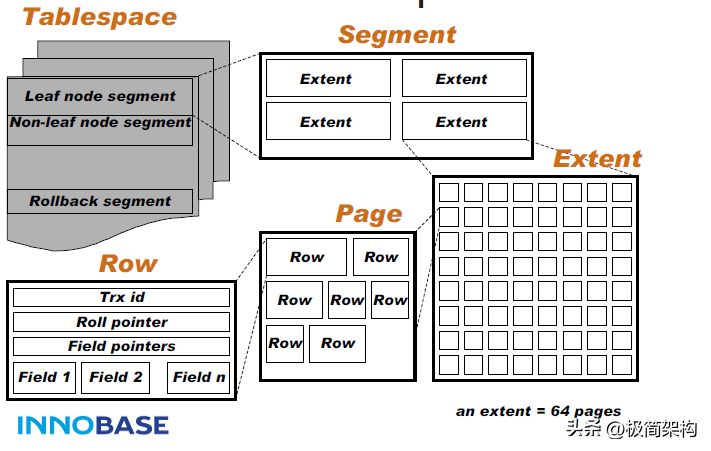

## 磁盘预读
为了提高效率，尽量减少磁盘I/O。为了达到这个目的，磁盘往往不是严格按需读取，而是每次都会预读，即使只需要一个字节，磁盘也会从这个位置开始，顺序向后读取一定长度的数据放入内存。预读可以提高I/O效率。预读的长度一般为页（page:计算机管理存储器的逻辑块-通常为4k）的整倍数. 主存和磁盘以页为单位交换数据。当程序要读取的数据不在主存中时，会触发一个缺页异常，此时系统会向磁盘发出读盘信号，磁盘会找到数据的起始位置并向后连续读取一页或几页载入内存中。

结合操作系统存储结构优化处理： mysql巧妙运用操作系统存储结构(一个节点分配到一个存储页中->尽量减少IO次数) & 磁盘预读(缓存预读->加速预读马上要用到的数据).
Mysql设计利用了磁盘预读原理，将一个B+Tree节点大小设为一个页大小，在新建节点时直接申请一个页的空间，这样就能保证一个节点物理上存储在一个页里，加之计算机存储分配都是按页对齐的，这样就实现了每个Node节点只需要一次I/O操作。

## 表空间Tablespace
[MySQL的表空间是什么](https://www.cnblogs.com/better-farther-world2099/articles/14713523.html)

InnoDB以表空间Tablespace(idb文件)结构进行组织，每个Tablespace 包含多个Segment段，每个段(分为2种段：叶子节点Segment&非叶子节点Segment), 一个Segment段包含多个Extent，一个Extent占用1M空间包含64个Page（每个Page 16k），InnoDB B-Tree 一个逻辑节点就分配一个物理Page,一个节点一次IO操作。,一个Page里包含很多有序数据Row行数据，Row行数据中包含Filed属性数据等信息。

## B+ Tree
[图解算法](https://www.cs.usfca.edu/~galles/visualization/Algorithms.html)

int 类型所占的内存时 4Byte（字节），指针的存储就给个 6Byte，一共就是 10Tybe，那么第一层节点就可以存储 16*1000/10=1600。
同理第二层每个节点也是可以存储 1600 个 key。
第三层是叶子节点，每个磁盘存储大小同样安装 BTree 的计算一样，每条数据占 1kb。
那么在 B+Tree 中三层可以存储的数据就是 1600*1600*16=40960000。