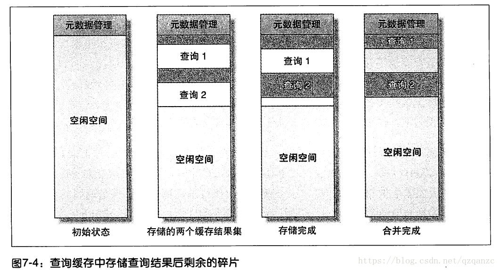
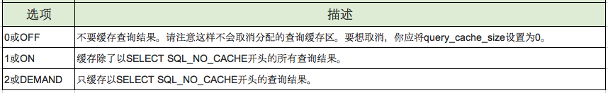
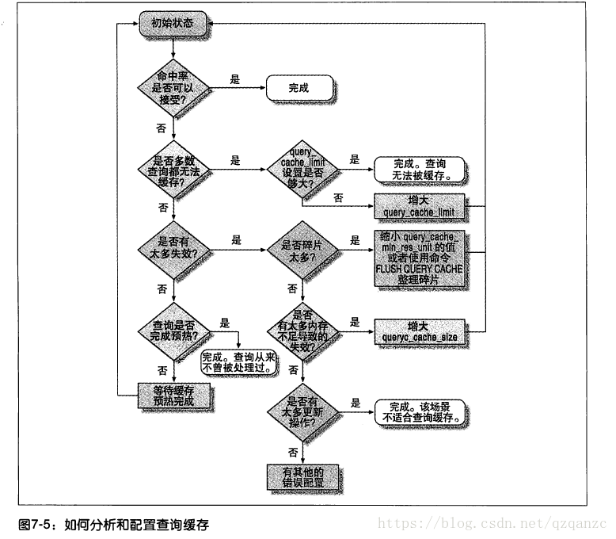
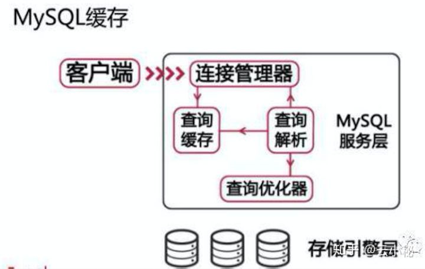

<!--toc-->
[TOC]
# Mysql缓存

## key cache
`show variables like '%key_cache%';`
## query cache
`show variables like '%query_cache%';`

```
mysql> show variables like '%query_cache%';
+------------------------------+---------+
| Variable_name                | Value   |
+------------------------------+---------+
| have_query_cache             | YES     |      --查询缓存是否可用
| query_cache_limit            | 1048576 |      --可缓存具体查询结果的最大值
| query_cache_min_res_unit     | 4096    |      --查询缓存分配的最小块的大小(字节)
| query_cache_size             | 1048576 |      --查询缓存的大小
| query_cache_type             | OFF     |      --是否支持查询缓存
| query_cache_wlock_invalidate | OFF     |      --控制当有写锁加在表上的时候，是否先让该表相关的 Query Cache失效
+------------------------------+---------+
6 rows in set (0.02 sec)
```

### mysql 查询缓存概述
在mysql的性能优化方面经常涉及到缓冲区（buffer）和缓存（cache），mysql通过在内存中建立缓冲区（buffer）和缓冲（cache）来提高mysql性能。对于innodb数据库，mysql采用缓冲池（buffer pool）的方式来缓存数据和索引；对于mylsam数据库，mysql采用缓存的方式来缓存数据和索引。

Mysql查询缓存机制（query cache）简单的说就是缓存sql语句及查询结果，如果运行相同的sql，服务器直接从缓存中提取结果，而不是再去解析和执行sql。而且这些缓存能被所有的会话共享，一旦某个客户端建立了查询缓存，其他发送同样sql语句的客户端也可以使用这些缓存。

如果表更改了，那么使用这个表的所有缓存查询将不再有效，查询缓存值得相关条目被清空。更改的是表中任何数据或是结构的改变，包括insert、update、delete、truncate、alter table、drop table或drop database等，也包括哪些映射到改变了表的使用merge表的查询。显然，这对于频繁更改的表，查询缓存是不合适的，而对于一些不常改变的数据且有大量相同sql查询的表，查询缓存会节约很大的性能。

查询必须是完全相同的（逐字节相同）才能够被认为是相同的，字符的大小也被认为是不同的。另外，同样的查询字符由于其他原因可能认为是不同的。使用不同的数据库，不同的协议版本或者不同默认字符字符集的查询被认为是不同的查询并且分别进行缓存。

### mysql 缓存机制

mysql缓存机制就是缓存sql 文本及缓存结果，用KV形式保存再服务器内存中，如果运行相同的sql,服务器直接从缓存中去获取结果，不需要在再去解析、优化、执行sql。 
如果这个表修改了，那么使用这个表中的所有缓存将不再有效，查询缓存值得相关条目将被清空。
表中得任何改变是值表中任何数据或者是结构的改变，包括insert,update,delete,truncate,alter table,drop table或者是drop database 包括那些映射到改变了的表的使用merge表的查询，显然，者对于频繁更新的表，查询缓存不合适，对于一些不变的数据且有大量相同sql查询的表，查询缓存会节省很大的性能。

> mysql Query Cache 默认为打开。从某种程度可以提高查询的效果，但是未必是最优的解决方案，如果有的大量的修改和查询时，由于修改造的cache失效，会给服务器造成很大的开销，可以通过query_cache_type【0(OFF)  1(ON)  2(DEMAND)】来控制缓存的开关.

#### 命中条件

缓存存在一个hash表中，通过查询SQL，查询数据库，客户端协议等作为key,在判断命中前，mysql不会解析SQL，而是使用SQL去查询缓存，SQL上的任何字符的不同，如空格，注释，都会导致缓存不命中。
如果查询有不确定的数据like now(),current_date()，那么查询完成后结果者不会被缓存，包含不确定的数的是不会放置到缓存中。

> 需要注意的是mysql query cache 是对大小写敏感的，因为Query Cache 在内存中是以 HASH 结构来进行映射，HASH 算法基础就是组成 SQL 语句的字符，所以 任何sql语句的改变重新cache,这也是项目开发中要建立sql语句书写规范的原因吧

##### 何时cache

- mysql query cache内容为 select 的结果集, cache 使用完整的 sql 字符串做 key, 并区分大小写，空格等。即两个sql必须完全一致才会导致cache命中。
- prepared statement永远不会cache到结果，即使参数完全一样。在 5.1 之后会得到改善。
- where条件中如包含了某些函数永远不会被cache, 比如current_date, now等。
- date 之类的函数如果返回是以小时或天级别的，最好先算出来再传进去。
    `select * from foo where date1=current_date -- 不会被 cache`
    `select * from foo where date1='2008-12-30' -- 被cache, 正确的做法`
- 太大的result set不会被cache (< query_cache_limit)
- MySQL缓存在分库分表环境下是不起作用的
- 执行SQL里有触发器,自定义函数时，MySQL缓存也是不起作用的

#### 工作流程

1. 服务器接收SQL，以SQL和一些其他条件为key查找缓存表
2. 如果找到了缓存，则直接返回缓存
3. 如果没有找到缓存，则执行SQL查询，包括原来的SQL解析，优化等。
4. 执行完SQL查询结果以后，将SQL查询结果缓存入缓存表

#### 缓存失败

当某个表正在写入数据，则这个表的缓存（命中缓存，缓存写入等）将会处于失效状态，在Innodb中，如果某个事务修改了这张表，则这个表的缓存在事务提交前都会处于失效状态，在这个事务提交前，这个表的相关查询都无法被缓存。

##### 何时更新
- 一旦表数据进行任何一行的修改，基于该表相关cache立即全部失效。
- 为什么不做聪明一点判断修改的是否cache的内容？因为分析cache内容太复杂，服务器需要追求最大的性能。

#### 缓存的内存管理
缓存会在内存中开辟一块内存（query_cache_size）来维护缓存数据，其中大概有40K的空间是用来维护缓存数据的元数据的，例如空间内存，例如空间内存，数据表和查询结果映射，SQL和查询结果映射的。
mysql将这个大内存块分为小内存块（query_cache_min_res_unit),每个小块中存储自身的类型、大小和查询结果数据，还有前后内存块的指针。
mysql需要设置单个小存储块大小，在SQL查询开始（还未得到结果）时就去申请一块内存空间，所以即使你的缓存数据没有达到这个大小也需要这个大小的数据块去保存（like linux filesystem’s block)。如果超出这个内存块的大小，则需要再申请一个内存块。当查询完成发现申请的内存有富余，则会将富余的内存空间是放点，这就会造成内存碎片的问题，见下图



#### 缓存的使用时机
**衡量打开缓存是否对系统有性能提升是一个很难的话题**
1. 通过缓存命中率判断, 缓存命中率 = 缓存命中次数 (Qcache_hits) / 查询次数 (Com_select)
2. 通过缓存写入率, 写入率 = 缓存写入次数 (Qcache_inserts) / 查询次数 (Qcache_inserts)
3. 通过 命中-写入率 判断, 比率 = 命中次数 (Qcache_hits) / 写入次数 (Qcache_inserts), 高性能MySQL中称之为比较能反映性能提升的指数,一般来说达到3:1则算是查询缓存有效,而最好能够达到10:1

##### 性能
- ache 未必所有场合总是会改善性能
    - 当有大量的查询和大量的修改时，cache机制可能会造成性能下降。因为每次修改会导致系统去做cache失效操作，造成不小开销。
    - 另外系统cache的访问由一个单一的全局锁来控制，这时候大量>的查询将被阻塞，直至锁释放。所以不要简单认为设置cache必定会带来性能提升。

- 大result set不会被cache的开销

    - **太大的result set不会被cache, 但mysql预先不知道result set的长度，所以只能等到reset set在cache添加到临界值 query_cache_limit 之后才会简单的把这个cache 丢弃。这并不是一个高效的操作**。如果mysql status中Qcache_not_cached太大的话, 则可对潜在的大结果集的sql显式添加 SQL_NO_CACHE 的控制。
    - query_cache_min_res_unit = (query_cache_size – Qcache_free_memory) / Qcache_queries_in_cache


#### 缓存参数配置
- have_query_cache: 该MySQL Server是否支持Query Cache。
- query_cache_type: 是否打开缓存
    可选项
    1) OFF: 关闭
    2) ON: 总是打开
    3) DEMAND: 只有明确写了SQL_CACHE的查询才会吸入缓存



- query_cache_size: 
    - 缓存使用的总内存空间大小,单位是字节,这个值必须是1024的整数倍,否则MySQL实际分配可能跟这个数值不同(感觉这个应该跟文件系统的blcok大小有关)
    - 为缓存查询结果分配的内存的数量，单位是字节，且数值必须是1024的整数倍。默认值是1048576(1MB),为0的话，即禁用查询缓存。请注意如果设置了该值，即使query_cache_type设置为0也将分配此数量的内存。

- query_cache_min_res_unit: 
    - 分配内存块时的最小单位大小
    - 查询缓存分配的最小块的大小(字节)。 默认值是4096(4KB)。
    当查询进行的时候，MySQL把查询结果保存在qurey cache中，但如果要保存的结果比较大，超过query_cache_min_res_unit的值 ，这时候mysql将一边检索结果，一边进行保存结果，所以，有时候并不是把所有结果全部得到后再进行一次性保存，而是每次分配一块query_cache_min_res_unit大小的内存空间保存结果集，使用完后，接着再分配一个这样的块，如果还不不够，接着再分配一个块，依此类推，也就是说，有可能在一次查询中，mysql要进行多次内存分配的操作。
    适当的调节query_cache_min_res_unit可以优化内存如果你的查询结果都是一些small result,默认的query_cache_min_res_unit可能会造成大量的内存碎片如果你的查询结果都是一些larger resule，你可以适当的把query_cache_min_res_unit调大

- query_cache_limit: 
    - MySQL能够缓存的最大结果,如果超出,则增加 Qcache_not_cached的值,并删除查询结果
    - MySQL能够缓存的最大查询结果，查询结果大于该值时不会被缓存。默认值是1048576(1MB)如果某个查询的结果超出了这个值，Qcache_not_cached的值会加1，如果某个操作总是超出，可以考虑在SQL中加上SQL_NO_CACHE来避免额外的消耗。

- query_cache_wlock_invalidate: 
    - 如果某个数据表被锁住,是否仍然从缓存中返回数据,默认是OFF,表示仍然可以返回
    - 如果某个表被锁住，是否返回缓存中的数据，默认关闭，也是建议的。一般情况，当客户端对MyISAM表进行WRITE锁定时，如果查询结果位于查询缓存中，则其它客户端未被锁定，可以对该表进行查询。将该变量设置为1，则可以对表进行WRITE锁定，使查询缓存内所有对该表进行的查询变得非法。这样当锁定生效时，可以强制其它试图访问表的客户端来等待。

GLOBAL STAUS 中 关于 缓存的参数解释:
Qcache_free_blocks: 缓存池中空闲块的个数
Qcache_free_memory: 缓存中空闲内存量
Qcache_hits: 缓存命中次数
Qcache_inserts: 缓存写入次数
Qcache_lowmen_prunes: 因内存不足删除缓存次数
Qcache_not_cached: 查询未被缓存次数,例如查询结果超出缓存块大小,查询中包含可变函数等
Qcache_queries_in_cache: 当前缓存中缓存的SQL数量
Qcache_total_blocks: 缓存总block数

#### 减少碎片策略

- 选择合适的block大小
- 使用 FLUSH QUERY CACHE 命令整理碎片.这个命令在整理缓存期间,会导致其他连接无法使用查询缓存
PS: 清空缓存的命令式 RESET QUERY CACHE


如上图所示， 没有什么办法能够完全避免碎片，但是选择合适的query_cache_min_res_unit可以帮你减少由碎片导致的内存空间浪费。这个值太小，则浪费的空间更少，但是会导致频繁的内存块申请操作；如果设置得太大，那么碎片会很多。调整合适的值其实是在平衡内存浪费和CPU消耗。可以通过内存实际消耗（query_cache_size - Qcache_free_memory）除以Qcache_queries_in_cahce计算单个查询的平均缓存大小。可以通过Qcahce_free_blocks来观察碎片。

通过FLUSH_QUERY_CAHCE完成碎片整理，这个命令将所有的查询缓存重新排序，并将所有的空闲空间都聚焦到查询缓存的一块区域上。


##### 手动清理缓存
- FLUSH QUERY CACHE； #清理查询缓存内存碎片
- RESET QUERY CACHE；#从查询缓存中移除所有查询
- FLUSH TABLES； #关闭所有打开的表，同时该操作会清空查询缓存中的内容

#### InnoDB与查询缓存

Innodb会对每个表设置一个事务计数器,里面存储当前最大的事务ID.当一个事务提交时,InnoDB会使用MVCC中系统事务ID最大的事务ID跟新当前表的计数器.
只有比这个最大ID大的事务能使用查询缓存,其他比这个ID小的事务则不能使用查询缓存.
另外,在InnoDB中,所有有加锁操作的事务都不使用任何查询缓存
查询必须是完全相同的(逐字节相同)才能够被认为是相同的。另外，同样的查询字符串由于其它原因可能认为是不同的。使用不同的数据库、不同的协议版本或者不同 默认字符集的查询被认为是不同的查询并且分别进行缓存。


#### Query Cache对性能的影响
##### Query Cache的额外开销

如上图所示: 在MySQL Server中打开Query Cache对数据库的读和写都会带来额外的消耗:

1) 读查询开始之前必须检查是否命中缓存。
2) 如果读查询可以缓存，那么执行完查询操作后，会查询结果和查询语句写入缓存。
3) 当向某个表写入数据的时候，必须将这个表所有的缓存设置为失效，如果缓存空间很大，则消耗也会很大，可能使系统僵死一段时间，因为这个操作是靠全局锁操作来保护的。
4) 对InnoDB表，当修改一个表时，设置了缓存失效，但是多版本特性会暂时将这修改对其他事务屏蔽，在这个事务提交之前，所有查询都无法使用缓存，直到这个事务被提交，所以长时间的事务，会大大降低查询缓存的命中
##### MySQL Query Cache碎片优化

详情查看[减少碎片策略](#减少碎片策略)

##### MySQL缓存状态查看
```
mysql> SHOW STATUS LIKE 'Qcache%';
+-------------------------+--------+
| Variable_name           | Value  |
+-------------------------+--------+
| Qcache_free_blocks      | 1      | ----在查询缓存中的闲置块，如果该值比较大，则说明Query Cache中的内存碎片可能比较多。FLUSH QUERY CACHE会对缓存中的碎片进行整理，从而得到一个较大的空闲内存块。
| Qcache_free_memory      | 382704 | ----剩余缓存的大小
| Qcache_hits             | 198    | ----缓存命中次数
| Qcache_inserts          | 131    | ----缓存被插入的次数，也就是查询没有命中的次数。
| Qcache_lowmem_prunes    | 0      | ----由于内存低而被删除掉的缓存条数，如果这个数值在不断增长，那么一般是Query Cache的空闲内存不足（通过Qcache_free_memory判断），或者内存碎片较严重（通过Qcache_free_blocks判断）。
| Qcache_not_cached       | 169    | ----没有被缓存的条数，有三种情况会导致查询结果不会被缓存：其一，由于query_cache_type的设置；其二，查询不是SELECT语句；其三，使用了now()之类的函数，导致查询语句一直在变化。
| Qcache_queries_in_cache | 128    | ----缓存中有多少条查询语句
| Qcache_total_blocks     | 281    | ----总块数
+-------------------------+--------+
8 rows in set (0.00 sec)
```

Qcache_free_blocks：目前还处于空闲状态的 Query Cache 中内存 Block 数目
Qcache_free_memory：目前还处于空闲状态的 Query Cache 内存总量
Qcache_hits：Query Cache 命中次数
Qcache_inserts：向 Query Cache 中插入新的 Query Cache 的次数，也就是没有命中的次数
Qcache_lowmem_prunes：当 Query Cache 内存容量不够，需要从中删除老的 Query Cache 以给新的 Cache 对象使用的次数
Qcache_not_cached：没有被 Cache 的 SQL 数，包括无法被 Cache 的 SQL 以及由于 query_cache_type 设置的不会被 Cache 的 SQL
Qcache_queries_in_cache：目前在 Query Cache 中的 SQL 数量
Qcache_total_blocks：Query Cache 中总的 Block 数量  

- Query Cache碎片率
Query Cache碎片率 = Qcache_free_blocks / Qcache_total_blocks * 100%
如果Query Cache碎片率超过20%，则可以用FLUSH QUERY CACHE整理内存碎片；如果你的查询都是小数据量的话，可以尝试减小query_cache_min_res_unit。

- Query Cache利用率
Query Cache利用率 = (query_cache_size - Qcache_free_memory) / query_cache_size * 100%
Query Cache利用率在25%以下的话，说明query_cache_size设置的过大，可适当减小；Query Cache利用率在80%以上，而且Qcache_lowmem_prunes > 50的话，说明query_cache_size可能有点小，或者就是内存碎片太多。

- Query Cache命中率
    - 可缓存查询的Query Cache命中率 = Qcache_hits / (Qcache_hits + Qcache_inserts) * 100%
    - 涵盖所有查询的Query Cache命中率 = Qcache_hits / (Qcache_hits + Com_select) * 100%
若命中率在50-70%的范围之内，则表明Query Cache的缓存效率较高。如果命中率明显小于50%，那么建议禁用（将query_cache_type设置为0(OFF)）或按需使用（将query_cache_type设置为2(DEMAND)）Query Cache，节省的内存可以用作InnoDB的缓冲池。

**如何判断Query Cache是空闲内存不足，还是内存碎片太多?**
如果Qcache_lowmem_prunes值比较大，表示Query Cache的内存空间大小设置太小，需要增大。

如果Qcache_free_blocks值比较大，表示内存碎片较多，需要使用FLUSH QUERY CACHE语句清理内存碎片。

**系统变量query_cache_min_res_unit应当设置为多大？**
query_cache_min_res_unit的计算公式如下所示：

query_cache_min_res_unit = (query_cache_size - Qcache_free_memory) / Qcache_queries_in_cache

其中，一般不建议将Query Cache的大小（也就是query_cache_size系统变量）设置超过256MB。


##### Query Cache缺点

- 查询语句的hash计算和hash查找带来的资源消耗。如果将query_cache_type设置为1（也就是ON），那么MySQL会对每条接收到的SELECT类型的查询进行hash计算，然后查找这个查询的缓存结果是否存在。虽然hash计算和查找的效率已经足够高了，一条查询语句所带来的开销可以忽略，但一旦涉及到高并发，有成千上万条查询语句时，hash计算和查找所带来的开销就必须重视了。
- Query Cache的失效问题。如果表的变更比较频繁，则会造成Query Cache的失效率非常高。表的变更不仅仅指表中的数据发生变化，还包括表结构或者索引的任何变化。
- 查询语句不同，但查询结果相同的查询都会被缓存，这样便会造成内存资源的过度消耗。查询语句的字符大小写、空格或者注释的不同，Query Cache都会认为是不同的查询（因为他们的hash值会不同）。
- 相关系统变量设置不合理会造成大量的内存碎片，这样便会导致Query Cache频繁清理内存。

> 如果经常有更新的系统，想要获得较高tps的话，建议一开始就关闭Query Cache

#### Mysql缓存的配置和使用

```
开启缓存
mysql> set global query_cache_size = 600000; --设置缓存内存大小
mysql> set global query_cache_type = ON;     --开启查询缓存

关闭缓存
mysql> set global query_cache_size = 0; --设置缓存内存大小为0， 即初始化是不分配缓存内存
mysql> set global query_cache_type = OFF;     --关闭查询缓存

# set global时需要有SUPER权限


也可以修改配置文件，设置query_cache_type和query_cache _size，以及query_cache_min_res_unit（可以采用默认值）

query_cache_type 0 代表不使用缓冲， 1 代表使用缓冲，2 代表根据需要使用。

如果query_cache_type=1，如果不需要缓冲，则query如下
SELECT SQL_NO_CACHE * FROM my_table WHERE ...

如果query_cache_type=2，如果需要缓冲，则query如下
SELECT SQL_CACHE * FROM my_table WHERE ...
```