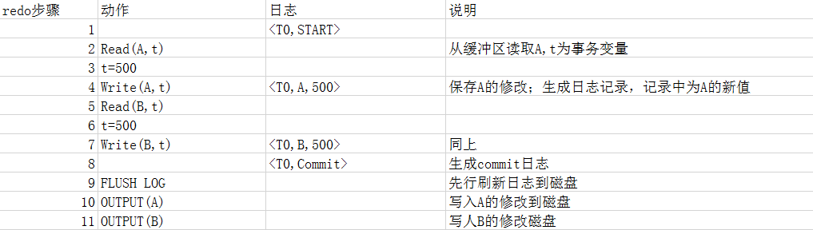
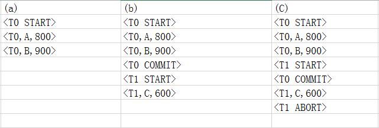
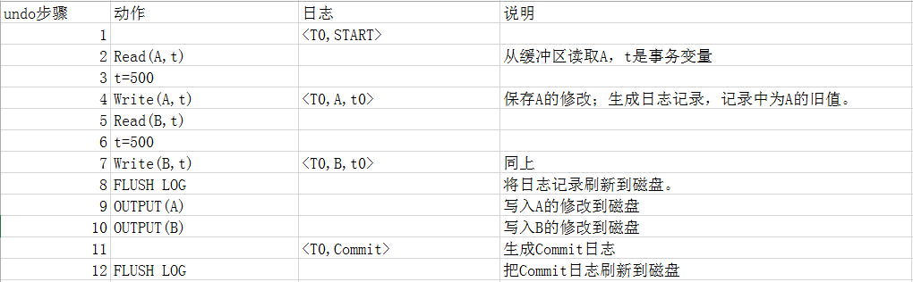
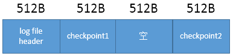
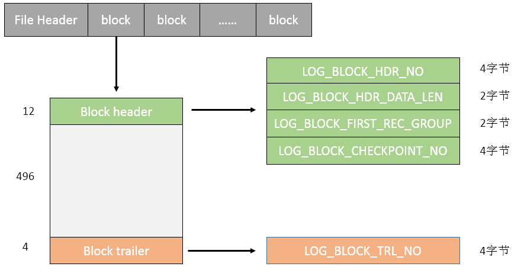
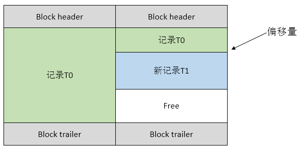
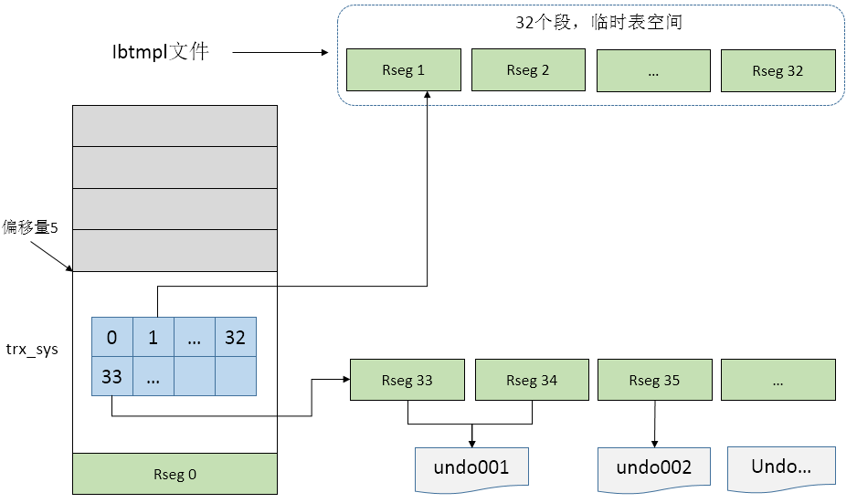
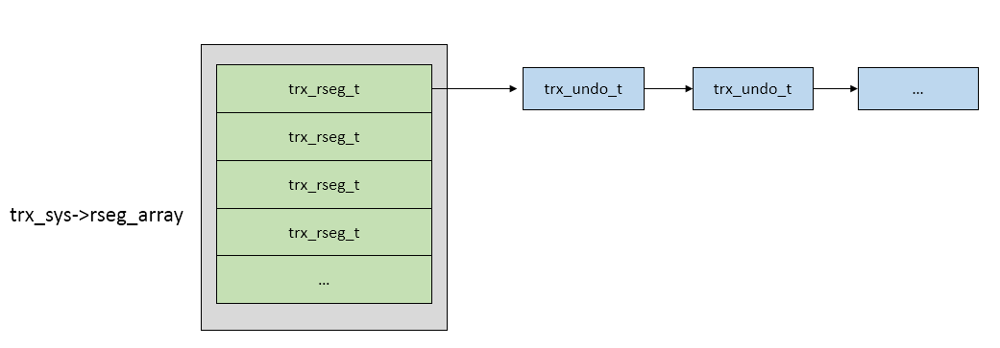
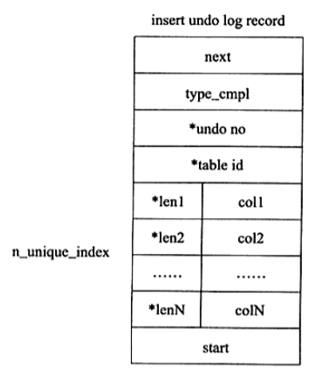
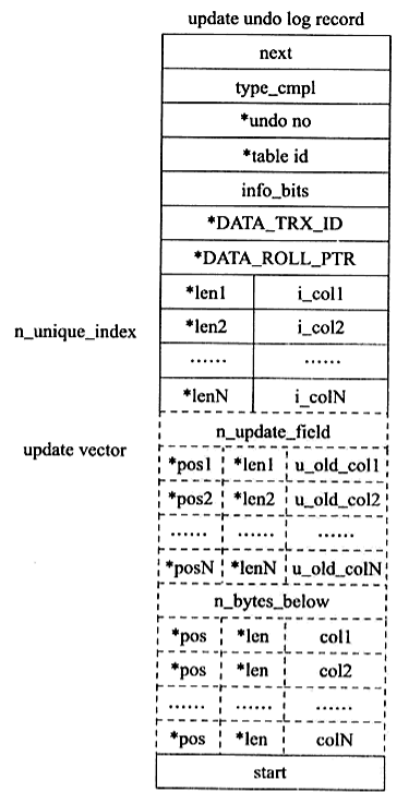

<!-- toc -->
[TOC]

[几年了，作为一个码农终于把MySQL日记看懂了](https://www.toutiao.com/i6885625128105804295/)

# 详解MySQL的Redo日志与Undo日志
## 概念与理解
Redo与undo并非是相互的逆操作，而是能配合起来使用的两种机制。
说是两种机制，其实都是日志记录，不同的是redo记录以顺序附加的形式记录新值，如某条记录<T,X,V>，表示事物T将新值V存储到数据库元素X，新值可以保证重做；
而Undo记录通常以随机操作的形式记录旧值，如某条记录<T1,Y,9>，表示事物T1对Y进行了修改，修改前Y的值是9，旧值能用于撤销，也能供其他事务读取。
Redo用来保证事务的原子性和持久性，Undo能保证事务的一致性，两者也是系统恢复的基础前提。

### 1.1 Redo
一个事务从开始到结束，要么提交完成，要么中止，具有原子性。而反映在redo日志中可能需要若干条记录来保证，如：
```
<T0 start>
<T0,A,500>
<T0,B,500>
<T0 commit>
```

这里的某条redo记录不是事务级别的，一般对应的是事务中的一些关键步骤。如Innodb执行事务时会拆分为很多小事务，每个小事务产生某条redo记录。
而通过几个数据库原语能更一般性的描述redo记录：

Input(X)：将X值从存储介质读入缓冲区
Read(X,t)：将X值从缓冲区读入事务内的变量t，如果缓冲中不存在，则触发Input
Write(X,t): 将事务内的t写入到缓冲区X块，如果缓冲中X不存在，则触发Input(X)，再完成write
Output(X)：将缓冲区X写入到存储中

所以上面的redo记录用原语表示如下：


很明显，现实中的redo日志大多不是这样孤立的，更多的是多个事务交织在一起的，错误也随时能发生，从小到数据格式错误到机房被导弹炸了。
下面通过3个redo日志来讨论：


a. 在日志中只有部分记录，可能事务在执行时系统发生了崩溃，这时需要根据日志重做(以下统一使用术语redo)。
b. 日志中T0已经提交了，必须要对T0 进行redo，而部分T1也需要redo
c. 日志中T0已经提交了，必须要对T0进行redo,而T1虽然abort也需要redo

可能有人有疑惑，commit的事务确实要redo，但进行到一半未提交的事务及后来abort的事务可以不必进行redo。确实，在日志中的每一个事务最终应该或者有一条commit记录，或者有一条abort记录，完全能筛选出目标事务再redo，但这样增加了redo阶段的复杂性，所以是根据日志统一redo，之后的撤销工作交给undo来进行。这也是redo具有事务无关性的一个体现。

### 1.2 Checkpoint
检查点的引入有好几个方面的原因。

原则上，系统恢复时可以通过检查整个日志来完成，但无论redo还是undo，当日志很长时：
1.搜索过程太耗时
除了上面这点，针对redo而言还有：
2.尽管redo是幂等的，大多数需要重做的事务已经把更新写入，对其重做不会有不良后果，但这会使恢复过程变得很长。
针对undo日志：
3.一旦事务commit日志记录写入磁盘，逻辑上而言本事务的undo记录在恢复时已经不需要，在commit时可以删除之前的undo记录。但由于多事务同时执行的原因，有时候不能这样做，尽管本事务已经commit，但其他事务可能在使用undo中的旧值。为此需要checkpoint来处理这些当前活跃的事务。


检查点技术可分为简单检查点与更优化的非静止检查点。在一个简单检查点中有如下过程：
（1）停止接受新的事务
（2）等待当前所有活跃事务完成或中止，并在日志中写入commit或abort记录。
（3）将当前位于内存的日志，将缓冲块刷新到磁盘
（4）写入日志记录<CKPT>，并再次刷新到磁盘
（5）重新开始接受事务
系统恢复时，可以从日志尾端反向搜索，直到找到第一个<CKPT>标志，而没有必要处理<CKPT>之前的记录。


#### 非静止检查点
简单检查点期间需要停止响应，如果当前活跃事务需要很长时间来处理，那系统看起来似乎卡住了。非静止检查点允许进行检查点时接受新事务进入，步骤如下：
（1）写入日志记录<START CKPT(t1,…tn)>，其中t1,…tn是当前活跃的事务
（2）等待t1,…tn所有事务提交或中止，但仍接受新事务的进入
（3）当t1,…tn所有事务都已完成，写入日志记录<END CKPT>

 

当使用非静止检查点技术，恢复时的也是从日志尾向前扫描，可能先遇到<START CKPT>标志，也可能先遇到<END CKPT>标志：
1.先遇到<START CKPT(t1,…tn)>时，说明系统在检查点过程中崩溃，未完成事务包括2部分：(t1,…tn)记录的部分及<START>标志后新进入部分。这部分事务中最早那个事务的开始点就是扫描的截止点，再往前可以不必扫描。

2.先遇到<END CKPT>，说明系统完成了上一个周期的检查点，新的检查点还没开始。需要处理2部分事务：<END CKPT>标志之后到系统崩溃时这段时间内的事务及上一个<START>，<END>区间内新接受的事务。为此扫描到上一个检查点<START CKPT()>就可以截止。

多说一句，很容易发现，非静止检查点是将一个点扩展为一个处理区间了，类似的设计其他技术也有，如JVM的GC处理，从stop the world到安全区的处理[1]。

### 1.3 Undo
Undo是逻辑日志，并不幂等，在撤销时，根据undo记录进行补偿操作。Undo本身也产生redo记录。通过undo日志数据库可以实现MVCC。
Undo保证了事务失败或主动abort时的机能，除此之外，系统崩溃恢复时，也确保数据库状态能恢复到一致。

系统恢复时，undo需要redo的配合来实现，或者说二者是一套机制的两个方面。因为在redo日志有commit或abort记录的事务是无需undo的。
假设以静止的检查点为日志类型，以<CKPT (t0,…,tn)>做检查点，期间不接受新事务进入，整个undo过程可以描述如下：
1.以进行检查点时记录的活跃事务(t0,…,tn)为undo-list
2.在redo阶段，发现一条<T,START>记录，就将T加入到undo-list
3.在redo阶段，发现一条<T,END>或<T,ABORT>记录，就将T从undo-list删除
4.此时undo-list中的事务都是些未提交也没回滚的事务，系统如同普通的事务回滚样进行具体的undo操作
5.当undo-list中发现<T,START>时，说明完成了具体的回滚操作，系统写入一个<T,ABORT>记录，并从undo-list中删除T。
6.直到undo-list为空，撤销阶段完成

undo的原语表示可以如下：


### 1.4 写日志
写日志有2种处理：一是等待一次IO，确实得写入到存储介质。二是先写入到缓冲，在之后的某一时间点统一写入磁盘。

以fsync函数与sync为例：
fsync函数等待磁盘操作结束，然后返回，它能确保数据持久化到存储介质，而不是停留在OS或存储的写缓冲中；
sync则把修改过的块缓冲区排入OS的写队列后就返回。fsync能确保数据写入，同时，这也意味着一次IO及性能消耗。


不同的数据库部件有各自的设计目的，负责不同的命令，Read和Write由事务发起，Input和Output由缓冲区管理器发出。也就是说，日志记录响应的是写入内存的write命令，而不是写入磁盘的output命令，除非显示的控制。
具体的实现上会有很多策略，但应保证一些原则：

针对undo
1.如果事务T改变了数据库元素X，那么必须保证对应的一条undo记录在X的新值写入磁盘之前落盘。
2.如果发生commit，那么该条commit记录写入磁盘前，所有之前的修改能确保先行落盘。

针对redo，有一条先写日志规则（Write-Ahead Logging，WAL）:
1.对数据库元素X的修改被写入磁盘前，一条对应的redo日志保证先行落盘。
2.提交时，修改的数据库元素在写入磁盘前，一条commit记录保证落盘。

注意这里说的数据库元素X，不是事务层面的更新记录集，通常假定是一个最小的原子处理单位，一个磁盘块。当某块在output时，不能有对该块的write。为此在某块输出时可以在块上设置排他锁，这种短期持有的闩锁（latch）与事务并发控制的锁无关，按照非两阶段的方式释放这样的锁对于事务可串行性没有影响。如果数据库元素小于单个块，一个糟糕的情景是不同事务的2个数据元素位于同一块，这时候一个事务对块的写磁盘动作可能导致另一个事务违反写入规则，一个建议是以块作为数据库元素。

在InnoDB的实现中，并不严格按照WAL规则，而是通过一种事务的序列编号LSN保证逻辑上的WAL。下面对InnoDB的一些实现细节尝试分析下。

## MySQL InnoDB中的实现

### 2.1 redo log
每个Innodb存储引擎至少有一个重做日志文件组(group)，每个文件组下至少有2个重做日志文件，如默认的ib_logfile0和ib_logfile1，其默认路径位于引擎的数据目录。 

设置多个日志文件时，其名字以ib_logfile[num]形式命名。多个日志文件循环利用，第一个文件写满时，换到第二个日志文件，最后一个文件写满时，回到第一个文件，组成逻辑上无限大的空间。在Innodb1.2.x前，重做日志文件的总大小不能大于等于4GB，1.2.x版本该限制以扩大到512GB. 

重做日志文件设置的越大，越可以减少checkpoint刷新脏页的频率，这有时候对提升MySQL的性能非常重要，但缺点是增加了恢复时的耗时；如果设置的过小，则可能需要频繁地切换文件，甚至一个事务的日志要多次切换文件，导致性能的抖动。 

Innodb中各种不同的操作有着不同类型的重做日志，类型数量有几十种，但记录条目的基本格式可以如下表示：
 

在存储结构上，redo log文件以block块来组织，每个block大小为512字节。每个文件的开头有一个2k大小的File Header区域用来保存一些控制信息，File Header之后就是连续的block。虽然每个redo log文件在头部划出了File Header区域，但实际存储信息的只有group中第一个redo log文件。
 

当redo log实际由mtr（Mini transaction）产生时，首先位于mtr的cache，之后输出到redo log 缓冲区，再从缓冲区写入到磁盘。Log buffer与文件中的block大小对应，以512字节为单位对齐，一个mtr日志可能不足一个block，也可能跨block。 

#### File Header
File Header位于每个redo log文件的开始，大小为2k，格式如下：
 
log group中的第一个文件实际存储这些信息，其他文件仅保留了空间。在写入日志时，除了完成block部分，还要更新File Header里的信息，这些信息对Innodb引擎的恢复操作非常关键。

#### Block
一个block块有512字节大小，每块中还有块头和块尾，中间是日志本身。其中块头Block Header占有12字节大小，块尾Block Trailer占有4字节大小，中间实际的日志存储容量为496字节(512-12-4)：

 

LOG_BLOCK_HDR_NO
在log buffer内部，可以看成是单位大小是512字节的log block组成的数组，LOG_BLOCK_HDR_NO就用来标记数组中的位置。其根据该块的LSN计算转换而来，递增且循环使用，占有4个字节，第一位用来判断是否flush bit，所以总容量是2G。(LSN在之后一段说明)

LOG_BLOCK_HDR_DATA_LEN
标识写入本block的日志长度，占有2个字节，当写满时用0X200表示，即有512字节。

LOG_BLOCK_FIRST_REC_GROUP
占有2个字节，记录本block中第一个记录的偏移量。如果该值与LOG_BLOCK_HDR_DATA_LEN
相同，说明此block被单一记录占有，不包含新的日志。如果有新日志写入，LOG_BLOCK_FIRST_REC_GROUP就是新日志的位置。

 

LOG_BLOCK_CHECKPOINT_NO
占有4字节，记录该block最后被写入时检查点第4字节值。

LOG_BLOCK_TRL_NO
Block trailer中只由这1个部分组成。记录本block中的checksum值，与LOG_BLOCK_HDR_NO值相同。 

#### LSN
LSN是Log Sequence Number的缩写，占有8字节，单调递增，记录重做日志写入的字节总量，也表示日志序列号。

LSN除了记录在redo日志中，还存于每个页中。页的头部有一个FIL_PAGE_LSN用于记录该页的LSN，反应的是页的当前版本。

LSN同样也用于记录checkpoint的位置。使用SHOW ENGINE INNODB STATUS命令查看LSN情况时，Log sequence number是当前LSN，Log flushed up to 是刷新到重做日志文件的LSN，Last checkpoint at 是刷新到磁盘的LSN。

由于LSN具有单调增长性，如果重做日志中的LSN大于当前页中LSN，说明页是滞后的，如果日志记录的LSN对应的事务已经提交，那么当前页需要重做恢复。
如果页被新事务修改了，页中LSN记录的是新写入的结束点的LSN，大于重做日志中的LSN，那么当前页是新数据，是脏页。
脏页根据提交情况可能需要加入flush list中，此时flush list上的所以脏页也是以LSN排序。

写redo log时是追加写，需要保证写入顺序，或者说应保证LSN的有序。当并发写时可以通过加锁来控制顺序但效率低下，8.0中使用了无锁的方式完成并发写，mtr写时已经提前知道自己在log buffer上的区间位置，不必等待直接写入log buffer就可。这样大的LSN值可能先写到log buffer上，而小的LSN还没写入，即log buffer上有空洞。所以有一个单独的线程log_write，负责不断的扫描log buffer，检测新的连续内容并进行刷新，是真正的写线程。

 

### 2.2 Undo

undo是逻辑日志，在事务回滚时对数据库进行一些补偿性的修改，以使数据在逻辑上回到修改前的样子，它并不幂等。
在Innodb中使用表空间，回滚段，页等多级概念结构实现undo功能，并随版本多次改进，为方便讨论，下面放一张5.7版本的大致结构图，在此基础上进行描述：

 

1. 在undo这部分，MySQL 5.7版本在5.6(InnoDB 1.2)的基础上主要增加有innodb_undo_log_truncate 收缩等功能，但在大致结构方面5.6可以参考上面5.7的图。

2. 在5.5(Innodb1.1)版本之前，只有一个undo回滚段(rollback segment)，支持1024个事务同时在线。

3. 在5.5版中，支持最大128个回滚段，理论上支持128*1024个事务同时在线。

4. 在之前的版本中，回滚段都存储于共享表空间中，一个常见的问题是ibdata膨胀。在5.6版本(Innodb1.2)时，可以对回滚段做更多的设置：
innodb_undo_directory
innodb_undo_logs
innodb_undo_tablespaces
这3个参数分别用来设置
（1）回滚段文件所在位置，这意味着回滚段可以存储到共享表空降值外，能使用独立的表空间。
（2）回滚段的数量，默认是128个。
（3）回滚段文件的数量。如设置为3个，则在上面指定的directory文件生成3个undo为前缀的文件：undo001，undo002，undo003，默认的128个回滚段将被依次平均分配到这3个文件中。具体分配时，总是从第一个space开始轮询，所以如果将回滚段的数量依次递增到128，那所有的段都将落入undo001中。


5. 如上图，共享表空间偏移量为5的页记录有所有回滚段的指向信息，这页的类型为FIL_PAGE_TYPE_SYS（trx_sys）。 0号回滚段被预留在ibdata中，1~32号的32个回滚段是临时表的回滚段，存储于ibtmpl文件，其余从33号开始的回滚段才是可配置的，因此InnoDB实际支出96*1024个普通事务同时在线。

6. 每个回滚段的头部维护着一个段头页，该页中划分了1024个槽位slot（TRX_RSEG_N_SLOTS），每个slot可以对应一个undo log对象，这也是为什么说一个回滚段支持1024个事务。

7. MySQL8.0中，每个Undo tablespace都可以创建128个回滚段，所以总共可以有总共有innodb_rollback_segments * innodb_undo_tablespaces个回滚段。

 

#### 结构体
回滚段的信息以数组的形式存放，数组大小为128，数组位于trx_sys->rseg_array
rseg_array数组中的元素类型是trx_rseg_t，表示一个回滚段。
每个trx_rseg_t中管理着许多trx_undo_t，这些trx_undo_t同时也属于多个链表，不同的链表有着不同的功能，如insert_undo_list或update_undo_list等。

 


#### undo log格式

Innodb中undo log可以分为两种：
inser undo log
update undo log

insert undo log是insert操作中产生的undo log，因为只对本事务可见，该类undo log在事务提交后就可以删除，不需要进行purge操作。格式如下：

 

update undo log是delete和update操作产生的undo log。此类undo log是MVCC的基础，在本事务提交后不能简单的删除，需要放入purge队列purge_sys->purge_queue
等待purge线程进行最后的删除。格式如下：
 

图上可见update undo log的格式比insert undo log复杂，同名的部分功能类似，其中的type_cmpl部分，由于update undo log本身还有分类，所以值可能有：
TRX_UNDO_DEL_MARK_REC，将记录标记为delete
TRX_UNDO_UPD_DEL_REC，将delete的记录标记为not delete
TRX_UNDO_UPD_EXIST_REC，更新未被标记delete的记录

## binlog
### binlog工具

- binlog2sql：Python 编写（执行时需要有 Python2.7、Python3.4+ 的环境），用于生成回滚/前滚 SQL 进行数据恢复/补偿
- MyFlash：C 语言编写（需要动态编译成二级制脚本后执行），用于生成反向 binlog 文件（二进制）进行数据恢复
- my2sql：Go 语言编写（可直接下载 linux 二进制版本执行），除了闪回，还提供了前滚和事务分析的功能，与 binlog2sql、MyFlash 差不多，my2sql 目前也不支持 8.0；闪回功能需要开启 binlog_format=row，binlog_row_image=full；只能闪回 DML 操作，不支持 DDL 的闪回。

#### my2sql限制
- my2sql 是模拟一个从库去在线获取主库 binlog，然后进行解析，因此执行操作的数据库用户需要具有 SELECT，REPLICATION SALVE，REPLICATION CLIENT 的权限。
- 与 binlog2sql、MyFlash 差不多，my2sql 目前也不支持 8.0；闪回功能需要开启 binlog_format=row，binlog_row_image=full；只能闪回 DML 操作，不支持 DDL 的闪回。
- 无法离线解析 binlog（MyFlash 支持）。
- 不能以 GTID 事务为单位进行解析（MyFlash 支持），具体 file+pos 点位需要先通过手工解析 binlog 后确认。
- 闪回/前滚 SQL 中，没有提供具体的 begin/commit 的位置，使用时无法分隔事务，需要人工判断。
- 使用事务分析功能时，只能给出具体的大/长事务发生时间、点位、涉及的对象和操作类型，不能给出具体的 SQL 语句，完整的语句仍然需要去 binlog 中进行查看（需设置 binlog_rows_query_log_events=on）