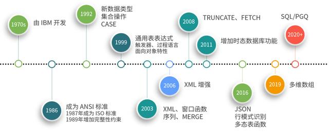

## 什么是SQL？

SQL意为结构化查询语言（Structured Query Language）。SQL用于和数据库交流。它是关系数据库管理系统的标准语言。SQL语句用于执行诸如更新数据库中的数据，或从数据库中检索数据等任务。

## 乘风破浪的 SQL

实际上，2016 年 SQL 标准就已经增加了 JSON 功能的支持，包括：

- JSON 对象的存储与检索；
- 将 JSON 对象表示成 SQL 数据；
- 将 SQL 数据表示成 JSON 对象。

如今，主流的关系数据库也都增加了原生 JSON 数据类型和相关函数的支持，包括 Oracle、MySQL、SQL Server、PostgreSQL 等。

2019 年 9 月 17 图形查询语言（GQL）成为了继 SQL 之后另一种新的 ISO 标准数据库查询语言。与此同时，SQL 标准将会出现一个新的第 16 部分（SQL/PGQ）（Property Graph Query），在 SQL 中直接提供一些 GQL 功能。

随着互联网和大数据等新技术的发展，SQL 早已不仅仅是当年的关系数据库查询语言了；无论是面向对象特性（例如自定义类型）、文档数据（XML、JSON）的存储和处理、时态数据的存储和处理、复杂事件和流数据处理、数据科学中的多维数组以及图形数据库等各种 NoSQL 功能已经或者即将成为 SQL 标准中的一部分，One SQL to Rule Them All！

[原文](https://blog.csdn.net/horses/article/details/107185387)

## SQL发展的简要历史：
1986年，ANSI X3.135-1986，ISO/IEC 9075:1986，SQL-86
1989年，ANSI X3.135-1989，ISO/IEC 9075:1989，SQL-89
1992年，ANSI X3.135-1992，ISO/IEC 9075:1992，SQL-92（SQL2）
1999年，ISO/IEC 9075:1999，SQL:1999（SQL3）
2003年，ISO/IEC 9075:2003，SQL:2003
2008年，ISO/IEC 9075:2008，SQL:2008
2011年，ISO/IEC 9075:2011，SQL:2011

从SQL:1999开始，标准简称中的短横线（-）被换成了冒号（:），而且标准制定的年份也改用四位数字了。前一个修改的原因是ISO标准习惯上采用冒号，ANSI标准则一直采用短横线。后一个修改的原因是标准的命名也遇到了2000年问题。

SQL86大概只有几十页，SQL92正文大约有500页，而SQL99则超过了1000页。可以看出，从SQL99开始，SQL标准的个头就非常庞大了，内容包罗万象，已经没有人能够掌握标准的所有内容了。以SQL:2003为例，它包括以下9个部分（中间编号空缺是曾经被占用，之后被废弃的标准造成的）：

ISO/IEC9075-1: Framework (SQL/Framework)
ISO/IEC 9075-2: Foundation (SQL/Foundation)
ISO/IEC 9075-3: Call Level Interface (SQL/CLI)
ISO/IEC 9075-4: Persistent Stored Modules (SQL/PSM)
ISO/IEC 9075-9: Management of External Data (SQL/MED)
ISO/IEC 9075-10: Object Language Bindings (SQL/OLB)
ISO/IEC 9075-11: Information and Definition Schemas (SQL/Schemata)
ISO/IEC 9075-13: Java Routines and Types Using the Java Programming Language(SQL/JRT)
ISO/IEC 9075-14: XML-Related Specifications (SQL/XML)

**如果要了解标准的内容，比较推荐的方法是泛读SQL92**

## 参考文献
http://www.ansi.org
http://www.iso.ch
http://sqlstandards.org
http://www.wiscorp.com

[适用于SQL-92，SQL-99和SQL-2003的BNF语法](https://github.com/ronsavage/SQL)

https://ronsavage.github.io/SQL/sql-92.bnf.html