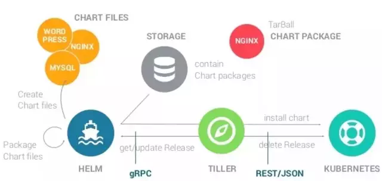

[TOC]
# Markdown


[Github Flavored Markdown语法介绍](https://github.com/guodongxiaren/README)
[GitHub Flavored Markdown](https://guides.github.com/features/mastering-markdown/)

[Markdown: Syntax 语法](https://daringfireball.net/projects/markdown/syntax)

Setext, atx, Textile, reStructuredText, Grutatext, and EtText

[emoji](https://github.com/guodongxiaren/README/blob/master/emoji.md)

还有更NB的[R-markdown](https://rmarkdown.rstudio.com/authoring_quick_tour.html) 当然需要RStudio(可以直接转换为html，pdf和word)，就像jupyter一样

同理也有[Python-Markdown](https://python-markdown.github.io/), haha,错了，这只是一个Markdown 转换的库

[pandoc](https://pandoc.org/MANUAL.html#creating-jupyter-notebooks-with-pandoc) 将 Markdown 转换为格式化文档

有个[MyST Markdown](https://myst-parser.readthedocs.io/en/latest/)不错,支持更多标记，如下（需要安装插件）:

```{code-cell} ipython3
---
other:
  more: true
tags: [hide-output, show-input]
---

print("Hallo!")
```

```{tip}
param = 5
```

## Quarkdown
Quarkdown	
Markdown	
LaTeX	
Typst	
AsciiDoc	
MDX

## 展开 收缩
<details open>
<summary>主题</summary>

<br/>

> 默认收缩， open属性默认展开

</details>

## 上标、下标

- X<sub>i</sub>
- H<sub>2</sub>O  CO<sub>2</sub>
- 益达<sup>TM</sup>
- 输入上标 x^2^
- 输入下标 x~0~


> 微信公众号：**[颜家大少](#jump_10)**
> 关注可了解更多的教程及排版技巧。问题或建议，请公众号留言;
> **[如果你觉得Md2All对你有帮助，欢迎赞赏](#jump_20)[^1]**

### 内容目录（由[TOC]自动生成）


### Md2All 简介
Markdown排版利器，支持 **"一键排版"** 、自定义css、80多种代码高亮。
能让Markdown内容，无需作任何调整就能**一键复制**到微信公众号、博客园、掘金、知乎、csdn、51cto、wordpress、hexo。。。等平台。
支持把图片自动上传到云图床;
支持Latex数学公式在公众号等平台完美显示;
支持生成带样式的html文件;
甚至支持直接用原生的html,css排版。

#### 详细教程
[Md2All详细教程,请参考：https://www.cnblogs.com/garyyan/p/8329343.html](https://www.cnblogs.com/garyyan/p/8329343.html )
#### 对公众号、博客的优化
支持代码块，并解决常见的代码块换行不正确,特别是iPone、iPad上不能滚动的问题;
解决把内容粘贴到公众号时，图片、或样式丢失的问题;

支持直接把页面"复制"到 "CSDN" 和 "博客园" 中，所有的样式保持一致。
[请参考此博文：http://blog.csdn.net/gary_yan/article/details/78645303](http://blog.csdn.net/gary_yan/article/details/78645303)
支持直接把页面"复制"到 "掘金" 中：
[请参考此博文：https://juejin.im/post/5a1bcc6ef265da431f4acb09](https://juejin.im/post/5a1bcc6ef265da431f4acb09)
支持直接把页面"复制"到 **"知乎"** 、51CTO、worpress ,hex......中。

### 代码块显示效果
注：markdown对代码块的语法是开始和结束行都要添加：\`\`\`,其中 \` 为windows键盘左上角那个，如下：

```
public class MyActivity extends AppCompatActivity {
@Override  //override the function
    protected void onCreate(@Nullable Bundle savedInstanceState) {
       super.onCreate(savedInstanceState);
       try {
            OkhttpManager.getInstance().setTrustrCertificates(getAssets().open("mycer.cer");
            OkHttpClient mOkhttpClient= OkhttpManager.getInstance().build();
        } catch (IOException e) {
            e.printStackTrace();
        }
}
```

要精确指定语言（如：`java,cpp,css,xml,javascript,python,php,go,kotlin,lua,objectivec`等等）时，在头部直接指定，如：\`\`\`javascript，如下：

```javascript
function DisplayWindowSize(){

  var w=window.innerWidth
  || document.documentElement.clientWidth
  || document.body.clientWidth;
}
```

如果所有的"代码主题"都不符合你的要求，你可以参考"一键排版"下的"代码块样式"自定义自己喜欢的代码高亮

<a id="jump_10"></a>
### 图片显示

下面的是我的公众号二维码图片，欢迎关注。

注：markdown对图片链接的语法是:``,
可直接把网络图片地址添加到markdown中，
默认为图片居中，如果想居左时，请打开"一键排版"下的css样式中的`img{margin:0 0;}`,
`[这里写图片描述]`中对图片的描述内容会自动生成在图片的底部，对应样式`figcaption{}`
### 云图床功能
Md2All支持云图床，设置好云图床后，能把本地图片自动上传到云图床，并自动生成markdown.
[请参考云图床教程:https://www.cnblogs.com/garyyan/p/9181809.html](https://www.cnblogs.com/garyyan/p/9181809.html)


### Tips
#### 自动保存
请点击左上角"编辑"图标再开始写作，这样就能自动保存写作内容，目前，所有保存的内容都是储存在本地浏览器缓存中(local storage)，所以,就算重新开机，这些内容都不会丢失的呵，但为了安全起见，在未实现帐号云同步功能前，请自行备份重要内容; 
#### 一键复制
**一键复制** 请点击工具栏的 **复制**，否则会可能出现奇怪的问题。

#### 一键排版
**"一键排版"** 支持标准的css,已提供了不少的样式模板，但因为每个人的喜好不一样，所以，如果现有的样式模板不适合你，请尽情地自定义css样式吧。
就算改错了也就"恢复预设值"就OK了，所以不用担心呵。一旦掌握自定义css样式后，你就会知到它到底有多大的威力了 ^_^;

#### 新版本对某主题样式更新时
当你保存了某排版主题的样式后，Md2All默认会使用你此主题保存的样式，所以，当新版本的Md2All对此主题样式有更新时，你需要“恢复预设值”才能看得到最新的样式。“恢复预设值”前，你可能需要备份一下你之前更改过的样式，否则会被覆盖掉。所以，我建议你把自己的样式保存在“最爱样式”下。

#### 浏览器兼容性问题，建议用Google chrome
本人用Google Chrome 和Firefox 浏览器做测试时，没发现问题，但用Safari时会存在问题。如果你发现有奇怪的问题，建议用Google chrome。

### Markdown基本语法
#### 标题
支持6种大小的标题，分别对应`#`,`##`,`###`,`####`,`#####`,`######`，和样式文件中的`h1,...,h6`如：
##### H5
###### H6
#### 行内代码
如：`AppCompatActivity`类,markdown对行内代码的语法是前后用：\`,其中 \` 为windows键盘左上角那个,

#### 强调
**我是强调**
#### 斜体
试试*斜体*
#### 强调的斜体
试试***强调的斜体***
#### 删除
试试 ~~删除~~
#### 外链的超链接
试试外链的超链接：[我是外链的超链接](http://blog.csdn.net/gary_yan/article/details/78645303),markdown对链接的语法为：`[]()`,如：`[我是外链的超链接](http://blog.csdn.net/gary_yan/article/details/78645303)`

####页内的超链接
试试页内的超链接：[我是页内的超链接](#jump_1)，注：你先要在要跳转的到地方放置一个类似：`<a id="jump_1">任意内容</a>`的锚点。由`id="jump_1" `来匹配。


#### 有序列表
1. 有序列表 1
2. 有序列表 2
3. 有序列表 3

#### 无序列表
- 无序列表 1
- 无序列表 2 
- 无序列表 3

#### 引用块
只需要在前面加 `>`,如下:
>我是引用块
微信公众号：颜家大少
欢迎关注我，一起学习，一起进步!

#### 分隔线
***


### Markdown扩展语法

#### 表格 
| 班级 | 男生 | 女生 |
|-----|-----|------|
| 一(7)班 | 30   | 25 |
| 一(8)班 | 25   | 30 |

注：表格在公众号预览时，可能在PC端显示的不是正确的全屏，但在手机上预览时就会正常显示为全屏的了。

> 这里有合并单元格
> https://github.com/jeffreytse/jekyll-spaceship#1-table-usage

#### 任务列表
- [x] 任务1，已完成;
- [x] 任务2，已完成;
- [ ] 任务3，未完成; 

#### 注脚
我是注脚[^10]。点点就能知到我跳到了那儿。
或跳到放置：`<a id="footnote-10">任意内容</a>`的地方,[^10] 对应`id="footnote-10"`

方式2
这是第一个有注脚的文本。^[注脚内容 第一条]

#### 锚点
<span id = "jump_span">跳转位置</span>
[span锚点](#jump_span)

####  TOC
看内容目录就是用`[toc]`生成的
注：只要放置:`[TOC]`,就能把其后面的标题如：`#,##,...######`自动生成目录树，注意，`[TOC]`要独立一行，并前面和后面都要空一行


### 直接支持html,css
如果你懂html和css，那下面这些效果就不在话下了：

<a href="#jump_1">来个页内跳转</a>，跳转到文未的： `<a id="jump_1">我是页内跳转到的位置</a>` ,对应：`id="jump_1"`
<span  style="color: #5bdaed; ">先给点颜色你看看</span>
<span  style="color: #AE87FA; ">再给点颜色你看看</span> 
<span  style="font-size:1.3em;">试试改变字体大小</span>
<span  style="font-size:1.3em;font-weight: bold;">改变字体大小，再来个粗体又如何？</span>

<p style="text-align:center">
试试内容居中

</p>

<p style="text-align:right">
那内容居右呢？
</p>

<p style="text-align:center;color:#1e819e;font-size:1.3em;font-weight: bold;">
来个综合的试试
<br/>
第二行
</p>

请参考"一键排版"中的"标题首字突出"样式的提示修改,可把此标题首字突出:
<span class="firstletter">1</span>试试首字突出

注:理论上Md2All是支持所有标准的html和css，但问题是公众号很多都不支持，所以上面只演示了部分支持的。

<a id="footnote-1"></a>
<a id="jump_20"></a>

### 赞赏Md2All

### 版本更新记录
***
版本号：V2.8.4
更新日期：2019-06-13 
1:解决在iphone手机上代码不能横向滚动的问题

版本号：V2.8.3
更新日期：2018-07-09
1:增加对以下语言的highlight
dart,r,delphi,vb(vbnet),vbs(vbscript),vbscript-html

版本号：V2.8.2
更新日期：2018-06-28
1:结合云图床，解决了Latex公式复制到公众号时有可能报“图片粘贴失败的问题”;
2:结合云图床，解决了Latex公式复制到知乎的问题;
3:点“图片”图标时，在云图床设置上新增了：“需要转换为图片的内容,会自动上传到云图床”选项
4:在“一键排版”的各样式文件中更新了Latex的样式，主要是显示的大小，你可能需要 **“恢复预设值”**才能看到新的样式.

**更多请参考**：
[Md2All版本更新记录](https://www.cnblogs.com/garyyan/p/9238405.html)

***
<a id="jump_1">我是页内跳转到的位置</a>（在`<a id="jump_1">`之间跳来跳去）
[^10]: 注脚跳转位置
111


 
----------------------


Markdown 标题：

# 这是 H1
## 这是 H2
### 这是 H3

Markdown 列表：
- 列表项目
1. 列表项目

*斜体*或_斜体_
**粗体**
***加粗斜体***
~~删除线~~

Markdown 插入链接：
[链接文字](链接网址 "标题")

Markdown 插入图片：


Markdown 插入代码块：
    ```python
    #!/usr/bin/python3
    print("Hello, World!");
    ```

Markdown 引用：
> 引用内容

Markdown 分割线：
---

Markdown 换行：
<br>

Markdown 段首缩进：
  or   表示一个半角的空格
  or    表示一个全角的空格
   两个全角的空格（用的比较多）
  or   不断行的空白格

#### html注释

<!--哈哈我是注释，不会在浏览器中显示。-->
#### hack方法
hack方法就是利用markdown的解析原理来实现注释的。

[comment]: <> (哈哈我是注释，不会在浏览器中显示。)
[//]: <> (哈哈我是注释，不会在浏览器中显示。)
[//]: # (其中，这种方法最稳定，适用性最强)
[^_^]: # (这种方法最可爱，超级无敌萌啊)

-------------
