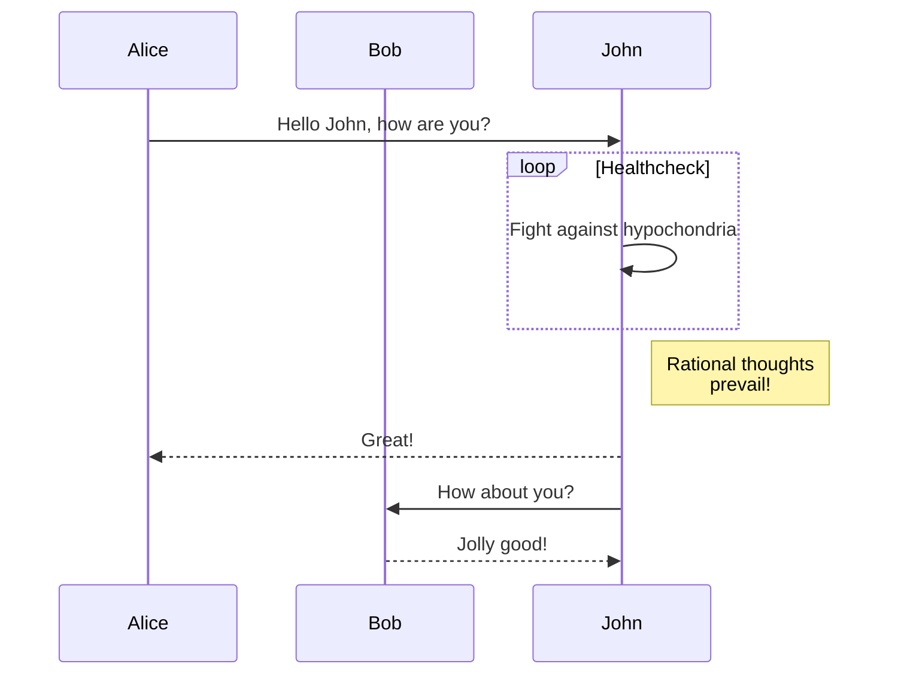
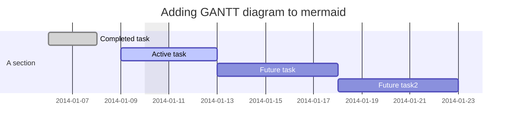

Markdown 目录：

## 上标、下标

- 
X<sub>i</sub>
H<sub>2</sub>O  CO<sub>2</sub>
益达<sup>TM</sup>

- 

输入上标 x^2^
输入下标 x~0~

[TOC]


[Github Flavored Markdown语法介绍](https://github.com/guodongxiaren/README)

[Markdown: Syntax 语法](https://daringfireball.net/projects/markdown/syntax)

Setext, atx, Textile, reStructuredText, Grutatext, and EtText

[emoji](https://github.com/guodongxiaren/README/blob/master/emoji.md)

> 微信公众号：**[颜家大少](#jump_10)**
> 关注可了解更多的教程及排版技巧。问题或建议，请公众号留言;
> **[如果你觉得Md2All对你有帮助，欢迎赞赏](#jump_20)[^1]**

###内容目录（由[TOC]自动生成）

[TOC]

###Md2All 简介
Markdown排版利器，支持 **"一键排版"** 、自定义css、80多种代码高亮。
能让Markdown内容，无需作任何调整就能**一键复制**到微信公众号、博客园、掘金、知乎、csdn、51cto、wordpress、hexo。。。等平台。
支持把图片自动上传到云图床;
支持Latex数学公式在公众号等平台完美显示;
支持生成带样式的html文件;
甚至支持直接用原生的html,css排版。

####详细教程
[Md2All详细教程,请参考：https://www.cnblogs.com/garyyan/p/8329343.html](https://www.cnblogs.com/garyyan/p/8329343.html )
####对公众号、博客的优化
支持代码块，并解决常见的代码块换行不正确,特别是iPone、iPad上不能滚动的问题;
解决把内容粘贴到公众号时，图片、或样式丢失的问题;

支持直接把页面"复制"到 "CSDN" 和 "博客园" 中，所有的样式保持一致。
[请参考此博文：http://blog.csdn.net/gary_yan/article/details/78645303](http://blog.csdn.net/gary_yan/article/details/78645303)
支持直接把页面"复制"到 "掘金" 中：
[请参考此博文：https://juejin.im/post/5a1bcc6ef265da431f4acb09](https://juejin.im/post/5a1bcc6ef265da431f4acb09)
支持直接把页面"复制"到 **"知乎"** 、51CTO、worpress ,hex......中。

###代码块显示效果
注：markdown对代码块的语法是开始和结束行都要添加：\`\`\`,其中 \` 为windows键盘左上角那个，如下：

```
public class MyActivity extends AppCompatActivity {
@Override  //override the function
    protected void onCreate(@Nullable Bundle savedInstanceState) {
       super.onCreate(savedInstanceState);
       try {
            OkhttpManager.getInstance().setTrustrCertificates(getAssets().open("mycer.cer");
            OkHttpClient mOkhttpClient= OkhttpManager.getInstance().build();
        } catch (IOException e) {
            e.printStackTrace();
        }
}
```

要精确指定语言（如：`java,cpp,css,xml,javascript,python,php,go,kotlin,lua,objectivec`等等）时，在头部直接指定，如：\`\`\`javascript，如下：

```javascript
function DisplayWindowSize(){

  var w=window.innerWidth
  || document.documentElement.clientWidth
  || document.body.clientWidth;
}
```

如果所有的"代码主题"都不符合你的要求，你可以参考"一键排版"下的"代码块样式"自定义自己喜欢的代码高亮

<a id="jump_10"></a>
###图片显示

下面的是我的公众号二维码图片，欢迎关注。

注：markdown对图片链接的语法是:``,
可直接把网络图片地址添加到markdown中，
默认为图片居中，如果想居左时，请打开"一键排版"下的css样式中的`img{margin:0 0;}`,
`[这里写图片描述]`中对图片的描述内容会自动生成在图片的底部，对应样式`figcaption{}`
###云图床功能
Md2All支持云图床，设置好云图床后，能把本地图片自动上传到云图床，并自动生成markdown.
[请参考云图床教程:https://www.cnblogs.com/garyyan/p/9181809.html](https://www.cnblogs.com/garyyan/p/9181809.html)


### mathjax

https://www.mathjax.org/

### Latex数学公式(能正确复制到公众号等平台）:

https://khan.github.io/KaTeX/docs/supported.html
“复制”时会自动把Latex数学公式转换为图片，并自动上传到云图床（如果在“图片”设置了“...,自动上传到云图床”）。
[请参考：Md2All,让公众号完美显示Latex数学公式](https://www.cnblogs.com/garyyan/p/9228994.html)
####行内公式：$...$
是的，我就是行内公式：

$$
e^{x^2}\neq{e^x}^2

$$

，排得OK吗？
####块公式：
$$
...

$$


$$
e^{x^2}\neq{e^x}^2$$
来个 *"复杂点"* 的:
$$H(D_2) = -(\frac{2}{4}\ log_2 \frac{2}{4} + \frac{2}{4}\ log_2 \frac{2}{4}) = 1$$
矩阵：

$$

    \begin{pmatrix}
    1 & a_1 & a_1^2 & \cdots & a_1^n \\
    1 & a_2 & a_2^2 & \cdots & a_2^n \\
    \vdots & \vdots & \vdots & \ddots & \vdots \\
    1 & a_m & a_m^2 & \cdots & a_m^n \\
    \end{pmatrix}
$$
对应“一键排版”的css样式关键字为：`.katex`
####Latex复制到公众号等各平台的特别说明
#####复杂的行内公式（顶部和底部突出很多那种），转换后，如果显示不完整，请改为块公式
有些比较复杂的行内公式,转换后，可能会出现顶部和底部很突出的部分看不见的情况，把它改成块公式就OK。
#####公众号报”图片粘贴失败“时，配合云图床完美解决
如果你发现复制到公众号时报**”图片粘贴失败“**，那是因为公众号有个很奇怪的问题：当复制很小很小的本地图片时，就可能会报”图片粘贴失败“，而其它的平台暂时没遇到。
解决的办法是点“图片”图标，设置好图床信息，并选“...,自动上传到云图床”。
[请参考云图床教程:https://www.cnblogs.com/garyyan/p/9181809.html](https://www.cnblogs.com/garyyan/p/9181809.html)
#####针对“知乎”的解决方法
知乎是一个比较神奇的网站，会把你的所有的样式恢复为默认的，并图片一定是居中的，也不能直接复制本地的图片。
所以你如果想要在知乎上正常显示：
1:只用块公式，或你可以接受行内公式在知乎上显示变成了块公式;
2:设置云图床，参考上面公众号那样设置“图片”->“...,自动上传到云图床”。


###Tips
####自动保存
请点击左上角"编辑"图标再开始写作，这样就能自动保存写作内容，目前，所有保存的内容都是储存在本地浏览器缓存中(local storage)，所以,就算重新开机，这些内容都不会丢失的呵，但为了安全起见，在未实现帐号云同步功能前，请自行备份重要内容; 
####一键复制
**一键复制** 请点击工具栏的 **复制**，否则会可能出现奇怪的问题。

####一键排版
**"一键排版"** 支持标准的css,已提供了不少的样式模板，但因为每个人的喜好不一样，所以，如果现有的样式模板不适合你，请尽情地自定义css样式吧。
就算改错了也就"恢复预设值"就OK了，所以不用担心呵。一旦掌握自定义css样式后，你就会知到它到底有多大的威力了 ^_^;

####新版本对某主题样式更新时
当你保存了某排版主题的样式后，Md2All默认会使用你此主题保存的样式，所以，当新版本的Md2All对此主题样式有更新时，你需要“恢复预设值”才能看得到最新的样式。“恢复预设值”前，你可能需要备份一下你之前更改过的样式，否则会被覆盖掉。所以，我建议你把自己的样式保存在“最爱样式”下。

####浏览器兼容性问题，建议用Google chrome
本人用Google Chrome 和Firefox 浏览器做测试时，没发现问题，但用Safari时会存在问题。如果你发现有奇怪的问题，建议用Google chrome。

###Markdown基本语法
####标题
支持6种大小的标题，分别对应`#`,`##`,`###`,`####`,`#####`,`######`，和样式文件中的`h1,...,h6`如：
#####H5
######H6
####行内代码
如：`AppCompatActivity`类,markdown对行内代码的语法是前后用：\`,其中 \` 为windows键盘左上角那个,

####强调
**我是强调**
####斜体
试试*斜体*
####强调的斜体
试试***强调的斜体***
####删除
试试 ~~删除~~
####外链的超链接
试试外链的超链接：[我是外链的超链接](http://blog.csdn.net/gary_yan/article/details/78645303),markdown对链接的语法为：`[]()`,如：`[我是外链的超链接](http://blog.csdn.net/gary_yan/article/details/78645303)`
####页内的超链接
试试页内的超链接：[我是页内的超链接](#jump_1)，注：你先要在要跳转的到地方放置一个类似：`<a id="jump_1">任意内容</a>`的锚点。由`id="jump_1" `来匹配。


####有序列表
1. 有序列表 1
2. 有序列表 2
3. 有序列表 3

####无序列表
- 无序列表 1
- 无序列表 2 
- 无序列表 3

####引用块
只需要在前面加 `>`,如下:
>我是引用块
微信公众号：颜家大少
欢迎关注我，一起学习，一起进步!

####分隔线
***


###Markdown扩展语法

####表格 
| 班级 | 男生 | 女生 |
|-----|-----|------|
| 一(7)班 | 30   | 25 |
| 一(8)班 | 25   | 30 |

注：表格在公众号预览时，可能在PC端显示的不是正确的全屏，但在手机上预览时就会正常显示为全屏的了。

####任务列表
- [x] 任务1，已完成;
- [x] 任务2，已完成;
- [ ] 任务3，未完成; 

####注脚
我是注脚[^10]。点点就能知到我跳到了那儿。
或跳到放置：`<a id="footnote-10">任意内容</a>`的地方,[^10] 对应`id="footnote-10"`


####TOC
看内容目录就是用`[toc]`生成的
注：只要放置:`[TOC]`,就能把其后面的标题如：`#,##,...######`自动生成目录树，注意，`[TOC]`要独立一行，并前面和后面都要空一行


###直接支持html,css
如果你懂html和css，那下面这些效果就不在话下了：

<a href="#jump_1">来个页内跳转</a>，跳转到文未的：`<a id="jump_1">我是页内跳转到的位置</a>` ,对应：`id="jump_1"`
<span  style="color: #5bdaed; ">先给点颜色你看看</span>
<span  style="color: #AE87FA; ">再给点颜色你看看</span> 
<span  style="font-size:1.3em;">试试改变字体大小</span>
<span  style="font-size:1.3em;font-weight: bold;">改变字体大小，再来个粗体又如何？</span>

<p style="text-align:center">
试试内容居中

</p>

<p style="text-align:right">
那内容居右呢？
</p>

<p style="text-align:center;color:#1e819e;font-size:1.3em;font-weight: bold;">
来个综合的试试
<br/>
第二行
</p>

请参考"一键排版"中的"标题首字突出"样式的提示修改,可把此标题首字突出:
###<span class="firstletter">1</span>试试首字突出

注:理论上Md2All是支持所有标准的html和css，但问题是公众号很多都不支持，所以上面只演示了部分支持的。

<a id="footnote-1"></a>
<a id="jump_20"></a>
###赞赏Md2All
如果你觉得到Md2All对你有帮助，欢迎赞赏，有你的支持，Md2All一定会越来越好！


###版本更新记录
***
版本号：V2.8.4
更新日期：2019-06-13 
1:解决在iphone手机上代码不能横向滚动的问题

版本号：V2.8.3
更新日期：2018-07-09
1:增加对以下语言的highlight
dart,r,delphi,vb(vbnet),vbs(vbscript),vbscript-html

版本号：V2.8.2
更新日期：2018-06-28
1:结合云图床，解决了Latex公式复制到公众号时有可能报“图片粘贴失败的问题”;
2:结合云图床，解决了Latex公式复制到知乎的问题;
3:点“图片”图标时，在云图床设置上新增了：“需要转换为图片的内容,会自动上传到云图床”选项
4:在“一键排版”的各样式文件中更新了Latex的样式，主要是显示的大小，你可能需要**“恢复预设值”**才能看到新的样式.

**更多请参考**：
[Md2All版本更新记录](https://www.cnblogs.com/garyyan/p/9238405.html)

***
<a id="jump_1">我是页内跳转到的位置</a>
[^10]: 注脚跳转位置
111


 
----------------------


Markdown 标题：
# 这是 H1
## 这是 H2
### 这是 H3

Markdown 列表：
- 列表项目
1. 列表项目

*斜体*或_斜体_
**粗体**
***加粗斜体***
~~删除线~~

Markdown 插入链接：
[链接文字](链接网址 "标题")

Markdown 插入图片：


Markdown 插入代码块：
    ```python
    #!/usr/bin/python3
    print("Hello, World!");
    ```

Markdown 引用：
> 引用内容

Markdown 分割线：
---

Markdown 换行：
<br>

Markdown 段首缩进：
  or   表示一个半角的空格
  or    表示一个全角的空格
   两个全角的空格（用的比较多）
  or   不断行的空白格

#### html注释

<!--哈哈我是注释，不会在浏览器中显示。-->
#### hack方法
hack方法就是利用markdown的解析原理来实现注释的。

[comment]: <> (哈哈我是注释，不会在浏览器中显示。)
[//]: <> (哈哈我是注释，不会在浏览器中显示。)
[//]: # (其中，这种方法最稳定，适用性最强)
[^_^]: # (这种方法最可爱，超级无敌萌啊)

-------------


# Mark流程图语法

DOT语言：图形描述语言

https://github.com/dreampuf/GraphvizOnline
Graphviz绘图：一款开源图形可视化软件

https://gitlab.com/graphviz/graphviz
https://graphviz.gitlab.io/about/
Graphviz 有 6 个引擎，分别是：
1. dot - “层次”或有向图的分层绘图。如果边具有方向性，这是默认使用的工具。
2. neato - “spring model” 布局。如果图不是太大(大约 100 个节点)，而且您对它一无所知，那么这是默认的工具。Neato 试图最小化一个全局能量函数，它相当于统计多维尺度。
3. fdp - “spring model”的布局类似于neato，但它是通过减少力而不是利用能量来实现的。
4. sfdp - fdp 的多尺度版本，用于大图形的布局。
5. twopi - 径向布局，after Graham Wills 97。节点被放置在同心圆上，这取决于它们与给定根节点的距离。
6. circo - 圆形布局，after Six and Tollis 99, Kauffman and Wiese 02。这适用于多个循环结构的某些图，例如某些电信网络。

[flowchat](http://flowchart.js.org/)
[Sequence](https://bramp.github.io/js-sequence-diagrams/)
[Mermaid](https://mermaid-js.github.io/mermaid/#/)
[PlantUML](https://plantuml.com/zh/)

```flow
st=>start: 开始
e=>end: 结束
op=>operation: 操作
sub=>subroutine: 子程序
cond=>condition: 是或者不是?
io=>inputoutput: 输出

st(right)->op->cond
cond(yes)->io(right)->e
cond(no)->sub(right)->op
```

```flow
st=>start: Start
e=>end: End
op1=>operation: My Operation
op2=>operation: Stuff
sub1=>subroutine: My Subroutine
cond=>condition: Yes
or No?
c2=>condition: Good idea
io=>inputoutput: catch something...

st->op1(right)->cond
cond(yes, right)->c2
cond(no)->sub1(left)->op1
c2(yes)->io->e
c2(no)->op2->e
```


顺序图

甘特图


类图-：实验性
```
classDiagram
Class01 <|-- AveryLongClass : Cool
Class03 *-- Class04
Class05 o-- Class06
Class07 .. Class08
Class09 --> C2 : Where am i?
Class09 --* C3
Class09 --|> Class07
Class07 : equals()
Class07 : Object[] elementData
Class01 : size()
Class01 : int chimp
Class01 : int gorilla
Class08 <--> C2: Cool label
```

总结来说js-sequence模块对sequence代码的语法解析执行过程如下图

```sequence
title: 序列图sequence(示例)
participant A
participant B
participant C

note left of A: A左侧说明
note over B: 覆盖B的说明
note right of C: C右侧说明

A->A:自己到自己
A->B:实线实箭头
A-->C:虚线实箭头
B->>C:实线虚箭头
B-->>A:虚线虚箭头
```


```sequence

颜回->孔子: 吃饭了没？
note right of 孔子: 孔子思考\n如何回答
孔子-->颜回: 吃过了。你咧？
颜回->>孔子: 吃过了，吃过了！

```

$$
