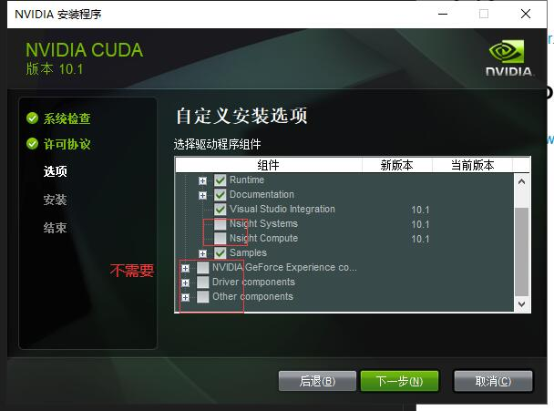

## NVIDIA显卡驱动版本，CUDA版本，cudnn版本之间关系及如何选择
https://blog.csdn.net/iamqianrenzhan/article/details/89343601
## 下载
https://developer.nvidia.com/cuda-downloads?target_os=Windows&target_arch=x86_64

## cudnn
NVIDIA cuDNN是用于深度神经网络的GPU加速库。
https://developer.nvidia.com/rdp/cudnn-archive

使用迅雷下载
https://developer.nvidia.com/compute/machine-learning/cudnn/secure/7.6.5.32/Production/10.1_20191031/cudnn-10.1-windows10-x64-v7.6.5.32.zip

解压 放到CUDA的目录下
C:\Program Files\NVIDIA GPU Computing Toolkit\CUDA\v10.1

## tensorflow

https://tensorflow.google.cn/install/gpu

https://mirrors.aliyun.com/pypi/simple/tensorflow/

> 能用conda安装最好
> 阿里镜像 http://mirrors.aliyun.com/pypi/simple/
> pip install -i https://pypi.tuna.tsinghua.edu.cn/simple/ tensorflow-2.2.0-cp38-cp38-win_amd64.whl

## 验证
nvcc -V 
nvcc --version