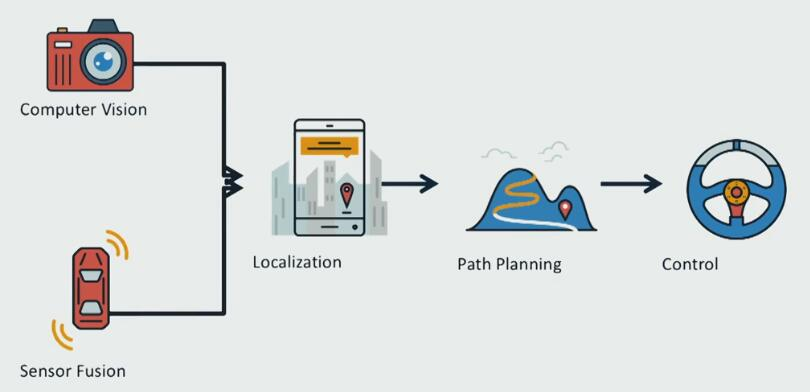
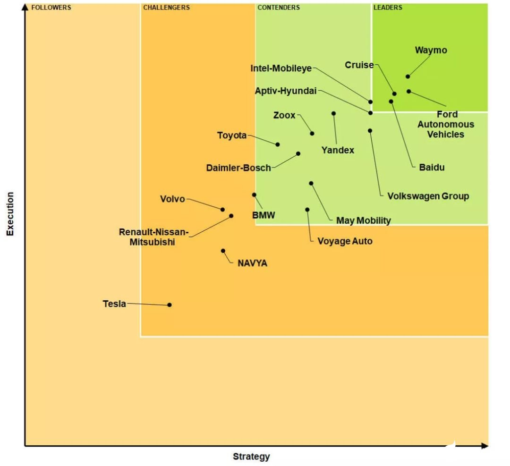
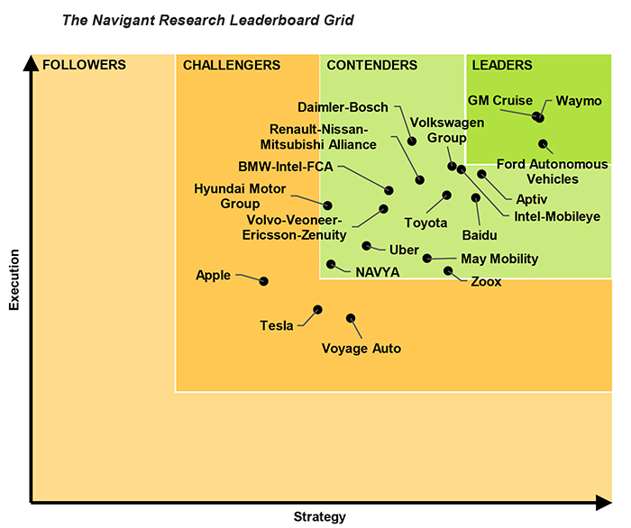

[最佳实践,为计算机视觉代码示例和文档。微软出品](https://github.com/microsoft/computervision-recipes)
## 图片处理
### 卡通化
[卡通化](https://github.com/SystemErrorWang/White-box-Cartoonization)
使用了GAN
[在线图片或视频来进行卡通化](https://cartoonize-lkqov62dia-de.a.run.app/cartoonize)
[论文链接](https://systemerrorwang.github.io/White-box-Cartoonization/paper/06791.pdf)

### 人脸识别

#### BlazeFace
https://arxiv.org/abs/1907.05047
https://google.github.io/mediapipe/solutions/face_detection

### 目标检测
- 旷视提出MegDetV2：目标检测/实例分割系统 论文：https://arxiv.org/abs/2010.02475

## Action Recognition
https://github.com/jinwchoi/awesome-action-recognition

https://github.com/kenshohara/3D-ResNets-PyTorch

### OpenPose
https://github.com/felixchenfy/Realtime-Action-Recognition

### BlazePose
谷歌研究人员提出全新神经网络BlazePose，可健身跟踪、手语识别
https://arxiv.org/pdf/2006.10204.pdf
https://arxiv.org/abs/2006.10204
https://www.arxiv-vanity.com/papers/2006.10204/

[推出 BlazePose：实现设备端实时人体姿态追踪](https://blog.csdn.net/jILRvRTrc/article/details/108590889)

### BlazePalm
https://google.github.io/mediapipe/solutions/hands

## OpenMMLab
https://github.com/open-mmlab
https://open-mmlab.github.io/
http://openmmlab.org/

2020年7月10 号 OpenMMLab 在 WAIC 2020 世界人工智能大会上发布了重磅升级，给大家带来了更丰富的 OpenMMLab 大礼包，1 个架构，10+ 个研究方向，100+ 种算法，600+ 预训练模型，是深度学习时代最完整的计算机视觉算法开源体系。

[MMDetection（物体检测）](https://github.com/open-mmlab/mmdetection)：在一个统一而灵活的架构上，高效实现了20多种典型检测算法。

[MMAction（行为理解）](https://github.com/open-mmlab/mmaction)：支持视频行为理解中的动作识别、时序检测、和时空检测等多种基本任务，复现了多种流行的算法，并支持常见的各种数据集。

[MMSkeleton（基于人体骨骼的理解）](https://github.com/open-mmlab/mmskeleton)：以人体骨骼为核心的视频理解框架，基于时空图模型（ST-GCN）支持行为理解、姿态估计、动作生成等任务。

[MMSR（图像与视频超分辨率）](https://github.com/open-mmlab/mmediting)：在统一的架构上，实现了一系列先进的超分辨率算法。

[MMFashion（时尚分析）](https://github.com/open-mmlab/mmfashion)：专注于时尚服饰领域的视觉分析，覆盖识别、检索、属性预测、检测、分割、推荐等主流任务。

### MMCV (基础支持)
Computer Vision 计算机视觉
https://github.com/open-mmlab/mmcv

新特性

- 增加 build_runner 方法，方便下游代码库的 runner 定制化
- 支持对 DCN 中 offset 层学习率的调整
- 增加 EMAHook，支持指数移动平均方法
- 为 Adaptive Average Pooling 提供 ONNX 的支持
- 增加新的算子，如 TINShift，Conv2dAdaptivePadding
- 增加新模块，如 DepthwiseSeparableConvModule，Swish activation
- 增加新的数据处理模块，如 imshear，imtranslate，adjust_brightness 等

代码改进

- JsonHandler 增加对 unserializable 的值与更多默认类型的支持
- 图像处理模块支持对角线翻转
- 优化 batched_nms 以处理框数量过多的情况，自动根据框的类别标签进行序列处理
- 增加了 wrap_fp16_model 的接口
- 改进 train/val_step 接口
- 添加 deconv 的注册器
- 支持在 fp16 optimizer hook 中记录梯度大小
- 允许 imshow_det_bboxes() 同时返回框和图片

### MMClassification 分类

https://github.com/open-mmlab/mmclassification

新特性

- 增加 inference 的相关代码
- 支持 PyTorch 到 ONNX 的转换
- 增加新的 transform，包括基于 PIL 的 transform 和 albumentations
- 增加新模型，包括 ResNeSt，VGG 等
- 支持新更多数据集
- 增加结果可视化模块

代码改进和 BUG 修复

- 更新了 ShuffleNet 的配置文件，更新多个模型的预训练权重，包括 ShuffleNet 系列与 SE-ResNet 系列
- 解决多个 transform 中存在的错误 
- 改进多个模型的参数和初始化问题

### MMSegmentation
Semantic Segmentation 计算机视觉 - 语义分割
https://github.com/open-mmlab/mmsegmentation

新算法/模型

- MobileNet V2
- EMANet
- DNL
- PointRend
- Semantic FPN
- Fast SCNN
- ResNeSt
- ORNet ResNet
- DeepLabV3/DeepLabV3+ Dilate 16

新数据集

- Pascal Context

代码改进

- 支持 ONNX 导出上采样
- 支持 Windows 环境下的安装
- 迁移 DepthwiseSeparableConv，collect_env 到 MMCV
- 支持用户自定义数据集类别和调色板

### MMEditing
图像和视频编辑
https://github.com/open-mmlab/mmediting

新特性

- 支持 NIQE，一种常用的图像质量评价指标，帮助大家更好地测试自己的模型
- 支持 pip install mmedit
- 加入 FP16 训练所需模块，支持 FP16 的训练，降低资源开销

### MMDetection
目标检测
https://github.com/open-mmlab/mmdetection

支持新算法/模型

- YOLACT
- CentripetalNet
- SABL
- YOLOv3
- PAA Assign
- CornerNet
- DIOU/CIOU loss
- 支持新数据集 LVIS V1

文档完善

- 新的colab tutorial：增加了训练教程，教程中包括将新的数据集转为MMDet的格式并对预训练模型进行微调和推理，方便新手了解目标检测中从数据预处理到模型训练和推理的全过程
- 增加trouble shooting页面：总结了mmdet使用过程中的常见issue和解决方案
- 完善了自定义数据集、自定义模型相关的教程

新特性

- 支持batch inference：支持在推理过程单卡 batch size >1的情况，提高模型推理的并行度
- 支持pip install mmdet：从此支持一行命令安装mmdet了
- 支持 RetinaNet 从 Pytorch 到 ONNX的转换：支持和完善了PyTorch2ONNX的功能，后续还会继续支持双阶段和多阶段检测器的Pytorch2ONNX
- 支持了PyTorch 1.6 Dockerfile：更新了Dockerfile，用户可以使用基于PyTorch1.6的docker来使用MMDetection，注意，Pytorch 1.3 - Pytorch 1.5的docker仍然可以使用，用户只需要在Dockerfile中修改PyTorch相应版本即可。

代码改进

- 将所有的CUDA/C++ 算子迁移到了MMCV，统一管理 OpenMMLab 项目对 CUDA 算子依赖。
- 对自定义数据集的灵活支持，支持根据类别自动筛选数据：之前对自定义数据集和自定义类别的数据使用不够友好，在指定训练类别的情况下无法控制剔除无GT图像的行为。最新版使得只有在 filter_empty_gt=True 和 test_mode=True 的情况下才会剔除无 GT 的图像，消除了数据筛选的歧义。
- 统一了代码中的负样本标签定义，RPN head 中 0 代表正样本（第一正类），1 代表负样本，使得 v2.5 以后所有的 head 都使用 self.num_classes 来定义背景框的标签，不再有特殊情况。

### MMDetection3D
通用3D对象检测平台。
https://github.com/open-mmlab/mmdetection3d

支持新算法/模型

- H3DNet
- 3DSSD
- CenterPoint

支持新数据集

- Waymo：支持 Waymo 数据集，开放了 PointPillars 和 SECOND 的预训练模型和模型性能，为研究和开发提供性能基准
- nuImages：支持使用 nuImages 数据集进行目标检测、实例分割任务。包含 Mask R-CNN and Cascade Mask R-CNN 预训练模型和模型性能，提供性能基准的同时也为多模态检测提供了预训练模型。

新特性

- 支持 Batch Inference：支持在推理过程单卡 batch size >1 的情况，提高模型推理的并行度
- 支持 Pytorch 1.6：支持了 Pytorch1.6，清理了 Pytorch1.6 （如 torch.nonzero）相关的warning
- 支持 pip install mmdet3d：支持一行命令安装 mmdetection3d，方便开发者将 mmdet3d 作为基础代码库开发新的项目
- 支持混合精度训练：对 PointPillars/SECOND 等基于 voxel 的模型支持混合精度训练，在 KITTI 和 nuScenes 数据集上显存减半但是精度不掉。
### MMPose
姿态估计
https://github.com/open-mmlab/MMPose

### MMAction2
行动理解
https://github.com/open-mmlab/MMAction2

### mmfashion
visual fashion analysis 视觉时尚分析
https://github.com/open-mmlab/mmfashion
### mmskeleton
human pose estimation, skeleton-based action recognition, and action synthesis.
人体姿态估计，基于骨架的动作识别，动作合成。
https://github.com/open-mmlab/mmskeleton

### OpenSelfSup（自监督学习）

https://github.com/open-mmlab/OpenSelfSup

以统一的框架支持基于分类、聚类、memory bank、contrastive learning 的多种自监督学习算法，支持最前沿的 SimCLR, MoCo, BYOL 等算法，在多个 benchmark 上支持标准化的评测方案。

### OpenPCDet（点云 3D 目标检测）

https://github.com/open-mmlab/OpenPCDet

清晰简洁的代码框架设计，基于统一规范化的 3D 坐标系，方便地支持各种数据集，代码采用模块化设计，集成各种 3D 检测模型，包含 PV-RCNN 等多个排行榜 top 排名的高性能3D检测方法。

### OpenUnReID（无监督目标重识别）

https://github.com/open-mmlab/OpenUnReID

第一个针对无监督及领域自适应的目标重识别框架，同时支持基于伪标签和域转换的算法，速度和精度相对其他框架均更优，且具有较强的可拓展性。

## 自动驾驶
[百度apollo](https://github.com/ApolloAuto/apollo)
[基于apollo](https://github.com/lgsvl)
[waymo](https://github.com/waymo-research/waymo-open-dataset)

Navigant Research自动驾驶排行榜 2020

竖坐标为执行能力（Execution），横坐标为策略能力（Strategy），将他们划分为「领导者」、「竞争者」、「挑战者」以及「跟随者」四个等级

[自动驾驶汽车成熟度指数报告](files/2020-autonomous-vehicles-readiness-index.pdf)
毕马威《自动驾驶汽车成熟度指数报告》(Autonomous Vehicles Readiness Index)(AVRI)
https://home.kpmg/au/en/home/insights/2020/07/autonomous-vehicles-readiness-index-2020.html