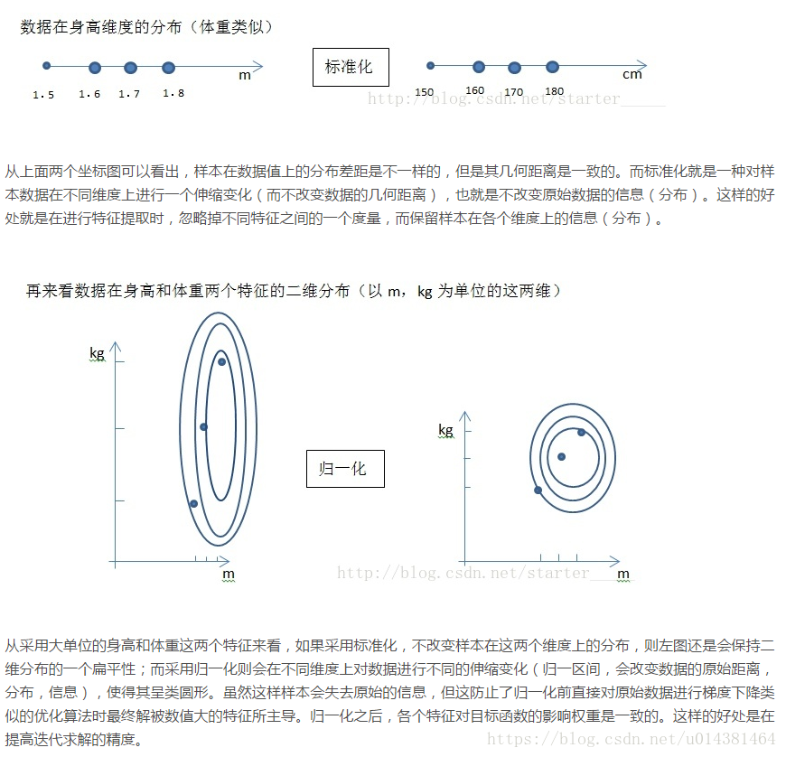
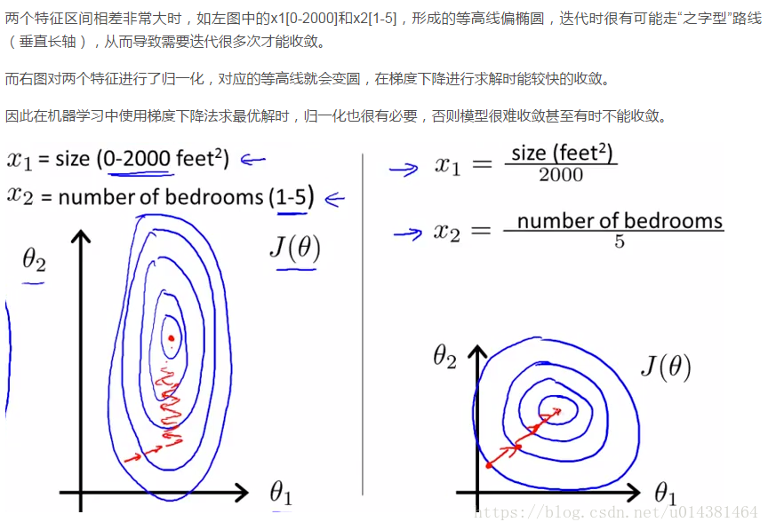
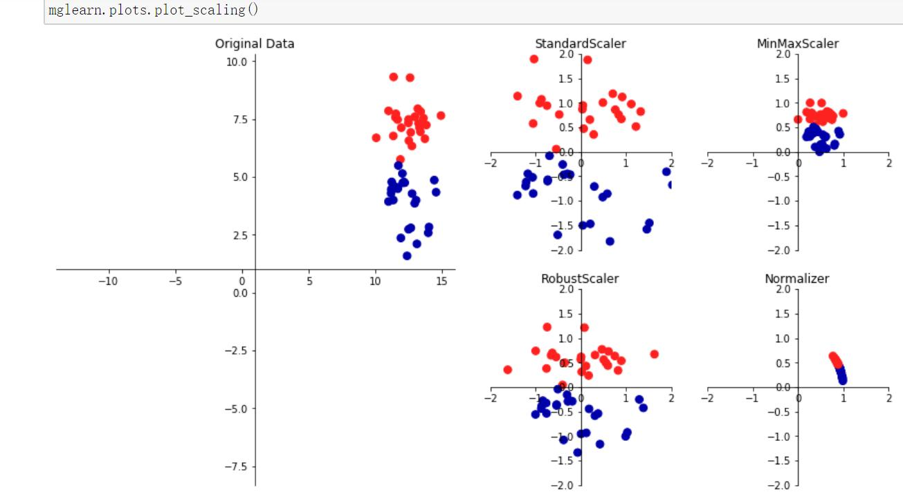

<!--toc-->
[TOC]
# 特征工程 - 数据预处理


特征是原始数据的数学表示。有很多方法可以将原始数据转换为数学测量值，这也是为什么特征最终看起来与许多事情相似。自然的，特征必须来自可用数据的类型。可能它们与模型相关联的事实也没那么明显；**一些模型更适合某些类型的特征，反之亦然**。正确的特征应该与手头的任务相关并且容易被模型摄取。**特征工程是指给定数据、模型和任务是制定最佳特征的过程**。

特征的数量也是很重要的。如果没有足够的信息特征，模型就无法完成最终的任务。如果存在太多的特征，或者如果它们大多数是无关紧要的，那么训练这个模型会更加的棘手并且代价更多。在训练过程中可能会出现一些错误影响模型的表现。

良好的特征使后续的建模步骤变得简单，并且所得到的模型能更容易实现所需的任务。糟糕的特征可能需要更复杂的模型才能达到相同的性能水平。

如果特征已经是数字数据也并不意味着不再需要特征工程。好的特征不仅代表数据的显著方面，而且符合模型的假设。


> 不包括《自动特征学习》

## 特征选择

特征选择技术会删除非有用的特征，以降低最终模型的复杂性。最终目标是快速计算的简约模型，预测准确性降低很小或不会降低。为了得到这样的模型，一些特征选择技术需要训练多个候选模型。换句话说，特征选择并不是减少训练时间，实际上有些技巧增加了整体训练时间，但是减少了模型评分时间。

粗略地说，特征选择技术分为三类。

- Filtering（过滤）: 预处理可以删除那些不太可能对模型有用的特征。例如，可以计算每个特征与响应变量之间的相关或相互信息，并筛除相关信息或相互信息低于阈值的特征。第3章讨论了文本特征的过滤技术的例子。过滤比下面的包装（wrapper）技术便宜得多，但是他们没有考虑到正在使用的模型。因此他们可能无法为模型选择正确的特征。最好先保守地进行预过滤，以免在进行模型训练步骤之前无意中消除有用的特征。

- Wrapper methods（包装方法）：这些技术是昂贵的，但它们允许您尝试特征子集，这意味着你不会意外删除自身无法提供信息但在组合使用时非常有用的特征。包装方法将模型视为提供特征子集质量分数的黑盒子。shi一个独立的方法迭代地改进子集。

- Embedded methods（嵌入式方法）：嵌入式方法执行特征选择作为模型训练过程的一部分。 例如，决策树固有地执行特征选择，因为它在每个训练步骤选择一个要在其上进行树分裂的特征。另一个例子是$L1$正则，它可以添加到任何线性模型的训练目标中。$L1$鼓励模型使用一些特征而不是许多特征。因此它也被称为模型的稀疏约束。嵌入式方法将特征选择作为模型训练过程的一部分。它们不如包装方法那么强大，但也远不如包装方法那么昂贵。与过滤相比，嵌入式方法会选择特定于模型的特征。从这个意义上讲，嵌入式方法在计算费用和结果质量之间取得平衡。


许多常见的数字特征工程技术：量化，缩放（又称规范化），对数变换（一种功率变换），交互特征以及处理大量交互特征所需的特征选择技术。

## 非线性变换
### QuantileTransformer
使用百分位教转换特征，通过缩小边缘异常值和非异常值之间的距离来提供特征的非线性变换。映射到均匀分布output_distribution = "uniform"

> 也可以使用参数output_distribution = "normal"来将数据映射到标准正态分布。


### PowerTransformer
映射到高斯分布。在许多建模场景中，数据集中的特性是正常的。幂变换是一类参数的单调变换，其目的是将数据从任意分布映射到尽可能接近高斯分布，以稳定方差和最小化偏度。

PowerTransformer目前提供了两个这样的幂变换，Yeo-Johnson变换和Box-Cox变换，利用极大似然估计了稳定方差和最小偏度的最优参数。并且，box-Cox要求输入数据严格为正数据，而Yeo-Johnson支持正负数据。


### 生产多项式特征 PolynomialFeatures 
增加一些输入数据的非线性特征来增加模型的复杂度，最直接的办法是给数据添加多项式特征。

比如数据[2,3] ->degree=2时 `[2,3,2*2,2*3,3*3]`

> 参数degree ：多项式的维度 ；当使用多项的 Kernel functions 时 ，多项式特征被隐式地在核函数中被调用(比如， sklearn.svm.SVC ， sklearn.decomposition.KernelPCA)

## 离散值处理（一般是对类别特征进行编码）
分类变量的类别通常不是数字。例如，眼睛的颜色可以是“黑色”，“蓝色”，“棕色”等。因此，需要使用编码方法将这些非数字类别变为数字。

### LabelEncoder 标签编码
有些算法不支持文本特征，所以需要将标签转换为数字，Label encoding在某些情况下很有用，但是场景限制很多。再举一例：比如有[dog,cat,dog,mouse,cat]，我们把其转换为[1,2,1,3,2]。这里就产生了一个奇怪的现象：dog和mouse的平均值是cat。所以目前还没有发现标签编码的广泛使用。

> sklearn.preprocessing.LabelEncoder中解释：使用0到n_classes-1之间的值对目标标签进行编码。该转换器应用于编码目标值，即y，而不是输入X.
### LabelBinarizer
对标签进行二值化处理

### MultiLabelBinarizer 多分类标签

比如将['红色'],['绿色'],['红色','绿色'] 变成[1, 0],  [0, 1],  [1, 1]

### OrdinalEncoder 顺序编码
例如输入`X = [['Male', 1], ['Female', 3], ['Female', 2]]`，这里输入数据中含有两列，说明有两类特征，第一列取值范围为：`[ 'Female'，'Male']`，按照顺序编码为`[0,1]`，第二列取值范围为：`[1,2,3]`,编码结果为`[0,1,2]`。按照这个思路，`['Female', 3], ['Male', 1]`的顺序编码分别为`[0,2]和[1,0]`。

> 这样的整数特征表示一般并不能在scikit-learn的估计器中直接使用，因为这样的连续输入，估计器会认为类别之间是有序的，但实际却是无序的。

### OneHotEncoder 独热编码
该离散特征有多少取值，就用多少维来表示该特征。


- 优点：独热编码解决了分类器不好处理属性数据的问题，在一定程度上也起到了扩充特征的作用。它的值只有0和1，不同的类型存储在垂直的空间。
- 缺点：当类别的数量很多时，特征空间会变得非常大。在这种情况下，一般可以用PCA来减少维度。而且one hot encoding+PCA这种组合在实际中也非常有用。

独热编码用来解决类别型数据的离散值问题，将离散型特征进行one-hot编码的作用，是为了让**距离计算更合理**，但如果特征是离散的，并且不用one-hot编码就可以很合理的计算出距离，那么就没必要进行one-hot编码。 有些基于树的算法在处理变量时，并不是基于向量空间度量，数值只是个类别符号，即没有偏序关系，所以不用进行独热编码。  Tree Model不太需要one-hot编码： 对于决策树来说，one-hot的本质是增加树的深度。

> 否则如果特征是字符串，就需要先使用 sklearn.preprocessing.LabelEncoder 将离散特征值转换为数字。
> 比如训练数据只有3类(可以指定类别)，当预测数据出现第四类时就会有问题（可以设置处理或者忽略也可以指定类别）

#### 哑编码dummy
当OneHotEncoder(drop='first')时就是哑编码（哑变量 dummy variable）（一般无序多分类时可以使用）
> 总结：我们使用one-hot编码时，通常我们的模型不加bias项 或者 加上bias项然后使用正则化手段去约束参数；当我们使用哑变量编码时，通常我们的模型都会加bias项，因为不加bias项会导致固有属性的丢失。

> 选择建议：我感觉最好是选择正则化 + one-hot编码；哑变量编码也可以使用，不过最好选择前者。虽然哑变量可以去除one-hot编码的冗余信息，但是因为每个离散型特征各个取值的地位都是对等的，随意取舍未免来的太随意。

> https://www.cnblogs.com/lianyingteng/p/7792693.html

## 离散化 (Discretization) 或 量化(quantization) 或 装箱(binning))
将连续特征划分为离散特征值。其目的就是把具有连续属性的数据集变换成只有名义属性(nominal attributes)的数据集。

- 固定宽度装箱

对于固定宽度装箱, 每个 bin 都包含一个特定的数值范围。范围可以是定制设计或自动分割, 它们可以线性缩放或指数缩放。例如, 我们可以将一个人的年龄分组为十年: 0-9 岁归纳到bin 1, 10-19 年归纳到 bin 2 等。要从计数映射到 bin, 只需除以 bin 的宽度并取整部分。

- 分位数装箱
固定宽度装箱很容易计算。但是如果计数有很大的差距, 那么将会有许多空的垃圾箱没有数据。该问题可以通过基于数据分布的垃圾箱自适应定位来解决。这可以使用分发的分位数来完成。

分位数是将数据划分为相等部分的值。例如, 中位数将数据分成一半;一半的数据是较小的, 一半大于中位数。分位数把数据分成几个部分, 十分位数把数据划分成十份。

- 对数变换

对数函数是指数函数的逆。它定义为$\log _{a}\left({a}^{x}\right)=X$
其中 $a$ 为正常数, $x$ 可以是任何正数。由于$a^0=1$,我们有$\log _{{a}}(1)=0$。这意味着对数函数将小范围的数字 (0、1) 映射到负数的整个范围$(-\infty, 0)$。函数$\log _{{a}}(10)=0$ 将 $[1、10]$ 映射到 $[0、1]$、将$[10、100]$ 映射到 $[1、2]$ 等等。换言之, 对数函数压缩大数的范围, 并扩展小数的范围。越大的 $x$ , $log(x)$的增量越慢。


log已10为底，将x 【0,1000】压缩到【0,3】

> 可以使用自定义函数来处理 sklearn.preprocessing.FunctionTransformer(np.log1p)


### KBinsDiscretizer 使用k个等宽的bins把特征离散化
> 参数strategy：‘uniform’：等宽分箱；‘quantile’：等位分箱；‘kmeans’：按聚类分箱

### Binarizer 二值化
比如计数：很难说听一首歌20次的人一定喜欢听10次的人的两倍。
用户偏好的更健壮表示是使计数二元化和修剪所有大于1（或者自定义阈值）的计数为1。

```
>>> from sklearn.preprocessing import Binarizer
>>> X = [[ 1., -1.,  2.],
...      [ 2.,  0.,  0.],
...      [ 0.,  1., -1.]]
>>> transformer = Binarizer().fit(X)  # fit does nothing.
>>> transformer
Binarizer()
>>> transformer.transform(X)
array([[1., 0., 1.],
       [1., 0., 0.],
       [0., 1., 0.]])
```
Binarizer参数threshold ，默认为0.0
小于或等于此值的特征值将替换为0，大于被1替换。对于稀疏矩阵的操作，阈值不得小于0。
> 当k=2时，当bin边处于值阈值时，Binarizer类似于KBinsDiscreizer。

## 特征缩放或归一化
基于参数的模型或基于距离的模型，都是要进行特征的归一化。
基于树的方法是不需要进行特征的归一化，例如随机森林，bagging 和 boosting等。

**规范化包括归一化标准化正则化，是一个统称**

### 中心化
平均值为0，对标准差无要求
### 标准化（standardization）又叫做Z-score normalization（也是一种归一化）：
数据标准化是将数据按比例缩放，使其落入到一个小的区间内，标准化后的数据可正可负，对不同特征维度的伸缩变换的目的是使其不同度量之间的特征具有可比性，同时**不改变原始数据的分布**。

标准化后会使每个特征中的数值平均变为0、标准差变为1

### 归一化（normalization）：
 1.把数据变为（0，1）之间的小数。主要是为了方便数据处理，因为将数据映射到0～1范围之内，可以使处理过程更加便捷、快速。

2.把有量纲表达式变换为无量纲表达式，成为纯量。经过归一化处理的数据，处于同一数量级，可以消除指标之间的量纲和量纲单位的影响，提高不同数据指标之间的可比性。

把数值放缩到0到1的小区间中（归到数字信号处理范畴之内），一般方法是最小最大规范的方法：min-max normalization

min-max normalization是线性归一化，还有非线性归一化，通过一些数学函数，将原始值进行映射。该方法包括log、指数、反正切等。需要根据数据分布的情况，决定非线性函数的曲线。

应用：

1.无量纲化
例如房子数量和收入，从业务层知道这两者的重要性一样，所以把它们全部归一化，这是从业务层面上作的处理。

2.避免数值问题
不同的数据在不同列数据的数量级相差过大的话，计算起来大数的变化会掩盖掉小数的变化。

3.一些模型求解的需要
例如梯度下降法，如果不归一化，当学习率较大时，求解过程会呈之字形下降。学习率较小，则会产生直角形路线，不管怎么样，都不会是好路线（路线解释看西面归一化和标准化的对比）。解释神经网络梯度下降的文章。

4.时间序列
进行log分析时，会将原本绝对化的时间序列归一化到某个基准时刻，形成相对时间序列，方便排查。

5.收敛速度
加快求解过程中参数的收敛速度。

特点：

对不同特征维度进行伸缩变换
改变原始数据的分布，使得各个特征维度对目标函数的影响权重归于一致（使得扁平分布的数据伸缩变换成类圆形）
对目标函数的影响体现在数值上
把有量纲表达式变为无量纲表达式
归一化可以消除量纲对最终结果的影响，使不同变量具有可比性。比如两个人体重差10KG，身高差0.02M，在衡量两个人的差别时体重的差距会把身高的差距完全掩盖，归一化之后就不会有这样的问题。

好处：
提高迭代求解的收敛速度
提高迭代求解的精度

缺点：
最大值与最小值非常容易受异常点影响
鲁棒性较差，只适合传统精确小数据场景





preprocessing.Normalizer

### MinMaxScaler (min-max归一化)
- 缩放压缩（或拉伸）所有特征值到 [0,1] 的范围内
$$
\widetilde{x}=\frac{x-\min (x)}{\max (x)-\min (x)}
$$


- 线性放缩到[-1,1]
$$
\widetilde{x}=\frac{2x-\max (x)-\min (x)}{\max (x)-\min (x)}
$$

### MaxAbsScaler
缩放到-1和1之间
### RobustScaler
如果你的数据包含许多异常值（离群值），使用均值和方差缩放可能并不是一个很好的选择。这种情况下，你可以使用 robust_scale 以及 RobustScaler 作为替代品。它们对你的数据的中心和范围使用更有鲁棒性的估计。

### 标准化 StandardScaler（方差缩放）(z-score归一化)
缩放到均值为0，方差为1

特征标准化的定义为：

$$
\widetilde{x}=\frac{x-\operatorname{mean}(x)}{\operatorname{var}(x)}
$$

减去特征 (所有数据点) 的平均值并除以方差。因此, 它也可以称为方差缩放。缩放后的特征的平均值为0, 方差为1。如果原始特征具有高斯分布, 则缩放特征为标准高斯。


### Normalizer 归一化
对每个数据点进行缩放，使得特征向量的欧式长度等于1。

归一化是缩放单个样本以具有单位范数的过程，这里的”范数”，可以使用L1或L2范数。
Normalizer的作用范围是每一行，使每一个行向量的范数变换为一个单位范数

> preprocessing.Normalizer(norm=’l2’, copy=True) 其中，norm : ‘l1’, ‘l2’, or ‘max’, optional (‘l2’ by default)



#### 不要中心化稀疏数据
最小最大缩放和标准化都从原始特征值中减去一个数量。对于最小最大缩放, 移动量是当前特征的所有值中最小的。对于标准化, 移动的量是平均值。如果移动量不是零, 则这两种转换可以将稀疏特征（大部分值为零）的向量转换为一个稠密的向量。这反过来会给分类器带来巨大的计算负担, 取决于它是如何实现的。词袋是一种稀疏表示, 大多数分类库都对稀疏输入进行优化。如果现在的表示形式包含了文档中没有出现的每个单词, 那就太可怕了。请谨慎对稀疏特征执行最小最大缩放和标准化操作。

#### L2 normalization
这项技术通过所谓的 L2 范数 (也称为欧几里德范数) 正常化 (划分) 原始特征值。

$$
\widetilde{x}=\frac{x}{\|x\|_{2}}
$$

L2范数度量向量在坐标空间中的长度。这个定义可以从众所周知的勾股定理中得到，给出三角形两边的长度，可以得到斜边长度。

$$
\|x\|_{2}=\sqrt{x_{1}^{2}+x_{2}^{2}+\ldots+x_{m}^{2}}
$$

L2 范数将求特征的各数据点的平方和, 然后取平方根。L2 规范化后, 该特征列具有范数1。它也可以称为 L2 缩放。(不严谨的说, 缩放意味着和常量相乘, 而规范化可能涉及许多操作。）下图说明了 L2 规范化。


### 核矩阵的中心化 KernelCenterer
KernelCenterer 类构造过程中不需要设定任何参数，只在 fit 过程中需要传入核矩阵，之后进行转换。实质上，KernelCenterer 中心化数据的过程就是将数据集转换为零均值的归一化过程。


# 特征工程 - 缺失值处理

## 直接使用含有缺失值的特征
有一些模型，如随机森林，自身能够处理数据缺失的情况，在这种情况下不需要对缺失数据做任何的处理，这种做法的缺点是在模型的选择上有局限。

## 删除含有缺失值的特征
最简单最直接的方法，很多时候也是最有效的方法，这种做法的缺点是可能会导致信息丢失。

## 缺失值补全

用规则或模型将缺失数据补全，这种做法的缺点是可能会引入噪声。
- 平均数、中位数、众数、最大值、最小值、固定值、插值等等（均值插补、同类均值插补、建模预测、高维映射、多重插补、极大似然估计、压缩感知和矩阵补全。）当然也可以手工补全~
- 建立一个模型来“预测”缺失的数据。（KNN, Matrix completion等方法）
- 引入虚拟变量(dummy variable)来表征是否有缺失，是否有补全。

### SimpleImputer
可以使用mean均值，median中位数，most_frequent众数，constant固定值

> sklearn.impute

### KNNImputer
使用k最近邻来完成缺失值的插补。

### IterativeImputer
建模预测(estimator参数默认BayesianRidge()，estimator的predict方法必须支持return_std 参数)

### MissingIndicator
标记缺失值，用来判断是否有缺失值，返回bool矩阵

# 特征工程 - 降维

> [参考](https://blog.csdn.net/smart_shi/article/details/85646967)
scikit-learn中降维在sklearn.decomposition包中，特征提取在sklearn.feature_extraction包中，特征选择在sklearn.feature_selection包中

- 为什么降维

（1）数据的多重共线性（相关系数和线性组合）：特征属性之间存在着相互关联关系。多重共线性会导致解的空间不稳定， 从而导致模型的泛化能力弱；
（2）高纬空间样本具有稀疏性，导致模型比较难找到数据特征；
（3）过多的变量会妨碍模型查找规律；
（4） 仅仅考虑单个变量对于目标属性的影响可能忽略变量之间的潜在关系。

- 目的

减少特征属性的个数，确保特征属性之间的相互独立性，最终目的就是解决过拟合现象。

- 特征降维的方法

特征降维分为两种：特征选择和特征抽取

1、特征选择 （Feature Selection）
（1）本质： 选择有效的特征子集，即去掉不相关或冗余的特征。目的是减少特征个数，提高模型精度，减少运行时间。特征选择后留下的特征值的数值在选择前后没有变化。
（2）特征选择依据：
特征是否发散： 如果一个特征不发散，例如方差接近于0，也就是说样本在这个特征上基本上没有差异，这个特征对于样本的区分并没有什么用；
特征与目标的相关性：与目标相关性高的特征，应当优选选择。
（3）特征选择方法简介：
（过滤法）Filter：按照发散性或者相关性对各个特征进行评分，设定阈值或者待选择阈值的个数，选择特征。
（包装法）Wrapper：根据目标函数（通常是预测效果评分），每次选择若干特征，或者排除若干特征。
（嵌入法）Embedded：先使用机器学习的算法和模型进行训练，得到各个特征的权值系数，根据系数从大到小选择特征。

2、特征抽取（Feature Extraction）
（1）本质： 特征抽取是指改变原有的特征空间，并将其映射到一个新的特征空间。
（2）特征抽取算法
主成分分析（PCA）： 通过线性变换将原始数据变换为一组各维度线性无关的表示，本质就是找出数据里最主要的方面，用数据里最主要的方面来代替原始数据。（sklearn.decomposition）

线性判别式分析（LDA）：一种监督学习的降维方法，它的数据集的每个样本有类别输出。 其本质是将数据在低维度上进行投影，投影后希望每一种类别的数据的投影点 尽可能的接近，不同类别的数据的类别中心之间的距离尽可能的大。（sklearn.discriminant_analysis）

> Pearson相关系数,皮尔森相关系数反映变量之间相关关系密切程度的统计指标，结果取值的区间为[-1,1]。
> (1)当r>0时，表示两变量正相关，r<0时，两变量为负相关
> (2)当|r|=1时，表示两变量为完全相关，当r=0时，表示两变量间无相关关系
> (3)当0<|r|<1时，表示两变量存在一定程度的相关。且|r|越接近1，两变量间线性关系越密切；|r|越接近于0，表示两变量的线性相关越弱
> 一般可按三级划分：|r|<0.4为低度相关；0.4≤|r|<0.7为显著性相关；0.7≤|r|<1为高度线性相关
> 相关系数法缺陷：pearson相关系数的一个明显的缺陷是只对线性关系敏感，对于非线性的，可以采用接下来介绍的互信息。

> 互信息和最大信息系数,[互信息是用于评价离散特征对离散目标变量的相关性](https://www.cnblogs.com/gatherstars/p/6004075.html)。


## 特征工程 - 特征提取

### DictVectorizer(字典特征向量化)
将字典类型数据结构的样本，抽取特征，转化成向量形式