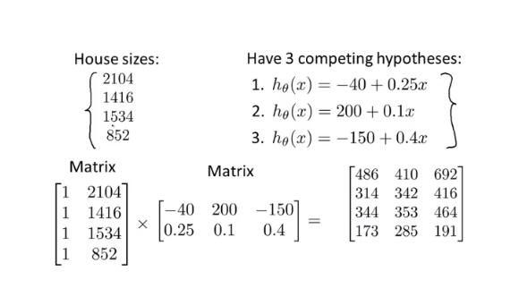
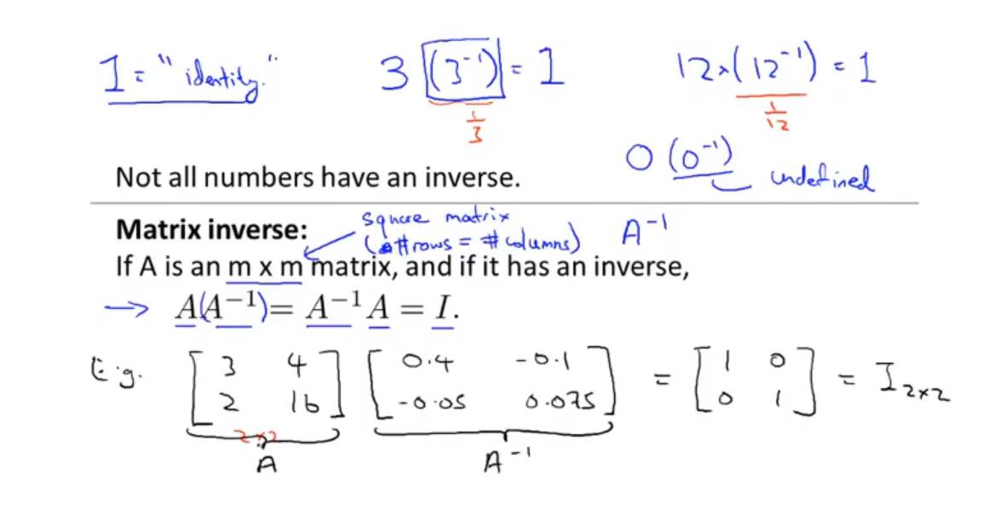

## 矩阵向量乘法的数学意义

[矩阵与向量的乘积](https://www.cnblogs.com/yibeimingyue/p/9924698.html)

`m*n  matrix  乘  n*o matrix   =  m*o matrix`
> 矩阵加法是要求两个矩阵的shape是一致的




```
1、乘法交换律：在两个bai数的乘法运算中，在从左往du右计算zhi的顺序，两个因数dao相乘，交换因数的位置，积不变。

乘法交换律公式：a×b=b×a

2、乘法结合律：三个数相乘，先把前两个数相乘，再和另外一个数相乘，或先把后两个数相乘，再和另外一个数相乘，积不变。

乘法结合律公式(a×b)×c=a×(b×c)

3、乘法分配律：两个数的和与一个数相乘，可以先把它们分别与这个数相乘，再将积相加。

乘法分配律公式：(a+b)×c=a×c+b×c
```

- `A*B != B*A` 也就是不符合交换律
- `A*B*C = A*(B*C) = (A*B)*C`  也就是符合结合律

- Identity Matrix 单位化矩阵(斜对角是1，其它位置是0)  `I (n*n)  那么任何矩阵A m*n  有A*I = I*A = A`

[转置矩阵（matrix transpose）和逆矩阵（matrix inverse）](https://blog.csdn.net/cui6864520fei000/article/details/86572306)
-  matrix inverse 存在矩阵M以及矩阵N，假如M*N = 矩阵I（Identify Matrix单位矩阵），那么矩阵M和矩阵N互为逆矩阵。


打开Octave
```
୰>> A = [3 4; 2 16]
A =

    3    4
    2   16

>> pinv(A)
ans =

   0.400000  -0.100000
  -0.050000   0.075000

>> A-i = pinv(A)
parse error:

  invalid left hand side of assignment

>>> A-i = pinv(A)
        ^

>> A_i = pinv(A)
A_i =

   0.400000  -0.100000
  -0.050000   0.075000

>> A * A_i
ans =

   1.0000e+00   5.5511e-17
  -2.2204e-16   1.0000e+00

>>
```
