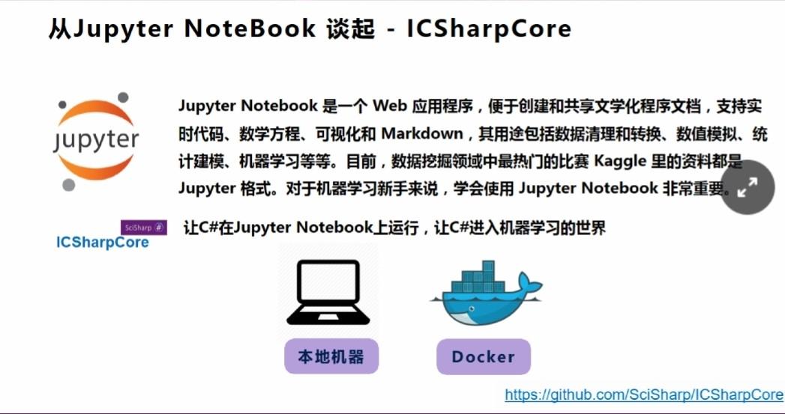
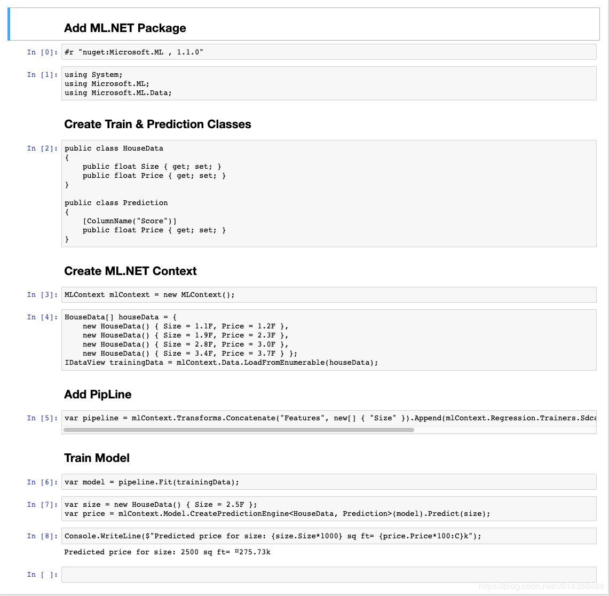
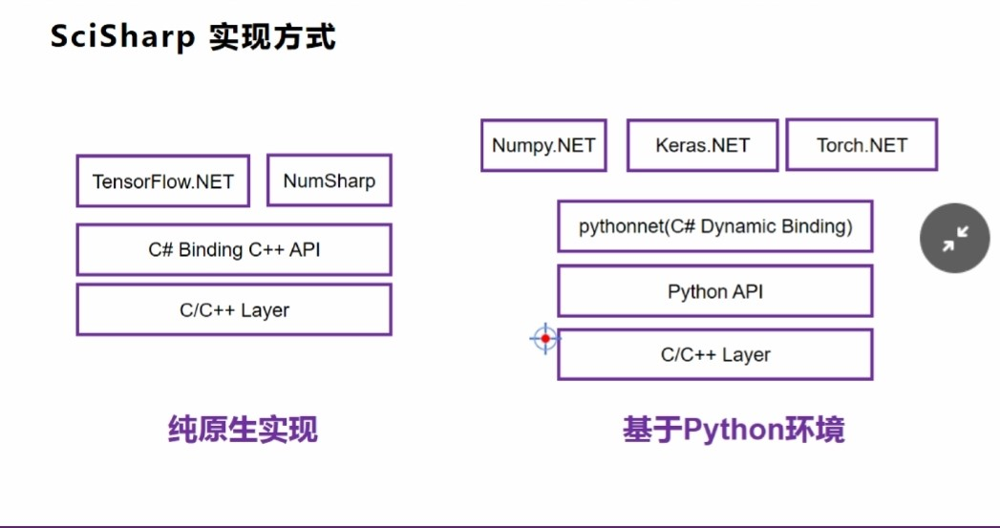
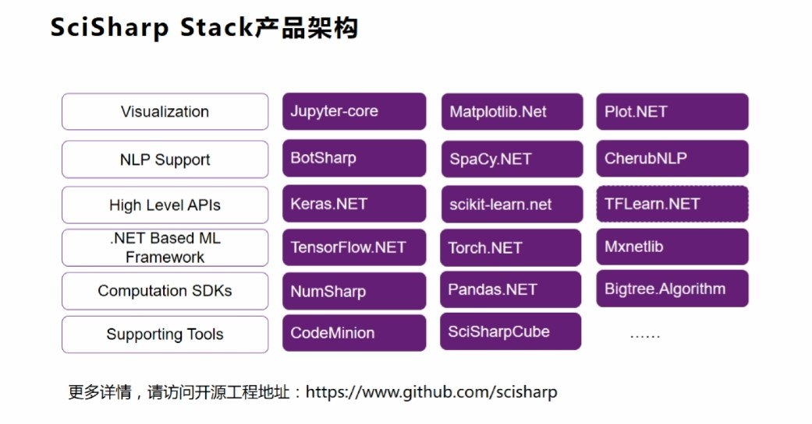

## 让你的jupyter notebook支持dotnet
通过[ICSharpCore](https://github.com/SciSharp/ICSharpCore)你可以为Jupyter Notebook 添加C#的支持
##### 1.下载云源码并编译
```
git clone https://github.com/SciSharp/ICSharpCore
```

如果你希望你的ICSharpCore环境支持Microsoft.ML 你需要在改项目下通过dotnet add package添加Microsoft.ML的支持

##### 2.jupyter notebook 增加dotnet kernel
去kernel-spec目录下修改kernel.json , 指定好刚才编译生成的ICSharpCore.dll的路径, 回到ICSharpCore目录下执行 
```
​jupyter kernelspec install kernel-spec --name=csharpcore 
jupyter kernelspec list​
```

##### 3.开始使用dotnet
通过New 可以看到选项已经添加C#的支持(SciSharpCube这个名字不错，所以我省得再修改了，当然你觉得不够爽就自己通过修改kernel.json去修改)，选中SciSharpCube就可以在Jupyter Notebook使用C#代码。
因为ICSharpCore结合Roslyn编译器进行使用，所以你引用库时，也需要通过#r 进行使用。
基于ML.NET的notebook



##### 4.Docker部署环境
https://github.com/SciSharp/SciSharpCube

###### 4.1 Run from Docker Hub
```
docker pull scisharpstack/scisharpcube:0.4
docker run --name scisharp -it -p 8888:8888 scisharpstack/scisharpcube:0.4
```
###### 4.2 Build image from local
If microsoft/dotnet is not pulled automatically, you should run docker pull microsoft/dotnet first.
```
git clone https://github.com/SciSharp/SciSharpCube
cd SciSharpCube
docker build -f ./dockerfiles/cube.dockfile -t scisharpcube .

docker run --name scisharp -it -p 8888:8888 scisharpcube

docker exec -it scisharp bash
```
## SciSharp
SciSharp对于不同框架的绑定，无非两种，第一种像TensorFlow.NET是基于TensorFlow原生的C库做绑定，这种做法的优点是对Python的依赖少，更像原生实现，第二种就直接基于[pythonnet](https://github.com/pythonnet/pythonnet)这个扩展去实现，这种做法就是桥接只需要做一些简单的语言扩展就可以快速实现功能，但有一个问题就是对本机Python环境依赖极高需要为不同版本的Python版本设置不同的dll，还有就是不够原汁原味了。但这两种方法其实对环境变量的设置都有要求，如TensorFlow.NET原生 就别忘记去设置TF的C库放置的环境变量路径，还有如依赖于pythonnet的Keras.NET, Numpy.NET就别忘记指定好你本机Python版本的lib文件夹路径，否则就会出现很多问题。
SciSharp在[medium](https://medium.com/scisharp)上有不少介绍和示例，建议大家都去看看




