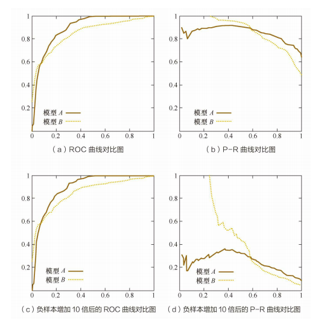
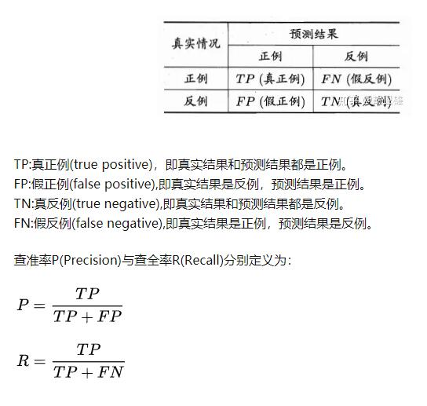
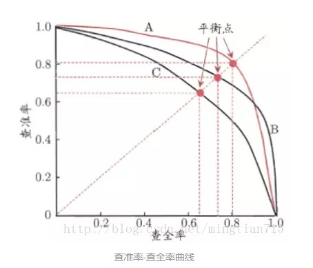
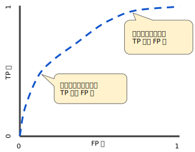
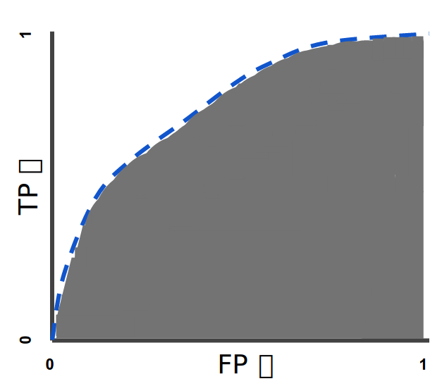
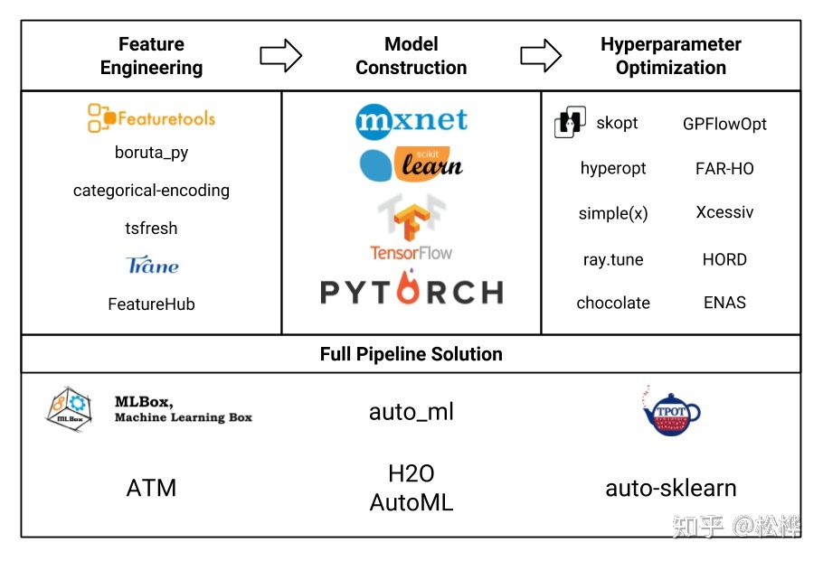
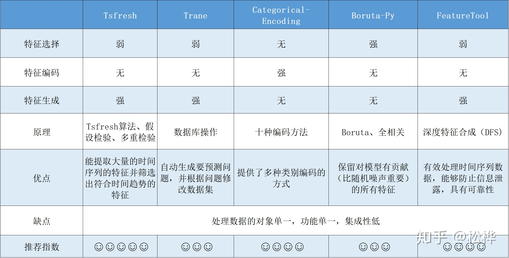
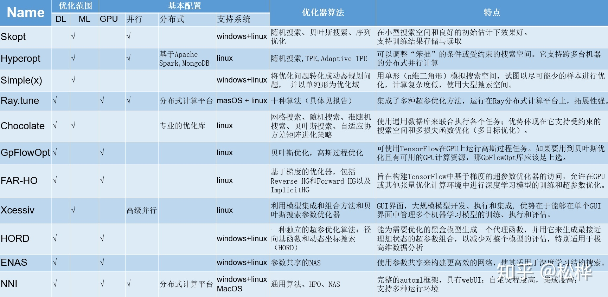
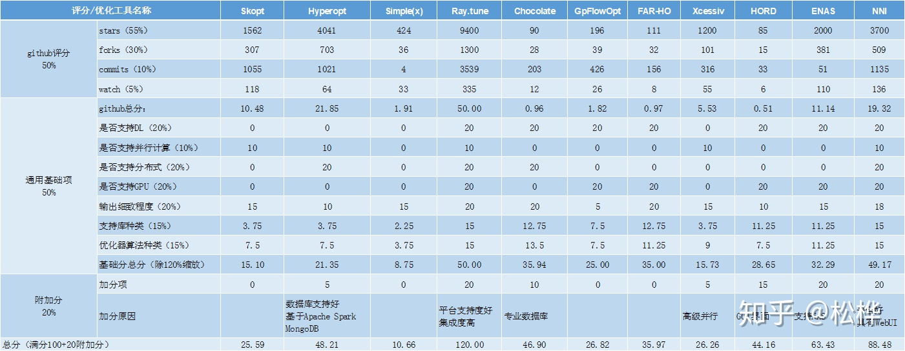

<!--toc-->
[TOC]
# 模型选择

> 一般针对过拟合的情况，我们可以在损失函数中增加正则项(L0、L1、L2范数，Dropout)来解决过拟合的问题
> [机器学习中常常提到的正则化到底是什么意思？](https://www.zhihu.com/question/20924039)

## 准确率、精确率、召回率
精确率是针对我们预测结果而言的，它表示的是预测为正的样本中有多少是真正的正样本。

召回率是针对我们原来的样本而言的，它表示的是样本中的正例有多少被预测正确了。

**demo1**
假设我们手上有60个正样本，40个负样本，我们要找出所有的正样本，系统查找出50个，其中只有40个是真正的正样本，计算上述各指标。
TP: 将正类预测为正类数 40(系统查找出40个是真正的正样本)
FN: 将正类预测为负类数 20(60个正样本 - 系统查找出40个是真正的正样本)
FP: 将负类预测为正类数 10(系统查找出50个 - 系统查找出40个是真正的正样本)
TN: 将负类预测为负类数 30(系统查找出50个正样本，那么就是预测了50个负样本，但是50个认为的负样本中实际上有20个正样本，所以30=50-20)

准确率(accuracy)(ACC) = 预测对的/所有 = (TP+TN)/(TP+FN+FP+TN) = 70%

精确率(precision)(PPV) = TP/(TP+FP) = 80%

召回率(recall) = TP/(TP+FN) = 2/3 

> 灵敏度（Sensitivity）（TPR）：就是召回率（Recall）召回率 = 提取出的正确信息条数 / 样本中的信息条数。通俗地说，就是所有准确的条目有多少被检索出来了

真正例率 (TPR) 是召回率的同义词 = TP/(TP+FN)

假正例率 (FPR) = FP/(FP+TN)

> 特异度(TNR)  Specificity = TN/(TN+FP)  

> 以上都是二级指标

> 三级指标 F1 Score = 2PR/(P+R)
> 其中，P代表Precision，R代表Recall。
> F1-Score指标综合了Precision与Recall的产出的结果。
> F1-Score的取值范围从0到1的，1代表模型的输出最好，0代表模型的输出结果最差

1）TP就是【True P】;FP就是【False P】。都是站在预测的角度来描述的。 
（2）P代表的是Positive【正类】; N表示的是Negative【负类】

Positive代表原始类别，而Negative代表其他所有的类别

FN：False Negative,被判定为负样本，但事实上是正样本。
FP：False Positive,被判定为正样本，但事实上是负样本。
TN：True Negative,被判定为负样本，事实上也是负样本。
TP：True Positive,被判定为正样本，事实上也是正样本。


**demo2**
分类阈值（也称为判定阈值）。如果值高于该阈值，则表示“垃圾邮件”；如果值低于该阈值，则表示“非垃圾邮件”。人们往往会认为分类阈值应始终为 0.5，但阈值取决于具体问题，因此您必须对其进行调整。

让我们以一种将电子邮件分为“垃圾邮件”或“非垃圾邮件”这两种类别的分类模型为例。
如果提高分类阈值，
**精确率可能会提高**:一般来说，提高分类阈值会减少假正例，从而提高精确率。
**召回率始终下降或保持不变**:提高分类阈值会导致真正例的数量减少或保持不变，而且会导致假负例的数量增加或保持不变。因此，召回率会保持不变或下降。

> 注意：“调整”逻辑回归的阈值不同于调整学习速率等超参数。在选择阈值时，需要评估您将因犯错而承担多大的后果。例如，将非垃圾邮件误标记为垃圾邮件会非常糟糕。不过，虽然将垃圾邮件误标记为非垃圾邮件会令人不快，但应该不会让您丢掉工作。反之将非垃圾邮件标记为垃圾邮件，那么你可以回家了。

<table border="1">
  <tbody><tr>
    <td style="background-color:#99FF99" width="50%">
      <b>真正例 (TP)：</b>
      <ul>
        <li>真实情况：受到狼的威胁。</li>
        <li>牧童说：“狼来了。”</li>
        <li>结果：牧童是个英雄。</li>
      </ul>
    </td>
    <td style="background-color:#FF9999">
      <b>假正例 (FP)：</b>
      <ul>
        <li>真实情况：没受到狼的威胁。</li>
        <li>牧童说：“狼来了。”</li>
        <li>结果：村民们因牧童吵醒他们而感到非常生气。</li>
    </ul></td>
  </tr>
  <tr>
    <td style="background-color:#FF9999">
      <b>假负例 (FN)：</b>
      <ul>
        <li>真实情况：受到狼的威胁。</li>
        <li>牧童说：“没有狼”。</li>
        <li>结果：狼吃掉了所有的羊。</li>
      </ul>
    </td>
    <td style="background-color:#99FF99">
      <b>真负例 (TN)：</b>
      <ul>
        <li>真实情况：没受到狼的威胁。</li>
        <li>牧童说：“没有狼”。</li>
        <li>结果：大家都没事。</li>
      </ul>
    </td>
  </tr>
</tbody></table>
**demo3**
在 100 个肿瘤样本中，91 个为良性（90 个 TN 和 1 个 FP），9 个为恶性（1 个 TP 和 8 个 FN）。
<table border="1">
  <tbody><tr>
    <td style="background-color:#99FF99" width="50%">
      <b>真正例 (TP)：</b>
      <ul>
        <li>真实情况：恶性</li>
        <li>机器学习模型预测的结果：恶性</li>
        <li><strong>TP 结果数：1</strong></li>
      </ul>
    </td>
    <td style="background-color:#FF9999">
      <b>假正例 (FP)：</b>
      <ul>
        <li>真实情况：良性</li>
        <li>机器学习模型预测的结果：恶性</li>
        <li><strong>FP 结果数：1</strong></li>
    </ul></td>
  </tr>
  <tr>
    <td style="background-color:#FF9999">
      <b>假负例 (FN)：</b>
      <ul>
        <li>真实情况：恶性</li>
        <li>机器学习模型预测的结果：良性</li>
        <li><strong>FN 结果数：8</strong></li>
      </ul>
    </td>
    <td style="background-color:#99FF99">
      <b>真负例 (TN)：</b>
      <ul>
        <li>真实情况：良性</li>
        <li>机器学习模型预测的结果：良性</li>
        <li><strong>TN 结果数：90</strong></li>
      </ul>
    </td>
  </tr>
</tbody></table>

准确率 = (TP+TN)/(TP+FN+FP+TN) = (1+90)/(1+90+1+8) = 0.91
精确率 =  TP/(TP+FP) = 1/(1+1) = 0.5 ，也就是说，该模型在预测恶性肿瘤方面的正确率是 50%。
召回率 =  TP/(TP+FN) = 1/(1+8) = 0.11，也就是说，该模型能够正确识别出所有恶性肿瘤的百分比是 11%。

以上数据说明：
1. 当您使用分类不平衡的数据集（比如正类别标签和负类别标签的数量之间存在明显差异）时，单单准确率一项并不能反映全面情况。
2. 判断模型的好坏需要通过 准确率和召回率两个指标来判断

**demo4**
> 在 roulette 游戏中，一只球会落在旋转轮上，并且最终落入 38 个槽的其中一个内。某个机器学习模型可以使用视觉特征（球的旋转方式、球落下时旋转轮所在的位置、球在旋转轮上方的高度）预测球会落入哪个槽中，准确率为 4%。
> 这个机器学习模型做出的预测比碰运气要好得多；随机猜测的正确率为 1/38，即准确率为 2.6%。尽管该模型的准确率“只有”4%，但成功预测获得的好处远远大于预测失败的损失。


[分类 (Classification)：检查您的理解情况（ROC 和 AUC）](https://developers.google.cn/machine-learning/crash-course/classification/check-your-understanding-roc-and-auc?hl=zh-cn)


## 性能评估
### 交叉验证
训练集上的损失值是无法衡量模型的好坏的。我们的办法就是增加交叉验证集，即将所有数据分为三部分：训练集、交叉验证集和测试集。交叉验证集不仅在选择模型时有用，在超参数选择、正则项参数 λ 和评价模型中也很有用。(也就是划分验证集用来模型选择和调参)


### 模型评估 - 代价曲线

在分类型模型评判的指标中，常见的方法有如下三种：

1. 混淆矩阵（也称误差矩阵，Confusion Matrix）
2. ROC曲线
3. AUC面积
4. DET(Detection Error Tradeoff )

ROC曲线有个很好的特性：当测试集中的正负样本的分布变化时，ROC曲线能够保持不变。在实际的数据集中经常会出现不平衡(class imbalance)现象，即负样本比正样本多很多（或者相反），而且测试数据中的正负样本的分布也可能随着时间变化。下图是ROC曲线和P-R曲线的对比:


#### 查准率－查全率曲线（P-R曲线）

> metrics.plot_precision_recall_curve




#### ROC曲线
”真正例率“（True Positive Rate,简称TPR)和”假正例率“（False Positive Rate,简称FPR)


```
from sklearn.metrics import plot_roc_curve
svc_disp = plot_roc_curve(svc, X_test, y_test)
plt.show()
```

#### AUC值
> metrics.auc

就是ROC曲线下面积


#### 混淆矩阵（confusion_matrix）
https://blog.csdn.net/SmartShylyBoy/article/details/91360934

## 超参调优
[Optuna - 超参数自动化调优框架](https://github.com/optuna/optuna)

### model_selection.ParameterSampler 参数生成器
### model_selection.GridSearchCV 和RandomizedSearchCV 网格搜索
GridSearchCV，它存在的意义就是自动调参，只要把参数输进去，就能给出最优化的结果和参数。但是这个方法适合于小数据集，一旦数据的量级上去了，很难得出结果。
### HalvingGridSearchCV和 HalvingRandomSearchCV

## 模型可解释性 - 指标和评分
一般模型验证时需要用到各种指标：
model_selection.cross_validate 交叉验证
参数:scoring 就是评分指标（str, callable, list, tuple, or dict, default=None）
参数：groups:切分train/test数据集后的样本所在集合标号

[交叉验证迭代器](https://scikit-learn.org/stable/modules/cross_validation.html#cross-validation-iterators)

验证使用的验证指标可以是方法、字符串、以及字典,如：
```
scoring = {'accuracy': make_scorer(accuracy_score),
          'prec': 'precision'}
```
所有指标
```
from sklearn import metrics
metrics.SCORERS.keys()
```


指标表格

| Scoring                              | Function                               | Comment                        |
|--------------------------------------|----------------------------------------|--------------------------------|
| Classification                       |                                        |                                |
| ‘accuracy’                           | metrics.accuracy_score                 |                                |
| ‘balanced_accuracy’                  | metrics.balanced_accuracy_score        |                                |
| ‘top_k_accuracy’                     | metrics.top_k_accuracy_score           |                                |
| ‘average_precision’                  | metrics.average_precision_score        |                                |
| ‘neg_brier_score’                    | metrics.brier_score_loss               |                                |
| ‘f1’                                 | metrics.f1_score                       | for binary targets             |
| ‘f1_micro’                           | metrics.f1_score                       | micro-averaged                 |
| ‘f1_macro’                           | metrics.f1_score                       | macro-averaged                 |
| ‘f1_weighted’                        | metrics.f1_score                       | weighted average               |
| ‘f1_samples’                         | metrics.f1_score                       | by multilabel sample           |
| ‘neg_log_loss’                       | metrics.log_loss                       | requires predict_proba support |
| ‘precision’ etc.                     | metrics.precision_score                | suffixes apply as with ‘f1’    |
| ‘recall’ etc.                        | metrics.recall_score                   | suffixes apply as with ‘f1’    |
| ‘jaccard’ etc.                       | metrics.jaccard_score                  | suffixes apply as with ‘f1’    |
| ‘roc_auc’                            | metrics.roc_auc_score                  |                                |
| ‘roc_auc_ovr’                        | metrics.roc_auc_score                  |                                |
| ‘roc_auc_ovo’                        | metrics.roc_auc_score                  |                                |
| ‘roc_auc_ovr_weighted’               | metrics.roc_auc_score                  |                                |
| ‘roc_auc_ovo_weighted’               | metrics.roc_auc_score                  |                                |
| Clustering                           |                                        |                                |
| ‘adjusted_mutual_info_score’         | metrics.adjusted_mutual_info_score     |                                |
| ‘adjusted_rand_score’                | metrics.adjusted_rand_score            |                                |
| ‘completeness_score’                 | metrics.completeness_score             |                                |
| ‘fowlkes_mallows_score’              | metrics.fowlkes_mallows_score          |                                |
| ‘homogeneity_score’                  | metrics.homogeneity_score              |                                |
| ‘mutual_info_score’                  | metrics.mutual_info_score              |                                |
| ‘normalized_mutual_info_score’       | metrics.normalized_mutual_info_score   |                                |
| ‘rand_score’                         | metrics.rand_score                     |                                |
| ‘v_measure_score’                    | metrics.v_measure_score                |                                |
| Regression                           |                                        |                                |
| ‘explained_variance’                 | metrics.explained_variance_score       |                                |
| ‘max_error’                          | metrics.max_error                      |                                |
| ‘neg_mean_absolute_error’            | metrics.mean_absolute_error            |                                |
| ‘neg_mean_squared_error’             | metrics.mean_squared_error             |                                |
| ‘neg_root_mean_squared_error’        | metrics.mean_squared_error             |                                |
| ‘neg_mean_squared_log_error’         | metrics.mean_squared_log_error         |                                |
| ‘neg_median_absolute_error’          | metrics.median_absolute_error          |                                |
| ‘r2’                                 | metrics.r2_score                       |                                |
| ‘neg_mean_poisson_deviance’          | metrics.mean_poisson_deviance          |                                |
| ‘neg_mean_gamma_deviance’            | metrics.mean_gamma_deviance            |                                |
| ‘neg_mean_absolute_percentage_error’ | metrics.mean_absolute_percentage_error |                                |

## 模型可解释性
### 分类报告 metrics.classification_report
### 各种损失
- 分类
metrics.hamming_loss
metrics.brier_score_loss
metrics.hinge_loss
metrics.log_loss
metrics.zero_one_loss

- 回归
metrics.mean_absolute_error(y_true, y_pred, *)
metrics.mean_squared_error(y_true, y_pred, *) 均方误差
metrics.mean_squared_log_error(y_true, y_pred, *)
metrics.median_absolute_error(y_true, y_pred, *)
metrics.mean_absolute_percentage_error(…)
metrics.mean_poisson_deviance(y_true, y_pred, *)
metrics.mean_gamma_deviance(y_true, y_pred, *)
metrics.mean_tweedie_deviance(y_true, y_pred, *)

### 相关系数
jaccard_score 相关系数
matthews_corrcoef 相关系数
## 模型可解释性 - 绘图部分
### model_selection.learning_curve 学习曲线
[Plotting Learning Curves](https://scikit-learn.org/stable/auto_examples/model_selection/plot_learning_curve.html)

### model_selection.validation_curve 验证曲线
[Plotting Validation Curves](https://scikit-learn.org/stable/auto_examples/model_selection/plot_validation_curve.html)

### metrics.plot_precision_recall_curve PR曲线
> 就是metrics.precision_recall_curve + metrics.PrecisionRecallDisplay

### metrics.plot_roc_curve ROC曲线（直接绘制）
> 就是metrics.roc_curve + metrics.RocCurveDisplay

### metrics.plot_det_curve DET曲线（直接绘制）
> 就是metrics.det_curve +metrics.DetCurveDisplay

DET(Detection Error Tradeoff )曲线是对二元分类系统误码率的曲线图，绘制出错误拒绝率FRR（False Reject Rate）与错误接受率（False Accept Rate）之间随着判断阈值的变化而变化的曲线图。现在DET曲线扩展到用于模式识别分类器性能的评价的一个指标之一。


### metrics.plot_confusion_matrix 混淆矩阵
> 就是metrics.confusion_matrix + metrics.ConfusionMatrixDisplay
[模型评估之混淆矩阵（confusion_matrix）](https://blog.csdn.net/SmartShylyBoy/article/details/91360934)

### inspection.plot_partial_dependence 部分依赖图和个体条件期望图
https://zhuanlan.zhihu.com/p/364921771

https://scikit-learn.org/stable/modules/classes.html#module-sklearn.inspection

# AutoML


https://zhuanlan.zhihu.com/p/93109455

## 特征工程工具
- Tsfresh
- Trane
- Categorical Encoding
- boruta_py
- Featuretools


## 超参优化工具
- optuna
- Skopt
- Hyperopt
- Simple(x)
- Ray.tune
- Chocolate
- GpFlowOpt
- FAR-HO
- Xcessiv
- HORD
- ENAS
- NNI



评比规则：通用基础项（50%）+gihub评分（50%）+加分项（20%）


## AutoML开源框架

- MLBox
- Autokeras
- TPOT
- H2O
- Auto_ml


- [auto-sklearn](https://github.com/automl/auto-sklearn/) 自动机器学习工具包和scikit-learn估计器的直接替代品

- [autoviml](https://github.com/AutoViML/Auto_ViML/) 用单行代码自动构建多个机器学习模型。设计为使用scikit学习模型的更快方法，而无需预处理数据。

- [TPOT](https://github.com/rhiever/tpot) 一种自动化的机器学习工具包，可优化一系列scikit-learner操作员以设计机器学习管道，包括数据和功能预处理器以及估计器。可以替代scikit-learn估算器。

- [Featuretools](https://github.com/FeatureLabs/featuretools) 执行自动特征工程的框架。它可以用于将时间和关系数据集转换为用于机器学习的特征矩阵。

- [Neuraxle](https://github.com/Neuraxio/Neuraxle) 一个用于构建整洁管道的库，提供正确的抽象以简化机器学习应用程序的研究，开发和部署。它与深度学习框架和scikit-learn API兼容，可以流式处理迷你批处理，使用数据检查点，构建时髦的管道以及使用自定义逐步保存程序序列化模型。