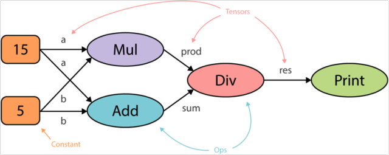

<!-- toc -->
[TOC]
# 机器学习

## 学习地址

[机器学习google手册](https://developers.google.cn/machine-learning/crash-course/)

[数据科学教育](https://www.kaggle.com/learn/overview)


https://github.com/ujjwalkarn/Machine-Learning-Tutorials

https://github.com/deeplearning-ai/machine-learning-yearning-cn

https://www.jianshu.com/c/5aca64d148d5

https://github.com/josephmisiti/awesome-machine-learning


## 机器学习框架

- 在工业界Tensorflow依旧无可取代
- 在学术界Pytorch已经超越Tensorflow

https://chillee.github.io/pytorch-vs-tensorflow/

### Google 的 Tensorflow 2015 年在 GitHub 上开源 140K+
[论文](../files/ml/Tensorflow-whitepaper2015.pdf)



TensorFlow 顶级项目
- Magenta：一个探索将机器学习用作创造过程的工具的开源研究项目：https://magenta.tensorflow.org/

- Sonnet：这是一个基于 TensorFlow 的软件库，可用于构建复杂的神经网络：https://sonnet.dev/

- Ludwig：这是一个无需写代码就能训练和测试深度学习模型的工具箱：https://uber.github.io/ludwig/

### Facebook 的 PyTorch 2017 年在 GitHub 上开源 35K+
[论文](../files/ml/automatic_differentiation_in_pytorch.pdf)

```
pip install torch 报错
https://pytorch.org/
https://blog.csdn.net/cxyj666/article/details/97617358
```


PyTorch 顶级项目

- CheXNet：使用深度学习来分析胸部 X 光照片，能实现放射科医生水平的肺炎监测：https://stanfordmlgroup.github.io/projects/chexnet/

- PYRO：这是一种用 Python 编写的通用概率编程语言（PPL），后端由 PyTorch 支持：https://pyro.ai (https://pyro.ai/)

- Horizon：一个用于应用强化学习（Applied RL）的平台：https://horizonrl.com (https://horizonrl.com/)

### Scikit-learn 35K+
Scikit-learn是一个完全用Python编写的机器学习框架。 它使你可以使用已建立的模型对数据运行分类，回归，聚类和降维过程，同时支持有监督和无监督的学习方法。

Scikit-learn是仅Python的实现，因此尽管它对Java / Javascript框架的移植性不强，但仍可以在所有现代桌面操作系统上使用。

Scikit-learn之所以与众不同，是因为它提供了庞大的高质量文档，以及所有部分的一致API。

### Microsoft Cognitive Toolkit(CNTK) 15K+
https://github.com/microsoft/CNTK

CNTK与Torch和PyTorch一样，支持NVIDIA的CUDA技术。 它也与.NET标准兼容，因此可用于通过.NET框架（甚至在Linux上）编写跨平台应用程序。 它支持ONNX格式（这是神经网络的开源格式）。

### Accord.NET 1.7K+
https://github.com/accord-net/framework

## 线性代数、微积分、概率和统计
### 线性代数概念：
1. 矩阵运算
2. 特征值/特征向量
3. 向量空间和范数

### 微积分概念：
1. 偏导数
2. 向量-值函数
3. 方向梯度

### 统计概念：
1. Bayes定理
2. 组合学
3. 抽样方法

## 机器学习有三类算法：
### 监督式学习（Supervised Learning， SL）
监督学习是指原始数据中既有特征值也有标签值的机器学习。用输入层的数据计算输出层的值，然后对比标签值计算误差，再通过迭代找到最佳模型参数。所谓机器学习就是指对已知数据不断迭代从而找到最佳参数的过程。

属于监督式学习的算法有：KNN、回归模型，决策树，随机森林，K邻近算法，逻辑回归、SVM等。

### 无监督式学习（Unsupervised Learning， UL）
与监督式学习不同的是，无监督学习中我们没有需要预测或估计的目标变量（或标签值）。无监督式学习是用来对总体对象进行分类的。它在根据某一指标将客户分类上有广泛应用。

属于无监督式学习的算法有：关联规则，K-means聚类算法等。

### 强化学习（Reinforcement Learning， RL）
这个算法可以训练程序做出某一决定。程序在某一情况下尝试所有的可能行动，记录不同行动的结果并试着找出最好的一次尝试来做决定。

属于这一类算法的有马尔可夫决策过程。

## 算法：
* 回归算法
这可能是最流行的机器学习算法，线性回归算法是基于连续变量预测特定结果的监督学习算法。另一方面，Logistic回归专门用来预测离散值。这两种（以及所有其他回归算法）都以它们的速度而闻名，它们一直是最快速的机器学习算法之一。

* 基于实例的算法
基于实例的分析使用提供数据的特定实例来预测结果。最著名的基于实例的算法是k-最近邻算法，也称为KNN。KNN用于分类，比较数据点的距离，并将每个点分配给它最接近的组。

* 决策树算法
决策树算法将一组“弱”学习器集合在一起，形成一种强算法，这些学习器组织在树状结构中，相互分支。一种流行的决策树算法是随机森林算法。在该算法中，弱学习器是随机选择的，这往往可以获得一个强预测器。在下面的例子中，我们可以发现许多共同的特征(就像眼睛是蓝的或者不是蓝色的)，它们都不足以单独识别动物。然而，当我们把所有这些观察结合在一起时，我们就能形成一个更完整的画面，并做出更准确的预测。

* 贝叶斯算法
丝毫不奇怪，这些算法都是基于Bayes理论的，最流行的算法是朴素Bayes，它经常用于文本分析。例如，大多数垃圾邮件过滤器使用贝叶斯算法，它们使用用户输入的类标记数据来比较新数据并对其进行适当分类。

* 聚类算法
聚类算法的重点是发现元素之间的共性并对它们进行相应的分组，常用的聚类算法是k-means聚类算法。在k-means中，分析人员选择簇数(以变量k表示)，并根据物理距离将元素分组为适当的聚类。

* 深度学习（神经网络）算法
人工神经网络算法基于生物神经网络的结构，深度学习采用神经网络模型并对其进行更新。它们是大、且极其复杂的神经网络，使用少量的标记数据和更多的未标记数据。神经网络和深度学习有许多输入，它们经过几个隐藏层后才产生一个或多个输出。这些连接形成一个特定的循环，模仿人脑处理信息和建立逻辑连接的方式。此外，随着算法的运行，隐藏层往往变得更小、更细微。

中文 | 英文
-|-
计算机视觉    |      Computer Vision 无人驾驶识别红绿灯
自然语言处理   |     Natural Language Processing(NLP) 语音识别，智能对话 属于 自然语言处理
机器学习        |    General-Purpose Machine Learning
数据分析/数据可视化 | Data Analysis / Data Visualization
语音识别 |          Speech Recognition
空间分析和几何 |  Spatial analysis and geometry
手势检测 | Gesture Detection
序列分析 | Sequence Analysis

CV教他认识他看到的一切，NLP教他更好理解我们的意思

应用：
* 物联网
物联网（Internet of Things），或者说IOT

* 聊天机器人
slack

* 自动驾驶
Uber和Tsla

* 推荐系统

* 风控