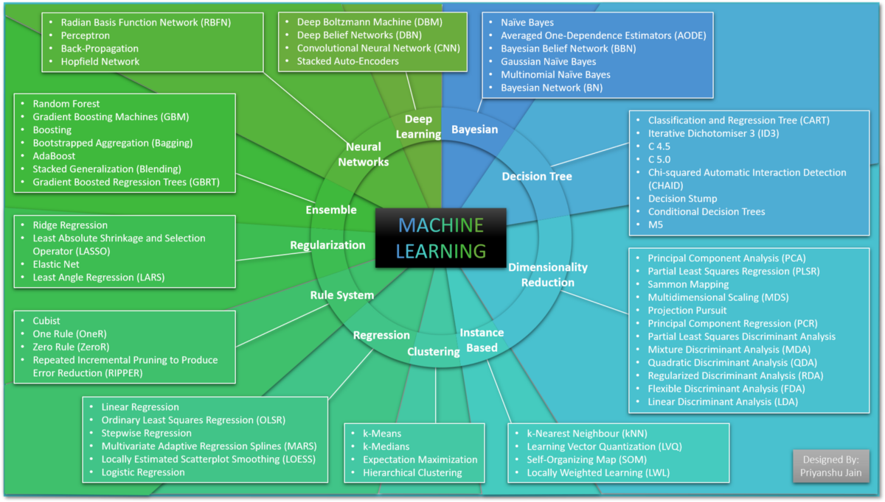
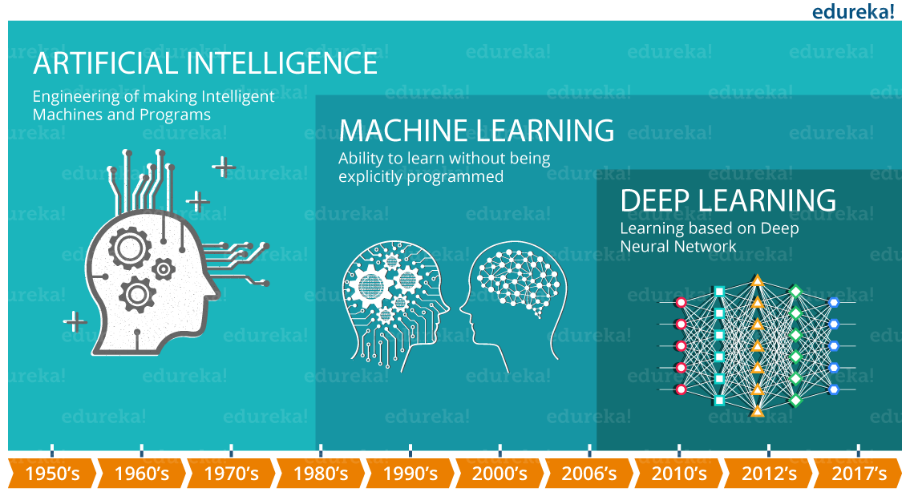
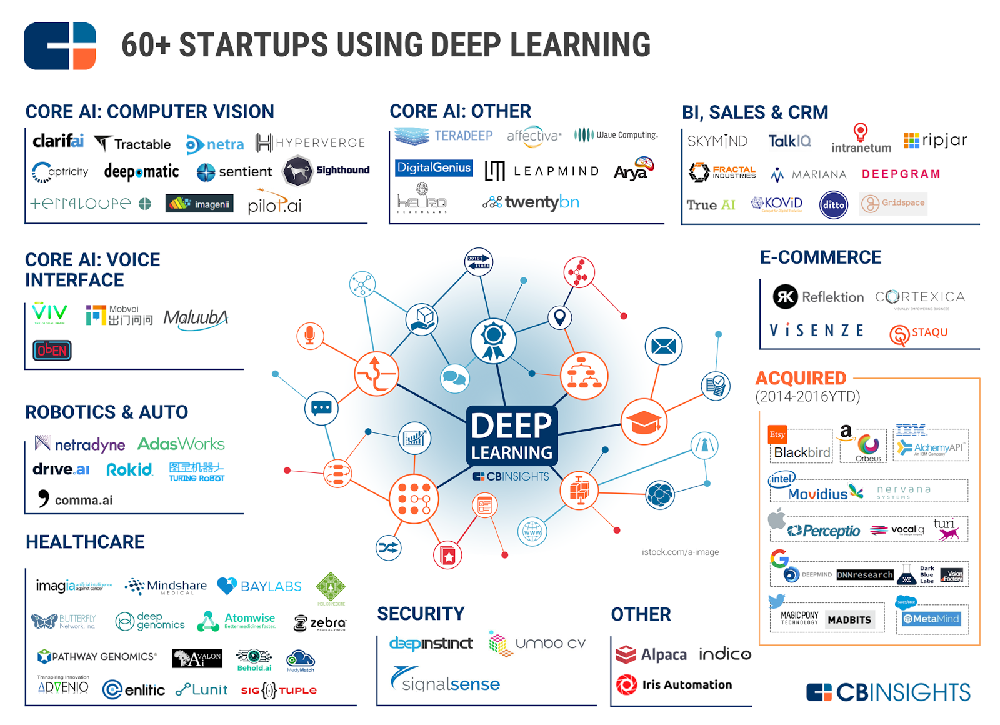
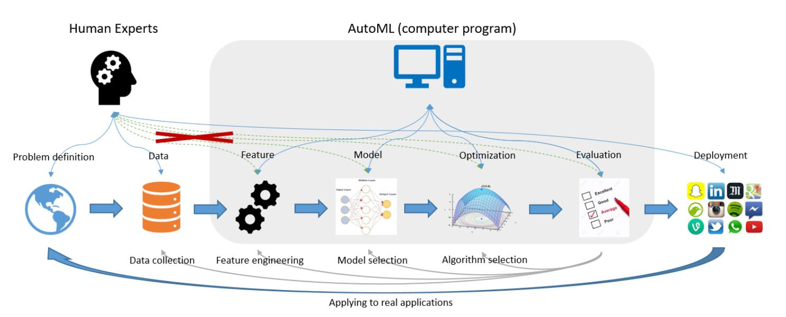
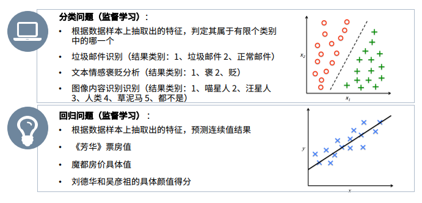
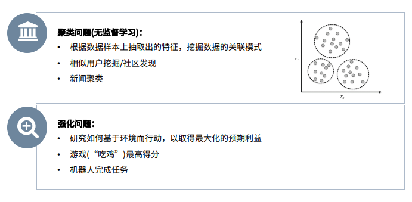

<!-- toc -->
[TOC]
# 机器学习

[MLPerf -AI芯片的基准测试](https://www.mlperf.org/)

[DNN，CNN和RNN的12种主要dropout方法的数学和视觉解释](https://blog.csdn.net/m0_46510245/article/details/106600133)

[Facebook 发布 TransCoder：实现 C ++ 到 Java、Python 的代码转化 | 论文解读](https://www.infoq.cn/article/vIvKyNV89Aw0x4uIQKxK)


https://arxiv.org/pdf/2006.03511.pdf

## 工业界和学术界
工业界和学术界最大的区别，工业界追求的是产品和利润，学术界关心的是技术；工业届着重有用更务实，学术届着眼未来更看重创新。

第一点:工业界要的一定是可转化的成果，成果形式是实实在在的产品；而学术界允许你做的技术暂时没有什么用，成果可能就是paper，基金，title什么的；

第二点:因为追求的目标不同，大部分就是大部分时间工业界要用的是现成的技术，而学术界在研究新技术。工业界做的更多的是成果转化，学术界做的是技术探索；


先不谈钱，从贡献上说，学术圈和工业界看问题的出发点不一样，学术圈追求现有技术、方法上的提高和创新，会把一个事情的解决立足到一类共性问题上。工业界更多是就事论事，以如何提高产品效率、精度、美观等进行技术改造。

工业界：这东西真好用，有意义，解决实际问题，还能挣钱！

学术界：这东西有创新，有难度，能写出好文章，还能报奖！


## 学习地址

[机器学习相关教程](https://github.com/MorvanZhou/tutorials)
[动手学深度学习](https://github.com/d2l-ai/d2l-zh)
深度学习框架也在传播深度学习思想的过程中扮演了重要角色。Caffe、 Torch和Theano这样的第一代框架使建模变得更简单。许多开创性的论文都用到了这些框架。如今它们已经被TensorFlow（经常是以高层API Keras的形式被使用）、CNTK、 Caffe 2 和Apache MXNet所取代。第三代，即命令式深度学习框架，是由用类似NumPy的语法来定义模型的 Chainer所开创的。这样的思想后来被 PyTorch和MXNet的Gluon API 采用，后者也正是本书用来教学深度学习的工具

[机器学习google手册](https://developers.google.cn/machine-learning/crash-course/)

[数据科学教育](https://www.kaggle.com/learn/overview)


https://github.com/ujjwalkarn/Machine-Learning-Tutorials

https://github.com/deeplearning-ai/machine-learning-yearning-cn

https://www.jianshu.com/c/5aca64d148d5

https://github.com/josephmisiti/awesome-machine-learning





## AutoML

为了使用机器学习技术并获得良好的性能，人类通常需要参与数据采集、特征提取工程、模型和算法选择。这张图显示了一个典型的机器学习应用程序管道，以及AutoML如何参与其中尽可能减少人类的参与。
https://arxiv.org/pdf/1810.13306.pdf

### auto-sklearn
https://automl.github.io/auto-sklearn/master/

### TPOT
Tree-based Pipeline Optimization Tool, TPOT
TPOT 文档地址：https://epistasislab.github.io/tpot/。

TPOT 的教程示例地址：https://epistasislab.github.io/tpot/examples/

### HyperOpt
HyperOpt 是一个用于贝叶斯优化的 Python 库
http://hyperopt.github.io/hyperopt-sklearn/


### AutoKeras
文档地址：https://autokeras.com/

教程地址：https://towardsdatascience.com/automl-creating-top-performing-neural-networks-without-defining-architecture-c7d3b08cddc


## Reddit 票选：2019 年绝对不能错过的机器学习论文
### 1. 理论研究 
[借助欠平滑 HAL，有效估计路径可微分目标参数](https://arxiv.org/pdf/1908.05607.pdf)
### 2. 计算机视觉 
[BA-Net：密集捆绑调整网络](https://openreview.net/pdf?id=B1gabhRcYX)
http://dwz.win/wmQ

### 3. 计算机视觉 
[MoCo：无监督视觉表示学习方法](https://arxiv.org/pdf/1911.05722.pdf)

### 4. 无监督学习 
[通过隐藏单元对抗进行无监督学习](https://www.pnas.org/content/pnas/116/16/7723.full.pdf)
http://dwz.win/wuJ

### 5. 理论研究 
[N-BEATS：可用于可解释时间序列预测的神经基础扩展分析](https://arxiv.org/pdf/1905.10437.pdf)

## 机器学习框架

- 在工业界Tensorflow依旧无可取代
- 在学术界Pytorch已经超越Tensorflow

https://chillee.github.io/pytorch-vs-tensorflow/

### Google 的 Tensorflow 2015 年在 GitHub 上开源 140K+
[论文](../files/ml/Tensorflow-whitepaper2015.pdf)


TensorFlow 顶级项目
- Magenta：一个探索将机器学习用作创造过程的工具的开源研究项目：https://magenta.tensorflow.org/

- Sonnet：这是一个基于 TensorFlow 的软件库，可用于构建复杂的神经网络：https://sonnet.dev/

- Ludwig：这是一个无需写代码就能训练和测试深度学习模型的工具箱：https://uber.github.io/ludwig/

### Facebook 的 PyTorch 2017 年在 GitHub 上开源 35K+
[论文](../files/ml/automatic_differentiation_in_pytorch.pdf)

```
pip install torch 报错
https://pytorch.org/
https://blog.csdn.net/cxyj666/article/details/97617358
```


PyTorch 顶级项目

- CheXNet：使用深度学习来分析胸部 X 光照片，能实现放射科医生水平的肺炎监测：https://stanfordmlgroup.github.io/projects/chexnet/

- PYRO：这是一种用 Python 编写的通用概率编程语言（PPL），后端由 PyTorch 支持：https://pyro.ai (https://pyro.ai/)

- Horizon：一个用于应用强化学习（Applied RL）的平台：https://horizonrl.com (https://horizonrl.com/)

#### prophet
Prophet 是 Facebook 开源一款基于 Python 和 R 语言的数据预测工具。

https://github.com/facebook/prophet

- 安装 pstan
prophet 是基于 pystan 的，因此安装此库前，要先安装 pystan。当然它还需要其他库，例如scipy、numpy、matplotlib等，但这些库在安装anaconda的时候已经安装完毕。同时pip工具也已经升级至最新版本。

pystan这个库也并不友好。这个库也是基于一堆的第三方库。不能通过pip install pystan 来进行安装，或者下载pystan之后用以上命令安装。根据以往经验，即使该库通过pip命令显示安装成功，最后导入该库的时候还是会出问题。推荐通过以下命令进行安装，安装过程会刷一些其他第三方库的版本。
`conda install -c conda-forge pystan`

- 安装 prophet
`pip install fbprophet  -i https://pypi.tuna.tsinghua.edu.cn/simple`

### Scikit-learn 35K+
Scikit-learn是一个完全用Python编写的机器学习框架。 它使你可以使用已建立的模型对数据运行分类，回归，聚类和降维过程，同时支持有监督和无监督的学习方法。

Scikit-learn是仅Python的实现，因此尽管它对Java / Javascript框架的移植性不强，但仍可以在所有现代桌面操作系统上使用。

Scikit-learn之所以与众不同，是因为它提供了庞大的高质量文档，以及所有部分的一致API。

### Microsoft Cognitive Toolkit(CNTK) 15K+
https://github.com/microsoft/CNTK

CNTK与Torch和PyTorch一样，支持NVIDIA的CUDA技术。 它也与.NET标准兼容，因此可用于通过.NET框架（甚至在Linux上）编写跨平台应用程序。 它支持ONNX格式（这是神经网络的开源格式）。

### Accord.NET 1.7K+
https://github.com/accord-net/framework

### Knime
https://github.com/knime
https://github.com/knime/knime-core
Knime基于图形用户界面(GUI)的开源机器学习工具，通常用于与数据相关的目的，比如数据操纵、数据挖掘等，无需编写任何代码就能完成端到端的数据科学工作流程。
而且，为了帮助新手，它配备了一个拖放式界面，界面清晰，可以使用它创建和生成，用起来很容易上手。

### RapidMiner
https://github.com/rapidminer
https://github.com/rapidminer/rapidminer-studio
如果你是非程序员，那么RapidMiner能帮上你的大忙，它的操作简单，只需要拖放就可以。
这是一个数据科学平台，界面很出色。它可以在跨平台操作系统上工作，使用它，可以用自己的数据测试自己的模型。

## 线性代数、微积分、概率和统计
### 线性代数概念：
1. 矩阵运算
2. 特征值/特征向量
3. 向量空间和范数

### 微积分概念：
1. 偏导数
2. 向量-值函数
3. 方向梯度

### 统计概念：
1. Bayes定理
2. 组合学
3. 抽样方法


## 机器学习有三类算法：
### 监督式学习（Supervised Learning， SL）
监督学习是指原始数据中既有特征值也有标签值的机器学习。用输入层的数据计算输出层的值，然后对比标签值计算误差，再通过迭代找到最佳模型参数。所谓机器学习就是指对已知数据不断迭代从而找到最佳参数的过程。

属于监督式学习的算法有：KNN、回归模型，决策树，随机森林，K邻近算法，逻辑回归、SVM等。


如人脸识别要先在图片上打上标签(画出人脸的位置)，识别猫和狗，标记哪个是猫哪个是狗，语音识别提供语音和对应的文字等等

> https://blog.csdn.net/Eddy_zheng/article/details/50763648
> 深度神经网络DNN（DNN，Deep Neural Networks）是深度学习的基础(又称为前馈神经网络（feedforward neural network，DNN）).DNN是一种最简单的神经网络。
> 卷积神经网络（CNN，Convolutional Neural Networks），比如图片识别不再是像素点，而是多个像素点组成的像素区域（可以连续起来），这样神经网络就能识别图像 https://morvanzhou.github.io/tutorials/machine-learning/ML-intro/2-2-CNN/
> 循环神经网络（RNN， Recurrent Neural Network） 比如：用于语音识别
> CNN的本质是一种深层神经网络，而无监督学习和有监督学习是以训练样本是否带有人工设置的标签来区分的，所以这两者没有矛盾关系。也就是DNN和CNN可以是有监督的也可以是无监督的.
> 事实上，不论是那种网络，他们在实际应用中常常都混合着使用，比如CNN和RNN在上层输出之前往往会接上全连接层，很难说某个网络到底属于哪个类别。不难想象随着深度学习热度的延续，更灵活的组合方式、更多的网络结构将被发展出来。尽管看起来千变万化，但研究者们的出发点肯定都是为了解决特定的问题。

### 无监督式学习（Unsupervised Learning， UL）
与监督式学习不同的是，无监督学习中我们没有需要预测或估计的目标变量（或标签值）。无监督式学习是用来对总体对象进行分类的。它在根据某一指标将客户分类上有广泛应用。

属于无监督式学习的算法有：关联规则，K-means聚类算法等。

如给猫和狗的图片，让他自己去区分哪些是猫哪些是狗，**机器学习通过观察各种数据之间的特性，会发现这些特性背后的规律，这些规律就是非监督学习所学到的东西**

### 半监督学习(Semi-Supervised Learning，SSL)
半监督学习(Semi-Supervised Learning，SSL)是模式识别和机器学习领域研究的重点问题，是监督学习与无监督学习相结合的一种学习方法。**半监督学习使用大量的未标记数据，以及同时使用少量标记数据**，来进行模式识别工作。当使用半监督学习时，将会要求尽量少的人员来从事工作，同时，又能够带来比较高的准确性，因此，半监督学习正越来越受到人们的重视。

### 强化学习（Reinforcement Learning， RL）
这个算法可以训练程序做出某一决定。程序在某一情况下尝试所有的可能行动，记录不同行动的结果并试着找出最好的一次尝试来做决定。

属于这一类算法的有马尔可夫决策过程。


> 比如：也就是把计算机丢到一个对于它完全陌生的环境 或者 让它完成一个从未接触过的任务，它自己会去尝试各种手段，最后让自己成功适应这个陌生的环境，或者学会完成这件任务的方法途径，（比如投篮，把它放到篮球场，只给球，让它自己尝试各种投篮方式，投中给它计分，在开始阶段命中率可能会非常低，不过他会像人类一样自己总结和学习投篮成功或者失败的经验，最后达到很高的命中率）

> 另外：还有一种和强化学习类似的学习方法叫遗传算法(GENETIC ALGORITHM),这一种方法是模拟我们熟知的进化理论，淘汰弱者，适者生存，比如让计算机学会玩超级玛丽，比如N个第一代会很快牺牲，计算机会产生第二代，它继承第一代，淘汰比较弱的代，基于强者代 繁衍和变异


## 算法：
* 回归算法
这可能是最流行的机器学习算法，线性回归算法是基于连续变量预测特定结果的监督学习算法。另一方面，Logistic回归专门用来预测离散值。这两种（以及所有其他回归算法）都以它们的速度而闻名，它们一直是最快速的机器学习算法之一。

* 基于实例的算法
基于实例的分析使用提供数据的特定实例来预测结果。最著名的基于实例的算法是k-最近邻算法，也称为KNN。KNN用于分类，比较数据点的距离，并将每个点分配给它最接近的组。

* 决策树算法
决策树算法将一组“弱”学习器集合在一起，形成一种强算法，这些学习器组织在树状结构中，相互分支。一种流行的决策树算法是随机森林算法。在该算法中，弱学习器是随机选择的，这往往可以获得一个强预测器。在下面的例子中，我们可以发现许多共同的特征(就像眼睛是蓝的或者不是蓝色的)，它们都不足以单独识别动物。然而，当我们把所有这些观察结合在一起时，我们就能形成一个更完整的画面，并做出更准确的预测。

* 贝叶斯算法
丝毫不奇怪，这些算法都是基于Bayes理论的，最流行的算法是朴素Bayes，它经常用于文本分析。例如，大多数垃圾邮件过滤器使用贝叶斯算法，它们使用用户输入的类标记数据来比较新数据并对其进行适当分类。

* 聚类算法
聚类算法的重点是发现元素之间的共性并对它们进行相应的分组，常用的聚类算法是k-means聚类算法。在k-means中，分析人员选择簇数(以变量k表示)，并根据物理距离将元素分组为适当的聚类。

* 深度学习（神经网络）算法
人工神经网络算法基于生物神经网络的结构，深度学习采用神经网络模型并对其进行更新。它们是大、且极其复杂的神经网络，使用少量的标记数据和更多的未标记数据。神经网络和深度学习有许多输入，它们经过几个隐藏层后才产生一个或多个输出。这些连接形成一个特定的循环，模仿人脑处理信息和建立逻辑连接的方式。此外，随着算法的运行，隐藏层往往变得更小、更细微。

中文 | 英文
-|-
计算机视觉    |      Computer Vision 无人驾驶识别红绿灯
自然语言处理   |     Natural Language Processing(NLP) 语音识别，智能对话 属于 自然语言处理
机器学习        |    General-Purpose Machine Learning
数据分析/数据可视化 | Data Analysis / Data Visualization
语音识别 |          Speech Recognition
空间分析和几何 |  Spatial analysis and geometry
手势检测 | Gesture Detection
序列分析 | Sequence Analysis

CV教他认识他看到的一切，NLP教他更好理解我们的意思

应用：
* 物联网
物联网（Internet of Things），或者说IOT

* 聊天机器人
slack

* 自动驾驶
Uber和Tsla

* 推荐系统

* 风控


## 激励函数
relu, sigmoid, tanh
ReLU, Swish, Maxout

可求导的函数才能反向传递

激励函数（activation function）和损失函数（loss function）
代价函数（cost function）


梯度爆炸

过拟合（对自己过度自信）：
    方法一: 增加数据量
    运用正规化. L1, l2 regularization等等
    还有一种专门用在神经网络的正规化的方法, 叫作 dropout，随机忽略一些点，让其无法过拟合


得分函数；损失函数；正则化；过拟合、泛化能力；softmax分类器；激励函数；梯度下降；后向传播
https://www.cnblogs.com/wangxiao-zb/p/7748347.html


http://www.image-net.org/


TensorSpace 是一款3D 模型可视化框架
http://scs.ryerson.ca/~aharley/vis/conv/

官网链接：

https://tensorspace.org/

Github链接：

https://github.com/tensorspace-team/tensorspace


分析一个问题：
回归  - 数值连续 比如预测打的士的价格 公里数跟总价的关系    预测房价，面价跟房价的关系
聚类  - 判断是猫是够的问题







在大数据时代，数据挖掘是最关键的工作。大数据的挖掘是从海量、不完全的、有噪声的、模糊的、随机的大型数据库中发现隐含在其中有价值的、潜在有用的信息和知识的过程，也是一种决策支持过程。其主要基于人工智能，机器学习，模式学习，统计学等。通过对大数据高度自动化地分析，做出归纳性的推理，从中挖掘出潜在的模式，可以帮助企业、商家、用户调整市场政策、减少风险、理性面对市场，并做出正确的决策。目前，在很多领域尤其是在商业领域如银行、电信、电商等，数据挖掘可以解决很多问题，包括市场营销策略制定、背景分析、企业管理危机等。大数据的挖掘常用的方法有分类、回归分析、聚类、关联规则、神经网络方法、Web 数据挖掘等。这些方法从不同的角度对数据进行挖掘。


(1)分类。分类是找出数据库中的一组数据对象的共同特点并按照分类模式将其划分为不同的类，其目的是通过分类模型，将数据库中的数据项映射到摸个给定的类别中。可以应用到涉及到应用分类、趋势预测中，如淘宝商铺将用户在一段时间内的购买情况划分成不同的类，根据情况向用户推荐关联类的商品，从而增加商铺的销售量。

(2)回归分析。回归分析反映了数据库中数据的属性值的特性，通过函数表达数据映射的关系来发现属性值之间的依赖关系。它可以应用到对数据序列的预测及相关关系的研究中去。在市场营销中，回归分析可以被应用到各个方面。如通过对本季度销售的回归分析，对下一季度的销售趋势作出预测并做出针对性的营销改变。

(3)聚类。聚类类似于分类，但与分类的目的不同，是针对数据的相似性和差异性将一组数据分为几个类别。属于同一类别的数据间的相似性很大，但不同类别之间数据的相似性很小，跨类的数据关联性很低。

(4)关联规则。关联规则是隐藏在数据项之间的关联或相互关系，即可以根据一个数据项的出现推导出其他数据项的出现。关联规则的挖掘过程主要包括两个阶段：第一阶段为从海量原始数据中找出所有的高频项目组;第二极端为从这些高频项目组产生关联规则。关联规则挖掘技术已经被广泛应用于金融行业企业中用以预测客户的需求，各银行在自己的ATM 机上通过捆绑客户可能感兴趣的信息供用户了解并获取相应信息来改善自身的营销。

(5)神经网络方法。神经网络作为一种先进的人工智能技术，因其自身自行处理、分布存储和高度容错等特性非常适合处理非线性的以及那些以模糊、不完整、不严密的知识或数据为特征的处理问题，它的这一特点十分适合解决数据挖掘的问题。典型的神经网络模型主要分为三大类：第一类是以用于分类预测和模式识别的前馈式神经网络模型，其主要代表为函数型网络、感知机;第二类是用于联想记忆和优化算法的反馈式神经网络模型，以Hopfield 的离散模型和连续模型为代表。第三类是用于聚类的自组织映射方法，以ART 模型为代表。虽然神经网络有多种模型及算法，但在特定领域的数据挖掘中使用何种模型及算法并没有统一的规则，而且人们很难理解网络的学习及决策过程。

(6)Web数据挖掘。Web数据挖掘是一项综合性技术，指Web 从文档结构和使用的集合C 中发现隐含的模式P，如果将C看做是输入，P 看做是输出，那么Web 挖掘过程就可以看做是从输入到输出的一个映射过程。

当前越来越多的Web 数据都是以数据流的形式出现的，因此对Web 数据流挖掘就具有很重要的意义。目前常用的Web数据挖掘算法有：PageRank算法，HITS算法以及LOGSOM 算法。这三种算法提到的用户都是笼统的用户，并没有区分用户的个体。目前Web 数据挖掘面临着一些问题，包括：用户的分类问题、网站内容时效性问题，用户在页面停留时间问题，页面的链入与链出数问题等。在Web 技术高速发展的今天，这些问题仍旧值得研究并加以解决。


## 推荐书籍

《机器学习》西瓜书以"机器学习"为主，涉及线性回归、SVM、决策树和神经网络（NN）；

《深度学习》花书以"深度学习"为主，主要就是NN，如CNN、RNN，还有一些围绕NN的知识点，如正则化、优化、学习率等。


