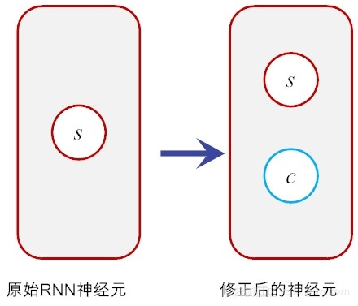
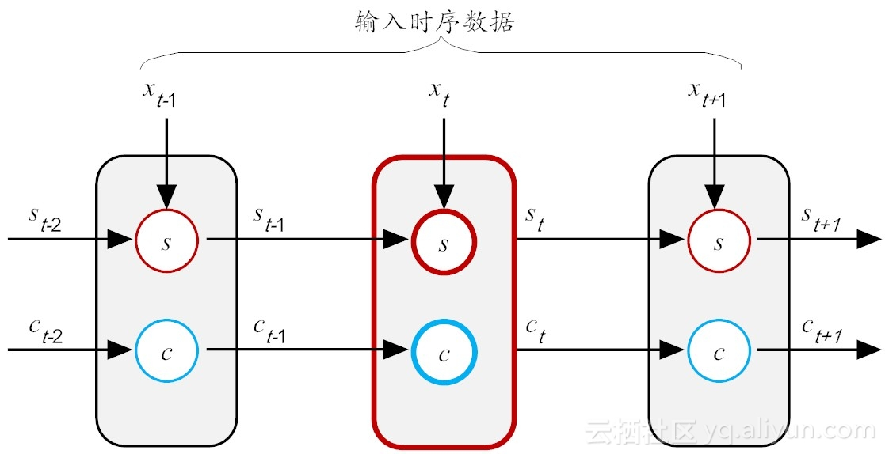
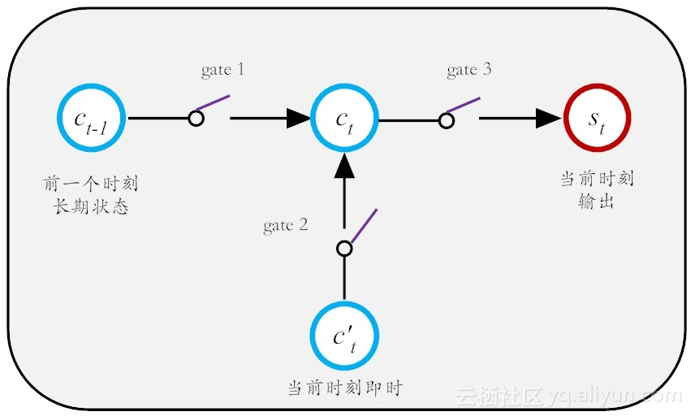
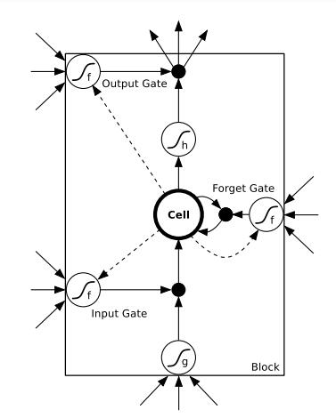
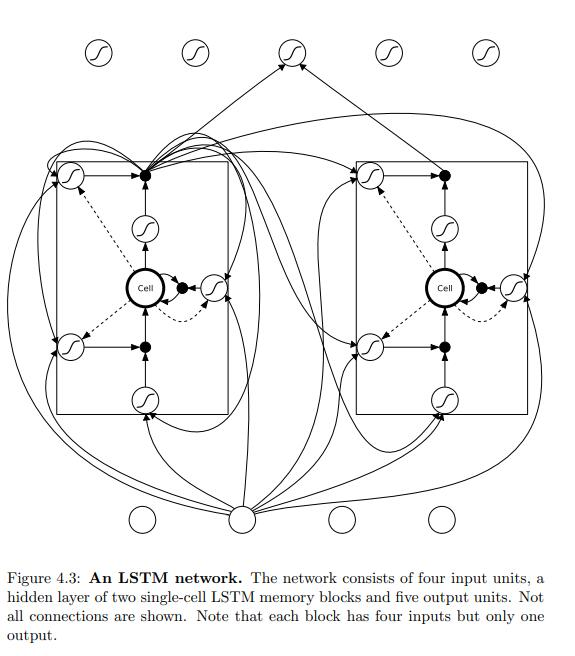
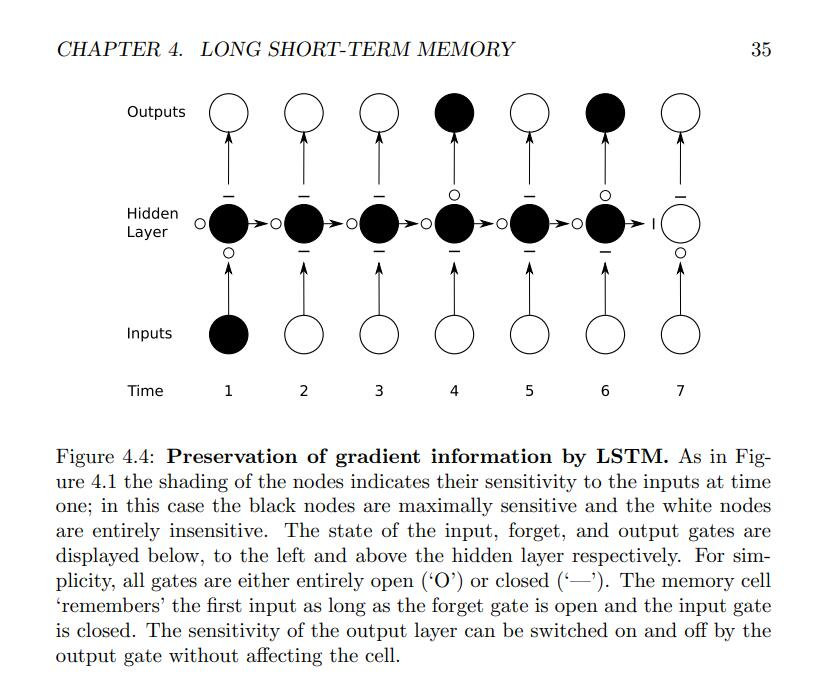

<!--toc-->
[TOC]

# RNN
[Supervised Sequence Labelling with Recurrent Neural Networks](https://www.cs.toronto.edu/~graves/preprint.pdf)

应用领域:
- 自然语言处理(NLP): 主要有视频处理, 文本生成, 语言模型, 图像处理
- 机器翻译, 机器写小说
- 语音识别
- 图像描述生成
- 文本相似度计算
- 音乐推荐、网易考拉商品推荐、Youtube视频推荐等新的应用领域.

## 结构

如果把上面有W的那个带箭头的圈去掉，它就变成了最普通的全连接神经网络。x是一个向量，它表示输入层的值（这里面没有画出来表示神经元节点的圆圈）；s是一个向量，它表示隐藏层的值（这里隐藏层面画了一个节点，你也可以想象这一层其实是多个节点，节点数与向量s的维度相同）；

U是输入层到隐藏层的权重矩阵，o也是一个向量，它表示输出层的值；V是隐藏层到输出层的权重矩阵。

那么，现在我们来看看W是什么。循环神经网络的隐藏层的值s不仅仅取决于当前这次的输入x，还取决于上一次隐藏层的值s。权重矩阵 W就是隐藏层上一次的值作为这一次的输入的权重。

对应的具体图(为了简单说明问题，偏置都没有包含在公式里面)

如果我们把上面的图展开，循环神经网络也可以画成下面这个样子：

> 1. 这里的W,U,V在每个时刻都是相等的(权重共享).
> 2. 隐藏状态可以理解为:  S=f(现有的输入+过去记忆总结) 

## 前向传播
带激活函数的公式（前向传播 Forward Pass）：
${a_h^t}$是t时刻未经过激活函数的输出；
$b_h^t$是经过激活函数的输出；
I输入单元，H是隐藏单元；
$${a_h^t} = \sum_{i=1}^I w_{ih}x_i^t + \sum_{h^{'}=1}^H w_{h^{'}h}b_{h^{'}}^{t-1}$$

$$b_h^t = \theta(a_h^t)$$

## 反向传播
由于每一步的输出不仅仅依赖当前步的网络，并且还需要前若干步网络的状态，那么这种BP改版的算法叫做Backpropagation Through Time(BPTT) , 也就是将输出端的误差值反向传递,运用梯度下降法进行更新.
real time recurrent learning (RTRL; Robinson and Fallside, 1987) 
backpropagation through time(BPTT; Williams and Zipser, 1995; Werbos, 1990).

## RNN改进算法
前面我们介绍了RNN的算法, 它处理时间序列的问题的效果很好, 但是仍然存在着一些问题, 其中较为严重的是容易出现梯度消失或者梯度爆炸的问题(BP算法和长时间依赖造成的). 注意: 这里的梯度消失和BP的不一样,这里主要指由于时间过长而造成记忆值较小的现象.

因此, 就出现了一系列的改进的算法, 这里介绍主要的两种算法: LSTM 和 GRU.

对于梯度消失: 由于它们都有特殊的方式存储”记忆”，那么以前梯度比较大的”记忆”不会像简单的RNN一样马上被抹除，因此可以一定程度上克服梯度消失问题。

对于梯度爆炸:用来克服梯度爆炸的问题就是gradient clipping，也就是当你计算的梯度超过阈值c或者小于阈值-c的时候，便把此时的梯度设置成c或-c。

在原始RNN隐层中的神经元，它只有一个状态，记为h，它对**短期输入非常敏感**。RNN可利用历史信息（或说上下文信息），把过去的输出，再次循环作为输入，从而可达到更好的预测效果。比如说，“天空中飞来一只__”，这个句子比较短，对于RNN来说，构建的网络层数比较浅，因此我们可以充分利用历史信息，能以较大概率来预测空白区可能是“鸟”或“蜻蜓”之类的飞行动物。

但是，如果我们再接着预测如下句子的空白处，句子为“我在中国北京长大，我兄弟5人，我哥叫牛A，我还有三个弟弟分别叫牛C、牛D和牛F，我排名老二，因此大家都叫我牛B，我们都能说一口流利的__”。距离空白处最近的信息提示我们，该处可能要预测一个语言名称。
但世界上的语言上百种，如果我们想缩小语言名称的范围，自然需要利用这个词的上下文信息，但我们很快就会发现，**关键词“中国北京”距离“说一口流利的__”这个词汇之间，距离太过遥远**。的确，我们也可把RNN的结构做深一点，但限于前文提到的缺点，如梯度弥散等问题，**前面网络层的信息如 x0 、x1，..., 等，“流淌”到当前层，有用的信息已所剩无几。或者说，过去的信息已经被抛弃（“遗忘”）了**。有时，这样**有用**但又**抛弃**的神经单元，也称为**泄漏单元（leaky unit）**。

### 改造的神经元
第一代RNN的问题，出在神经元的功能不健全上，它把该记住的遗忘了，又把该遗忘的记住了。那如何来改造它呢？这个时候，就要体现胡伯提出的LSTM的工作了。LSTM的核心本质在于，通过引入巧妙的可控自循环，以产生让梯度能够得以长时间可持续流动的路径 。
假如我们在原有神经元的基础上再增加一个状态，即，让它“合理地”保存长期的状态，不就解决问题了吗？

假设新增加的状态c，称为记忆单元态(cell state)，亦称为“记忆块（memory block）”，用以取代传统的隐含神经元节点。它负责把记忆信息从序列的初始位置，传递到序列的末端。下面我们把上图按照时间步展开，得到如图所示的示意图。

在LSTM结构中，在t时刻，当前神经元（粗红线标识）的输入有三个：当前时刻输入值 $S_t$、前一时刻输出值$S_{t-1}$和前一时刻的记忆单元状态$C_{t-1}$。输出有两个：当前时刻LSTM输出值 $S_t$ 和当前时刻的记忆单元状态$C_t$。需要注意的是，这里的$X$、$S$和$C$都是向量，里面都包含多个参数值。
现在LSTM关键之处来了，那就是如何有效控制这个长期状态c而为我所用呢？这里，LSTM的设计思路是设计3把控制门开关（gate），从而打造一个可控记忆神经元，如图所示。

这第一把门开关，就是负责决定把前一个长期记忆$C_{t-1}$在多大程度上保留到$C_t$中，它可选择性地遗忘部分之前积累的信息；第二把门开关，就是负责控制以多大程度把当前即时状态存入到长期记忆状态$C_t$中；第三把开关，负责控制是否把长期状态$C$，作为当前LSTM的输出。有了这三把好用的开关，记忆就如是酒保手中的酒，是“勾兑”可调的。

### LSTM算法(Long Short Term Memory, 长短期记忆网络 ) 
[长短期记忆（LSTM）](https://tangshusen.me/Dive-into-DL-PyTorch/#/chapter06_RNN/6.8_lstm)

一个LSTM单元

> Figure 4.2: LSTM memory block with one cell. The three gates are nonlinear summation units that collect activations from inside and outside the block,and control the activation of the cell via multiplications (small black circles).
The input and output gates multiply the input and output of the cell while the forget gate multiplies the cell’s previous state. No activation function is applied within the cell. The gate activation function ‘f’ is usually the logistic sigmoid, so that the gate activations are between 0 (gate closed) and 1 (gate open). 
The cell input and output activation functions (‘g’ and ‘h’) are usually tanh or logistic sigmoid, though in some cases ‘h’ is the identity function. The weighted ‘peephole’ connections from the cell to the gates are shown with dashed lines.
All other connections within the block are unweighted (or equivalently, have a fixed weight of 1.0). The only outputs from the block to the rest of the network emanate from the output gate multiplication.

a hidden layer of two single-cell LSTM memory blocks and five output units

> LSTM 网络结构，该网络由四个输入单元组成，一个隐藏层由两个单元LSTM存储器模块和五个输出单元组成。并非显示所有连接。请注意，每个块有四个输入，但只有一个输出。

> 粉红色圆圈表示点向运算，如向量加法、点乘
> 黄色框是学习神经网络层
> 线的交叉表示其内容正在复制，副本将转到不同的位置

LSTM的关键是细胞状态，表示细胞状态的这条线水平的穿过图的顶部。

LSTM具有删除或添加信息到细胞状态的能力，这个能力是由被称为门(Gate)的结构所赋予的。
门(Gate)是一种可选地让信息通过的方式。 它由一个Sigmoid神经网络层和一个点乘法运算组成。

Sigmoid神经网络层输出0和1之间的数字，这个数字描述每个组件有多少信息可以通过， 0表示不通过任何信息，1表示全部通过

>  LSTM有三个门，用于保护和控制细胞的状态
> 用于遗忘的门叫做"遗忘门", 用于信息增加的叫做"信息增加门",最后是用于输出的"输出门"

#### 信息遗忘门
遗忘门的目的在于，控制从前面的记忆中，丢弃多少信息，或者说要继承过往多大程度的记忆。以音乐个性化推荐为例，用户对某位歌手或某个流派的歌曲感兴趣，那么诸如“点赞”、“转发”和“收藏”等这样的正向操作，作为“记忆”，就需要得到加强（换句话说，就需要遗忘得少点）。反之，如果发生了删除、取消点赞或收藏等这类负向操作，对于推荐功能来说，它的信息就应该被“遗忘”得多一些。

$f_t$是0到1之间的值，如果一个值为0，那么从$C_{t-1}$中去掉，如果这个值为1，则完全通过。因此，这种操作也被称为“忘记门操作”。

> 这里$f_t * C_{t-1}$

#### 信息增加门

这部分分为两步。 首先，称为“输入门层”的Sigmoid层决定了我们将更新哪些值。 接下来一个tanh层创建**候选向量$C_{t}$**,该向量将会被加到细胞的状态中。 在下一步中，我们将结合这两个向量来创建更新值。

新的候选值$C_t$ = $f_t * C_{t-1}$遗忘部分+信息增加门*候选向量 

#### 信息输出门

我们将单元格状态通过tanh（将值规范化到-1和1之间），并将其乘以Sigmoid门的输出，至此我们只输出了我们决定的那些部分。

### 门控循环单元（Gated Recurrent Unit，GRU Network）
GRU是2014年提出的一种LSTM改进算法. 它将忘记门和输入门合并成为一个单一的更新门, 同时合并了数据单元状态和隐藏状态, 使得模型结构比之于LSTM更为简单.

> [门控循环单元（GRU）](https://tangshusen.me/Dive-into-DL-PyTorch/#/chapter06_RNN/6.7_gru)

### 双向循环神经网络Bidirectional Networks(BRNN)
RNN和LSTM都只能依据之前时刻的时序信息来预测下一时刻的输出，但在有些问题中，当前时刻的输出不仅和之前的状态有关，还可能和未来的状态有关系。比如预测一句话中缺失的单词不仅需要根据前文来判断，还需要考虑它后面的内容，真正做到基于上下文判断。BRNN有两个RNN上下叠加在一起组成的，输出由这两个RNN的状态共同决定。BRNN结构图如图所示。

> 对于每个时刻t，输入会同时提供给两个方向相反的RNN，输出由这两个单向RNN共同决定。

> [29页](https://www.cs.toronto.edu/~graves/preprint.pdf)

双向RNN中的重复模块可以是常规RNN、LSTM或是GRU。双向RNN的结构和连接如图所示。有两种类型的连接，一种是向前的，这有助于我们从之前的表示中进行学习，另一种是向后的，这有助于我们从未来的表示中进行学习。

正向传播分两步完成：
1. 我们从左向右移动，从初始时间步骤开始计算值，一直持续到到达最终时间步骤为止；

2. 我们从右向左移动，从最后一个时间步骤开始计算值，一直持续到到达最终时间步骤为止；

#### 双向LSTM神经网络 (BLSTM or BiLSTM)
总的来说，BLSTM总体上还是优于其它网络

## 参考
[循环神经网络(RNN)模型与前向反向传播算法](https://www.cnblogs.com/pinard/p/6509630.html)
[RNN前向传播与后向传播公式推导](https://zhuanlan.zhihu.com/p/28806793)

[深度学习--递归神经网络--LSTM/GRU算法理论](https://blog.csdn.net/weixin_35733800/article/details/105650025)