<!--toc-->
[TOC]

# RNN

应用领域:
- 自然语言处理(NLP): 主要有视频处理, 文本生成, 语言模型, 图像处理
- 机器翻译, 机器写小说
- 语音识别
- 图像描述生成
- 文本相似度计算
- 音乐推荐、网易考拉商品推荐、Youtube视频推荐等新的应用领域.

## 结构
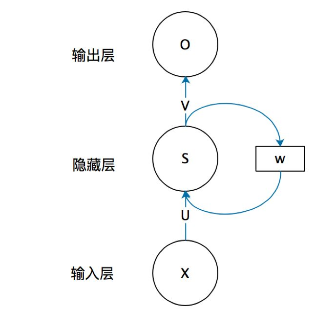

如果把上面有W的那个带箭头的圈去掉，它就变成了最普通的全连接神经网络。x是一个向量，它表示输入层的值（这里面没有画出来表示神经元节点的圆圈）；s是一个向量，它表示隐藏层的值（这里隐藏层面画了一个节点，你也可以想象这一层其实是多个节点，节点数与向量s的维度相同）；

U是输入层到隐藏层的权重矩阵，o也是一个向量，它表示输出层的值；V是隐藏层到输出层的权重矩阵。

那么，现在我们来看看W是什么。循环神经网络的隐藏层的值s不仅仅取决于当前这次的输入x，还取决于上一次隐藏层的值s。权重矩阵 W就是隐藏层上一次的值作为这一次的输入的权重。

对应的具体图(为了简单说明问题，偏置都没有包含在公式里面)
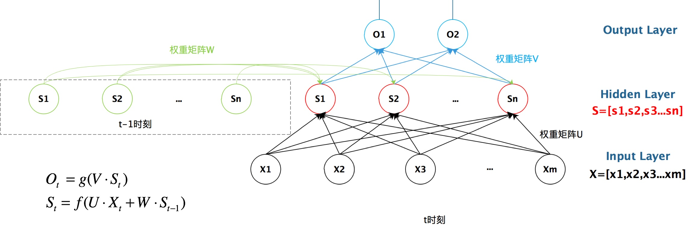

如果我们把上面的图展开，循环神经网络也可以画成下面这个样子：

> 1. 这里的W,U,V在每个时刻都是相等的(权重共享).
> 2. 隐藏状态可以理解为:  S=f(现有的输入+过去记忆总结) 

## 前向传播
带激活函数的公式（前向传播 Forward Pass）：
${a_h^t}$是t时刻未经过激活函数的输出；
$b_h^t$是经过激活函数的输出；
I输入单元，H是隐藏单元；
$${a_h^t} = \sum_{i=1}^I w_{ih}x_i^t + \sum_{h^{'}=1}^H w_{h^{'}h}b_{h^{'}}^{t-1}$$

$$b_h^t = \theta(a_h^t)$$

## 反向传播
由于每一步的输出不仅仅依赖当前步的网络，并且还需要前若干步网络的状态，那么这种BP改版的算法叫做Backpropagation Through Time(BPTT) , 也就是将输出端的误差值反向传递,运用梯度下降法进行更新.
real time recurrent learning (RTRL; Robinson and Fallside, 1987) 
backpropagation through time(BPTT; Williams and Zipser, 1995; Werbos, 1990).

## RNN改进算法
前面我们介绍了RNN的算法, 它处理时间序列的问题的效果很好, 但是仍然存在着一些问题, 其中较为严重的是容易出现梯度消失或者梯度爆炸的问题(BP算法和长时间依赖造成的). 注意: 这里的梯度消失和BP的不一样,这里主要指由于时间过长而造成记忆值较小的现象.

因此, 就出现了一系列的改进的算法, 这里介绍主要的两种算法: LSTM 和 GRU.

对于梯度消失: 由于它们都有特殊的方式存储”记忆”，那么以前梯度比较大的”记忆”不会像简单的RNN一样马上被抹除，因此可以一定程度上克服梯度消失问题。

对于梯度爆炸:用来克服梯度爆炸的问题就是gradient clipping，也就是当你计算的梯度超过阈值c或者小于阈值-c的时候，便把此时的梯度设置成c或-c。

### LSTM算法(Long Short Term Memory, 长短期记忆网络 ) 
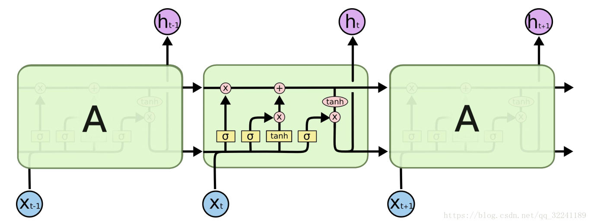
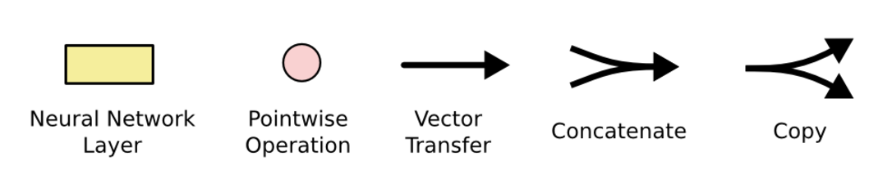
> 粉红色圆圈表示点向运算，如向量加法、点乘
> 黄色框是学习神经网络层
> 线的交叉表示其内容正在复制，副本将转到不同的位置

LSTM的关键是细胞状态，表示细胞状态的这条线水平的穿过图的顶部。
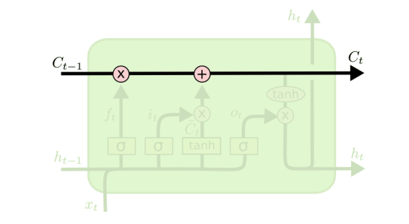
LSTM具有删除或添加信息到细胞状态的能力，这个能力是由被称为门(Gate)的结构所赋予的。
门(Gate)是一种可选地让信息通过的方式。 它由一个Sigmoid神经网络层和一个点乘法运算组成。
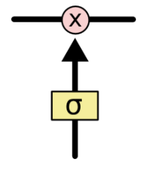

Sigmoid神经网络层输出0和1之间的数字，这个数字描述每个组件有多少信息可以通过， 0表示不通过任何信息，1表示全部通过

>  LSTM有三个门，用于保护和控制细胞的状态
> 用于遗忘的门叫做"遗忘门", 用于信息增加的叫做"信息增加门",最后是用于输出的"输出门"

#### 信息遗忘门
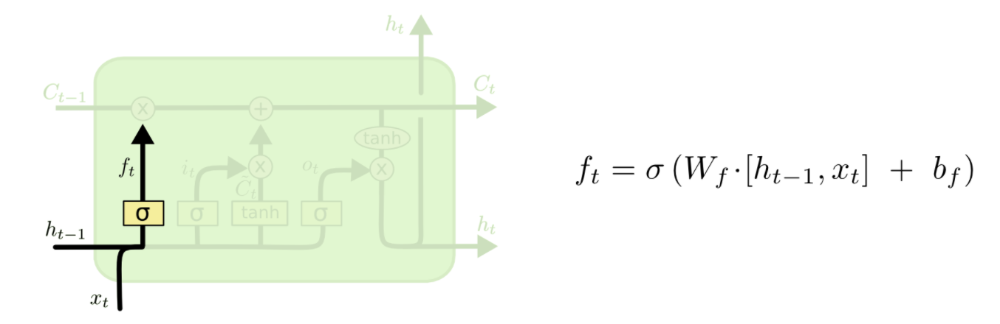

$f_t$是0到1之间的值，如果一个值为0，那么从$C_{t-1}$中去掉，如果这个值为1，则完全通过。因此，这种操作也被称为“忘记门操作”。

> 这里$f_t * C_{t-1}$

#### 信息增加门
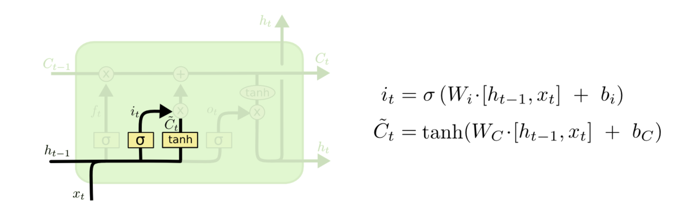
这部分分为两步。 首先，称为“输入门层”的Sigmoid层决定了我们将更新哪些值。 接下来一个tanh层创建**候选向量$C_{t}$**,该向量将会被加到细胞的状态中。 在下一步中，我们将结合这两个向量来创建更新值。

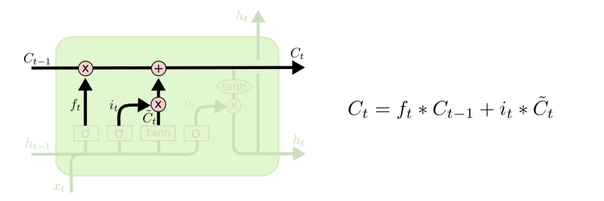

新的候选值$C_t$ = $f_t * C_{t-1}$遗忘部分+信息增加门*候选向量 

#### 信息输出门
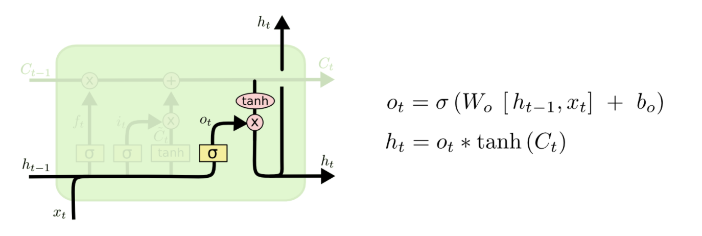
我们将单元格状态通过tanh（将值规范化到-1和1之间），并将其乘以Sigmoid门的输出，至此我们只输出了我们决定的那些部分。

### 门控循环单元（Gated Recurrent Unit，GRU Network）
GRU是2014年提出的一种LSTM改进算法. 它将忘记门和输入门合并成为一个单一的更新门, 同时合并了数据单元状态和隐藏状态, 使得模型结构比之于LSTM更为简单.

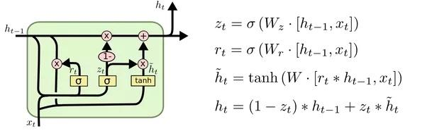

### 双向循环神经网络Bidirectional Networks(BRNN)
RNN和LSTM都只能依据之前时刻的时序信息来预测下一时刻的输出，但在有些问题中，当前时刻的输出不仅和之前的状态有关，还可能和未来的状态有关系。比如预测一句话中缺失的单词不仅需要根据前文来判断，还需要考虑它后面的内容，真正做到基于上下文判断。BRNN有两个RNN上下叠加在一起组成的，输出由这两个RNN的状态共同决定。BRNN结构图如图所示。
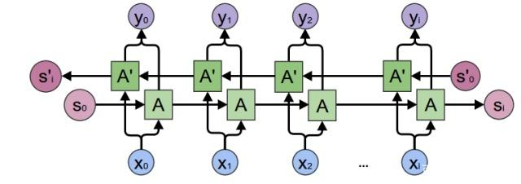
> 对于每个时刻t，输入会同时提供给两个方向相反的RNN，输出由这两个单向RNN共同决定。

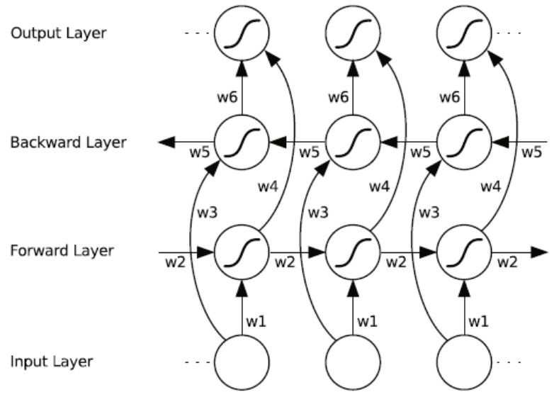
> [29页](https://www.cs.toronto.edu/~graves/preprint.pdf)

双向RNN中的重复模块可以是常规RNN、LSTM或是GRU。双向RNN的结构和连接如图所示。有两种类型的连接，一种是向前的，这有助于我们从之前的表示中进行学习，另一种是向后的，这有助于我们从未来的表示中进行学习。

正向传播分两步完成：
1. 我们从左向右移动，从初始时间步骤开始计算值，一直持续到到达最终时间步骤为止；

2. 我们从右向左移动，从最后一个时间步骤开始计算值，一直持续到到达最终时间步骤为止；

## 参考
[循环神经网络(RNN)模型与前向反向传播算法](https://www.cnblogs.com/pinard/p/6509630.html)
[RNN前向传播与后向传播公式推导](https://zhuanlan.zhihu.com/p/28806793)

[深度学习--递归神经网络--LSTM/GRU算法理论](https://blog.csdn.net/weixin_35733800/article/details/105650025)