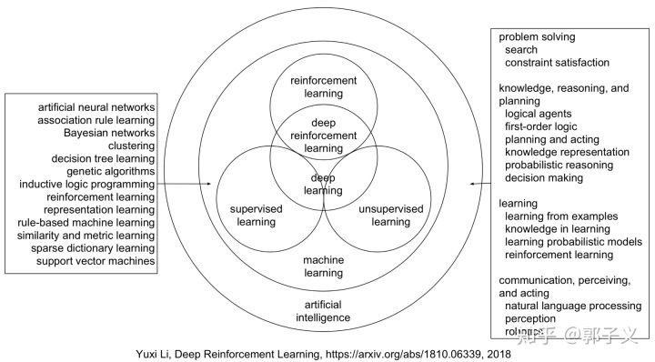
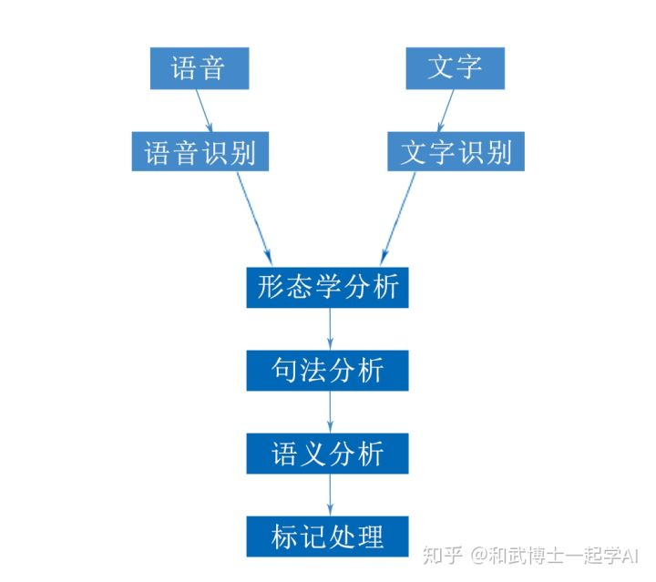

<!-- toc -->
[TOC]
files/深度强化学习DEEP REINFORCEMENT LEARNING-1810.06339.pdf

# 机器学习和深度学习

机器学习：一切通过优化方法挖掘数据中规律的学科。

深度学习：一切运用了神经网络作为参数结构进行优化的机器学习算法。

强化学习（reinforcement learning）：不仅能利用现有数据，还可以通过对环境的探索获得新数据，并利用新数据循环往复地更新迭代现有模型的机器学习算法。学习是为了更好地对环境进行探索，而探索是为了获取数据进行更好的学习。

深度强化学习：一切运用了神经网络作为参数结构进行优化的强化学习算法。

深度学习和强化学习都属于机器学习，而机器学习又是人工智能的一部分。深度学习和强化学习功能的有趣之处在于它们使计算机能够自己开发规则来解决问题。这种学习能力对于计算机来说并不是什么新鲜事，但直到最近，我们还没有足够的数据和计算能力使其工业化。

## 自然语言处理

NLP，严格来讲，自然语言处理是数据挖掘的一个具体应用领域。自然语言处理是计算机科学领域与人工智能领域中的一个重要方向。它研究能实现人与计算机之间用自然语言进行有效通信的各种理论和方法。自然语言处理是一门融语言学、计算机科学、数学于一体的科学。因此，这一领域的研究将涉及自然语言，即人们日常使用的语言，所以它与语言学的研究有着密切的联系但又有重要的区别。自然语言处理并不是一般地研究自然语言，而在于研制能有效地实现自然语言通信的计算机系统，特别是其中的软件系统。因而它是计算机科学的一部分。自然语言处理（NLP）是计算机科学，人工智能，语言学关注计算机和人类（自然）语言之间的相互作用的领域。

斯坦福大学人工智能实验室主任：Manning是这样评价NLP ：

> 这个星球上有许多生物拥有超过人类的视觉系统，但只有人类才拥有这么高级的语言。

自然语言处理是一门计算机科学、人工智能以及语言学的交叉学科。虽然NLP只是人工智能的应用一部分（人工智能还包括计算机视觉、智能控制等），但它是非常独特的，具有十分重要的的意义。

自然语言处理的目标是让计算机处理或说“理解”我们人类的语言（声音、文字、甚至肢体），以完成有意义的任务，比如订机票购物或问答、聊天等。然而，完全理解和表达语言是极其困难的，完美的语言理解是NLP处理的终极目标。

自然语言处理涉及的五个层次：

更多细节
[深度学习与自然语言处理（二）：自然语言处理与深度学习简介](https://zhuanlan.zhihu.com/p/56494787)

自然语言处理是机器学习的应用领域，是解决自然语言处理的问题的。
自然语言处理大多数是基于深度学习的。

像推荐系统，计算机视觉，nlp这些价值已知的场景
数据挖掘（像推荐系统，计算机视觉，nlp）是应用，可以使用机器学习，也可以使用别的方法

## 特征工程

特征工程其本质是一项工程活动，目的是最大限度地从原始数据中提取特征以供算法和模型使用。本特征工程思维导图涵盖的知识点包括：特征工程的意义、数据的采集、数据的处理（数据的清洗和采样）、数值型、类别型、时间型、文本型、统计型、组合型特征的处理、特征的选择和降维。

## 计算机视觉(Computer Vision)

## 什么是深度学习？

深度学习本质上是一个自学习系统。我们可以使用现有数据来训练算法以查找解决相应问题的模式，然后使用这种模式来对新数据进行预测。例如，我们可以训练深度学习算法来识别照片上的猫。具体步骤是：1、让计算机看数以百万计的包含猫或不包含猫的图像。2、让程序通过对图像数据进行分类和聚类（例如，边缘，形状，颜色，形状之间的距离等）来建立模式，足够多的的模式可以得到最终的预测模型。3、让程序通过预测模型来查看新的图像集，通过与预测模型的比对来确定图像中是否有猫。

深度学习算法通过模拟我们大脑神经元网络的人工神经网络来实现类似人类大脑的功能。算法在运行中会执行各种循环，通过缩小模式与实际的差距来改进每个循环的预测，最终建立一个最优预测模型。

苹果的Face ID（人脸识别）就是一个很好的关于深度学习的工业应用案例。Face ID可以通过扫描脸部来训练算法。每次使用Face ID登录时，TrueDepth摄像头会捕获数千个数据点，这些数据点被用于创建用户脸部的深度图，而手机的内置神经引擎将执行预测模型以判断您是否是您。

## 什么是强化学习？

强化学习也是一种自学习系统，但它主要是通过反复试验来学习的。通过有限次地执行行动以得到最大化奖励从而确定最佳答案，换句话说，它是通过实践来学习，从实践中找到最佳结果。这就好比我们小时候学骑自行车。刚开始学的时候我们经常会摔倒，但随着摔得次数多了，我们慢慢就掌握窍门了。这个学习的过程就是强化学习。当计算机使用强化学习时，它们会尝试不同的行为，从反馈中学习该行为是否能够得到更好的结果，然后将能得到好结果的行为记住，规范点说就是计算机在多次迭代中自主地重新修正算法，直到能做出正确的判断为止。

使用强化学习的一个很好的例子是让机器人学习如何走路。机器人首先向前迈出一大步然后跌倒。这一大步和摔倒是强化学习系统关注的响应点。由于反馈是负面的，所以继续调整，系统会根据多个负反馈的比对最终确定机器人应该把步子迈的小一点，不停地小，直到机器人走路不会摔倒为止。

近几年，我看到的最强大的强化学习实验之一就是谷歌的Deep Mind。谷歌的研究人员把这个工具应用到了经典的电脑游戏Atari Breakout（一个最经典的打砖块游戏）上。他们把最佳目标（结果）设定成了最多的得分，Deep Mind需要做的就是不断地通过移动底下的挡板来击打小球以破环屏幕顶部的砖块。这个实验的视频大家可以去百度一下，在实验的开始，Deep Mind犯了很多低级错误，但很快，它就可以击败这个世界上最好的击砖块选手了。到现在，Deep Mind已经会玩近60种游戏了。

## 深度学习与强化学习的区别

深度学习和强化学习首先都是自主学习系统。它们之间的区别在于，深度学习是从训练集中学习，然后将学习到的知识应用于新数据集，是一种静态学习，而强化学习是通过连续的反馈来调整自身的动作以获得最优结果，是一种不断试错的过程，这是动态学习。

有一点需要注意，深度学习和强化学习并不是相互排斥的概念。事实上，您可以在强化学习系统中使用深度学习，这就是深度强化学习。

---

人工智能并不是一个新的术语，它已经有几十年的历史了，大约从80年代初开始，计算机科学家们开始设计可以学习和模仿人类行为的算法。
在算法方面，最重要的算法是神经网络，由于过拟合而不是很成功（模型太强大，但数据不足）。尽管如此，在一些更具体的任务中，使用数据来适应功能的想法已经取得了显着的成功，并且这也构成了当今机器学习的基础。
在模仿方面，人工智能专注于图像识别，语音识别和自然语言处理。人工智能专家们花费了大量的时间来创建诸如边缘检测，颜色配置文件，N-gram，语法树等。不过，这些进步还不足以达到我们的需求。

## 传统的机器学习：

机器学习（ML）技术在预测中发挥了重要的作用，ML经历了多代的发展，形成了具有丰富的模型结构，例如：

1.线性回归。

2.逻辑回归。

3.决策树。

4.支持向量机。

5.贝叶斯模型。

6.正则化模型。

7.模型集成（ensemble）。

8.神经网络。

这些预测模型中的每一个都基于特定的算法结构，参数都是可调的。训练预测模型涉及以下步骤：

1. 选择一个模型结构（例如逻辑回归，随机森林等）。

2. 用训练数据（输入和输出）输入模型。

3. 学习算法将输出最优模型（即具有使训练错误最小化的特定参数的模型）。

每种模式都有自己的特点，在一些任务中表现不错，但在其他方面表现不佳。但总的来说，我们可以把它们分成低功耗（简单）模型和高功耗（复杂）模型。选择不同的模型是一个非常棘手的问题。

由于以下原因，使用低功率/简单模型是优于使用高功率/复杂模型：

- 在我们拥有强大的处理能力之前，训练高功率模型将需要很长的时间。
- 在我们拥有大量数据之前，训练高功率模型会导致过度拟合问题（因为高功率模型具有丰富的参数并且可以适应广泛的数据形状，所以我们最终可能训练一个适合于特定到当前的训练数据，而不是推广到足以对未来的数据做好预测）。

然而，选择一个低功率的模型会遇到所谓的“欠拟合”的问题，模型结构太简单，如果它复杂，就无法适应训练数据。（想象一下，基础数据有一个二次方关系：y = 5 * x ^ 2;你无法适应线性回归：y = a * x + b，不管我们选择什么样的a和b。

为了缓解“不适合的问题”，数据科学家通常会运用他们的“领域知识”来提出“输入特征”，这与输出关系更为直接。（例如，返回二次关系y = 5 * square（x），如果创建了一个特征z = x ^ 2，则可以拟合线性回归：y = a * z + b，通过选择a = 5和b = 0）。

机器学习的主要障碍是特征工程这个步骤，这需要领域专家在进入训练过程之前就要找到非常重要的特征。特征工程步骤是要靠手动完成的，而且需要大量领域专业知识，因此它成为当今大多数机器学习任务的主要瓶颈。

换句话说，如果我们没有足够的处理能力和足够的数据，那么我们必须使用低功耗/更简单的模型，这就需要我们花费大量的时间和精力来创建合适的输入特征。这是大多数数据科学家今天花时间去做的地方。

## 强化学习（reinforcement learning）：
另一个关键组成部分是关于如何模仿一个人（或动物）的学习，设想感知/行为/奖励循环的非常自然的动物行为。一个人或者一个动物首先会通过感知他或者她所处的状态来了解环境。在此基础上，他或者她会选择一个“动作”，将他或者她带到另一个“状态”。那么他或她将获得“奖励”，循环重复，直到他或她消失。这种学习方式（称为强化学习）与传统监督机器学习的曲线拟合方法有很大不同。尤其是，强化学习学习得非常快，因为每一个新的反馈（例如执行一个行动并获得奖励）都被立即发送到影响随后的决定。

强化学习也提供了预测和优化的平滑整合，因为它在采取不同的行动时保持当前状态的信念和可能的转换概率，然后做出决定哪些行动可以导致最佳结果。

## 深度学习+强化学习= AI

与经典的ML技术相比，DL提供了一个更强大的预测模型，通常可以产生良好的预测结果。与经典优化模型相比，强化学习提供了更快的学习机制，并且更适应环境的变化。

## 机器学习 vs 深度学习

在深度探讨machine learning和data science的联系之前，这里简要地讨论一下machine learning 和deep learning。machine learning是一套算法，来训练数据集做预测或者采取行动以使得系统最优化。举例来说，supervised classification algorithms被用来根据历史数据将想要贷款的客户分成预期好的和预期差的(good or bad prospects)。对于给定的任务(比如监督聚类)，需要的技术多种多样：naive Bayes、SVM、neural nets、ensembles、association rules、decision trees、logistic regression，或者是很多技术的组合。所有这些都是数据科学的子集。当这些算法自动化后，比如无人驾驶飞机或者无人驾驶汽车，这就叫AI了，或者说的具体一点，deep learning。如果采集的数据来自传感器并且通过互联网传播，那么这就是机器学习或数据科学或深度学习应用于物联网了。

有些人对深度学习有不同的定义，他们认为深度学习是更深层次的神经网络(一种机器学习的技术)。AI(Artificial Intelligence)是创建于20世纪60年代的计算机科学的一个子领域，是关于解决那些对人类来讲非常容易但是对计算机而言很难的任务。值得一提的是，所谓的strong AI可能可以做所有人类可以做的事情(可能除了纯粹的物理问题)。这是相当广泛的，包括各种各样的事情，比如做计划，在世界上到处溜达，识别物体和声音，说话，翻译，社交或者商业交易，还有创造性工作(比如写诗画画)等等。

NLP(Natural language processing)只是AI要处理的语言部分，尤其是写。

Machine learning是这样的一种情况：给出一些可以被以离散形式描述的AI问题(比如从一系列动作中选出对的那个)，然后给定一堆外部世界的信息，在不需要程序员手动写程序的情况下选出那个“正确的”行为。通常情况需要借助外界的一些过程来判断这个动作对不对。在数学上，这就是函数：你给一些输入，然后你想要他处理一下得到正确的输出，所以整个问题就简化为用一些自动的方式建立这种数学函数模型。和AI区分一下：如果我写了一段特别机智的程序有着人类的行为，那这就可以是AI，但是除非它的参量都是自动从数据中学会的，否则就不是机器学习。

Deep learning是当下非常流行的机器学习的一种。它包含一种特殊的数学模型，可以想成是一种特定类型的简单块的组合(或者说是块的功能的组合)，这些块可以进行调整来更好的预测最终结果。

# 深度学习算法优化系列一 | ICLR 2017《Pruning Filters for Efficient ConvNets》

## 前言

这篇文章是深度学习算法优化系列的第一篇文章，主要解读一篇 ICLR 2017 年的《Pruning Filters for Efficient ConvNets》，关于通道剪枝策略的一篇论文。论文原地址见附录。

## 背景

在模型压缩的方法中，包括剪枝，量化，多值网络，模型蒸馏等。这篇论文是模型剪枝当面的。剪枝最初应用应该是在决策树算法中，通过降低决策树的模型复杂度防止过拟合。在 CNN 中也是类似的思想，因为在大型的模型中，总是不可避免的存在大量的权重冗余，这种冗余甚至有可能降低模型的准确率。因此需要借助剪枝的方法压缩模型，在压缩率合适的条件下，可以提高模型的准确率的同时减少模型大小。同时，在往移动端部署模型的时候也会考虑牺牲一点精度换取时间和空间的节约。CNN 的剪枝主要分为两种，一种是基于幅值的剪枝，一种是基于通道的剪枝。基于幅值的剪枝主要思想是将小于一定阈值的权重抛弃，阈值用剪枝率来确定。而基于通道的剪枝主要思想史将不重要的整个权重通道剪掉，从而将模型变小。这篇论文就属于第二类。

## 1. 摘要

CNN 在各种应用中的成功伴随着计算量和参数量的显着增加。最近朝着减少这些开销的研究涉及到在不损伤精度的条件下剪枝和压缩不同层的权重。然而，基于幅值的权重剪枝主要是减少了全连接层的参数量，并且由于修剪的不规则性，并没有减少卷积层的计算成本。这篇论文展示了一种对于 CNN 的加速方法，即直接移除对于 CNN 精度影响很小的卷积核。通过将网络的这些卷积核以及它们的 feature map 移除掉，可以极大的减少计算成本。与权重剪枝相比，这个方法不会导致稀疏连接模式。因此，它不需要专门支持稀疏卷积库的支持，它可以使用针对密集矩阵乘法的 BLAS 库高效处理，我们展示了通过简单的卷积核剪枝可以推理成本，在 CIFAR10 上，VGG-16 的推理成本可降低高达 34％，ResNet-110 最高可降低 38％，同时通过重新训练网络恢复接近原始精度。

## 2. 卷积核和特征图剪枝

ni​是第i个卷积层的输入通道数，hi​和wi​是输入特征图的高和宽。卷积层将输入维度为Xi​∈Rni​×hi​×wi​的特征图转化为维度为Xi+1​∈Rni+1​×hi+1​×wi+1​的输出特征图作为下一层的输入。这里卷积核的维度为ni+1​×ni​×k×k，卷积层的乘加操作次数为ni+1​×ni​×k2×hi+1​×wi+1​。如下面的 Figure1 所示：  
  
当我们把一个卷积核剪掉后，对应的 feature map 也没了，减少了ni​×k2×hi+2​×wi+2​操作。这是因为当前一个卷积层的卷积核被剪掉后，该层保留的卷积核参数不仅仅在卷积核个数这个维度上缩减了，还和上一个卷积层剪掉的卷积核个数有关，其简介导致了该层卷积核在通道上的缩减。

## 3. 方法

### 3.1 确定在单层中需要剪枝的卷积核

论文用Fi,j​∈Rni​×k×k来表示第i层的一个卷积核，然后论文提出通过∑∣Fi,j​∣，即一个卷积核类所有权值绝对值之和（L1 范数）来表示每个层中该卷积核的重要程度。Figure2（a）展示了在 CIFAR-10 数据集上训练好的 VGG16 网络中每一个卷积层中每个卷积核权重绝对值之和的分布，可以看到每层的分布是不同的。

同时论文发现剪掉 L1 值最小的卷积核比随机剪枝或者剪掉最大的卷积核效果更好。从第i个卷积层剪掉m个卷积核的算法过程如下：

*   对每个卷积核Fi,j​，计算它的权重绝对值之和sj​\=∑l\=1ni​​∑∣Kl​∣。
*   根据sj​排序。
*   将m个权重绝对值之和最小的卷积核及对应的 feature map 剪掉。下一个卷积层中和剪掉的 feature ,ap 相关的卷积核也要移除。
*   一个对于第i层和第i+1层的新的权重矩阵被创建，并且剩下的权重参数被复制到新模型中。

### 3.2 确定卷积层对剪枝的敏感度

为了确定每个卷积层对剪枝的敏感度，论文对每一层独立剪枝并在验证集上对剪枝后的网络进行评估。Figure2(b)展示了这一结果。其中曲线的斜率就可以代表敏感度，斜率比较平缓的说明该层对剪枝的敏感度就更高。论文根据经验来决定对每一层的卷积核进行剪枝，对于深度网络（如 VGG-16 或 ResNets），观察到同一 stage 相同尺寸的特征图）对应的层对剪枝的敏感度相似，论文对于同一 stage 的所有层使用相同的剪枝比例。而对于那些敏感度高的层，剪枝时比例很小，甚至完全不进行剪枝。

### 3.3 跨多个卷积层剪枝

之前的工作是逐层剪枝然后重新训练来恢复进度。然而理解如何能一次性的对多层进行剪枝是有有必要的:（1）因为对于深层网络来说，逐层剪枝再训练太耗时。（2）整体剪枝的方法可以为网络鲁棒性提供一个全局视野，从而形成了一个更小的网络。（3）对于复杂的网络，一个整体的方法是有必要的。例如对于 ResNet，对恒等映射特征图或者每个残差模块的第二层剪枝会导致额外层的剪枝。为了对多层同时剪枝，论文考虑了两个策略。

*   每一层独立剪枝，即在计算(求权重绝对值之和)时不考虑上一层的剪枝情况，所以计算时 Figure3 中的黄色点权重仍然参与计算。
*   采用贪心策略，计算时不计算已经剪枝过的，即黄色点不参与计算。  
    实验证明采用贪心策略的计算方式精度会好一些。  
    对于简单的 CNN 网络如 AlexNet,VGGNet，可以简单的对任意卷积层进行剪枝。然而，对于 ResNet 这种复杂的网络，这是不可行的。ResNet 的结构对剪枝提出了限制条件，残差块中的第一个卷积层可以随意修剪，因为它不会改变残差块输出特征图的数目，然而第二个卷积层和特征映射的剪枝很困难。因此，为了残差模块的第二个卷积层进行剪枝，相关的 projected featured maps(就是xi​)必须也要剪掉，由于恒等特征映射要比添加的 residual maps 重要，对第二个层的剪枝应该由 shortcut 层的剪枝结果决定。为了决定那些恒等特征映射图被剪掉，我们对 shortcut 卷积层（1x1 卷积核）上采用相同的选择标准，即 residual block 中第二层修剪的 Filter index 与 shortcut layer 所选择的 Filter index 相同。这个过程结合 Figure4 比较容易懂。  
    

### 3.4 重新练网络恢复精度

在剪枝过后，通过重新训练可以补偿剪枝造成的精度损失，有两种策略：

*   一次剪枝和重新训练：一次性对多层的卷积核剪枝，然后重新训练直到原来的准确率恢复。
*   交替剪枝和训练：逐层或逐卷积核剪枝，然后再训练，重复多次。

## 4. 实验结论

从下面的 Table1 可以看到，对剪枝后的网络结构从头训练要比对重新训练剪枝后的网络（利用了未剪枝之前的权重）的结果差，这也说明了对小容量的网络训练很难。  
其中 Tabl2 表示了 VGG16 中各层的剪枝比例，如下：  
在 CIFAR10 上，VGG-16 的推理成本可降低高达 34％，ResNet-110 最高可降低 38％，同时通过重新训练网络恢复接近原始精度。

## 5. 附录

论文原文：[https://arxiv.org/abs/1608.08710](https://arxiv.org/abs/1608.08710)  
再记录一些剪枝相关的论文。  
**基于权重的剪枝**

*   Song Han： Deep Compression: Compressing Deep Neural Network with Pruning, Trained Quantization and Huffman Coding.
*   Michael Zhu and Suyog Gupta：To prune, or not to prune: exploring the efficacy of pruning for model compression  
    **基于通道的剪枝**
*   Channel Pruning for Accelerating Very Deep Neural Networks
*   Zhuang Liu：Learning Efficient Convolutional Networks through Network Slimming  
    **关于源码实现**  
    可以看看这个工程：[https://github.com/666DZY666/model-compression](https://github.com/666DZY666/model-compression)

## 6. 参考

*   [GitHub 项目推荐：用深度学习让你的照片变得美丽](https://github.com/aiff22/DPED)
*   [Github项目推荐 | Transformer-XL 的高效分布式训练](https://github.com/GaoPeng97/transformer-xl-chinese)
*   [Spark Streaming VS Flink](https://www.jianshu.com/p/96624553cf14)
* [写给程序员的机器学习入门 (五) - 递归模型 RNN，LSTM 与 GRU](https://www.cnblogs.com/zkweb/p/12982132.html) 