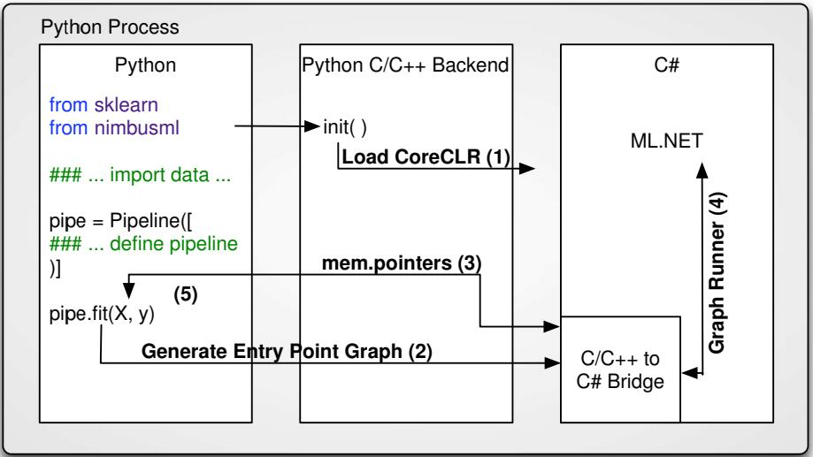

# ML.NET
Machine Learning at Microsoft with ML.NET paper
https://arxiv.org/pdf/1905.05715.pdf

https://github.com/dotnet/machinelearning
## High performance and accuracy
Training on ~900 MB of an Amazon review dataset, ML.NET produced a model with 93% accuracy, scikit-learn with 92%, and H2O with 85%. ML.NET took 11 minutes to train and test the model, scikit-learn took 66 minutes, and H2O took 105 minutes.

## NimbusML
https://github.com/Microsoft/NimbusML

nimbusml is a Python module that provides Python bindings for ML.NET.

## Infer.NET
https://github.com/dotnet/infer
是一个在概率图模型(graphical models)中运行贝叶斯推理(Bayesian inference)的框架

　　　　

## AForge.NET
https://github.com/andrewkirillov/AForge.NET

AForge.NET是一个专门为开发者和研究者基于C#框架设计的，他包括计算机视觉与人工智能，图像处理，神经网络，遗传算法，机器学习，模糊系统，机器人控制等领域。这个框架由一系列的类库组成。主要包括有：

AForge.Imaging —— 一些日常的图像处理和过滤器
AForge.Vision —— 计算机视觉应用类库
AForge.Neuro —— 神经网络计算库AForge.Genetic -进化算法编程库
AForge.MachineLearning —— 机器学习类库
AForge.Robotics —— 提供一些机器学习的工具类库
AForge.Video —— 一系列的视频处理类库
AForge.Fuzzy —— 模糊推理系统类库
AForge.Controls—— 图像，三维，图表显示控件

## Accord.NET

Accord.NET Framework是在AForge.NET基础上封装和进一步开发来的。功能也很强大，因为AForge.NET更注重与一些底层和广度，而Accord.NET Framework更注重与机器学习这个专业，在其基础上提供了更多统计分析和处理函数，包括图像处理和计算机视觉算法，所以侧重点不同，但都非常有用。

## 绑定
https://github.com/SciSharp/TensorFlow.NET
https://github.com/migueldeicaza/TensorFlowSharp

https://github.com/SciSharp/Torch.NET
https://github.com/xamarin/TorchSharp

https://github.com/SciSharp/Keras.NET

### xx
https://github.com/SciSharp/NumSharp
https://github.com/SciSharp/SharpCV
https://github.com/SciSharp/Plot.NET
https://github.com/SciSharp/Pandas.NET
https://github.com/SciSharp/PillowSharp
https://github.com/SciSharp/Matplotlib.Net

## 其它机器学习库
https://github.com/sethjuarez/numl

http://www.alglib.net/

## 开源.NET平台非综合类
### Math.NET
Math.NET是.NET平台下最全面的数学计算组件之一，基础功能非常完善。

### Adaboost算法
1.https://github.com/bgorven/Classifier

2.https://github.com/ElmerNing/Adaboost

### Apriori算法
1.https://github.com/Omar-Salem/Apriori-Algorithm

2.https://github.com/simonesalvo/apriori

### PageRank算法
https://github.com/archgold/pagerank

### NativeBayes(朴素贝叶斯)算法
1.https://github.com/Rekin/Naive-Bayes-Classifier
2.https://github.com/ArdaXi/Bayes.NET
3.https://github.com/amrishdeep/Dragon
4.https://github.com/joelmartinez/nBayes

### kmeans算法
http://visualstudiomagazine.com/articles/2013/12/01/k-means-data-clustering-using-c.aspx