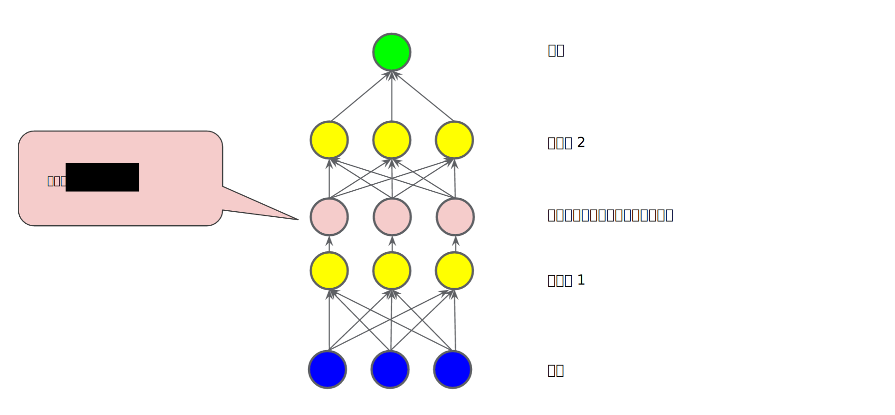
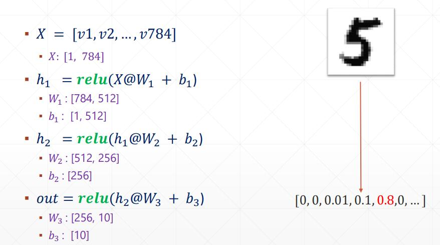
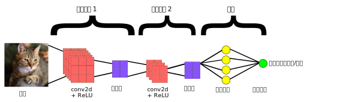

## Gradient Descent

[梯度下降的可视化解释(Momentum，AdaGrad，RMSProp，Adam)](https://zhuanlan.zhihu.com/p/147275344)

[可视化工具](https://github.com/lilipads/gradient_descent_viz)


利用动能


## 机器学习
### 术语库
https://developers.google.com/machine-learning/glossary
https://developers.google.cn/machine-learning/glossary/?hl=zh-cn

### 课程
https://developers.google.cn/machine-learning/crash-course/ml-intro?hl=zh-cn

## 总结

### [训练集、测试集和验证集](https://developers.google.cn/machine-learning/crash-course/validation/video-lecture?hl=zh-cn)

**静态模型*采用离线训练方式**。也就是说，我们只训练模型一次，然后使用训练后的模型一段时间。
**动态模型*采用在线训练方式**。也就是说，数据会不断进入系统，我们通过不断地更新系统将这些数据整合到模型中。

- 训练集进行训练模型-> 测试集进行评估模型 -> 选择在测试集上获得最佳效果的模型 （可能在不断的超参调优过程中 模型会出现过拟合）
- 训练数据和测试数据应该随机拆分
- 不要训练测试数据，当测试数据准确率达到100% 请仔细考虑是否正确(过拟合)
- 数据量少可以考虑使用交叉验证
- 另一个划分：增加验证数据集（注意区别交叉验证数据集）
- 训练集进行训练模型-> 验证集进行评估模型 -> 选择在验证集上获得最佳效果的模型 -> 使用测试集确认模型的效果


类别 |	验证集	|测试集
---|---|---
是否被训练到	|否|	否
作用	|纯粹用于调超参数|	纯粹为了加试以验证泛化性能
使用次数|	多次使用，以不断调参|	仅仅一次使用
缺陷|	模型在一次次重新手动调参并继续训练后所逼近的验证集，可能只代表一部分非训练集，导致最终训练好的模型泛化性能不够	|测试集为了具有泛化代表性，往往数据量比较大，测试一轮要很久，所以往往只取测试集的其中一小部分作为训练过程中的验证集
互相转化|	验证集具有足够泛化性（一般来说，如果验证集足够大到包括大部分非训练集时，也等于具有足够泛化性了）	|验证集具有足够泛化性时，测试集就没有存在的必要了
类比|	校内答辩（如果校内答辩比多校联合答辩还有泛化性（大众）说服力，那么就没有必要再搞个多校联合答辩了）	|多校联合公开答辩


训练数据集：训练模型

验证数据集：调整超参数使用的数据集（也就是之前的测试数据集的作用）

将验证数据传给训练好的模型，观察相应的效果：如果效果不好，就重新换参数，重新训练模型…直到找到一组参数，这组参数使得模型针对验证数据来说已经达到最优

测试数据集：作为衡量最终模型性能的数据集

### 梯度下降 Gradient Descent
在求解机器学习算法的模型参数，即无约束优化问题时，梯度下降（Gradient Descent）是最常采用的方法之一，另一种常用的方法是最小二乘法。

当前的点x~1~ - 学习速率 * 导数 = 新的点x~2~ 

#### 梯度下降法和其他无约束优化算法的比较
在机器学习中的无约束优化算法，除了梯度下降以外，还有前面提到的最小二乘法，此外还有牛顿法和拟牛顿法。

梯度下降法和最小二乘法相比，梯度下降法需要选择步长，而最小二乘法不需要。梯度下降法是迭代求解，最小二乘法是计算解析解。如果样本量不算很大，且存在解析解，最小二乘法比起梯度下降法要有优势，计算速度很快。但是如果样本量很大，用最小二乘法由于需要求一个超级大的逆矩阵，这时就很难或者很慢才能求解解析解了，使用迭代的梯度下降法比较有优势。

梯度下降法和牛顿法/拟牛顿法相比，两者都是迭代求解，不过梯度下降法是梯度求解，而牛顿法/拟牛顿法是用二阶的海森矩阵的逆矩阵或伪逆矩阵求解。
相对而言，使用牛顿法/拟牛顿法收敛更快。但是每次迭代的时间比梯度下降法长。

### 特征

特征组合 (feature cross)

通过将单独的特征进行组合（求笛卡尔积）而形成的合成特征。特征组合有助于表达非线性关系。

1. [A X B]：将两个特征的值相乘形成的特征组合。
2. [A x B x C x D x E]：将五个特征的值相乘形成的特征组合。
3. [A x A]：对单个特征的值求平方形成的特征组合。

### 正则化

排除噪点

lambda（又称为正则化率）就是惩罚因子

注意：将 lambda 设为 0 可彻底取消正则化。 在这种情况下，训练的唯一目的将是最小化损失，而这样做会使过拟合的风险达到最高。

[L1正则化与L2正则化的理解](https://www.cnblogs.com/lliuye/p/9354972.html)

#### L1正则化
稀疏性正则化 (Regularization for Sparsity)：L₁ 正则化
和 L2 不同，L1 鼓励稀疏性

稀疏矢量通常包含许多维度。创建特征组合会导致包含更多维度。由于使用此类高维度特征矢量，因此模型可能会非常庞大，并且需要大量的 RAM。

在高维度稀疏矢量中，最好尽可能使权重正好降至 0。正好为 0 的权重基本上会使相应特征从模型中移除。 将特征设为 0 可节省 RAM 空间，且可以减少模型中的噪点。

L1 正则化**可能会使信息丰富**的特征的权重正好为 0.0。
L1 正则化会使**大多数信息缺乏**的权重正好为 0.0。
L1 正则化往往会减少特征的数量。也就是说，L1 正则化常常会**减小模型的大小**。

L2 正则化可以使权重变小，但是并不能使它们正好为 0.0。

L2 和 L1 采用不同的方式降低权重：
- L2 会降低 权重^2^。
- L1 会降低 |权重|。

因此，L2 和 L1 具有不同的导数：
- L2 的导数为 2 * 权重。
- L1 的导数为 k（一个常数，其值与权重无关）。


### 准确率、精确率、召回率
精确率是针对我们预测结果而言的，它表示的是预测为正的样本中有多少是真正的正样本。

召回率是针对我们原来的样本而言的，它表示的是样本中的正例有多少被预测正确了。

**demo1**
假设我们手上有60个正样本，40个负样本，我们要找出所有的正样本，系统查找出50个，其中只有40个是真正的正样本，计算上述各指标。
TP: 将正类预测为正类数 40(系统查找出40个是真正的正样本)
FN: 将正类预测为负类数 20(60个正样本 - 系统查找出40个是真正的正样本)
FP: 将负类预测为正类数 10(系统查找出50个 - 系统查找出40个是真正的正样本)
TN: 将负类预测为负类数 30(系统查找出50个正样本，那么就是预测了50个负样本，但是50个认为的负样本中实际上有20个正样本，所以30=50-20)

准确率(accuracy) = 预测对的/所有 = (TP+TN)/(TP+FN+FP+TN) = 70%

精确率(precision) = TP/(TP+FP) = 80%

召回率(recall) = TP/(TP+FN) = 2/3

真正例率 (TPR) 是召回率的同义词 = TP/(TP+FN)

假正例率 (FPR) = FP/(FP+TN)


1）TP就是【True P】;FP就是【False P】。都是站在预测的角度来描述的。 
（2）P代表的是Positive【正类】; N表示的是Negative【负类】

Positive代表原始类别，而Negative代表其他所有的类别

FN：False Negative,被判定为负样本，但事实上是正样本。
FP：False Positive,被判定为正样本，但事实上是负样本。
TN：True Negative,被判定为负样本，事实上也是负样本。
TP：True Positive,被判定为正样本，事实上也是正样本。


**demo2**
分类阈值（也称为判定阈值）。如果值高于该阈值，则表示“垃圾邮件”；如果值低于该阈值，则表示“非垃圾邮件”。人们往往会认为分类阈值应始终为 0.5，但阈值取决于具体问题，因此您必须对其进行调整。

让我们以一种将电子邮件分为“垃圾邮件”或“非垃圾邮件”这两种类别的分类模型为例。
如果提高分类阈值，
**精确率可能会提高**:一般来说，提高分类阈值会减少假正例，从而提高精确率。
**召回率始终下降或保持不变**:提高分类阈值会导致真正例的数量减少或保持不变，而且会导致假负例的数量增加或保持不变。因此，召回率会保持不变或下降。

> 注意：“调整”逻辑回归的阈值不同于调整学习速率等超参数。在选择阈值时，需要评估您将因犯错而承担多大的后果。例如，将非垃圾邮件误标记为垃圾邮件会非常糟糕。不过，虽然将垃圾邮件误标记为非垃圾邮件会令人不快，但应该不会让您丢掉工作。反之将非垃圾邮件标记为垃圾邮件，那么你可以回家了。

<table border="1">
  <tbody><tr>
    <td style="background-color:#99FF99" width="50%">
      <b>真正例 (TP)：</b>
      <ul>
        <li>真实情况：受到狼的威胁。</li>
        <li>牧童说：“狼来了。”</li>
        <li>结果：牧童是个英雄。</li>
      </ul>
    </td>
    <td style="background-color:#FF9999">
      <b>假正例 (FP)：</b>
      <ul>
        <li>真实情况：没受到狼的威胁。</li>
        <li>牧童说：“狼来了。”</li>
        <li>结果：村民们因牧童吵醒他们而感到非常生气。</li>
    </ul></td>
  </tr>
  <tr>
    <td style="background-color:#FF9999">
      <b>假负例 (FN)：</b>
      <ul>
        <li>真实情况：受到狼的威胁。</li>
        <li>牧童说：“没有狼”。</li>
        <li>结果：狼吃掉了所有的羊。</li>
      </ul>
    </td>
    <td style="background-color:#99FF99">
      <b>真负例 (TN)：</b>
      <ul>
        <li>真实情况：没受到狼的威胁。</li>
        <li>牧童说：“没有狼”。</li>
        <li>结果：大家都没事。</li>
      </ul>
    </td>
  </tr>
</tbody></table>
**demo3**
在 100 个肿瘤样本中，91 个为良性（90 个 TN 和 1 个 FP），9 个为恶性（1 个 TP 和 8 个 FN）。
<table border="1">
  <tbody><tr>
    <td style="background-color:#99FF99" width="50%">
      <b>真正例 (TP)：</b>
      <ul>
        <li>真实情况：恶性</li>
        <li>机器学习模型预测的结果：恶性</li>
        <li><strong>TP 结果数：1</strong></li>
      </ul>
    </td>
    <td style="background-color:#FF9999">
      <b>假正例 (FP)：</b>
      <ul>
        <li>真实情况：良性</li>
        <li>机器学习模型预测的结果：恶性</li>
        <li><strong>FP 结果数：1</strong></li>
    </ul></td>
  </tr>
  <tr>
    <td style="background-color:#FF9999">
      <b>假负例 (FN)：</b>
      <ul>
        <li>真实情况：恶性</li>
        <li>机器学习模型预测的结果：良性</li>
        <li><strong>FN 结果数：8</strong></li>
      </ul>
    </td>
    <td style="background-color:#99FF99">
      <b>真负例 (TN)：</b>
      <ul>
        <li>真实情况：良性</li>
        <li>机器学习模型预测的结果：良性</li>
        <li><strong>TN 结果数：90</strong></li>
      </ul>
    </td>
  </tr>
</tbody></table>

准确率 = (TP+TN)/(TP+FN+FP+TN) = (1+90)/(1+90+1+8) = 0.91
精确率 =  TP/(TP+FP) = 1/(1+1) = 0.5 ，也就是说，该模型在预测恶性肿瘤方面的正确率是 50%。
召回率 =  TP/(TP+FN) = 1/(1+8) = 0.11，也就是说，该模型能够正确识别出所有恶性肿瘤的百分比是 11%。

以上数据说明：
1. 当您使用分类不平衡的数据集（比如正类别标签和负类别标签的数量之间存在明显差异）时，单单准确率一项并不能反映全面情况。
2. 判断模型的好坏需要通过 准确率和召回率两个指标来判断

**demo4**
> 在 roulette 游戏中，一只球会落在旋转轮上，并且最终落入 38 个槽的其中一个内。某个机器学习模型可以使用视觉特征（球的旋转方式、球落下时旋转轮所在的位置、球在旋转轮上方的高度）预测球会落入哪个槽中，准确率为 4%。
> 这个机器学习模型做出的预测比碰运气要好得多；随机猜测的正确率为 1/38，即准确率为 2.6%。尽管该模型的准确率“只有”4%，但成功预测获得的好处远远大于预测失败的损失。


[分类 (Classification)：检查您的理解情况（ROC 和 AUC）](https://developers.google.cn/machine-learning/crash-course/classification/check-your-understanding-roc-and-auc?hl=zh-cn)


### 激活函数，梯度消失与梯度爆炸

如果每层因子相乘的结果不断减小，产生**梯度消失**，会造成网络的前层网络的权重的梯度很小，这些w很可能得不到更新；而如果相乘的结果越来越大，则产生**梯度爆炸**。

非线性变化，例如激活函数

激活函数（例如 ReLU 或 S 型函数），用于对上一层的所有输入求加权和，然后生成一个输出值（通常为非线性值），并将其传递给下一层。

在下图所示的模型中，在隐藏层 1 中的各个节点的值传递到下一层进行加权求和之前，我们采用一个非线性函数对其进行了转换。这种非线性函数称为激活函数。


**线性回归：out = w*x + b**
**逻辑(非线性)回归：需要添加非线性函数（激活函数）f;使得 out = f(w*x + b) ：比如f=relu**

hide1(隐藏层) = relu(w1@x + b1) 
hide2(隐藏层) = relu(w2@hide1 + b2) 
out = relu(w3@hide2 + b3) 

为什么deep ？hide 非常多


**x输入如果是矩阵，那么w和b 也是矩阵，这样就可以实现降维：**


#### Relu
x<0时，输出为0, 否则输出x
存在的问题：
-  x<0时，输出为0，可能导致某些神经元死亡
- 不是zero-center
- 无负值


ReLU在自变量大于0时导数为1,小于0时导数为0,因此可以解决梯度爆炸问题.

####  S 型激活函数
S 型激活函数将加权和转换为介于 0 和 1 之间的值


#### 梯度消失
较低层（更接近输入）的梯度可能会变得非常小。在深度网络中，计算这些梯度时，可能涉及许多小项的乘积。

当较低层的梯度逐渐消失到 0 时，这些层的训练速度会非常缓慢，甚至不再训练。

ReLU 激活函数有助于防止梯度消失。

#### 梯度爆炸
如果网络中的权重过大，则较低层的梯度会涉及许多大项的乘积。在这种情况下，梯度就会爆炸：梯度过大导致难以收敛。

批标准化可以降低学习速率，因而有助于防止梯度爆炸。

#### ReLU 单元消失
一旦 ReLU 单元的加权和低于 0，ReLU 单元就可能会停滞。它会输出对网络输出没有任何贡献的 0 激活，而梯度在反向传播算法期间将无法再从中流过。由于梯度的来源被切断，ReLU 的输入可能无法作出足够的改变来使加权和恢复到 0 以上。

降低学习速率有助于防止 ReLU 单元消失。
### Deep Learning
深度学习是机器学习的一个子领域，研究受大脑结构和功能启发的算法。这些算法被称为人工智能网络，它由层层排列的函数（神经元）组成，它们将信号传递给其他神经元。这些信号是输入到网络中的数据的产物，从一层传递到另一层，并对网络进行缓慢的“调整”，实际上是在调整每个连接的突触强度（权重）。通过数据集中提取特征并识别交叉样本的趋势，网络最终学会做出预测。

### CNN
卷积神经网络的端到端结构


一般图像处理使用2DConvolution层

3DConvolution层
三维卷积对三维的输入进行滑动窗卷积，当使用该层作为第一层时，应提供input_shape参数。
例如input_shape = (3,10,128,128)代表对10帧128*128的彩色RGB图像进行卷积 。

```
# demo01
#160*100*22
model.add(Convolution3D(
    10,
    kernel_dim1=9, # depth
    kernel_dim2=9, # rows
    kernel_dim3=9, # cols
    input_shape=(3,160,100,22),
    activation='relu'
))
#now 152*92*14

# demo02

#34*19*8
model.add(Convolution3D(
    50,
    kernel_dim1=5, # depth
    kernel_dim2=9, # rows
    kernel_dim3=8, # cols
    activation='relu'
))
#now 26*12*4
```


### 待学习 seq2seq BERT  YOLOv5 对决 Faster RCNN
目前，基于深度学习(deep learning)的目标检测技术效果是最好的，这些技术模型可以分成三类：
1. 基于Region Proposal（候选区域）的算法如：R-CNN系列，包括R-CNN，Fast R-CNN，以及Faster R-CNN
2. Single Shot Detector (SSD)
3. You Only Look Once (YOLO)系列，其中YOLOv3是今天的主角

目标检测算法主要分为两类：
一类是基于Region Proposal（候选区域）的算法，如R-CNN系算法（R-CNN，Fast R-CNN, Faster R-CNN），它们是two-stage（两步法）的，需要先使用Selective search或者CNN网络（RPN）产生Region Proposal，然后再在Region Proposal上做分类与回归。
而另一类是Yolo，SSD这类one-stage算法（一步法），其仅仅使用一个CNN网络直接预测不同目标的类别与位置。
第一类方法是准确度高一些，但是速度慢，而第二类算法是速度快，但是准确性要低一些。


https://pjreddie.com/darknet/yolo/

### NLP
GRU，LSTM，XLNet，BERT

### 最强大的语言模型GPT-3（也有图片模型GPT-3）

GPT 模型是 OpenAI 在 2018 年提出的一种新的 ELMo 算法模型，该模型在预训练模型的基础上，只需要做一些微调即可直接迁移到各种 NLP 任务中，因此具有很强的业务迁移能力。

互联网原子弹，人工智能界的卡丽熙，算力吞噬者，黄仁勋的新 KPI ，下岗工人制造机，幼年期的天网 —— 最先进的 AI 语言模型 GPT-3。
GPT-3开启“天网元年”。

在语言方面，依赖于单词预测的无监督学习算法（例如GPT-3和BERT）非常成功

另外两个主要的技术趋势会让程序员倍感不安：无代码编程和AutoML.

无代码编程指的是一种可视化工具，任何人都可以通过这种可视化工具轻松地构建新产品，无论是网站、设计、数据分析还是模型都没问题。
AutoML，即自动机器学习，它大大缩短了AI投入生产的时间。 

GPT-3将再一次掀起无代码编程和AutoML工具的热潮。

你不仅可以指导GPT-3编写代码，而且还可以指导它编写诗歌、音乐、社交媒体评论或任何其他文本。

GPT可以编写代码(比如SQL，其它任何语言)，可以编写任何东西，而且它还可以生成图像。
同一个模型体系结构不仅可以用于处理文本，还可在像素序上进行训练，从而生成新的图像。实际上，GPT的表现出人意料，甚至可与顶级的CNN媲美。


OpenAI 曾于 2019 年初发布 GPT-2，这一基于 Transformer 的大型语言模型共包含 15 亿参数、在一个 800 万网页数据集上训练而成，这在当时就已经引起了不小的轰动。整个 2019 年，GPT-2 都是 NLP 界最耀眼的明星之一，与 BERT、Transformer XL、XLNet 等大型自然语言处理模型轮番在各大自然语言处理任务排行榜上刷新最佳纪录。而 GPT-2 得益于其稳定、优异的性能在业界独领风骚。 

而 GPT-3 的参数量足足是 GPT-2 的 116 倍（**GPT-3，1750 亿参数，45TB 训练数据**），实现了对整个 2019 年的所有大型自然语言处理模型的降维打击。

在 NLP 领域中，通常采用 ELMo 算法的思想，即通过在大量的语料上预训练语言模型，然后再将预训练好的模型迁移到具体的下游NLP任务，从而提高模型的能力。GPT 模型是 OpenAI 在 2018 年提出的一种新的 ELMo 算法模型，该模型在预训练模型的基础上，只需要做一些微调即可直接迁移到各种 NLP 任务中，因此具有很强的业务迁移能力。

GPT 模型主要包含两个阶段。第一个阶段，先利用大量未标注的语料预训练一个语言模型，接着，在第二个阶段对预训练好的语言模型进行微改，将其迁移到各种有监督的 NLP 任务，并对参数进行 fine-tuning。

在 GPT-3 之前，最大的 AI 语言模型是微软在今年（2020） 2 月推出的 Turing NLG，当时拥有 170 亿参数的 Turing NLG 已经标榜是第二名 Megatron-LM 的两倍。没错，仅短短 5 个月的时间，GPT-3 就将头号玩家的参数提高了 10 倍！

微软给 OpenAI 提供的这台超级计算机是一个统一的系统，该系统拥有超过 285000 个 CPU 核心，10000 个 GPU 和每秒 400G 的网络，是一台排名全球前 5 的超级计算机。
有专业人士推测过，训练一个GPT-3模型需要“355个GPU年”（一块GPU运行355年的运算量），光是训练费用就高达460万美元。


最后引用神经网络之父、图灵奖获得者 Geoffrey Hinton 早前对 GPT-3 的一番评论：

“ 鉴于 GPT-3 在未来的惊人前景，可以得出结论：生命、宇宙和万物的答案，就只是 4.398 万亿个参数而已。”

#### 参考链接：
https://blogs.microsoft.com/ai/openai-azure-supercomputer/
https://jalammar.github.io/how-gpt3-works-visualizations-animations/
https://www.reddit.com/r/MachineLearning/comments/hymqof/d_gpt3_and_a_typology_of_hype_by_delip_rao/
https://www.datanami.com/2020/07/21/openais-gpt-3-language-generator-is-impressive-but-dont-hold-your-breath-for-skynet/

GPT-3应用案例：
https://gpt3examples.com/

GPT-3沙箱：
https://github.com/shreyashankar/gpt3-sandbox

OpenAI API开发者工具包：
https://www.notion.so/API-Developer-Toolkit-49595ed6ffcd413e93ebff10d7e70fe7


### one-hot

手写数字问题：[28 , 28, 1]的图片矩阵 - 打平 第二行28 放到第一行的右边，总共变成一维[28*28 = 748]

输出（prediction）：
1. dog = 0, cat =1 ,fish = 2 ...
2. one-hot 编码
   dog =[1,0,0,...]
   cat = [0,1,0,0,..]
   fish = [0,0,1,0,..]

一般在输出结果之前的数据格式为[dog=0.9,cat=0.1]  它们的概率之和为1，我们取最大的

### 张量的数据形式

tensor:张量
dim：代表张量的维度。
constant:常量

标量(scalar)：数据单独的一个数，零维张量，其形状如：1.1 ,dim=0  ,shape=()

向量(vector) ：一维数组，一维张量，其形状如：`[1.1,2.2,3.3]` ,dim=1 ,shape=(3,)

矩阵(matrix)：二维数组，二维张量，其形状如：shape=(3,3)

多维数组(n-d array)：多维数组，多维张量，其形状如：shape=(1,3,3)


shape：shape描述的是矩阵的形状, 即张量的shape。从前往后对应由外向内的维度。

size：size描述的是元素的个数。

dim：代表张量的维度。

`[[1],[2],[3]]` 这个张量的shape为（3,1）
`[[[1,2],[3,4]],[[5,6],[7,8]],[[9,10],[11,12]]]`这个张量的shape为（3,2,2）,
`[1,2,3,4]`这个张量的shape为（4，）

#### 1-5维的张量应用场景
dim = 0 , 标量(scalar), shape = ()  ,`[]`
loss 和 accuracy

dim = 1 ,向量(vector), shape = (2,) , `[1,2]`

net.bias
```
# W @ x + b
net = layers.Dense(10)
net.build((4, 8))

net.kernel # w,shape = (8,10)
net.bias # b, shape =(10,)  
```

dim = 2 ,矩阵(matrix)，shape = (2,2)，`[[1,2],[3,4]]`
一般 input x :[b, vec_dim] (`一张图片[1,784]，多张图片[b,784]`)
weight : [input_dim, output_dim]


dim = 3, tensor张量,  `[25000, 80, 200]`
比如NLP中
x:[b,seq_len, word_dim]

将每个单词转换为word_dim = 200长度的
那么seq_len = 单词个数
b= 句子个数

对单词embedding


dim = 4, tensor张量,  `[60000, 28, 28, 3]`
比如图片：`[b,h,w,3]`
b个图片个数


dim = 5 ,tensor张量
可以看做对dim=4的批量
`[task_b,b,h,w,3]` 有task_b个任务，每个任务`[b,h,w,3]`