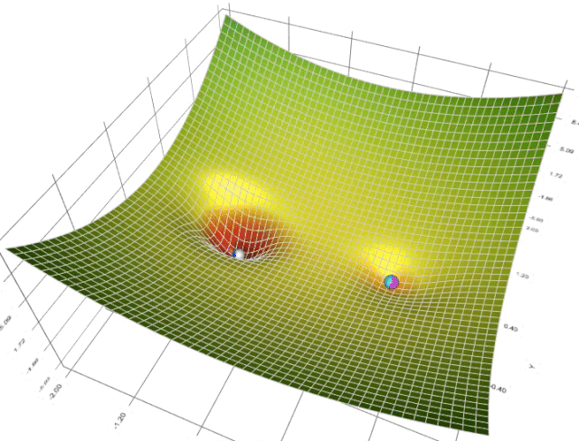

## Gradient Descent

[梯度下降的可视化解释(Momentum，AdaGrad，RMSProp，Adam)](https://zhuanlan.zhihu.com/p/147275344)

[可视化工具](https://github.com/lilipads/gradient_descent_viz)

利用动能

## 机器学习
### 术语库
https://developers.google.com/machine-learning/glossary
https://developers.google.cn/machine-learning/glossary/?hl=zh-cn

### 课程
https://developers.google.cn/machine-learning/crash-course/ml-intro?hl=zh-cn

## 总结

[训练集、测试集和验证集](https://developers.google.cn/machine-learning/crash-course/validation/video-lecture?hl=zh-cn)

- 训练集进行训练模型-> 测试集进行评估模型 -> 选择在测试集上获得最佳效果的模型 （可能在不断的超参调优过程中 模型会出现过拟合）
- 训练数据和测试数据应该随机拆分
- 不要训练测试数据，当测试数据准确率达到100% 请仔细考虑是否正确(过拟合)
- 数据量少可以考虑使用交叉验证
- 另一个划分：增加验证数据集（注意区别交叉验证数据集）
- 训练集进行训练模型-> 验证集进行评估模型 -> 选择在验证集上获得最佳效果的模型 -> 使用测试集确认模型的效果

类别 |	验证集	|测试集
---|---|---
是否被训练到	|否|	否
作用	|纯粹用于调超参数|	纯粹为了加试以验证泛化性能
使用次数|	多次使用，以不断调参|	仅仅一次使用
缺陷|	模型在一次次重新手动调参并继续训练后所逼近的验证集，可能只代表一部分非训练集，导致最终训练好的模型泛化性能不够	|测试集为了具有泛化代表性，往往数据量比较大，测试一轮要很久，所以往往只取测试集的其中一小部分作为训练过程中的验证集
互相转化|	验证集具有足够泛化性（一般来说，如果验证集足够大到包括大部分非训练集时，也等于具有足够泛化性了）	|验证集具有足够泛化性时，测试集就没有存在的必要了
类比|	校内答辩（如果校内答辩比多校联合答辩还有泛化性（大众）说服力，那么就没有必要再搞个多校联合答辩了）	|多校联合公开答辩

训练数据集：训练模型

验证数据集：调整超参数使用的数据集（也就是之前的测试数据集的作用）

将验证数据传给训练好的模型，观察相应的效果：如果效果不好，就重新换参数，重新训练模型…直到找到一组参数，这组参数使得模型针对验证数据来说已经达到最优

测试数据集：作为衡量最终模型性能的数据集
