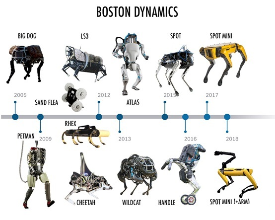

[足式机器人的过去、现在和未来](https://zhuanlan.zhihu.com/p/128685081)

## Boston Dynamics 波士顿动力公司
https://www.bostondynamics.com/

世界上的足式机器人有两种，一种叫Boston Dynamics, 一种叫其它。

## festo 费斯托
[一家「仿生」上瘾的机器人公司，比波士顿动力大67岁：Festo最新仿生雨燕问世](https://news.cnblogs.com/n/667699/)
[festo 仿生机器人](https://www.festo.com/group/en/cms/10156.htm)
[BionicSwift 仿生雨燕](https://www.festo.com/group/en/cms/13787.htm)

先说天上飞的。在过去的几年，Festo 先后展示过仿生蜻蜓、仿生蝙蝠、仿生蝴蝶等黑科技：再说水里游的，比如仿生水母：　最后，还有地上跑的，比如蜘蛛、袋鼠：

仿生软件臂
仿生软手

## Agility Robotics
波士顿动力对手Agility Robotics
https://www.agilityrobotics.com/

腿足式机器人——Cassie
Hurst是Cassie的发明人，目前是Oregon State University 的[Dynamic Robotics Laboratory](https://mime.oregonstate.edu/research/drl/)负责人，同时也是Agility Robotics公司CTO

## 国外知名足式机器人研发机构

- [有哪些著名的机器人公司和机器人实验室？](https://www.zhihu.com/question/19826366)
    - [Robdyn的回答](https://www.zhihu.com/question/19826366/answer/153493143)
    - [Yifan Hou的回答](https://www.zhihu.com/question/19826366/answer/43599414)

- 其它资料

- [Boston Dynamics](http://www.bostondynamics.com/index.html)
- [TheInstitute for Human & Machine Cognition (IHMC)](https://www.ihmc.us/)
- [Oregon State UniversityDynamic Robotics Laboratory](http://mime.oregonstate.edu/research/drl/)
- [Carnegie MellonUniversity Robotics Institute](http://www.ri.cmu.edu/research_guide/index.html)
- [MIT CSAIL RobotLocomotion Group](http://groups.csail.mit.edu/locomotion/index.html)
- [Yale University GRAB Lab](https://www.eng.yale.edu/grablab/index.html)
- [加利福尼亚大学洛杉矶分校RoMeLa](http://www.romela.org/)
- [MIT media lab biomechatronics group](https://www.media.mit.edu/groups/biomechatronics/overview/)
- [University of Michigan](http://web.eecs.umich.edu/faculty/grizzle/)
- [California Institute of Technology AMBERLab](http://www.bipedalrobotics.com/)

- [日本本田技研工业株式会社](http://asimo.honda.com/default.aspx)
- [川田工业株式会社](http://global.kawada.jp/mechatronics/index.html)
- [东京大学JSK实验室](http://www.jsk.t.u-tokyo.ac.jp/index.html)
- [京都立命馆大学Humanoid Systems Lab](http://www.ritsumei.ac.jp/se/~gen/index-e.html)
- [早稻田大学WABOT-HOUSE研究所](http://www.wabot-house.waseda.ac.jp/html/e-top.htm)
- [早稻田大学Humanoid Robotics Institute](http://www.humanoid.waseda.ac.jp/index.html)

- [韩国科学技术院(KAIST)](http://hubolab.kaist.ac.kr/)
- [首尔大学DynamicRobotic Systems Lab](http://dyros.snu.ac.kr/)
- [Robotis](http://en.robotis.com/index/)

- [IIT](https://www.iit.it/programs/robotics)
- [DLR](http://www.dlr.de/rmc/rm/en/desktopdefault.aspx/tabid-11370/)
- [Aldebaran Robotics](https://www.ald.softbankrobotics.com/en)
- [University of Cambridge Biologically InspiredRobotics Lab](http://divf.eng.cam.ac.uk/birl)
- [University of Edinburgh](http://valkyrie.inf.ed.ac.uk/)

- [瑞士联邦理工学院Biorobotics Laboratory](http://biorob.epfl.ch/page-36354.html)

## 其它
### ReWalk Robotics
可穿戴式外骨骼系统医疗设备公司

### Autel Robotics
大疆无人机的对手？

### 杭州云深处科技有限公司
http://www.deeprobotics.cn/
“绝影”是国内第一款面向行业应用和场景展示的灵敏型四足机器人