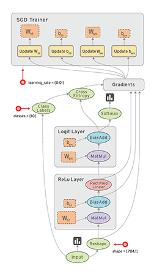

pytorch
tensorflow

[tensorflow blog](https://blog.tensorflow.org/)
[tensorflow 教程](http://tensorflow.google.cn/)
[tensorflow playground](http://playground.tensorflow.org/?hl=zh-cn)
[机器学习课程](https://developers.google.cn/machine-learning/crash-course)

[TensorFlow Recommenders](https://github.com/tensorflow/recommenders)

V1.x

具体编程流程：
建立计算图
初始化变量
建立会话
在会话中执行图
关闭会话

[深度学习入门开源书，基于TensorFlow 2.0案例实战](https://github.com/dragen1860/Deep-Learning-with-TensorFlow-book)

[Tensorflow2.0 学习](https://github.com/lyhue1991/eat_tensorflow2_in_30_days)
https://lyhue1991.github.io/eat_tensorflow2_in_30_days/

[tf 2.0](https://geektutu.com/post/tf2doc.html)

[python深度学习](https://github.com/fchollet/deep-learning-with-python-notebooks)

学习深度学习简单的例子，如MNIST, CIFAR, PTB, Word2Vec等等。只要学习了这里面的基础任务，基本可以说是入门了。我建议结合网上的深度学习教材来看代码。
https://github.com/tensorlayer/tensorlayer/blob/master/examples/README.md

学习更加复杂的深度学习例子，并尝试重现一篇自己喜欢的paper。下面的链接中整理了计算机视觉、自然语言处理、生成对抗网络等中大型应用的代码链接。
https://github.com/tensorlayer/awesome-tensorlayer

对强化学习感兴趣的同学，可以看看这套代码库，我们用简单且统一的代码模版，实现了大部分的强化学习算法，并不断地添加最新算法。我们最近在写一本深度强化学习的书，也是用Python作为例子的。
https://zhuanlan.zhihu.com/p/68950847

https://www.zhihu.com/question/48180108
1. 前期准备， 你多多少少需要懂python科学运算，数据整理还有出图像结果的模块，这三个必不可少：numpy[教程](https://morvanzhou.github.io/tutorials/data-manipulation/np-pd/) , pandas [教程], matplotlib [教程].
2. 进阶准备，在机器学习方面，scikit-learn [教程] 是汇集了众多机器学习方法的模块，它支持各种各样的机器学习方法。你总能找到适合你项目的。
3. 同样是进阶的，在神经网络方面有着巨大贡献的 Tensorflow [教程]，这个是Google开发，而且挖了挺多theano的开发人员。我觉得神经网络的开发没有比tensorflow更牛的了。而且你想Google这大公司，更新推进的速度肯定也不会慢。看好它。同时 Pytorch [教程] 也是值得推荐的神经网络库.
4. 现在强化学习 [教程] 也非常的热门, 让机器人自动学习, 帮你完成事情是不错的想法. 比如AlphaGo, 都是强化学习做出来的.
5. 遗传算法 [教程] 这种类型, 在工业界是使用得比较多的, 但是未来可能大部分用遗传算法的工程会被深度学习替代, 但是遗传算法这种进化形势的算法, 还是在机器学习有一席之地的.
6. 如果想方便快捷地搭建神经网络, Keras 这个模块很不错, 他的底层是 Tensorflow 和 Theano, 所以在 Windows, MacOS, Linux上都能用得到.