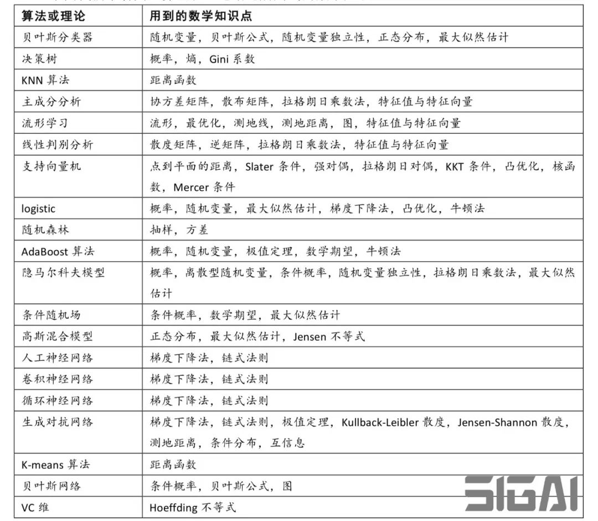

<!--toc-->
[TOC]
# 数学

## 高等数学
高等数学中两大入门课程：线性代数和微积分

- 线性代数
它的研究对象是向量，向量空间（或称线性空间），线性变换和有限维的线性方程组。
### 入门

#### 托马斯微积分
《托马斯微积分》：直观易读，强调建模应用和技巧训练，重要的是不失数学上的完整性，工科使用应该相当不错。作者：芬尼 / 韦尔 / 焦尔当诺
#### 普林斯顿微积分读本
《普林斯顿微积分读本》：没看过，据说评价很高。 作者：阿德里安·班纳

### 进阶
#### 微积分和数学分析引论
《微积分和数学分析引论》 ：数学经典之一。作者: Richard Courant / Fritz John
#### 数学分析原理
《数学分析原理》 ：分析学名著。作者：Walter Rudin
#### 数学分析八讲
《数学分析八讲》：据说数理学科看着都有点困难。作者：辛钦
#### 微积分学教程
《微积分学教程》（共三卷）：数学名著。作者：菲赫金哥尔茨
#### 微积分入门
《微积分入门》（共两卷）：世界级数学大师的优秀教材。作者：小平邦彦

## 线性代数

- 知识点

[Linear Algebra](https://www.deeplearningbook.org/contents/linear_algebra.html)
[Linear Algebra Slides](https://www.deeplearningbook.org/slides/02_linear_algebra.pdf)

[The matrix cookbook - 线性代数索引](files/matrixcookbook.pdf) [在线版](https://www.math.uwaterloo.ca/~hwolkowi/matrixcookbook.pdf)

[Old and New Matrix Algebra Useful for Statistics](https://tminka.github.io/papers/matrix/minka-matrix.pdf)

[Matrix calculus](https://en.jinzhao.wiki/wiki/Matrix_calculus)
[The Matrix Calculus You Need For Deep Learning](https://arxiv.org/pdf/1802.01528.pdf)
[在线计算矩阵微积分](http://www.matrixcalculus.org/)

- 斯坦福大学机器学习复习材料(数学基础)

[Linear Algebra Review and Reference - 2007年](https://see.stanford.edu/materials/aimlcs229/cs229-linalg.pdf)
[Linear Algebra Review and Reference - 2015年](http://cs229.stanford.edu/section/cs229-linalg.pdf)
[Linear Algebra Review and Reference - 2020年](http://cs229.stanford.edu/summer2020/cs229-linalg.pdf)
[翻译 - 2020年版本](https://github.com/openjw/open/blob/master/MachineLearning/cs229/cs229-linalg.md)

[Review of Probability Theory](http://cs229.stanford.edu/section/cs229-prob.pdf)
[Probability Theory Review for Machine Learning - 2006年](https://see.stanford.edu/materials/aimlcs229/cs229-prob.pdf)
[翻译](https://github.com/fengdu78/Data-Science-Notes/blob/master/0.math/1.CS229/markdown/2.CS229-Prob.md)

[Convex Optimization Overview (cnt’d)](http://cs229.stanford.edu/section/cs229-cvxopt2.pdf)
[Convex Optimization Overview](http://web.stanford.edu/class/cs224n/readings/cs229-cvxopt.pdf)

[Hidden Markov Models Fundamentals](http://cs229.stanford.edu/section/cs229-hmm.pdf)

[Gaussian processes](http://cs229.stanford.edu/section/cs229-gaussian_processes.pdf)

其它内容：
http://cs229.stanford.edu/section/
http://cs229.stanford.edu/summer2020/
http://web.stanford.edu/class/cs224n/readings/

[Math 290-1: Linear Algebra & Multivariable Calculus Northwestern University, Lecture Notes](https://sites.math.northwestern.edu/~scanez/courses/290/notes/lecture-notes-290-1.pdf)

### 入门
#### 线性代数及其应用
《线性代数及其应用》 ：侧重于应用。作者：David C. Lay
[MIT 教授 Gilbert Strang](http://math.mit.edu/~gs/) 的公开课 Linear Algebra，配合教材 [《Introduction to Linear Algebra 》](https://github.com/liuguoyou/Introduction-to-Linear-Algebra-5th-Edition---EE16A/blob/master/Ed%205%2C%20Gilbert%20Strang%20-%20Introduction%20to%20Linear%20Algebra%20(2016%2C%20Wellesley-Cambridge%20Press).pdf)或[《Linear Algebra and Its Applications》](https://github.com/AUT-CE-Archive/AUT-CE-LA/tree/main/References)

[《Introduction to Linear Algebra 》](https://github.com/ksmaybe/cs310)

#### 台大线性代数
[台大线性代数 PPT和视频](http://speech.ee.ntu.edu.tw/~tlkagk/courses_LA18.html)

### 进阶
#### 线性代数应该这样学
《线性代数应该这样学》 ：建立在普通线性代数基础上的，有泛函基础再看这本书会好些。作者：Sheldon Axler
#### 矩阵分析
《矩阵分析》 ：赫赫有名的一本书。作者：（美）合恩（Horn/R.A.）等/杨奇
#### 矩阵计算
《矩阵计算》 ：被称为数值线性代数圣经。作者：Gene H.Golub / Charles F.Van Loan

## 概率论与数理统计
### 概率论基础教程
《概率论基础教程》 ：入门级的好教材。作者：罗斯（Sheldon M. Ross）
### 概率论教程
《概率论教程》：看版本号就知道很经典。作者：钟开莱
### 概率论与数理统计
《概率论与数理统计》：用心写成的书，不光是教知识，更是教思维的方法。作者：陈希孺
### 数理统计学导论（原书第7版）
《数理统计学导论（原书第7版） 》 ：不太了解。作者：霍格
### 数理统计学教程
《数理统计学教程 》 ：堪称最好的中文数理统计教材，中国科学院院士的又一杰作。作者：陈希孺

## 俄罗斯数学教材选译系列
绿色封面
## 华章数学译丛
黄色封面

## 最优化方法
> 优化 = 数学规划
> 线性规划一定是凸规划

[最优化：建模、算法与理论/最优化计算方法](http://bicmr.pku.edu.cn/~wenzw/optbook.html)

凸优化

[Stephen Boyd的Convex Optimization](https://web.stanford.edu/~boyd/cvxbook/bv_cvxbook.pdf)

非线性规划

[Nonlinear Programming by Dimitri P. Bertsekas](http://www.athenasc.com/nonlinbook.html)

高等代数

# 机器学习

## 数学基础

### 数学之美
《数学之美（第二版）》 - 吴军。

### 统计学习方法
《统计学习方法》 - 李航。可以说是机器学习的入门宝典，许多机器学习培训班、互联网企业的面试、笔试题目，很多都参考这本书。

[《统计学习方法》第二版的代码实现](https://github.com/fengdu78/lihang-code)

### 托马斯微积分
《托马斯微积分》学好多元微积分也能更好地理解神经网络模型的优化过程。

### 线性代数及其应用
《线性代数及其应用（原书第 5 版）》线性代数是理解矩阵运算的基础。数据挖掘算法里的非负矩阵分解、奇异值分解，以及神经网络里的矩阵运算，都需要一定的线性代数知识。

### 概率论与数理统计
《概率论与数理统计》概率论与数理统计是最为重要的一门数学课。目前使用最广泛的交叉熵损失函数，源于统计中的极大似然估计；概率论中的贝叶斯公式衍生出了贝叶斯学派；大数定律则是很多主观实验的理论依据之一。

## 算法|编程基础
### 图解机器学习
《图解机器学习》
### 集体智慧编程
《集体智慧编程》

## 入门
### 机器学习
《机器学习》 周志华的西瓜书
[西瓜书）公式推导解析](https://github.com/datawhalechina/pumpkin-book)

[机器学习原理](https://github.com/shunliz/Machine-Learning)
[Foundations of Machine Learning-机器学习基础](https://cs.nyu.edu/~mohri/mlbook/)

[The Elements of Statistical Learning - 统计学习基础](https://web.stanford.edu/~hastie/ElemStatLearn/)

[Machine Learning: a Probabilistic Perspective - 机器学习：概率视角](https://doc.lagout.org/science/Artificial%20Intelligence/Machine%20learning/Machine%20Learning_%20A%20Probabilistic%20Perspective%20%5BMurphy%202012-08-24%5D.pdf)

- Chapter 1: 引言 Introduction
- Chapter 2: 概率 Probability
- Chapter 3: 面向离散数据的生成式模型 Generative models for discrete data
- Chapter 4: 高斯模型 Gaussian models
- Chapter 5: 贝叶斯统计 Bayesian statistics
- Chapter 6: 频率统计 Frequentist statistics
- Chapter 7: 线性回归 Linear regression
- Chapter 8: 逻辑回归 Logistic regression
- Chapter 9: 广义线性模型和指数族 Generalized linear models and the exponential - family
- Chapter 10: 有向图模型(贝叶斯网络) Directed graphical models (Bayes nets)
- Chapter 11: 混合模型与EM算法 Mixture models and the EM algorithm
- Chapter 12: 隐式线性模型 Latent linear models
- Chapter 13: 稀疏线性模型 Sparse linear models
- Chapter 14: 核方法 Kernels
- Chapter 15: 高斯过程 Gaussian processes
- Chapter 16: 自适应基函数模型 Adaptive basis function model
- Chapter 17: 马尔可夫模型和隐马尔可夫模型 Markov and hidden Markov Models
- Chapter 18: 状态空间模型 State space models
- Chapter 19: 无向图模型(马尔可夫随机域) Undirected graphical models (Markov random - fields)
- Chapter 20: 图模型精准推断 Exact inference algorithms for graphical models
- Chapter 21: 变分推断 Variational inference
- Chapter 22: 更进变分推断 More variational inference
- Chapter 23: 蒙特卡洛推断 Monte Carlo inference algorithms
- Chapter 24: 马尔科夫链蒙特卡洛推断 MCMC inference algorithms
- Chapter 25: 聚类 Clustering
- Chapter 26: 图模型结构学习 Graphical model structure learning
- Chapter 27: 因变量 Latent variable models for discrete data
- Chapter 28: 深度学习 Deep learning

[《机器学习:概率视角》第二版的Python 3代码](https://github.com/probml/pyprobml)
[Probabilistic Machine Learning - by Kevin Patrick Murphy.](https://probml.github.io/pml-book/)
- [Book 0: “Machine Learning: A Probabilistic Perspective” (2012)](https://probml.github.io/pml-book/book0.html)
- [Book 1: “Probabilistic Machine Learning: An Introduction” (2021)](https://probml.github.io/pml-book/book1.html)
- [Book 2: “Probabilistic Machine Learning: Advanced Topics” (2022)](https://probml.github.io/pml-book/book2.html)

[MACHINE LEARNING An Algorithmic Perspective - - 机器学习：算法视角](https://doc.lagout.org/science/Artificial%20Intelligence/Machine%20learning/Machine%20Learning_%20An%20Algorithmic%20Perspective%20%282nd%20ed.%29%20%5BMarsland%202014-10-08%5D.pdf)

机器学习其它书籍：
https://doc.lagout.org/science/Artificial%20Intelligence/Machine%20learning/

推荐，符合scikit-learn
[Mastering machine learning algorithms  expert techniques for implementing popular machine learning algorithms, fine-tuning your models, and understanding how they work by Giuseppe Bonaccorso](./files/Mastering-machine-learning-algorithms-by-Giuseppe-Bonaccorso.pdf)

### Python 深度学习
《Python 深度学习》
### 动手学深度学习
《动手学深度学习》
### Python 神经网络编程
《Python 神经网络编程》

### 神经网络与深度学习
[《神经网络与深度学习》 邱锡鹏著](https://github.com/nndl/nndl.github.io/blob/master/nndl-book.pdf)

### 概率图模型
[Probabilistic Graphical Models: Principles and Techniques](https://djsaunde.github.io/read/books/pdfs/probabilistic%20graphical%20models.pdf)

[Graphical Models, Exponential Families, and Variational Inference](https://people.eecs.berkeley.edu/~wainwrig/Papers/WaiJor08_FTML.pdf)

## 进阶
### 机器学习实战
《机器学习实战》
### Pattern Recognition And Machine Learning（ 模式识别与机器学习）
《Pattern Recognition And Machine Learning》（ 模式识别与机器学习）
### Statistical Learning Theory
《Statistical Learning Theory》

# PDF
https://github.com/zhangbc/eBooks/tree/master/%E6%9C%BA%E5%99%A8%E5%AD%A6%E4%B9%A0%E7%B1%BB