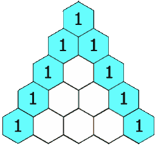
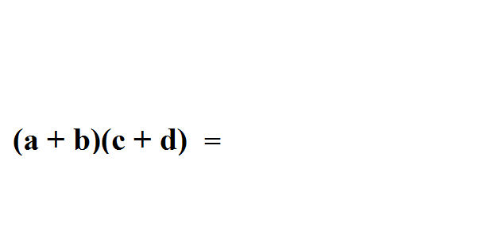
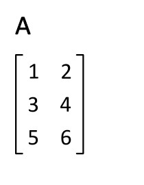
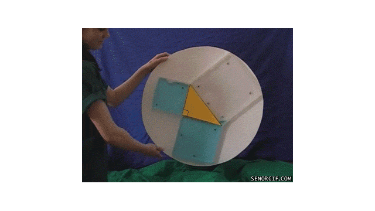
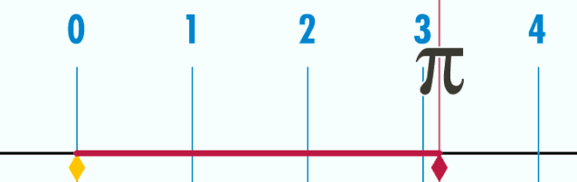
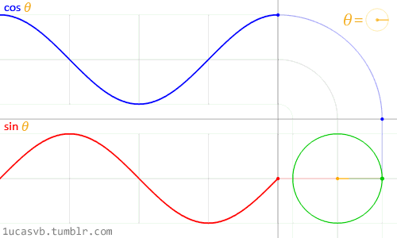
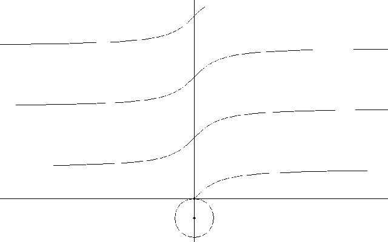
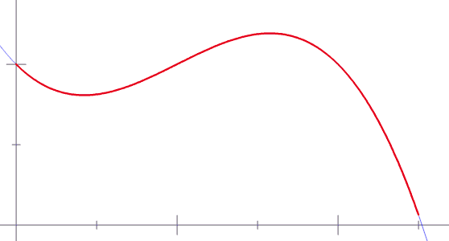
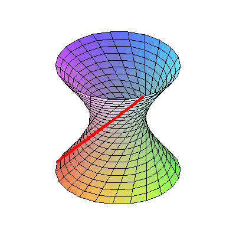

用视觉的方式来帮助你理解各种数学技巧
###  椭圆的画法

### 杨辉三角问题(Pascal triangles)解法

### 使用“FOIL”轻松的解决二项式乘法

### 对数解法技巧

### 矩阵转置的技巧

### 勾股定理

### 多边形的外角之和总是等于360度

### 圆周率π

### 一弧度就是长度刚好等于半径的一段圆弧所对的圆心角

### 在Y轴上使用正弦(红色)，在X轴上使用余弦(蓝色)，则在XY轴平面上画出的环形如下图(黑色)

### 同前一原理，但更简单

### 这是将sin和cos运用到三角形上

### 余弦是正弦的衍生物

### 正切线

### 同上，但翻个面看，更容易理解

### 将一个公式从笛卡尔坐标转换成轴坐标

### 画抛物线

### 黎曼和(Riemann sum)约等于其曲线下的面积

### 双曲线

### 将双曲线表现成3D形式，也许你不相信，它完全是用直线画成的
