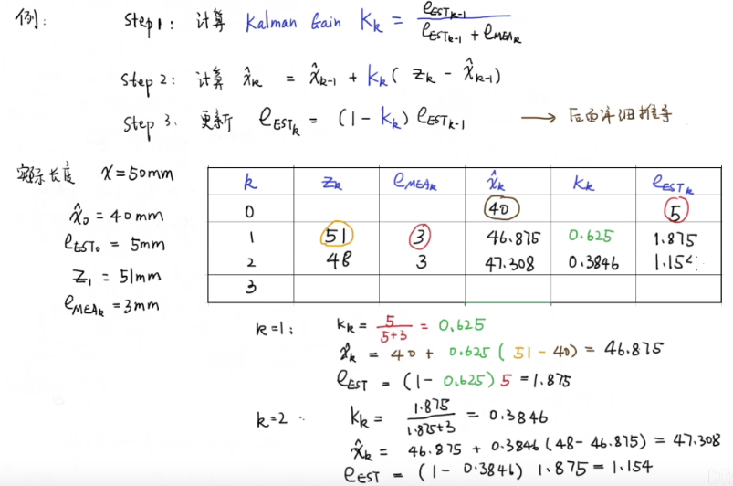

[TOC]
### 卡尔曼滤波器
[卡尔曼滤波器](https://www.bilibili.com/video/BV1ez4y1X7eR)

[Kalman filter](https://en.jinzhao.wiki/wiki/Kalman_filter)

卡尔曼滤波器是一种有效的递推滤波器，通过一系列噪声测量估计线性动态系统的内部状态.
> The Kalman filter is an efficient recursive filter estimating the internal-state of a linear dynamic system from a series of noisy measurements.

估计误差：$e_{EST}$ error estimate
测量误差：$e_{MEA}$ error measurement
卡尔曼增益:$K_k$ Kalman Gain
$$\hat{x}_k = \hat{x}_{k-1} + K_k(x_k -\hat{x}_{k-1})$$
$$K_k = \frac{{e_{EST}}_{k-1}}{{e_{EST}}_{k-1}+{e_{MEA}}_{k}}$$

如：在k时刻
① ${e_{EST}}_{k-1} \gg {e_{MEA}}_{k}$ 那么$K_k \to 1$ , $\hat{x}_k = x_k$
① ${e_{EST}}_{k-1} \ll {e_{MEA}}_{k}$ 那么$K_k \to 0$ , $\hat{x}_k = \hat{x}_{k-1}$

step 1:计算$K_k$
step 2:计算$\hat{x}_k = \hat{x}_{k-1} + K_k(x_k -\hat{x}_{k-1})$
step 3:更新估计误差$e_{EST} = (1-K_k){e_{EST}}_{k-1}$

#### 取均值
比如k次x均值：
均值$\hat{x}_k = \frac{1}{k}(x_1+...+x_k) = \frac{1}{k} \frac{k-1}{k-1} (x_1+...+x_{k-1}) + \frac{1}{k} x_k = \frac{k-1}{k} \hat{x}_{k-1} + \frac{1}{k} x_k = \hat{x}_{k-1} + \frac{1}{k}(x_k -\hat{x}_{k-1})$

当前的估计值 = 上一次的估计值 + 系数 x (当前测量值-上一次的估计值)
系数就是卡尔曼增益，用$K_k$
随着k的增加，测量的结果不再重要

### 欧拉公式
[Euler's formula](https://en.jinzhao.wiki/wiki/Euler%27s_formula):
$$e^{i\theta} = \cos\theta  + i\sin\theta$$
证明(Proofs):
令函数
$${\displaystyle f(\theta )=e^{-i\theta }(\cos \theta +i\sin \theta )}$$
求导
$${\displaystyle f'(\theta )=e^{-i\theta }(i\cos \theta -\sin \theta )-ie^{-i\theta }(\cos \theta +i\sin \theta )=0}$$

所以$f(\theta )$是个常数，我们知道$f(0) = 1$所以，对于所有的自变量$f(\theta) = 1$，得证。

### 傅里叶分析、傅立叶变换、傅立叶级数
[傅里叶分析之掐死教程（完整版）更新于2014.06.06](https://zhuanlan.zhihu.com/p/19763358)
[视频 - 纯干货数学推导_傅里叶级数与傅里叶变换](https://www.bilibili.com/video/BV1Et411R78v)

**傅里叶分析**（[Fourier analysis](https://en.jinzhao.wiki/wiki/Fourier_analysis)）可分为**傅里叶级数**（[Fourier Series](https://en.jinzhao.wiki/wiki/Fourier_series)）和**傅里叶变换**([Fourier Transformation](https://en.jinzhao.wiki/wiki/Fourier_transform))

基础的正弦波a.sin(wt+θ)中，振幅(a)，频率(w)，相位(θ)缺一不可

频域（[Frequency domain](https://en.jinzhao.wiki/wiki/Frequency_domain)）：

傅里叶分析究竟是干什么用的？
- **滤波**（[Wave filtering](https://en.jinzhao.wiki/wiki/Filter_(signal_processing))）是将信号中特定波段频率滤除的操作，是信号处理最重要的概念之一。

- 求解微分方程
因为除了要计算加减乘除，还要计算微分积分。而傅里叶变换则可以让微分和积分在频域中变为乘法和除法，大学数学瞬间变小学算术有没有。

> 函数的正交性：如：三角函数的正交性$\int_{-\pi}^{\pi} \sin (nx) \cos (mx) = 0$（当然这并不完整）

> 三角函数系：{1，sinx，cosx，sin2x，cos2x，sin3x，cos3x，sin4x，cos4x，...}
> 三角函数系在其一个周期[-pi,pi]上具有正交性
> 即三角函数系中任何两个不同的函数的乘积在[-pi,pi]上的积分都等于零

> 周期函数:以$T$为周期的函数$f(x+T) = f(x)$
取$\xi = \frac{2\pi x}{T}$, 则$y(\xi) = f(\frac{T}{2\pi}\xi)$,且有
$$y(\xi+2\pi) = f(\frac{T}{2\pi}(\xi+2\pi)) = f(\frac{T}{2\pi}\xi+T) = f(\frac{T}{2\pi} \xi) = y(\xi)$$
因此，只研究周期为$2\pi$的函数就可以了。

> [周期函数的FOURIER级数](http://staff.ustc.edu.cn/~rui/ppt/calculus2/chap10_1.html)

以$2\pi$为周期的函数的Fourier级数展开为
$$f(x) = \frac{a_0}{2} + \sum_{n=1}^{\infty} (a_n \cos nx + b_n \sin nx)$$
其中$a_0,a_n,b_n,n = 1,2,...$称为$f(x)$的Fourier系数，由下面的Euler-Fourier公式给出
$$a_n = \frac{1}{\pi} \int_{-\pi}^{\pi} f(x)\cos(nx)dx$$
$$b_n = \frac{1}{\pi} \int_{-\pi}^{\pi} f(x)\sin(nx)dx$$
上面的Euler-Fourier公式很容易计算：
首先对上述Fourier级数展开等式两边同时乘以$\cos mx$,再对其在[-pi,pi]求积分
$$\int_{-\pi}^{\pi} f(x)\cos (mx) dx = \int_{-\pi}^{\pi} \frac{a_0}{2} \cos(mx) dx + \int_{-\pi}^{\pi}\sum_{n=1}^{\infty} a_n \cos (nx)\cos (mx)dx + \int_{-\pi}^{\pi}\sum_{n=1}^{\infty} b_n \sin (nx)\cos (mx) dx$$

第一项：$\int_{-\pi}^{\pi} \frac{a_0}{2} \cos(mx) dx = \frac{a_0}{2}\int_{-\pi}^{\pi}  1.\cos(mx) dx $ 由三角函数的正交性$\int_{-\pi}^{\pi}  1.\cos(mx) dx=0$
第三项由三角函数的正交性也一定等于0
第二项$\int_{-\pi}^{\pi}\sum_{n=1}^{\infty} a_n \cos (nx)\cos (mx)dx$由三角函数的正交性，能唯一保留下来的就是$n=m$时的一项$\int_{-\pi}^{\pi}  a_n \cos (nx)\cos (mx)dx = a_n \int_{-\pi}^{\pi} \cos (nx)\cos (mx)dx = a_n\pi$

所以$\int_{-\pi}^{\pi} f(x)\cos (mx) dx = a_n\pi ,m=n$不就是$a_n = \frac{1}{\pi} \int_{-\pi}^{\pi} f(x)\cos(nx)dx$
同理求$b_n$时， 对等式左右两边同时乘以$\sin(mx)$,再求积分

---
以$T=2L$为周期的函数的Fourier级数展开为:$\omega = \frac{\pi}{L}= \frac{2\pi}{T}$
$$f(t) = \frac{a_0}{2} + \sum_{n=1}^{\infty}[a_n \cos(n\omega t) +b_n\sin(n\omega t)]$$
$$a_n = \frac{2}{T} \int_{0}^{T}f(t)\cos(n\omega t)dt$$
$$b_n = \frac{2}{T} \int_{0}^{T}f(t)\sin(n\omega t)dt$$

---
傅里叶级数的复数形式：$\cos x = \frac{1}{2}(e^{ix} + e^{-ix})  , \sin x = -\frac{1}{2}i(e^{ix} - e^{-ix})$
带入[得到](https://blog.csdn.net/qq_28404829/article/details/103054656)
$$f(t) = \frac{a_0}{2} + \sum_{n=1}^{\infty} \frac{a_n -ib_n}{2}e^{in\omega t}  + \sum_{n=-\infty}^{-1} \frac{a_{-n} + ib_{-n}}{2}e^{in\omega t} $$
而$\frac{a_0}{2} = \sum_{n=0}^0 \frac{a_0}{2} e^{in\omega t}$
所以
$$f(t) = \sum_{-\infty}^{\infty} C_n e^{in\omega t}$$

---
从傅里叶级数推导傅里叶变换

非周函数，也就是周期$T \to \infty$

$$f(t) = \frac{1}{2\pi} \int_{-\infty}^{\infty} \int_{-\infty}^{\infty} f(t) e^{-i\omega t} dt e^{i\omega t} d\omega$$

Fourier transform(FT) :就是中间部分
$$F(\omega) = \int_{-\infty}^{\infty} f(t) e^{-i\omega t} dt$$

Fourier inversion transform(FIT):
$$f(t) = \frac{1}{2\pi} \int_{-\infty}^{\infty} F(\omega) e^{i\omega t} d\omega$$

Laplace transform: $s=i\omega$  (Fourier transform看作一种特殊的Laplace transform)
$$F(s) = \int_{-\infty}^{\infty} f(t) e^{-s t} dt$$

## tools
[几个好用的数学软件](https://www.bilibili.com/read/cv760567)
> 比如几何画板，Graphing Calculator 3D，grafeq, chaoscope,Mathstudio
### 微积分

[在线计算矩阵微积分](http://www.matrixcalculus.org/)
### wolframalpha
数学图形/数学工具
https://www.wolframalpha.com/ 这个网站其实是一个计算知识引擎

- 在线积分计算器
- 逆矩阵、行列式、利息、房贷等
### mathematica
https://www.wolfram.com/mathematica/
### gnuplot
交互式绘图工具
http://www.gnuplot.info/

你可以在c#程序中编写数据文件，从c#调用gnuplot可执行文件，并在c#图片框中显示生成的图像。

### 数学动画、数学图形

#### Desmos
[图形计算器](https://www.desmos.com/)
比如：在[网站](https://www.desmos.com/calculator?lang=zh-CN)中输入`cos x + 0.1 cos 10x + 0.1 cos 100x`

[科学计算器](https://www.desmos.com/scientific?lang=zh-CN)

李萨如曲线:
[Meta的Logo](https://www.desmos.com/calculator/8ap4y8uyhg?lang=zh-CN)
[What is the Meta logo?](https://nathanielbd.github.io/posts/what-is-the-meta-logo/)

> https://student.desmos.com/?prepopulateCode=z44ema

#### Manim 
https://github.com/3b1b/manim

#### Geogebra
各种计算机（图形、科学）
https://www.geogebra.org/graphing