<!--toc-->
[TOC]
# 图解一切
## 图解数学
用视觉的方式来帮助你理解各种数学技巧
###  椭圆的画法
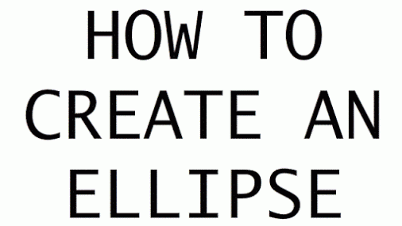
### 杨辉三角问题(Pascal triangles)解法

### 使用“FOIL”轻松的解决二项式乘法

### 对数解法技巧
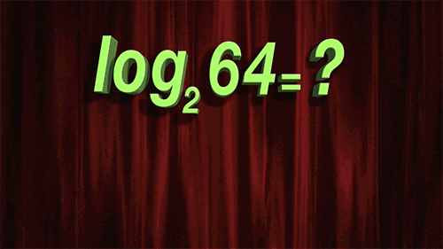

### 矩阵转置的技巧

### 勾股定理

### 多边形的外角之和总是等于360度
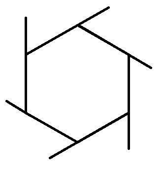

### 圆周率π

### 一弧度就是长度刚好等于半径的一段圆弧所对的圆心角
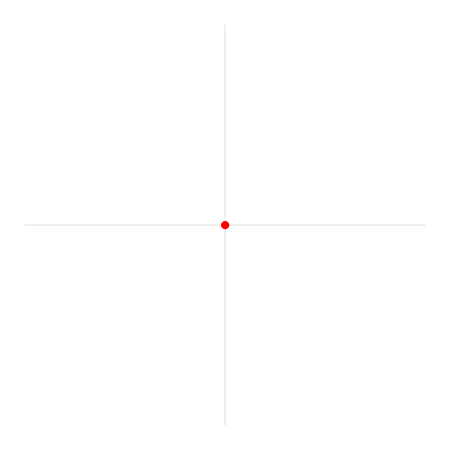

### 在Y轴上使用正弦(红色)，在X轴上使用余弦(蓝色)，则在XY轴平面上画出的环形如下图(黑色)
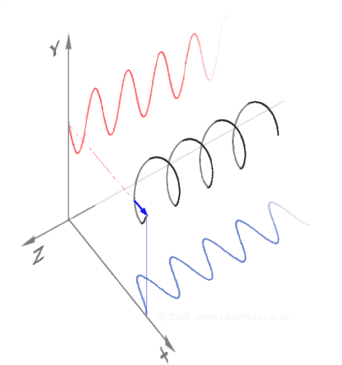

### 同前一原理，但更简单

### 这是将sin和cos运用到三角形上
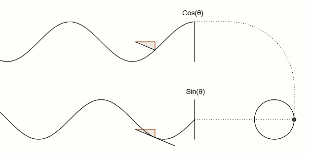

### 余弦是正弦的衍生物
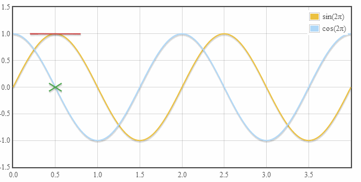

### 正切线
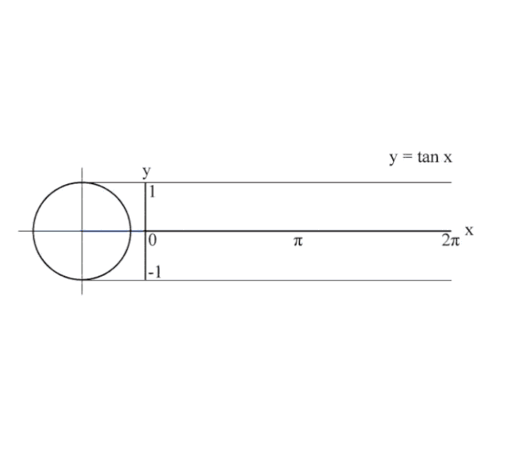

### 同上，但翻个面看，更容易理解

### 将一个公式从笛卡尔坐标转换成轴坐标
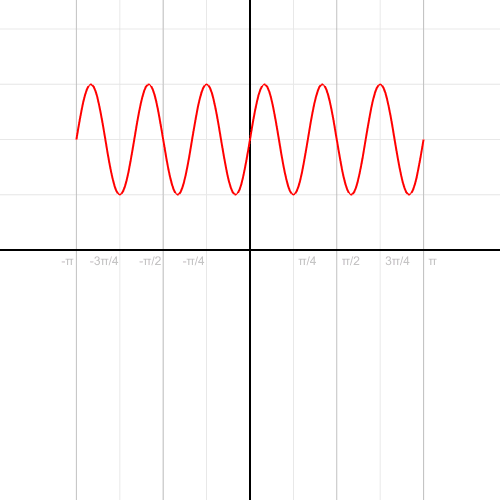

### 画抛物线
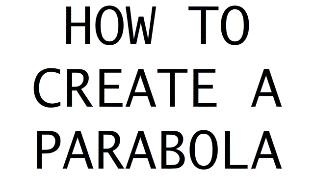

### 黎曼和(Riemann sum)约等于其曲线下的面积

### 双曲线

### 将双曲线表现成3D形式，也许你不相信，它完全是用直线画成的

## 神经网络结构
### 标准网络
#### 1 | 感知器（Perceptron）
感知器是所有神经网络中最基本的，也是更复杂的神经网络的基本组成部分。它只连接一个输入神经元和一个输出神经元。
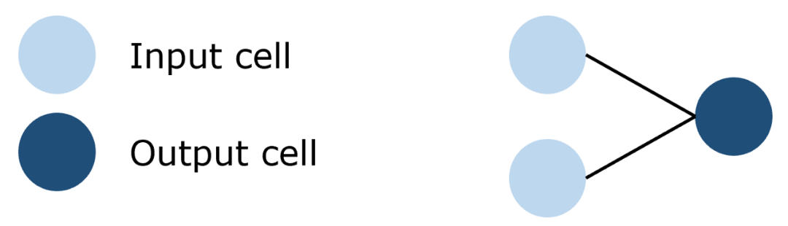

#### 2 | 前馈（Feed-Forward）网络

前馈网络是感知器的集合，其中有三种基本类型的层: 输入层、隐藏层和输出层。在每个连接过程中，来自前一层的信号被乘以一个权重，增加一个偏置，然后通过一个激活函数。前馈网络使用反向传播迭代更新参数，直到达到理想的性能。
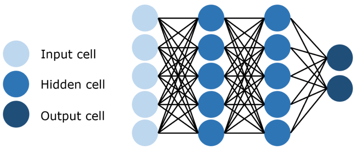

#### 3 | 残差网络(Residual Networks/ResNet)

深层前馈神经网络的一个问题是所谓的梯度消失，即当网络太深时，有用的信息无法在整个网络中反向传播。当更新参数的信号通过网络传播时，它会逐渐减少，直到网络前面部分的权重不再改变或者根本不再使用。为了解决这个问题，残差网络使用跳过连接实现信号跨层传播。通过使用这种不易受到影响的连接来减少梯度消失问题。随着时间的推移，通过学习特征空间，网络学会了重建跳过的层，但训练更有效，因为它的梯度不容易消失和需要探索更少的特征空间。

### 循环网络
#### 4 | 循环神经网络 (Recurrent Neural Network/RNN) 

循环神经网络是一种特殊类型的网络，它包含环和自重复，因此被称为“循环”。由于允许信息存储在网络中，RNNs 使用以前训练中的推理来对即将到来的事件做出更好、更明智的决定。为了做到这一点，它使用以前的预测作为“上下文信号”。由于其性质，RNNs 通常用于处理顺序任务，如逐字生成文本或预测时间序列数据(例如股票价格)。它们还可以处理任意大小的输入。

#### 5 | 长短期记忆网络(Long Short Term Memory Network/LSTM)

由于上下文信息的范围在实践中是非常有限的，所以 RNNs 有个大问题。给定的输入对隐藏层(即对网络的输出)输入的影响(反向传播误差) ，要么指数级爆炸，要么网络连接循环衰减为零。解决这个梯度消失问题的方法是长短期记忆网络(LSTM)。这种 RNN 结构是专门为解决梯度消失问题而设计的，结构中加入了内存块。这些模块可以看作是计算机中的内存芯片——每个模块包含几个循环连接的内存单元和三个门(输入、输出和遗忘，相当于写入、读取和重置)。该网络只能通过每个门与神经元进行互动，因此这些门学会智能地打开和关闭，以防止梯度爆炸或消失，但也通过“不断错误传送带”传播有用信息，以及丢弃不相关的内存内容。

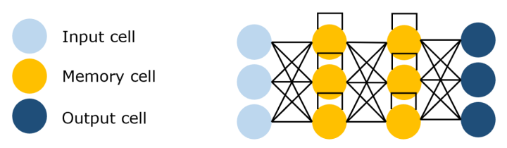
标准的 RNNs 在输入事件和目标信号之间的时间滞后大于5到10个时间步长时无法学习，LSTM 则不会受到影响，甚至连接时间滞后1,000个时间步长它都可以通过实施一个有用的常量误差流来学习。

#### 6 | 回声状态网络(Echo State Networks/ESN)

回声状态网络是循环神经网络的一个变种，它有一个非常稀疏连接的隐藏层(通常是百分之一的连通性)。神经元的连通性和权重是随机分配的，忽略层和神经元的差异(跳过连接)。通过学习输出神经元的权重，使网络能够产生和再现特定的时间模式。这个网络背后的原因是，尽管它是非线性的，但在训练过程中修改的权重只是突触连接，因此误差函数可以被微分为线性系统。

### 卷积网络
#### 7 | 卷积神经网络 (Convolutional Neural Network/CNN) 

图像具有非常高的维数，因此训练一个标准的前馈网络来识别图像将需要成千上万的输入神经元，除了显而易见的高计算量，还可能导致许多与神经网络中的维数灾难相关的问题。卷积神经网络提供了一个解决方案，利用卷积和池化层，来降低图像的维度。由于卷积层是可训练的，但参数明显少于标准的隐藏层，它能够突出图像的重要部分，并向前传播每个重要部分。传统的CNNs中，最后几层是隐藏层，用来处理“压缩的图像信息”。

卷积神经网络在基于图像的任务上表现良好，例如将图像分类为狗或猫。

#### 8 | 反卷积神经网络(Deconvolutional Neural Network/DNN)

正如它的名字所暗示的那样，反卷积神经网络与卷积神经网络操作相反。DNN不是通过卷积来降低图像的维数，而是利用反卷积来创建图像，通常是从噪声中获得图像。这本身就是一项艰巨的任务; 想象一下 CNN 的任务：用三句话写出奥威尔《1984》全书的总结摘要，而 DNN 的任务是把这三句话扩展成全本书。

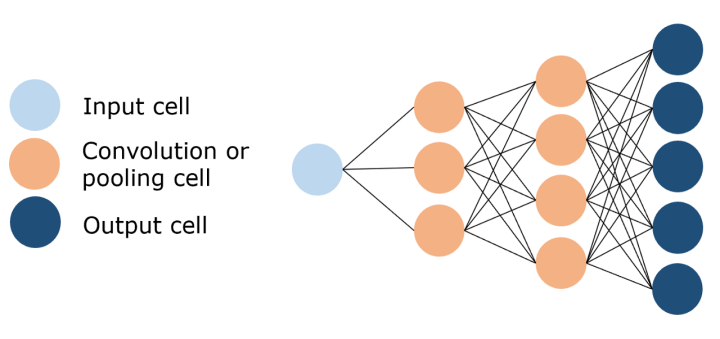

#### 9 | 生成对抗网络(Generative Adversarial Network/GAN)

生成对抗网络是一种专门设计用于生成图像的网络，由两个网络组成: 一个鉴别器和一个生成器。鉴别器的任务是区分图像是从数据集中提取的还是由生成器生成的，生成器的任务是生成足够逼真的图像，以至于鉴别器无法区分图像是否真实。随着时间的推移，在谨慎的监督下，这两个对手相互竞争，彼此都想成功地改进对方。最终的结果是一个训练有素的生成器，可以生成逼真的图像。鉴别器是一个卷积神经网络，其目标是最大限度地提高识别真假图像的准确率，而生成器是一个反卷积神经网络，其目标是最小化鉴别器的性能。

### 自动编码器
#### 10 | 自动编码器(Auto Encoder/AE)

自动编码器的基本思想是将原始的高维数据“压缩”成高信息量的低维数据，然后将压缩后的数据投影到一个新的空间中。自动编码器有许多应用，包括降维、图像压缩、数据去噪、特征提取、图像生成和推荐系统。它既可以是无监督的方法，也可以是有监督的，可以得到对数据本质的洞见。

隐藏的神经元可以替换为卷积层，以便处理图像。 
#### 11 | 变分自动编码器(Variational Auto Encoder/VAE)

自动编码器学习一个输入（可以是图像或文本序列）的压缩表示，例如，压缩输入，然后解压缩回来匹配原始输入，而变分自动编码器学习表示的数据的概率分布的参数。不仅仅是学习一个代表数据的函数，它还获得了更详细和细致的数据视图，从分布中抽样并生成新的输入数据样本。从这个意义上说，它更像是一个纯粹的“生成”模型，就像一个 GAN。

VAE使用了概率隐藏神经元，它对测试用例和神经元平均值之间的差应用了一个径向基核函数。