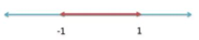
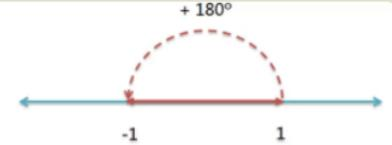
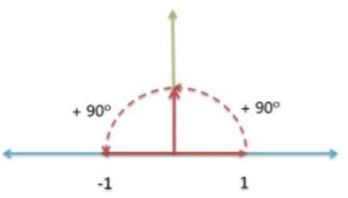
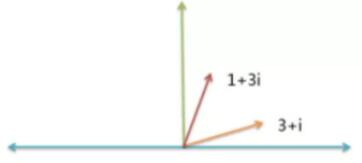
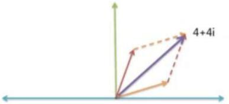
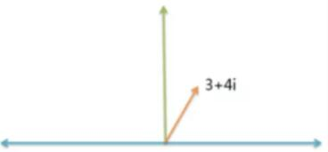
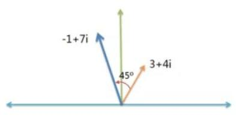
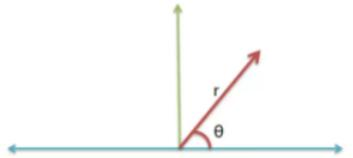

## 图解虚数

[虚数是真的](https://www.bilibili.com/video/BV1kX4y1u7GJ?p=22)

### 什么是虚数(imaginary number)
首先，假设有一根数轴，上面有两个反向的点： +1 和 -1 。

这根数轴的正向部分，可以绕原点旋转。显然，逆时针旋转 180 度， +1 就会变成 -1 。

这相当于两次逆时针旋转 90 度。

因此，我们可以得到下面的关系式：
`(+1) * ( 逆时针旋转 90 度) * ( 逆时针旋转 90 度) = (-1)`

如果把 +1 消去，这个式子就变为：
`(逆时针旋转 90 度 )^2 = (-1)`
将 "逆时针旋转 90 度" 记为 i ：`i^2 = (-1)`,它就是虚数的定义公式。

所以，我们可以知道， 虚数 i 就是逆时针旋转 90 度， i 不是一个数，而是一个旋转量。

### 复数的定义
既然 i 表示旋转量，我们就可以用 i ，表示任何实数的旋转状态。

将实数轴看作横轴，虚数轴看作纵轴，就构成了一个二维平面。旋转到某一个角度的任何正实数，必然唯一对应这个平面中的某个点。

只要确定横坐标和纵坐标，比如 ( 1 , i ) ，就可以确定某个实数的旋转量（ 45 度）。

数学家用一种特殊的表示方法，表示这个二维坐标：用 + 号把横坐标和纵坐标连接起来。 
比如， 把 ( 1 , i ) 表示成 1 + i 。这种表示方法就叫做复数 （ complex number ） ，其中 1 称为实数部， i 称为虚数部。

为什么要把二维坐标表示成这样呢，下一节告诉你原因。

### 虚数的作用：加法

虚数的引入，大大方便了涉及到旋转的计算。

比如，物理学需要计算 "力的合成 "。假定一个力是 3 + i ，另一个力是 1 + 3i ，请问它们的合成力是多少？

根据 "平行四边形法则 " ，你马上得到， 合成力就是 ( 3 + i ) + ( 1 + 3i ) = ( 4 + 4i ) 。
这就是虚数加法的物理意义。

### 虚数的作用：乘法
如果涉及到旋转角度的改变，处理起来更方便。

比如，一条船的航向是 3 + 4i 。
如果该船的航向，逆时针增加 45 度，请问新航向是多少？

45 度的航向就是 1 + i 。计算新航向，只要把这两个航向 3 + 4i 与 1 + i 相乘就可以了 （原因在下一节解释） ：
`( 3 + 4i ) * ( 1 + i ) = ( -1 + 7i )`
所以，该船的新航向是 -1 + 7i 。

如果航向逆时针增加 90 度，就更简单了。因为 90 度的航向就是 i ，所以新航向等于：

`( 3 + 4i ) * i = ( -4 + 3i )`

这就是虚数乘法的物理意义： 改变旋转角度 。

#### 虚数乘法的数学证明
为什么一个复数改变旋转角度，只要做乘法就可以了？
下面就是它的数学证明 ，实际上很简单 。

任何复数 a + bi ，都可以改写成旋转半径 r 与横轴夹角 θ 的形式。
假定现有两个复数 a + bi 和 c + di ，可以将它们改写如下：

`a + bi = r1 * ( cos α + isin α )`
`c + di = r2 * ( cos β + isin β )`
这两个复数相乘， ( a + bi )( c + di ) 就相当于
`r1 * r2 * ( cos α + isin α ) * ( cos β + isin β )`
展开后面的乘式，得到
`cos α * cos β - sin α * sin β + i( cos α * sin β + sin α * cos β )`

根据三角函数公式，上面的式子就等于
`cos( α+ β) + isin( α+ β)`
所以，`( a + bi )( c + di ) ＝ r1 * r2 * ( cos( α+ β) + isin( α+ β) )`
这就证明了，两个复数相乘，就等于旋转半径相乘、旋转角度相加。