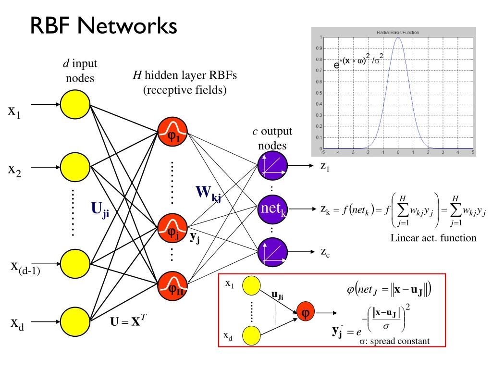
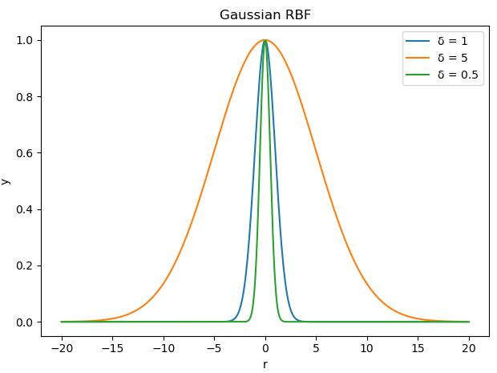
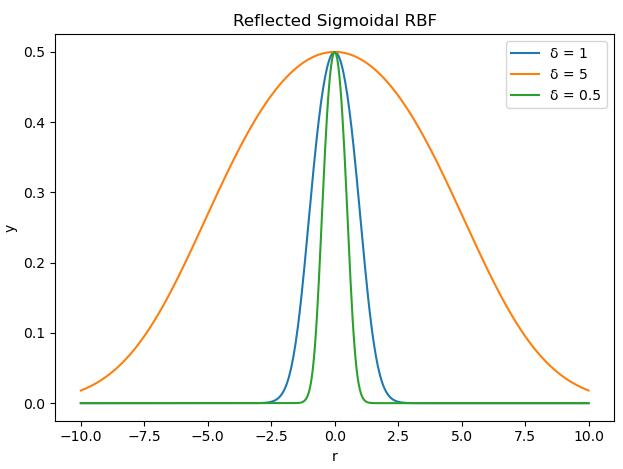
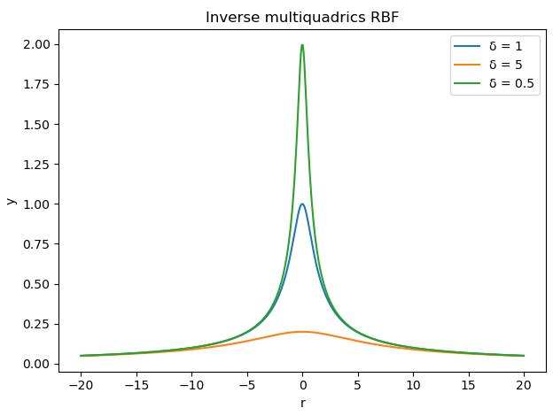

# 径向基函数（Radical Basis Function,RBF）

1985年，Powell提出了多变量插值的径向基函数（Radical Basis Function,RBF）方法。1988年，Moody和Darken提出了一种神经网络结构，即RBF神经网络，属于前向神经网络类型，它能够以任意精度逼近任意连续函数，特别适合于解决分类问题。

## RBF网络模型

径向基神经网络的激活函数采用径向基函数，通常定义为空间任一点到某一中心之间欧氏距离的单调函数。径向基神经网络的激活函数是以输入向量和权值向量之间的距||dist||为自变量的。径向神经网络的激活函数一般表达式为 $\mathcal{R}$(||dist||) = $e^{-||dist||^2}$

## RBF网络学习算法



## 径向基函数
- Gauss（高斯）函数
${\phi}(r) = exp(-\frac{r^2}{2{\sigma}^2})$


```python
import numpy as np
import matplotlib.pyplot as plt

r = np.linspace(-20, 20, 500)
plt.xlabel("r")
plt.ylabel("y")
plt.title("Gaussian RBF")
for delta in [1, 5, 0.5]:
    y = np.exp(-(r ** 2 / (2 * delta ** 2)))
    plt.plot(r, y, label="δ = " + str(delta))

plt.legend()  # 将plot标签里面的图注印上去
plt.show()
```

- Reflected Sigmoidal（反常S型）函数
${\phi}(r) = \frac{1}{1+exp(\frac{r^2}{\sigma}^2)}$



```python
import numpy as np
import matplotlib.pyplot as plt

r = np.linspace(-20, 20, 500)
plt.xlabel("r")
plt.ylabel("y")
plt.title("Reflected Sigmoidal RBF")
for delta in [1, 5, 0.5]:
    y = 1 / (1 + np.exp(r ** 2 / delta ** 2))
    plt.plot(r, y, label="δ = " + str(delta))

plt.legend()  # 将plot标签里面的图注印上去
plt.show()
```
sympy绘图
```python
from sympy.plotting import plot
from sympy import symbols
from sympy.functions import exp

r = symbols('r')
p = []
for delta in [1, 5, 0.5]:
    y = 1 / (1 + exp(r ** 2 / delta ** 2))
    p.append((y, (r, -10, 10)))
p2 = plot(*p)
```

- Inverse multiquadrics（拟多二次）函数
${\phi}(r) = \frac{1}{\sqrt{{r^2}+{\sigma}^2}}$



```python
import numpy as np
import matplotlib.pyplot as plt

r = np.linspace(-20, 20, 500)
plt.xlabel("r")
plt.ylabel("y")
plt.title("Inverse multiquadrics RBF")
for delta in [1, 5, 0.5]:
    y = 1 / (np.sqrt(r ** 2 + delta ** 2))
    plt.plot(r, y, label="δ = " + str(delta))

plt.legend()  # 将plot标签里面的图注印上去
plt.show()
```
## 参考

[径向基神经网络](https://cloud.tencent.com/developer/article/1044824)
[Radial basis function](https://en.jinzhao.wiki/wiki/Radial_basis_function)
[Radial basis function kernel](https://en.jinzhao.wiki/wiki/Radial_basis_function_kernel)