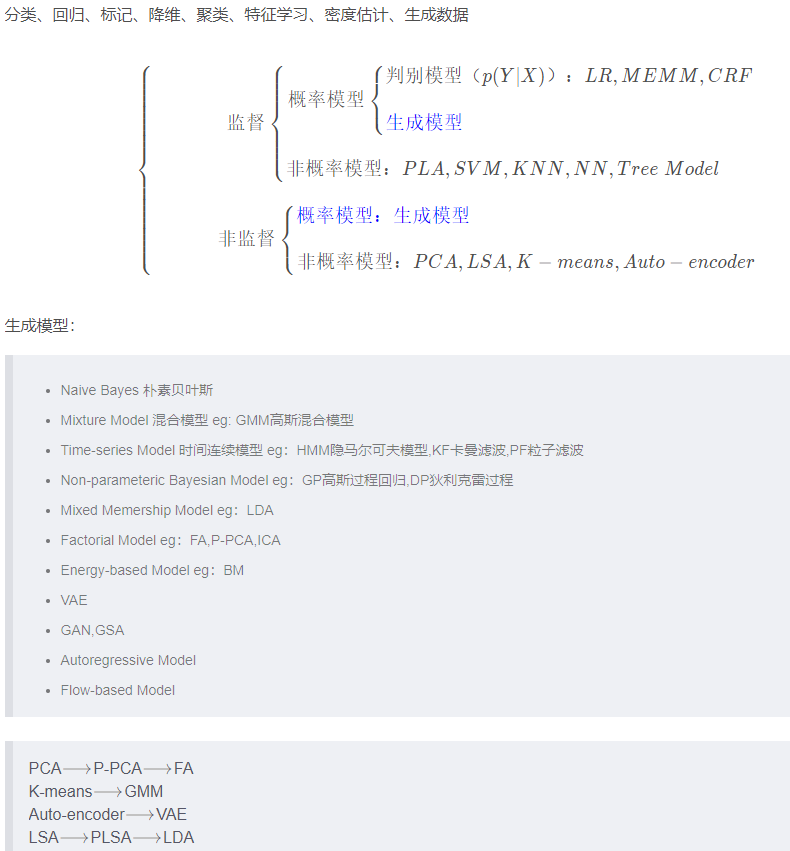

[TOC]
# 生成模型和判别模型
[Generative model](https://en.jinzhao.wiki/wiki/Generative_model) 只有[Probabilistic models](https://en.jinzhao.wiki/wiki/Category:Probabilistic_models)才有Generative一说

[Discriminative model](https://en.jinzhao.wiki/wiki/Discriminative_model)

监督学习方法又分生成方法（Generative approach）和判别方法（Discriminative approach），所学到的模型分别称为生成模型（Generative Model）和判别模型（Discriminative Model）。

生成方法的特点：生成方法学习联合概率密度分布P(X,Y)，所以就可以从统计的角度表示数据的分布情况，能够反映同类数据本身的相似度。但它不关心到底划分各类的那个分类边界在哪。生成方法可以还原出联合概率分布P(Y|X)，而判别方法不能。生成方法的学习收敛速度更快，即当样本容量增加的时候，学到的模型可以更快的收敛于真实模型，当存在隐变量时，仍可以用生成方法学习。此时判别方法就不能用。

判别方法的特点：判别方法直接学习的是决策函数Y=f(X)或者条件概率分布P(Y|X)。不能反映训练数据本身的特性。但它寻找不同类别之间的最优分类面，反映的是异类数据之间的差异。直接面对预测，往往学习的准确率更高。由于直接学习P(Y|X)或P(X)，可以对数据进行各种程度上的抽象、定义特征并使用特征，因此可以简化学习问题。

## 模型类别

| 分类                                                       | 方法                                       | 适用问题           | 模型特点                                           | 模型类别           | 学习策略                           | 损失函数             | 学习算法                               |
| ---------------------------------------------------------- | ------------------------------------------ | ------------------ | -------------------------------------------------- | ------------------ | ---------------------------------- | -------------------- | -------------------------------------- |
| 监督                                                       | 感知机                                     | 二分类             | 分离超平面                                         | 判别模型           | 极小化误分点到超平面距离           | 误分点到超平面距离   | 随机梯度下降                           |
| 监督                                                       | k 近邻法                                   | 多分类、回归       | 特征空间、样本点                                   | 判别模型           | —                                  | —                    | —                                      |
| 监督                                                       | 朴素贝叶斯                                 | 多分类             | 特征与类别的联合概率分布，条件独立假设             | 生成模型           | 极大似然估计、最大后验概率估计     | 对数似然损失         | 概率计算公式、EM 算法                  |
| 监督                                                       | 决策树                                     | 多分类、回归       | 分类树、回归树                                     | 判别模型           | 正则化的极大似然估计               | 对数似然损失         | 特征选择、生成、剪枝                   |
| 监督                                                       | 逻辑斯蒂回归                               | 多分类             | 特征条件下类别的条件概率分布，对数线性模型         | 判别模型           | 极大似然估计，正则化的极大似然估计 | 逻辑斯蒂损失         | 改进的迭代尺度算法，梯度下降，拟牛顿法 |
| 监督                                                       | 支持向量机                                 | 二分类             | 分离超平面，核技巧                                 | 判别模型           | 极小化正则化合页损失，软间隔最大化 | 合页损失             | 序列最小最优化算法（SMO)               |
| 监督                                                       | 提升方法 (Boosting)                        | 二分类             | 弱分类器的线性组合                                 | 判别模型           | 极小化加法模型的指数损失           | 指数损失             | 前向分布加法算法                       |
| 监督                                                       | EM 算法                                    | 概率模型参数估计   | 含隐变量概率模型                                   | —                  | 极大似然估计，最大后验概率估计     | 对数似然损失         | 迭代算法                               |
| 监督                                                       | 隐马尔科夫模型(HMM)                        | 标注               | 观测序列与状态序列的联合概率分布模型               | 生成模型           | 极大似然估计，最大后验概率估计     | 对数似然损失         | 概率计算公式，EM 算法                  |
| 监督                                                       | 最大熵马尔科夫模型(MEMM)                                       | 标注               | -                                                  | 判别模型           |
| 监督                                                       | 条件随机场(CRF)                            | 标注               | 状态序列条件下观测序列的条件概率分布，对数线性模型 | 判别模型           | 极大似然估计，正则化极大似然估计   | 对数似然损失         | 改进的迭代尺度算法，梯度下降，拟牛顿法 |
| 监督                                                       | 马尔可夫随机场 Markov Random Fields        | -                  | -                                                  | 生成模型           |
| 监督                                                       | 线性判别分析(LDA)                          | -                  | -                                                  | 判别模型           |
| 监督                                                       | 高斯判别分析(GDA)                          | -                  | -                                                  | 生成模型           |
| 监督                                                       | 传统的神经网络(Traditional Neural Network) | -                  | -                                                  | 判别模型           |
| 无监督                                                     | 层次聚类                                   | 聚类               | -                                                  | -                  | -                                  | 类内样本距离最小     | 启发式算法                             |
| 无监督                                                     | k 均值                                     | 聚类               | -                                                  | -                  | -                                  | 样本与类中心距离最小 | 迭代算法                               |
| 无监督                                                     | 高斯混合模型                               | 聚类               | -                                                  | 生成模型           | -                                  | 似然函数最大         | EM 算法                                |
| 无监督                                                     | PCA                                        | 降维               | -                                                  | -                  | -                                  | 方差最大             | SVD                                    |
| 无监督                                                     | LSA                                        | 话题分析，矩阵分解 | -                                                  | 概率模型是生成模型 | -                                  | 平方损失             | SVD                                    |
| 无监督                                                     | NMF                                        | 话题分析，矩阵分解 | -                                                  | 概率模型是生成模型 | -                                  | 平方损失             | 非矩阵分解                             |
| 无监督                                                     | PLSA                                       | 话题分析           | -                                                  | 生成模型           | -                                  | 似然函数最大         | EM 算法                                |
| 无监督                                                     | LDA 隐狄利克雷分配                         | 话题分析           | -                                                  | 生成模型           | -                                  | 后验概率估计         | 吉布斯采样，变分推断                   |
| 无监督                                                     | PageRank                                   | 图分析             | -                                                  | -                  | -                                  | 平稳分布求解         | 幂法                                   |
| Boltzmann Machine(BM) / Restricted Boltzmann Machine (RBM) | 生成模型                                   |
| Sigmoidal Belief Networks, Bayesian Networks               | 生成模型                                   |
| 无监督                                                     | GAN                                        | 生成模型           |

> 监督任务：分类，回归，标记
> 非监督任务：降维，聚类，特征学习，密度估计，生成数据

> P-PCA 概率模型的 PCA

[【机器学习】白板推导系列(三十) ～ 生成模型综述(Generative Model Introduction)](https://www.bilibili.com/video/BV1dE411u7TK)

## Discriminative vs. Generative

判别方法：由数据直接**学习决策函数 Y=f(X)或者条件概率分布 P(Y|X)作为预测的模型**，即判别模型。基本思想是有限样本条件下建立判别函数，不考虑样本的产生模型，直接研究预测模型，也就是我们**不关心 X 的分布**，判别模型一般用来分类

生成方法：由数据学习**联合概率密度分布 P(X,Y)，然后求出条件概率分布 P(Y|X)作为预测的模型**，即生成模型：P(Y|X)= P(X,Y)/ P(X)。基本思想是**首先建立样本的联合概率概率密度模型 P(X,Y)**，**然后再得到后验概率 P(Y|X)，再利用它进行分类**，就像上面说的那样。注意了哦，这里是先求出 P(X,Y)才得到 P(Y|X)的，**然后这个过程还得先求出 P(X)**。P(X)就是你的训练数据的概率分布。（生成模型必然跟概率有关，我们关注样本分布本身）

## 经典的案例

假设有四个 samples

| sample  | x   | y   |
| ------- | --- | --- |
| sample1 | 0   | 0   |
| sample2 | 0   | 0   |
| sample3 | 1   | 0   |
| sample4 | 1   | 1   |

生成模型：$\sum{P(x,y)}=1 $

| 特征 x | y=0 | y=1 |
| ------ | --- | --- |
| x=0    | 1/2 | 0   |
| x=1    | 1/4 | 1/4 |

> 生成模型，对完全数据建模

判定模型:$\sum{P(y|x)}=1 $

| 特征 x | y=0 | y=1 |
| ------ | --- | --- |
| x=0    | 1   | 0   |
| x=1    | 1/2 | 1/2 |

## Bayesian Network VS. Neural Network

> 概率图就是对概率分布的表示
> 神经网络就是一个函数万能逼近器

1. 表示：
   BN：结构化的、稀疏（条件独立性假设）、浅层，具备可解释性
   NN：深层、稠密、计算图，可解释性未知

1. 推断：
   BN：精确、近似（MC、变分）
   NN：推断很容易，但没有意义

1. 学习：
   BN：likelihood Maxi；EM
   NN：梯度下降（BP 后向传播：一种高效的求导方法，链式求导法则+动态规划（递归+缓存））

1. 适合场景：
   BN：high level reasoning
   NN：表示学习，low level reasoning
